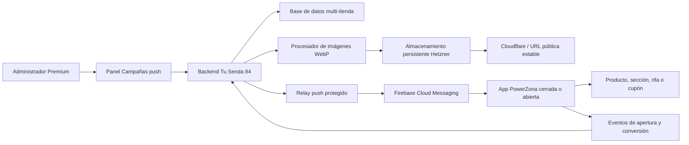
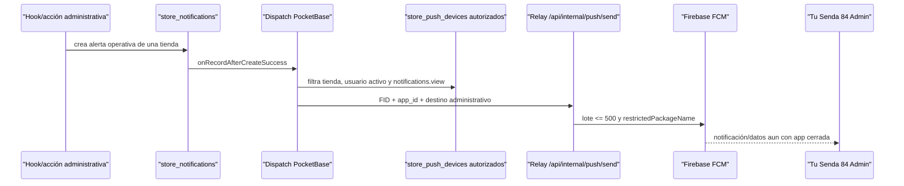

# Plan maestro: app de clientes white-label y campañas push Premium

> Documento vivo de ejecución para construir una app Android pública de PowerZona, reutilizable para otras tiendas de Tu Senda 84, con campañas push administradas desde el panel web.

## 1. Control del documento

| Campo | Valor |
|---|---|
| Estado general | PZ-APP-C03 EN CURSO — registro público seguro de instalaciones |
| Versión del documento | 1.16 |
| Fecha de creación | 2026-08-11 |
| Última actualización | 2026-08-12 |
| Tienda piloto | PowerZona |
| Plataforma inicial | Android (APK y AAB) |
| Proyecto móvil propuesto | `mobile-storefront` |
| Aplicación administrativa existente | `mobile-admin` / Tu Senda 84 Admin |
| Responsable de aprobación | Propietario de Tu Senda 84 |
| Próximo prompt | PZ-APP-C03 EN CURSO — registro público seguro de instalaciones |

### Convención de estados

- `[ ]` PENDIENTE: todavía no iniciado.
- `[x]` COMPLETADO: implementado, probado y documentado.
- `EN CURSO`: debe indicarse en la tabla general y en la bitácora. Solo puede existir un prompt en este estado.
- `BLOQUEADO`: no puede continuar sin una decisión, acceso o corrección externa.

### Niveles de razonamiento y criterio de calidad

Las recomendaciones de este documento usan los nombres disponibles en Codex:

- **Medium:** equilibrio entre velocidad y análisis. Útil cuando el alcance ya está claro.
- **High:** adecuado para implementación con varios archivos, pruebas y decisiones técnicas.
- **Extra High:** recomendado para seguridad, arquitectura, migraciones y flujos con muchas dependencias.
- **Max:** reserva más tiempo de razonamiento para los problemas de mayor riesgo, especialmente diagnóstico integral y producción.
- **Ultra:** divide trabajo complejo entre subagentes. No se usará por defecto en este plan porque las fases son secuenciales y necesitan una única trazabilidad. Solo se considerará si el propietario pide explícitamente trabajo paralelo y las partes pueden aislarse sin riesgo.

Según la [guía oficial de modelos de Codex](https://learn.chatgpt.com/docs/models.md), **Sol** es la opción preferida para trabajo complejo, abierto y de alto valor; **Terra** funciona bien como modelo general para tareas cotidianas y bien delimitadas. Un nivel mayor puede mejorar el análisis, pero también tarda más y consume más recursos.

Ningún modelo o nivel garantiza por sí solo un resultado perfecto. Para este proyecto, la calidad se consigue combinando:

1. Un prompt con alcance y definición de terminado.
2. El modelo y nivel apropiados al riesgo.
3. Pruebas automáticas.
4. Pruebas manuales en staging, emulador y teléfono físico.
5. Revisión del resultado antes de producción.

Cuando una fase requiera intervención humana, Codex debe mostrar claramente **PRUEBA MANUAL NECESARIA**, entregar pasos numerados, resultado esperado y evidencia solicitada. El prompt no se marcará completado hasta recibir el resultado de esa prueba o documentar por qué se pospuso.

## 2. Objetivo del proyecto

Construir una app Android pública para los clientes de PowerZona que muestre la tienda web, funcione sin inicio de sesión obligatorio y reciba notificaciones incluso cuando la app esté cerrada. La solución debe ser white-label: el mismo código permitirá generar una app diferente para otra tienda de Tu Senda 84 cambiando su configuración, marca, URL, identificador Android y credenciales de Firebase.

La app pública white-label y su panel de campañas serán productos exclusivos del plan Premium. El panel permitirá crear, segmentar, programar, enviar y medir notificaciones con texto, imagen WebP y enlaces internos. Al tocar una notificación, la app podrá abrir un producto, categoría, sección, seguimiento de pedido, rifa o cupón.

## 3. Decisiones aprobadas

1. La app de clientes será independiente de **Tu Senda 84 Admin**.
2. PowerZona será la primera tienda y servirá como plantilla validada.
3. La primera versión será Android; generará APK para entrega directa y AAB para Google Play.
4. No se exigirá una cuenta de cliente. Cada instalación se registrará anónimamente mediante un identificador de instalación de Firebase o equivalente.
5. La dirección IP no identificará al dispositivo. Solo se registrará en el servidor para seguridad, control de abuso y ubicación aproximada.
6. Los administradores de tienda verán estadísticas agregadas. El IP sin anonimizar, si se conserva, quedará restringido al Master Admin o funciones de seguridad.
7. Las imágenes se alojarán inicialmente en el servidor Hetzner, en almacenamiento persistente, se validarán y convertirán a WebP y se entregarán mediante una URL estable con caché de Cloudflare.
8. Los secretos, cuentas de servicio, archivos de firma y contraseñas nunca se guardarán en Git.
9. Las campañas comerciales para clientes se separarán de las alertas operativas de administradores.
10. Toda entidad móvil pertenecerá a una sola tienda. Ninguna campaña, instalación, imagen o evento podrá cruzar datos entre tiendas.
11. El permiso Premium se comprobará en el backend; ocultar botones en la interfaz no será suficiente.
12. Ninguna fase se desplegará en producción sin pasar primero por staging, emulador y teléfono físico cuando corresponda.
13. La app pública white-label, su configuración, builds y campañas solo se provisionarán para tiendas con plan Premium activo.

## 4. Resumen vivo del proyecto

### 4.1 Base ya completada y reutilizable

- [x] Existe una app administrativa Android nativa en `mobile-admin`.
- [x] La app administrativa usa el identificador `com.tusenda84.admin`.
- [x] La versión administrativa 1.0.2 fue instalada y validada.
- [x] Se solicitaron y verificaron los permisos de notificaciones de Android.
- [x] Las notificaciones administrativas funcionan con la app cerrada en un Samsung Galaxy Z Fold5 físico.
- [x] Se completó una prueba real de orden identificada como `Push002`.
- [x] El flujo validado es: PocketBase → Cloudflare → relay interno → Firebase Cloud Messaging → teléfono.
- [x] El relay de producción utiliza `https://tusenda84.com/api/internal/push/send`.
- [x] Firebase Admin y el secreto compartido del relay están configurados en el entorno de producción.
- [x] Cloudflare permite el tráfico originado por el servidor Hetzner `91.99.99.83` mediante la regla **Lista blanca servidor Alemania**.
- [x] La regla de lista blanca se encuentra antes de la limitación geográfica, usa la acción `Skip` y conserva el registro de eventos.
- [x] La limitación geográfica continúa activa para el resto del tráfico.
- [x] Se eliminó el relay HTTP temporal basado en `sslip.io`.
- [x] Frontend y PocketBase fueron desplegados y validados después de la corrección.
- [x] El commit desplegado durante esa validación fue `f5b023bc81075691c5b78f70e4a98279920967e1`.

### 4.2 Componentes existentes auditados en PZ-APP-C01

- `backend-powerzona/pb_hooks/pz_store_push_dispatch_lib.js`
- `backend-powerzona/pb_hooks/pz_store_push_devices_lib.js`
- Rutas relacionadas con dispositivos push en `backend-powerzona/pb_hooks`.
- Colecciones actuales `store_push_devices` y `store_notifications`.
- `frontend-powerzona/src/pages/api/internal/push/send.ts`
- Lógica Android de Firebase, registro y deep links en `mobile-admin`.
- Ayudantes de planes y permisos, entre ellos `pz_store_plans_lib.js` y `pz_store_team_permissions_lib.js`.

Resultado: el canal administrativo puede conservarse sin cambios, pero no se reutilizarán sus colecciones, identidad, permiso, rutas ni contrato de relay como canal público. Solo se reutilizarán patrones probados: FID de Firebase, entrega híbrida notificación/datos, `restrictedPackageName`, lotes de hasta 500, canales Android y desactivación de instalaciones rechazadas permanentemente.

### 4.3 Separación obligatoria

La colección administrativa `store_push_devices` no debe reutilizarse automáticamente para clientes. El registro actual está ligado a usuarios administrativos autenticados y a reglas operativas del panel. La app pública necesita instalaciones anónimas, consentimiento de notificaciones y métricas diferentes.

Se crearán modelos específicos para la app pública. Los nombres definitivos acordados técnicamente en PZ-APP-C01 son:

- `storefront_app_configs`
- `storefront_installations`
- `storefront_web_sessions`
- `storefront_order_links`
- `push_media`
- `push_campaigns`
- `push_campaign_deliveries`
- `push_events`
- `push_daily_stats`, diferida a PZ-APP-C09

No se creará una colección pública de lotes: el bloqueo, intento y resultado se conservarán en `push_campaign_deliveries` y en campos de control de `push_campaigns`.

## 5. Arquitectura objetivo



### 5.1 Aplicación Android white-label

Se creará un proyecto independiente, propuesto como `mobile-storefront`, reutilizando únicamente patrones seguros y probados de `mobile-admin`.

Cada marca tendrá una configuración declarativa con, al menos:

| Propiedad | PowerZona | Otra tienda |
|---|---|---|
| Clave interna | `powerzona` | Configurable |
| Nombre visible | PowerZona | Configurable |
| URL inicial | `https://tusenda84.com/t/powerzona` | URL de la tienda |
| `applicationId` | `com.tusenda84.powerzona`, aprobado | Único por app |
| Icono y splash | V1 y v2 A/B rechazados. Maestro premium, símbolo launcher y splash v3 aprobados por el propietario en `docs/tusenda84/brand/powerzona/` | Marca de la tienda |
| Colores | Paleta v1 rechazada. Paleta v3 zafiro, cobalto, platino y blanco perlado aprobada con tokens exactos en `powerzona-palette-v3.svg` | Configurables |
| Firebase Android app | Exclusiva | Exclusiva |
| `google-services.json` | Fuera de configuración pública | Uno por app |
| Firma Android | Segura y separada | Una política por marca |
| `versionCode` / `versionName` | Independientes | Independientes |

Cada app publicada en Google Play necesita un `applicationId`, ficha, firma y versionado propios. No basta con cambiar la URL.

### 5.2 Registro anónimo de instalaciones

Al abrir la app por primera vez:

1. La app obtiene el Firebase Installation ID (FID) de su Firebase Android app.
2. Solicita permiso de notificaciones en el momento apropiado en Android 13 o superior.
3. Obtiene un token de Firebase App Check con Play Integrity.
4. La capa Android nativa registra la instalación; el WebView nunca recibe el FID ni la credencial de instalación.
5. Envía versión de la app, versión de Android, modelo, idioma, zona horaria y estado del permiso.
6. El servidor resuelve la tienda mediante la app Firebase/configuración validada, registra `first_seen`, actualiza `last_seen` de forma idempotente y devuelve una credencial opaca de instalación.
7. Si Firebase rota el FID, la app vuelve a registrar la instalación; la credencial anterior se revoca o vincula mediante un cambio auditado.

En este repositorio y en las API actuales de Firebase utilizadas por la app administrativa, FCM trabaja con FID, no con el registration token histórico. La reinstalación, eliminación de datos o restauración puede producir un identificador nuevo. Por esa razón, el panel hablará de **instalaciones** o **dispositivos registrados**, no de personas únicas exactas.

### 5.3 Contenido y apertura de una notificación

El mensaje incluirá una carga de datos normalizada:

```json
{
  "schema_version": "1",
  "channel": "storefront",
  "store_key": "powerzona",
  "campaign_id": "ID_DE_CAMPANA",
  "target_type": "product",
  "target_path": "/t/powerzona/producto/slug",
  "image_url": "https://media.tusenda84.com/push/powerzona/archivo.webp"
}
```

Tipos iniciales propuestos:

- `home`: abre la portada de la tienda.
- `product`: abre un producto.
- `category`: abre una categoría.
- `section`: abre una sección especial.
- `order`: abre seguimiento de una orden mediante un enlace seguro.
- `raffle`: abre una rifa.
- `coupon`: abre la tienda y solicita aplicar un cupón válido.

No existirá un tipo `url` libre. El servidor resolverá relaciones de la misma tienda a rutas canónicas y la app validará host HTTPS, slug y familia de ruta. Una app PowerZona no podrá abrir rutas `/admin`, `/master`, `/api`, `/login` ni `/t/<otra-tienda>`. Los enlaces externos se abrirán fuera del WebView solo cuando pertenezcan a esquemas explícitamente permitidos por la navegación normal, nunca por un payload push.

Para un cupón, la app no confiará en un descuento contenido solamente en la notificación. Abrirá una URL segura con un identificador o código; el backend validará vigencia, tienda, límites, elegibilidad y condiciones antes de aplicarlo.

### 5.4 Imágenes WebP en Hetzner

Flujo previsto:

1. El administrador sube JPG, PNG o WebP desde Campañas push.
2. El backend valida tipo real, dimensiones y peso.
3. Elimina metadatos que no sean necesarios.
4. Corrige orientación.
5. Redimensiona dentro del máximo acordado.
6. Convierte a WebP con calidad controlada.
7. Genera un nombre aleatorio no predecible.
8. Guarda en almacenamiento persistente, nunca dentro del sistema de archivos efímero del contenedor frontend.
9. Devuelve una URL HTTPS estable, preferiblemente bajo `media.tusenda84.com`.
10. Cloudflare sirve la imagen con caché.

Se añadirán cuotas por tienda, limpieza de imágenes huérfanas, copias de seguridad y política de retención. Si en el futuro se migra a R2 o S3, el dominio público estable evitará cambios en las apps.

### 5.5 Panel Premium de campañas

El módulo permitirá:

- Crear borradores.
- Definir título, texto, imagen y destino.
- Previsualizar el contenido.
- Elegir audiencia.
- Enviar ahora o programar.
- Cancelar una campaña programada que aún no haya comenzado.
- Ver historial y estado.
- Duplicar una campaña anterior.
- Consultar métricas y errores.

Segmentos iniciales recomendados:

- Todos los dispositivos activos de la tienda.
- Dispositivos activos en los últimos 7 o 30 días.
- Android por versión de app.
- Con permiso de notificación confirmado.
- País o región aproximada, solo cuando la precisión y privacidad lo permitan.
- Segmentos de comportamiento futuros basados en eventos de tienda.

No se enviará por FID uno a uno desde el navegador. El backend resolverá destinatarios, aplicará límites, dividirá lotes, registrará resultados y desactivará FID inválidos.

### 5.6 Métricas

Panel de instalaciones:

- Instalaciones registradas totales.
- Activas hoy, últimos 7 días y últimos 30 días.
- Permiso concedido, denegado o desconocido.
- FID activos, inválidos o revocados.
- Versión de app y Android.
- Modelo del dispositivo.
- Primera y última actividad.
- Distribución geográfica aproximada y agregada.

Embudo de campaña:

1. Dispositivos seleccionados.
2. Mensajes aceptados por Firebase.
3. Envíos fallidos o FID inválidos.
4. Notificaciones abiertas mediante toque.
5. Destino visualizado.
6. Cupón aplicado, cuando corresponda.
7. Orden atribuida, cuando sea técnicamente verificable.

Una respuesta aceptada por Firebase no significa que el usuario leyó la notificación. La apertura solo se contará cuando la app procese el toque y reporte el evento.

## 6. Seguridad, privacidad y límites

- Todo endpoint público tendrá validación estricta, rate limiting y protección contra abuso.
- El servidor determinará la tienda por una credencial/configuración válida; no confiará solamente en un `store_id` arbitrario enviado por el cliente.
- Las consultas administrativas siempre filtrarán por tienda y permisos.
- Las funciones de envío comprobarán plan Premium y permiso, por ejemplo `marketing.push.manage`.
- Se establecerá un máximo de destinatarios y frecuencia por campaña.
- Se evitará registrar FID, credenciales, secretos o IP completos en logs generales.
- Se definirá retención para IP, eventos individuales y campañas.
- Se permitirá desactivar una instalación o sus notificaciones.
- Se eliminarán o invalidarán FID rechazados permanentemente por Firebase.
- Las imágenes serán públicas por necesidad técnica, pero usarán nombres aleatorios y no contendrán datos sensibles.
- La pantalla administrativa mostrará consentimiento, finalidad y límites de las métricas.
- El WebView solo abrirá hosts permitidos y bloqueará esquemas inseguros.
- La navegación, cargas de archivos y puentes JavaScript se revisarán contra abuso.
- Las cuentas de servicio de Firebase tendrán privilegios mínimos y rotación documentada.

### 6.1 Resultado de la auditoría PZ-APP-C01

Auditoría local realizada sobre `064d584f9de8c98638d4cb1bb035eb05b76c2458`. El repositorio estaba limpio antes de la edición documental y no existía `.tmp/`. No se abrió `pb_data`, no se usaron credenciales reales y no se ejecutaron migraciones, builds, servidores, despliegues ni acciones sobre Cloudflare, Coolify, Firebase o producción.

| Área | Estado real confirmado | Consecuencia para la app pública |
|---|---|---|
| Android administrativo | `mobile-admin` es Android nativo Java 17, SDK/target 36, minSdk 26, versión 1.0.2 y paquete predeterminado `com.tusenda84.admin`. El WebView bloquea acceso a archivos, mixed content y errores SSL; FCM auto-init se activa después del consentimiento. | Crear `mobile-storefront` independiente. Reutilizar patrones, no autenticación, cookies, puente ni paquete administrativo. |
| Marca PowerZona | No existían recursos inequívocos de PowerZona. El propietario rechazó v1 y v2 A/B, aportó una referencia y aprobó el maestro v3 original con P/Z inclinada, rayo, órbita y acabado zafiro/platino sobre blanco perlado. C01 derivó un símbolo launcher, splash y paleta exacta v3 en `docs/tusenda84/brand/powerzona/`; los tres fueron aprobados. | C07 no usará recursos rechazados y solo generará densidades/recursos Android finales desde la familia v3 aprobada. |
| Navegación Android | `MainActivity.java` permite navegación interna por host configurado y abre esquemas externos de forma controlada. Esa frontera es suficiente para un panel de un solo tenant, pero no para un host público que sirve muchas tiendas. | Validar HTTPS + host + slug fijo + familia de ruta. Un payload no podrá aportar una URL arbitraria. |
| Identidad push administrativa | `/api/pz/store-push/register` exige usuario autenticado, dispositivo administrativo autorizado y permiso `notifications.view`; persiste en `store_push_devices`. | No reutilizar `store_push_devices`. La instalación pública no representa a un usuario ni consume la cuota de dispositivos administrativos. |
| Alertas administrativas | Hooks crean `store_notifications`; el hook posterior a creación selecciona dispositivos administrativos activos de la misma tienda y envía al relay. | No reutilizar `store_notifications`. Las campañas comerciales tendrán ciclo de vida, audiencia, cuota, imagen, programación y métricas propios. |
| Relay Firebase | `/api/internal/push/send` exige secreto compartido, agrupa por `app_id`, usa FID, `restrictedPackageName`, prioridad alta y payload híbrido. El límite implementado por lote es 500. | Mantener este endpoint como v1 administrativo. Crear v2 separado para campañas y evitar regresiones. |
| Planes | Free y Básico comparten capacidades avanzadas desactivadas; Premium las activa. PowerZona está migrada como Premium permanente. | Añadir la capability `push_campaigns_enabled`; no inferir Premium solo desde el frontend y reevaluarla también al ejecutar. |
| Permisos | El catálogo posee 28 permisos asignables y cinco reservados; no existe permiso de campañas. El principal activo hereda el conjunto autorizado y los colaboradores usan permisos persistidos. | Añadir `marketing.push.manage`, incluirlo en la plantilla de marketing y exigirlo en lectura operativa y mutaciones sensibles. |
| Rutas multi-tienda | La ruta pública canónica es `/t/:storeSlug`; `/admin` es legado y `/t/:storeSlug/admin` es canónica. PowerZona es el slug predeterminado. | La app fija una sola configuración de tienda. Ni el cliente ni el payload pueden escoger otro `store_id`/slug. |
| Medios | PocketBase 0.38.2 guarda archivos bajo `pb_data/storage`; el frontend ya incluye `sharp` 0.34.5. El Dockerfile crea `/app/pb_data`, pero no declara por sí mismo un volumen. La documentación de despliegue dice que Coolify monta persistencia, sin prueba remota en C01. | Recomendación: archivo PocketBase en el volumen persistente existente, procesado primero por SSR con `sharp`. La persistencia real debe probarse en staging antes de aprobar C04. |
| Programación | PocketBase ya ejecuta `cronAdd` para avisos operativos cada cinco minutos. | Usar un cron nuevo cada minuto con lease transaccional e idempotencia por entrega. No mezclarlo con el cron operativo. |
| Borrado de tiendas | `pz_master_store_deletion_lib.js` cuenta, borra y verifica explícitamente las colecciones de cada tienda. | Toda colección nueva debe añadirse al preview, orden de borrado y verificación para no dejar datos huérfanos ni romper la eliminación. |
| Despliegue | Astro 6.4.3 usa adaptador Node; requiere Node >=22.12. PocketBase se construye en imagen 0.38.2. Producción conocida usa Git/Coolify/Hetzner/Cloudflare y relay en `tusenda84.com`. | Los cambios serán append-only y se probarán primero en staging. C01 no verificó ni alteró el estado remoto. |

Flujo administrativo actual, que debe permanecer compatible:



### 6.2 Arquitectura definitiva propuesta para el canal público

```mermaid
sequenceDiagram
    participant M as "mobile-storefront nativa"
    participant G as "Gateway Astro /api/storefront/v1"
    participant C as "Firebase App Check"
    participant P as "PocketBase privado"
    participant S as "Scheduler campañas"
    participant R as "Relay v2"
    participant F as "Firebase FCM"
    M->>C: obtiene token Play Integrity
    M->>G: FID + metadatos + App Check
    G->>C: verifica token y Firebase app id
    G->>P: llamada interna autenticada; sin store_id del cliente
    P-->>M: credencial opaca de instalación
    S->>P: reclama campaña y snapshot de destinatarios
    S->>R: entregas de una sola tienda, lotes <= 500
    R->>F: FID, packageName e imagen pública
    F-->>M: campaña storefront
    M->>G: apertura/evento + App Check + credencial
    G->>P: evento idempotente y acotado a instalación/tienda
```

Fronteras obligatorias:

1. La app nativa conoce una `app_key` pública compilada y su Firebase Android app; no envía un `store_id` confiable.
2. El gateway Astro verifica Firebase App Check y deriva `firebase_app_id`. PocketBase resuelve desde ese identificador una sola `storefront_app_configs` activa.
3. Gateway y PocketBase usan un secreto interno nuevo, mínimo 32 caracteres, distinto de `PZ_PUSH_RELAY_SECRET` y de los secretos de seguridad existentes.
4. El FID y la credencial de instalación solo viven en código nativo y backend. No se exponen a JavaScript, URLs, analítica web ni logs generales.
5. La credencial de instalación es aleatoria, rota, se guarda en Android mediante Keystore/almacenamiento cifrado y solo se persiste como digest HMAC en el servidor.
6. Firebase App Check prueba que la solicitud procede de una app admitida; no sustituye la credencial de instalación ni la autorización de tienda.
7. Las reglas CRUD directas de las colecciones nuevas quedan cerradas. Clientes públicos pasan por gateway; administradores pasan por endpoints autenticados que vuelven a comprobar tienda, plan y permiso.
8. Todo registro contiene `store`; las relaciones referenciadas deben tener el mismo `store`, validado en backend. La tienda se deriva del actor o de `storefront_app_configs`, nunca de un campo libre.
9. La cuenta de servicio Firebase, `google-services.json`, secretos internos y firmas Android permanecen fuera de Git.

### 6.3 Colecciones, campos sensibles e índices

| Colección | Propósito y campos principales | Acceso e índices obligatorios |
|---|---|---|
| `storefront_app_configs` | `store`, `app_key`, `display_name`, `package_name`, `firebase_app_id`, `public_origin`, `store_path_prefix`, `status`, versiones mínimas. | CRUD directo cerrado; Master para administración futura. Solo puede provisionarse/activarse para Premium. Únicos `app_key`, `package_name`, `firebase_app_id`; único compuesto `store + app_key`. `store` no cambia tras crear. |
| `storefront_installations` | `store`, `app_config`, `fid` oculto, `fid_digest`, `credential_digest`, `status`, `notification_permission`, `app_version`, `android_version`, `device_model`, `locale`, `timezone`, `first_seen`, `last_seen`, `last_ip_encrypted`/seguridad y geografía aproximada. | CRUD cerrado. Único `app_config + fid_digest`; índices `store + status + last_seen`, `store + notification_permission`. FID/IP nunca en respuestas o logs generales. |
| `storefront_web_sessions` | Sesión web efímera que vincula una instalación nativa con el WebView sin revelar FID/credencial: `store`, `installation`, `session_digest`, `expires_at`, `last_seen`, `status`. | CRUD cerrado; único `session_digest`; índices `store + installation + status`, `expires_at`. Cookie `HttpOnly`, `Secure`, `SameSite=Lax`; bootstrap de un solo uso. |
| `storefront_order_links` | Asociación verificada `store`, `installation`, `order`, `created_at`, `status` para destino/atribución de orden. | CRUD cerrado; único `installation + order`; todas las relaciones deben pertenecer a la misma tienda. No almacena el token de recibo en eventos ni FCM. |
| `push_media` | `store`, archivo PocketBase `file`, `sha256`, `width`, `height`, `bytes`, `status`, `created_by`, `referenced_at`, `delete_after`. | CRUD cerrado; archivo público por URL no predecible; índices `store + status + created`, `sha256`. Backend valida cuota y referencias antes de borrar. |
| `push_campaigns` | `store`, `created_by`, `status`, `title`, `body`, `media`, audiencia declarativa, destino tipado, `scheduled_at`, zona horaria de presentación, contadores, `lock_token`, `lock_expires_at`, `started_at`, `completed_at`, `canceled_at`, `failure_code`. Relaciones de destino separadas: producto, categoría, orden, rifa o cupón; sección como enum. | CRUD cerrado; índices `store + status + scheduled_at`, `store + created`, `lock_expires_at`. Backend impone exactamente un destino compatible y la misma tienda. |
| `push_campaign_deliveries` | Snapshot por destinatario: `store`, `campaign`, `installation`, `status`, `attempt_count`, `claim_token`, `lease_expires_at`, `firebase_message_id`, código de error normalizado y timestamps. | Único `campaign + installation`; índices `campaign + status`, `store + status + updated`, `lease_expires_at`. No copia FID ni IP. |
| `push_events` | `store`, `campaign`, `delivery`, `installation`, `event_type`, `idempotency_key`, `occurred_at`, `received_at`, versión de esquema y metadatos permitidos. | CRUD cerrado; único `installation + idempotency_key`; índices `store + campaign + event_type + occurred_at`, `received_at`. Payload con lista cerrada y reloj acotado. |
| `push_daily_stats` | Agregados diarios por tienda/campaña/plataforma; se crea en C09, no en C02. | Único por dimensión y fecha; nunca contiene FID, IP ni credencial. |

Las migraciones deben usar relaciones sin cascade automático desde `stores`; el flujo Master de eliminación mantendrá un inventario explícito y transaccional. Las reglas directas no se abrirán como sustituto de los endpoints.

### 6.4 Contratos HTTP definitivos

Rutas externas nativas en Astro, por defecto `POST`, con JSON estricto, límite de cuerpo, rate limit, HTTPS, App Check y respuestas sin secretos. La única excepción es el consumo WebView de un código bootstrap de un solo uso:

| Ruta | Autenticación adicional | Resultado |
|---|---|---|
| `/api/storefront/v1/installations/register` | App Check; FID en cuerpo nativo | Alta/upsert idempotente y credencial de instalación rotada. |
| `/api/storefront/v1/installations/heartbeat` | App Check + credencial | Actualiza metadatos y `last_seen` con límites. |
| `/api/storefront/v1/installations/permission` | App Check + credencial | Registra `granted`, `denied` o `unknown`. |
| `/api/storefront/v1/installations/disable` | App Check + credencial | Revoca credencial y excluye entregas. |
| `POST /api/storefront/v1/session/bootstrap` | App Check + credencial | Devuelve una URL con código aleatorio de un solo uso y vida máxima de 60 segundos. |
| `GET /api/storefront/v1/session/bootstrap/{code}` | Código de un solo uso | Lo consume atómicamente, establece cookie HttpOnly y redirige a la tienda fija; repetición o expiración falla cerrado. |
| `/api/storefront/v1/events` | App Check + credencial | Acepta evento tipado e idempotente. |
| `/api/storefront/v1/campaigns/resolve-target` | App Check + credencial | Resuelve un destino vigente de la misma entrega; es obligatorio para orden. |

Rutas PocketBase internas equivalentes bajo `/api/pz/storefront/v1/*` exigirán `X-PZ-Storefront-Internal`, aceptarán el Firebase app id ya verificado por el gateway y volverán a resolver app/tienda. Ninguna confiará en `X-Forwarded-For` o `store_id` aportado por el teléfono; la IP efectiva se obtiene en la capa pública conforme a la topología Cloudflare/Coolify y se pasa en un sobre firmado interno.

Rutas administrativas PocketBase, con sesión normal, CSRF/origen según el patrón actual, `push_campaigns_enabled` y `marketing.push.manage`:

- `GET /api/pz/storefront/v1/campaigns`
- `GET /api/pz/storefront/v1/campaigns/{id}`
- `POST /api/pz/storefront/v1/campaigns/save`
- `POST /api/pz/storefront/v1/campaigns/audience-preview`
- `POST /api/pz/storefront/v1/campaigns/schedule`
- `POST /api/pz/storefront/v1/campaigns/cancel`
- `POST /api/pz/storefront/v1/campaigns/duplicate`
- `POST /api/pz/storefront/v1/media/attach`
- `POST /api/pz/storefront/v1/media/delete`

El procesador SSR de imagen será `POST /api/admin/storefront-push/media`. El relay nuevo será `POST /api/internal/push/v2/send`, solo interno. El v1 actual `/api/internal/push/send` no cambiará de contrato.

### 6.5 Deep links y navegación segura

El payload FCM llevará como máximo `schema_version`, `channel`, `store_key`, `campaign_id`, `target_type`, `target_path` cuando sea público y `image_url`; se mantendrá holgadamente por debajo de 4096 bytes. `target_path` siempre se genera en servidor.

| Tipo | Fuente autorizada | Ruta canónica / regla |
|---|---|---|
| `home` | Sin referencia | `/t/{slug}` |
| `product` | Relación `products` activa de la misma tienda | `/t/{slug}/producto/{slug-actual}` |
| `category` | Relación `categories` activa de la misma tienda | `/t/{slug}/categoria/{slug-actual}` |
| `section` | Enum cerrado `search`, `links`, `gifts`, `raffles`, `checkout` | Ruta pública conocida bajo `/t/{slug}`. |
| `raffle` | Relación `raffles` de la misma tienda | `/t/{slug}/rifa/{raffleSlug}`; si venció, respaldo `/t/{slug}/rifa`. |
| `coupon` | Relación `manual_coupons` de la misma tienda | `/t/{slug}?coupon={codigo}`; el checkout vuelve a validar tienda, vigencia, límites y precios. |
| `order` | `storefront_order_links` activo y audiencia de una sola instalación | No se incluye el token de orden en FCM. `resolve-target` autentica la instalación y devuelve temporalmente `/orden/{orderNumber}/{token}`. |

La app acepta únicamente `https://tusenda84.com` y `https://www.tusenda84.com` si el origen canónico mantiene ambos, más el prefijo exacto de su tienda y la ruta de recibo resuelta por servidor. Un destino eliminado, vencido, de otra tienda o mal formado abre `/t/{slug}` y reporta un error no sensible. El mensaje no debe contener datos privados: FCM no es un canal de cifrado de extremo a extremo para información sensible.

### 6.6 Medios persistentes

Decisión técnica aprobada por el propietario: usar el campo file de `push_media` en PocketBase. El archivo físico quedará en el `pb_data/storage` persistente del mismo servicio, no en el contenedor efímero de Astro y no en un segundo volumen dedicado en V1. El frontend SSR autenticado decodifica con `sharp`, corrige orientación, elimina metadatos al recodificar y envía el WebP final a PocketBase. PocketBase vuelve a validar tienda, estado y metadatos esperados.

Límites recomendados:

- Entrada: JPG, PNG o WebP real; máximo 8 MiB, 6000 px por lado y 36 megapíxeles.
- Salida: WebP `fit: inside`, máximo 1200 × 630, calidad inicial 82 y máximo 750 KiB; si no baja del límite tras la estrategia de calidad, se rechaza.
- Cuota: 250 MiB activos por tienda; máximo 100 medios no archivados; huérfanos borrables después de 30 días.
- Nombre: 128 bits aleatorios + extensión `.webp`, sin nombre original ni datos de cliente.
- Caché: URL inmutable, `Cache-Control: public, max-age=31536000, immutable`; reemplazar crea otro archivo.
- Host inicial: URL pública estable del PocketBase existente. Recomendación de alias: `media.tusenda84.com`, apuntando al mismo origen para permitir una migración futura sin cambiar las apps.
- Backup: incluir `pb_data/storage` y la base PocketBase como una unidad consistente; probar restauración y persistencia en staging durante C04.

El Dockerfile no prueba que Coolify tenga el volumen montado. Antes de C04 se deberá confirmar el mount exacto `/app/pb_data`, backup y restore de staging; no se presupone el estado remoto desde este repositorio.

### 6.7 Plan Premium, permiso, cuotas y downgrade

- Capability definitiva: `push_campaigns_enabled`, `true` solo en Premium activo.
- Elegibilidad de producto aprobada: la app pública white-label, su configuración, builds y campañas se ofrecen exclusivamente a tiendas con plan Premium activo. Si una tienda ya publicada baja de plan, la app instalada conserva acceso seguro al escaparate público, pero se suspenden altas push y campañas para no romper la navegación de clientes existentes.
- Permiso definitivo: `marketing.push.manage`; se añade al catálogo asignable y a la plantilla `marketing_promotions`. El administrador principal activo lo obtiene por la semántica vigente; colaboradores requieren asignación explícita.
- El backend comprueba capability y permiso al guardar contenido enviable, calcular audiencia, programar, enviar ahora, cancelar y duplicar; el scheduler vuelve a comprobar plan, tienda activa y autorización vigente del creador antes de reclamar destinatarios.
- Free/Básico pueden ver una explicación comercial, pero no datos de instalaciones, borradores o métricas del módulo.
- Cuota diaria aprobada por el propietario: máximo 6 campañas iniciadas por tienda en cada día calendario de su zona horaria configurada. Los borradores y las campañas canceladas antes de comenzar no cuentan.
- Frecuencia aprobada por instalación: una instalación elegible puede recibir las 6 campañas de ese día. El contador se reinicia con el día calendario de la tienda; las alertas administrativas no cuentan para este límite.
- Cuota mensual aprobada por el propietario: máximo 186 campañas iniciadas por tienda, suficiente para mantener 6 diarias durante un mes de 31 días.
- Audiencia aprobada por el propietario: no existe un máximo fijo de instalaciones por campaña. Una campaña dirigida a todos se procesa para todas las instalaciones activas y elegibles, sin excluir silenciosamente las que superen 20 000 o 100 000.
- FCM es un producto sin coste por cantidad de mensajes. El límite técnico oficial actual del API HTTP v1 es una cuota predeterminada de 600 000 mensajes downstream por minuto y proyecto, sujeta a cambio o ampliación; no es una cuota mensual de facturación. El motor consultará/monitorizará la cuota real, enviará en lotes de hasta 500, distribuirá la carga y respetará `Retry-After` ante `429 RESOURCE_EXHAUSTED`.
- Si una tienda baja de Premium: conservar borradores, medios e historial en solo lectura; bloquear nuevas acciones; pasar lo programado aún no iniciado a `paused_plan`; no reanudar automáticamente al recuperar Premium. Un administrador autorizado debe revisar y reprogramar para evitar un envío antiguo inesperado.

La exclusividad Premium, las cuotas y el comportamiento de downgrade fueron aprobados por el propietario en C01.

### 6.8 Programación, concurrencia e idempotencia

PocketBase ejecutará `cronAdd("pz_storefront_push_campaigns", "* * * * *", ...)` dentro del proceso `serve`. El motor:

1. Busca campañas `scheduled` con `scheduled_at <= now`.
2. En transacción SQLite vuelve a validar tienda, Premium, permiso del creador, cuotas, destino y medio; adquiere `lock_token` con lease corto.
3. Materializa una vez el snapshot de destinatarios en `push_campaign_deliveries`; el índice único `campaign + installation` impide repetir filas.
4. Reclama entregas pendientes mediante `claim_token`/`lease_expires_at` y las divide en lotes de hasta 500.
5. Llama al relay v2. Este devuelve por `delivery_id` aceptación, fallo permanente o fallo transitorio, sin devolver FID en logs/respuestas generales.
6. Marca FID permanentemente inválidos como `invalid`; reintenta fallos transitorios hasta tres veces con backoff y nunca cruza tienda/app/package.
7. Si el resultado de red es ambiguo después de entregar a Firebase, marca `unknown` y no reintenta automáticamente; requiere revisión. Esto prioriza evitar duplicados sobre ocultar una incertidumbre.
8. Consolida `sent`, `partially_sent` o `failed`, libera el lease y registra contadores auditables.

El bloqueo transaccional protege también si en el futuro hay más de una réplica, pero C11 debe confirmar cuántos procesos `serve`/scheduler existen. FCM no ofrece idempotencia de entrega extremo a extremo: un fallo entre la aceptación de Firebase y la persistencia local puede dejar resultado incierto. La app usará una etiqueta estable por campaña para reemplazar visualmente duplicados, pero el panel no prometerá “exactly once”.

### 6.9 Métricas, privacidad y atribución

- `selected` significa snapshot de instalaciones elegibles; `accepted` significa que Firebase aceptó el mensaje, no que Android lo entregó o el cliente lo leyó.
- `opened` solo se cuenta cuando la app nativa procesa el toque y envía un evento autenticado e idempotente.
- `destination_viewed` se registra por la sesión web efímera después de cargar un destino válido.
- Un cupón se atribuye únicamente si el servidor lo aplicó en checkout, coincide tienda/campaña/instalación y ocurrió dentro de siete días del toque.
- Una orden se atribuye solo si se crea mediante una `storefront_web_sessions` vinculada, después del toque y dentro de siete días; correlación temporal sin vínculo de instalación no basta.
- Retención recomendada: IP completa cifrada 30 días; sesiones web 30 días tras expirar; eventos individuales y entregas 180 días; campañas/contadores 24 meses; agregados diarios sin identificadores, 36 meses. Al vencer, se agregan o anonimizan antes de borrar.
- Store Admin ve agregados y datos operativos de su tienda, nunca IP completa/FID/credenciales. Master/seguridad puede revelar el IP solo por el flujo auditado existente o una extensión equivalente.

Contrato de privacidad aplicado en C03: la app nativa envía únicamente FID, versión de app, versión Android, modelo, idioma, zona horaria y permiso de notificaciones. No puede declarar `store_id`, IP, país o región. El gateway obtiene el IP desde la topología confiable del runtime, PocketBase lo cifra con AES-256-GCM y fija `ip_delete_after` a 30 días; nunca lo usa como identidad. País/región aproximados solo se aceptan desde metadatos del proxy y quedan separados del IP completo. FID y credencial se buscan mediante HMAC con dominios distintos; la credencial solo se devuelve a la capa nativa y no se registra en activity logs. Las respuestas públicas omiten FID, digests, IP y secretos. El administrador de tienda no recibe acceso CRUD a estos campos; el IP completo sigue restringido a Superuser/Master-seguridad y requerirá un flujo auditado específico si se incorpora a una interfaz futura.

### 6.10 Compatibilidad, migración y rollback

1. Migraciones append-only: crear colecciones/capability/permiso sin alterar datos de `store_push_devices` o `store_notifications`.
2. Relay paralelo: v1 administrativo permanece intacto; v2 comparte solo inicialización Firebase y validadores puros probados.
3. App paralela: `mobile-storefront` usa paquete, Firebase app, firma, datos y configuración separados; nunca actualiza ni sustituye `com.tusenda84.admin`.
4. Secretos paralelos: `PZ_STOREFRONT_INTERNAL_SECRET` y App Check no reutilizan el secreto del relay administrativo.
5. Activación progresiva: colecciones y endpoints cerrados → gateway/App Check → medios → motor deshabilitado → app staging → panel staging → pruebas C11 → producción C12.
6. Rollback antes de producción: desactivar `storefront_app_configs`/scheduler y volver a la imagen anterior; las tablas nuevas pueden quedar inertes. El `down` de migraciones solo se usará en una base desechable o si está demostrado que no contiene datos útiles.
7. No hay migración de dispositivos administrativos a instalaciones públicas. Cada cliente debe registrarse desde `mobile-storefront`.
8. Cada nueva colección se incorpora al preview/borrado Master y a pruebas de aislamiento antes de habilitar el módulo.

### 6.11 Inventario exacto previsto de archivos de C02-C12

Este inventario es el contrato de implementación conocido en C01. Si una fase descubre que necesita otro archivo, debe registrarlo primero en la bitácora de esa fase y justificarlo; no autoriza editarlo durante C01.

| Fase | Archivos nuevos o modificados previstos |
|---|---|
| C02 | `backend-powerzona/pb_migrations/1786579200_storefront_push_foundation.js`; `backend-powerzona/pb_migrations/1786579300_storefront_push_permission.js`; `backend-powerzona/pb_hooks/pz_storefront_push_schema_lib.js`; `backend-powerzona/pb_hooks/pz_store_plans_lib.js`; `backend-powerzona/pb_hooks/pz_store_capabilities_lib.js`; `backend-powerzona/pb_hooks/pz_store_team_permissions_lib.js`; `backend-powerzona/pb_hooks/pz_store_permission_enforcement_lib.js`; `backend-powerzona/pb_hooks/pz_master_store_deletion_lib.js`; `frontend-powerzona/src/lib/storeCapabilities.ts`; `frontend-powerzona/src/lib/storeTeamPermissions.ts`; `backend-powerzona/tests/pz_storefront_push_schema.test.cjs`; `backend-powerzona/tests/pz_storefront_push_permissions.test.cjs`; `backend-powerzona/tests/pz_master_store_deletion_storefront.test.cjs`; `backend-powerzona/tests/pz_store_plans.test.cjs`; `backend-powerzona/tests/pz_store_capabilities.test.cjs`; `backend-powerzona/tests/pz_store_team_permissions.test.cjs`; `backend-powerzona/tests/pz_store_plan_management.test.cjs`. |
| C03 | `backend-powerzona/pb_hooks/pz_storefront_installations.pb.js`; `backend-powerzona/pb_hooks/pz_storefront_installations_lib.js`; `frontend-powerzona/src/lib/storefrontPushAppCheck.ts`; `frontend-powerzona/src/lib/storefrontPushContracts.ts`; `frontend-powerzona/src/pages/api/storefront/v1/installations/register.ts`; `frontend-powerzona/src/pages/api/storefront/v1/installations/heartbeat.ts`; `frontend-powerzona/src/pages/api/storefront/v1/installations/permission.ts`; `frontend-powerzona/src/pages/api/storefront/v1/installations/disable.ts`; `frontend-powerzona/src/pages/api/storefront/v1/session/bootstrap.ts`; `frontend-powerzona/src/pages/api/storefront/v1/session/bootstrap/[code].ts`; `backend-powerzona/tests/pz_storefront_installations.test.cjs`; `frontend-powerzona/tests/storefrontPushGateway.test.mjs`; `backend-powerzona/.env.example`; `frontend-powerzona/.env.example`. |
| C04 | `backend-powerzona/pb_hooks/pz_storefront_push_media.pb.js`; `backend-powerzona/pb_hooks/pz_storefront_push_media_lib.js`; `frontend-powerzona/src/lib/storefrontPushMedia.ts`; `frontend-powerzona/src/pages/api/admin/storefront-push/media.ts`; `backend-powerzona/tests/pz_storefront_push_media.test.cjs`; `frontend-powerzona/tests/storefrontPushMedia.test.mjs`; `docs/tusenda84/STORE_FRONT_PUSH_MEDIA_OPERATIONS.md`; `backend-powerzona/.env.example`; `frontend-powerzona/.env.example`. |
| C05 | `backend-powerzona/pb_hooks/pz_storefront_campaigns.pb.js`; `backend-powerzona/pb_hooks/pz_storefront_campaigns_lib.js`; `backend-powerzona/pb_hooks/pz_storefront_push_dispatch_lib.js`; `frontend-powerzona/src/lib/pushRelayV2Payload.ts`; `frontend-powerzona/src/pages/api/internal/push/v2/send.ts`; `backend-powerzona/tests/pz_storefront_campaigns.test.cjs`; `backend-powerzona/tests/pz_storefront_push_dispatch.test.cjs`; `frontend-powerzona/tests/pushRelayV2Payload.test.mjs`; `backend-powerzona/.env.example`; `frontend-powerzona/.env.example`. |
| C06 | `mobile-storefront/settings.gradle`; `build.gradle`; `gradle.properties`; `gradlew`; `gradlew.bat`; `gradle/wrapper/gradle-wrapper.jar`; `gradle/wrapper/gradle-wrapper.properties`; `.gitignore`; `README.md`; `app/build.gradle`; `app/proguard-rules.pro`; `app/src/main/AndroidManifest.xml`; Java bajo `app/src/main/java/com/tusenda84/storefront/`: `StorefrontActivity.java`, `StorefrontMessagingService.java`, `StorefrontRegistrationClient.java`, `StorefrontInstallationStore.java`, `StorefrontDeepLink.java`, `StorefrontConfig.java`; recursos `res/layout/activity_storefront.xml`, `res/layout/view_storefront_offline.xml`, `res/values/strings.xml`, `colors.xml`, `themes.xml`, `res/xml/network_security_config.xml`; pruebas unitarias `StorefrontConfigTest.java`, `StorefrontDeepLinkTest.java`, `StorefrontPushPayloadTest.java`. |
| C07 | `mobile-storefront/config/powerzona.properties`; `mobile-storefront/brands/powerzona/brand.json`; `icon.png`; `splash.png`; pruebas `app/src/test/java/com/tusenda84/storefront/PowerZonaDestinationsTest.java`; `frontend-powerzona/src/pages/api/storefront/v1/campaigns/resolve-target.ts`; `backend-powerzona/pb_hooks/pz_storefront_installations.pb.js`; `backend-powerzona/pb_hooks/pz_storefront_installations_lib.js`; `backend-powerzona/tests/pz_storefront_order_targets.test.cjs`. La configuración Firebase real seguirá en un archivo local ignorado, no en Git. |
| C08 | `frontend-powerzona/src/pages/admin/push-campaigns.astro`; `frontend-powerzona/src/pages/t/[storeSlug]/admin/push-campaigns.astro`; `frontend-powerzona/src/components/admin/PushCampaignsView.astro`; `frontend-powerzona/src/components/admin/AdminSidebar.astro`; `frontend-powerzona/src/middleware.ts`; `frontend-powerzona/src/lib/storefrontPushAdmin.ts`; `frontend-powerzona/tests/storefrontPushAdminAccess.test.mjs`; `frontend-powerzona/tests/storefrontPushAdminForm.test.mjs`. |
| C09 | `backend-powerzona/pb_migrations/1786579400_storefront_push_daily_stats.js`; `backend-powerzona/pb_hooks/pz_storefront_push_events.pb.js`; `backend-powerzona/pb_hooks/pz_storefront_push_events_lib.js`; `frontend-powerzona/src/pages/api/storefront/v1/events.ts`; `frontend-powerzona/src/components/admin/PushCampaignsView.astro`; `backend-powerzona/tests/pz_storefront_push_events.test.cjs`; `backend-powerzona/tests/pz_storefront_push_retention.test.cjs`; `frontend-powerzona/tests/storefrontPushMetrics.test.mjs`. |
| C10 | `scripts/build-store-app.ps1`; `mobile-storefront/config/schema.json`; `mobile-storefront/config/demo.properties`; `mobile-storefront/brands/demo/brand.json`; `icon.png`; `splash.png`; `mobile-storefront/README.md`; `mobile-storefront/scripts/validate-store-config.ps1`; `mobile-storefront/scripts/test-store-config.ps1`. |
| C11 | `docs/tusenda84/reportes/PZ-APP-C11-staging.md` y este plan para resultados/evidencias; no se añadirán credenciales, bases temporales, capturas sensibles ni artefactos generados a Git. |
| C12 | `docs/tusenda84/reportes/PZ-APP-C12-produccion.md` y este plan para versiones, checksums, despliegue y rollback; APK/AAB firmados quedan fuera de Git. |

No se reservan en C01 números de versión, secretos, archivos `google-services.json`, keystores, artefactos APK/AAB ni archivos generados. C11 y C12 documentarán por separado despliegue y evidencias.

### 6.12 Referencias técnicas verificadas

- Firebase Admin, multicast y límite de 500 FID: <https://firebase.google.com/docs/cloud-messaging/send/admin-sdk>
- Precio FCM: producto sin coste, sin tope diario o mensual de mensajes facturables: <https://firebase.google.com/pricing> y <https://firebase.google.com/products/cloud-messaging/>
- Cuota técnica downstream predeterminada: 600 000 mensajes/minuto/proyecto y manejo de `429`: <https://firebase.google.com/docs/cloud-messaging/throttling-and-quotas>
- Firebase Installation ID y ciclo de vida de instalaciones: <https://firebase.google.com/docs/projects/manage-installations>
- App Check con Play Integrity y backend propio: <https://firebase.google.com/docs/app-check/android/play-integrity-provider> y <https://firebase.google.com/docs/app-check/custom-resource-backend>
- Tipos de mensaje FCM, límite de payload e imágenes: <https://firebase.google.com/docs/cloud-messaging/customize-messages/set-message-type> y <https://firebase.google.com/docs/cloud-messaging/customize-messages/cross-platform>
- PocketBase: cron embebido, archivos y rutas personalizadas: <https://pocketbase.io/docs/js-jobs-scheduling/>, <https://pocketbase.io/docs/files-handling/> y <https://pocketbase.io/docs/js-routing/>

### 6.13 Estado de decisiones humanas para cerrar C01

**PRUEBA MANUAL COMPLETADA — el propietario aprobó el maestro v3 y confirmó `derivados v3 aprobados`.**

Estado vigente:

1. Identidad: nombre `PowerZona`, `applicationId` `com.tusenda84.powerzona`, maestro premium v3, símbolo launcher sin wordmark, splash vertical y paleta v3 exacta aprobados. V1 y v2 A/B quedan solo como historial rechazado.
2. Medios aprobados: `push_media.file` en `pb_data/storage` del servidor Tu Senda 84, alias `media.tusenda84.com`, entrada 8 MiB/6000 px/36 MP, WebP 1200 × 630 y 750 KiB, cuota 250 MiB/100 activos.
3. Campañas: aprobados 6 por día, 186 por mes, que cada instalación elegible pueda recibir las 6 diarias y que cada campaña alcance a toda su audiencia elegible sin máximo fijo. El motor respetará la cuota técnica vigente de FCM mediante lotes y control de velocidad.
4. Downgrade aprobado: historial/borradores/medios en solo lectura; programadas pasan a `paused_plan` y requieren reprogramación manual tras recuperar Premium.
5. Retención aprobada: IP completa cifrada 30 días; entregas/eventos 180 días; campañas 24 meses; agregados 36 meses.
6. Atribución aprobada: ventana de siete días desde el toque; orden solo con sesión/instalación verificada y cupón solo aplicado por validación server-side.
7. Distribución directa aprobada: App Check/Play Integrity se configura y prueba por separado para APK directo y Google Play, sin reducir silenciosamente la protección.
8. Elegibilidad aprobada: la app white-label es exclusiva de Premium; un downgrade suspende push/provisión pero no rompe el escaparate de una app ya instalada.

## 7. Tabla general de prompts

| ID | Entregable | Estado | Dependencia | Prueba manual | Modelo y razonamiento recomendado |
|---|---|---|---|---|---|
| PZ-APP-C01 | Auditoría y diseño técnico definitivo | COMPLETADO | Ninguna | Completada: identidad y derivados v3 aprobados | Sol — Extra High |
| PZ-APP-C02 | Modelo de datos, migraciones y reglas multi-tienda | COMPLETADO | C01 | Completada: inspección controlada A/B en staging | Sol — Extra High |
| PZ-APP-C03 | Registro público seguro de instalaciones | EN CURSO | C02 | Sí: ciclo de registro en staging | Sol — High |
| PZ-APP-C04 | Canal persistente de imágenes WebP | PENDIENTE | C02 | Sí: carga, visualización y persistencia | Terra — High |
| PZ-APP-C05 | Motor de campañas y entrega FCM | PENDIENTE | C02, C03, C04 | Sí: envío real controlado | Sol — Extra High |
| PZ-APP-C06 | Base Android white-label `mobile-storefront` | PENDIENTE | C01, C03 | Sí: emulador y teléfono | Sol — High |
| PZ-APP-C07 | Variante PowerZona y deep links | PENDIENTE | C05, C06 | Sí, obligatoria: teléfono físico | Sol — High |
| PZ-APP-C08 | Panel Premium Campañas push | PENDIENTE | C04, C05 | Sí: panel móvil y escritorio | Sol — High |
| PZ-APP-C09 | Analítica de instalaciones y campañas | PENDIENTE | C03, C05, C07, C08 | Sí: contraste del embudo | Sol — Extra High |
| PZ-APP-C10 | Generador reproducible APK/AAB por tienda | PENDIENTE | C06, C07 | Sí: instalar ambos artefactos | Terra — High |
| PZ-APP-C11 | Pruebas integrales en staging | PENDIENTE | C03-C10 | Sí, obligatoria y extensa | Sol — Max |
| PZ-APP-C12 | Publicación controlada en producción | PENDIENTE | C11 | Sí, obligatoria con aprobación | Sol — Max |

## 8. Prompts de ejecución

Cada prompt debe ejecutarse en orden. Al comenzar, cambiar su estado a `EN CURSO`, añadir una entrada a la bitácora y no iniciar otro prompt hasta terminar o marcarlo `BLOQUEADO`.

### [x] PZ-APP-C01 — Auditoría y diseño técnico definitivo

**Objetivo:** convertir este plan conceptual en un contrato técnico basado en el código y despliegue reales, sin cambiar todavía el comportamiento de producción.

**Prompt para ejecutar:**

> Revisa completamente el repositorio de Tu Senda 84 y documenta cómo funcionan actualmente la app `mobile-admin`, el registro de dispositivos administrativos, `store_notifications`, el dispatch de PocketBase, el relay de Firebase, los planes Premium, permisos, despliegues y rutas de tienda. Diseña la nueva app pública `mobile-storefront` sin mezclar instalaciones de clientes con dispositivos administrativos. Confirma las decisiones de nombres, contratos API, deep links, almacenamiento de medios, trabajos programados, aislamiento por tienda y estrategia white-label. Identifica cambios que puedan romper compatibilidad y propón una migración segura. No modifiques código de producción en este prompt. Actualiza este archivo con hallazgos, decisiones pendientes, diagrama final, riesgos y una lista exacta de archivos que cambiarán en los siguientes prompts.

**Modelo y nivel recomendado:** Sol — Extra High. La fase combina arquitectura, seguridad, producto y dependencias existentes; necesita profundidad y juicio, pero todavía no justifica Max si el repositorio y el alcance están bien definidos.

**Prueba manual requerida:** Sí, revisión humana del diseño. Codex presentará las decisiones pendientes en una lista breve. El propietario debe confirmar como mínimo `applicationId`, marca, almacenamiento, límites de campañas y comportamiento Premium. No se requiere teléfono en esta fase.

**Criterios de aceptación:**

- [x] Se documentó el flujo administrativo actual de extremo a extremo.
- [x] Se definió el flujo público nuevo y sus fronteras de seguridad.
- [x] Se confirmó que PocketBase almacenará los archivos en `pb_data/storage` persistente del servidor Tu Senda 84.
- [x] Se definieron nombres de colecciones, rutas y permisos.
- [x] Se confirmó el `applicationId` de PowerZona: `com.tusenda84.powerzona`.
- [x] Se especificó cómo se ejecutarán campañas programadas.
- [x] No se modificó producción.
- [x] Este documento quedó actualizado con resultados y próximo paso.

### [x] PZ-APP-C02 — Modelo de datos, migraciones y aislamiento

**Objetivo:** crear la base de datos segura para configuraciones de app, instalaciones públicas, campañas, medios y eventos.

**Prompt para ejecutar:**

> Implementa las migraciones y reglas de acceso acordadas en PZ-APP-C01 para la app pública y las campañas push. Mantén separadas las colecciones administrativas existentes. Cada registro debe pertenecer inequívocamente a una tienda. Agrega índices para búsquedas de digest de FID, instalación, estado, programación, fechas y campañas. Define estados válidos, retención, timestamps y relaciones. Las reglas de acceso directo deben ser de mínimo privilegio; las operaciones sensibles pasarán por hooks o endpoints controlados. Incluye rollback seguro cuando la arquitectura del proyecto lo permita. Añade pruebas automatizadas de aislamiento entre dos tiendas, duplicados, permisos y plan Premium. No despliegues a producción.

**Modelo y nivel recomendado:** Sol — Extra High. Las migraciones, permisos y aislamiento multi-tienda tienen impacto crítico y requieren revisar consecuencias y rollback.

**Prueba manual requerida:** Limitada. Después de las pruebas automáticas, Codex debe mostrar en staging las nuevas colecciones, índices y reglas, y ejecutar una inspección controlada con dos tiendas. El propietario solo tendrá que confirmar la estructura visualmente si se solicita; no se usa teléfono.

**Criterios de aceptación:**

- [x] Las migraciones son reproducibles en una base limpia.
- [x] Ninguna tienda puede leer o modificar registros de otra.
- [x] El modelo separa dispositivos administrativos e instalaciones públicas.
- [x] Los índices y restricciones evitan duplicados previsibles.
- [x] Las pruebas de autorización y aislamiento pasan.
- [x] Se documentaron campos sensibles y retención.

**Resultado técnico local de C02:** se crearon `storefront_app_configs`, `storefront_installations`, `storefront_web_sessions`, `storefront_order_links`, `push_media`, `push_campaigns`, `push_campaign_deliveries` y `push_events`. Las cinco reglas directas de cada colección son `null`; no se creó `push_daily_stats` ni una colección pública de lotes. Todas las relaciones usan `cascadeDelete: false` y el borrado Master inventaría, detecta cruces, elimina de hijos a padres y verifica las ocho colecciones de forma explícita.

El acceso administrativo exige simultáneamente `marketing.push.manage` y `push_campaigns_enabled`; la capability es `false` en Free/Básico y `true` solo en Premium vigente o permanente. El permiso fue incorporado a las plantillas `secondary_admin` y `marketing_promotions`, con migración reversible de los registros persistidos. Las instalaciones y campañas públicas no reutilizan `store_push_devices` ni `store_notifications`.

Los campos sensibles y plazos quedan centralizados en `pz_storefront_push_schema_lib.js`: FID, digests, credenciales, IP cifrado, sesiones, tokens de lock/lease, Firebase message ID, idempotencia y metadatos privados. Retención acordada: IP completo 30 días; sesiones 30 días tras expirar; entregas/eventos 180 días; campañas 24 meses; agregados diarios 36 meses cuando se creen en C09. La inspección controlada con dos tiendas desechables terminó correctamente en staging, todos sus datos temporales fueron eliminados y el propietario confirmó la validación. C02 queda `COMPLETADO`; producción no fue modificada.

### [ ] PZ-APP-C03 — Registro público seguro de instalaciones

**Objetivo:** registrar y mantener instalaciones anónimas sin exigir una cuenta de cliente.

**Prompt para ejecutar:**

> Implementa endpoints públicos controlados para registrar, actualizar, detectar rotación de FID, enviar heartbeat y desactivar una instalación de la app de una tienda. Usa Firebase App Check y la credencial de instalación acordada, validación de tienda, rate limiting e idempotencia. Captura únicamente metadatos necesarios: versión, Android, modelo, idioma, zona horaria, permiso y estado. Obtén el IP desde el request confiable del servidor, no desde un campo manipulable del cliente. Restringe el IP completo al ámbito Master/seguridad y prepara datos geográficos agregados. No uses el IP como identificador. Añade pruebas de reinstalación simulada, rotación de FID, duplicados, abuso y cruce de tiendas. Actualiza la documentación de privacidad.

**Modelo y nivel recomendado:** Sol — High. El contrato queda definido en las fases anteriores, pero la seguridad pública, idempotencia e identidad de instalación exigen razonamiento alto.

**Prueba manual requerida:** Sí, en staging. Codex probará primero el API automáticamente y luego indicará cómo registrar una instalación, repetir el registro, simular rotación de FID y desactivarla. La validación en teléfono puede posponerse hasta PZ-APP-C06, pero debe quedar registrada como pendiente.

**Criterios de aceptación:**

- [ ] Repetir el registro no crea duplicados para la misma instalación.
- [ ] Rotar el FID no pierde el historial auditable de instalación.
- [ ] Una app no puede registrarse en una tienda arbitraria.
- [ ] Existe rate limiting y validación de entradas.
- [ ] IP, FID y credencial no aparecen en logs generales.
- [ ] Se prueban altas, heartbeats, desactivación y errores.

### [ ] PZ-APP-C04 — Imágenes WebP persistentes

**Objetivo:** permitir imágenes de campaña optimizadas y alojadas en Hetzner con URL estable.

**Prompt para ejecutar:**

> Implementa el flujo de medios para campañas push según PZ-APP-C01: carga autenticada por tienda, validación del contenido real, límites de peso y resolución, eliminación de metadatos, corrección de orientación, conversión a WebP, nombre aleatorio, almacenamiento persistente y URL HTTPS estable. Impide traversal, archivos ejecutables, dobles extensiones y consumo ilimitado. Agrega cuota por tienda, referencia desde campañas, limpieza segura de huérfanos y estrategia de backup. Configura cabeceras de caché compatibles con Cloudflare. Incluye pruebas con archivos válidos, corruptos, demasiado grandes y maliciosos. No guardes archivos en el contenedor efímero del frontend.

**Modelo y nivel recomendado:** Terra — High. Es una implementación delimitada con validaciones claras; Terra ofrece buen equilibrio y High permite revisar seguridad y persistencia. Usar Sol — High si durante la fase cambia la arquitectura de almacenamiento.

**Prueba manual requerida:** Sí. Subir una imagen JPG o PNG, confirmar que la salida es WebP, verla desde su URL pública, revisar su aspecto en la previsualización y comprobar que sigue disponible después de reiniciar o redesplegar el servicio de staging.

**Criterios de aceptación:**

- [ ] Toda imagen publicada termina validada como WebP.
- [ ] La URL funciona sin autenticación para que FCM/Android pueda descargarla.
- [ ] No se aceptan tipos falsificados ni rutas manipuladas.
- [ ] Hay cuotas, limpieza y respaldo documentados.
- [ ] La imagen sobrevive reinicios y despliegues.
- [ ] La caché no impide reemplazos ni limpieza correctos.

### [ ] PZ-APP-C05 — Motor de campañas y entrega FCM

**Objetivo:** crear el servicio backend que selecciona destinatarios y entrega campañas de clientes mediante Firebase.

**Prompt para ejecutar:**

> Implementa el ciclo de vida de campañas: borrador, programada, procesando, enviada, parcialmente enviada, fallida y cancelada. Exige tienda, plan Premium activo y permiso `marketing.push.manage`. Valida título, cuerpo, imagen y destino. Resuelve la audiencia solo dentro de la tienda, divide FID en lotes compatibles con Firebase, registra resultados agregados y desactiva FID inválidos permanentes. Protege contra envíos duplicados mediante idempotencia y bloqueos. Implementa envío inmediato y el mecanismo acordado para programación. Mantén el relay administrativo v1 intacto y crea el contrato v2 acordado. Añade pruebas de aislamiento, límites, reintentos, duplicados, Firebase parcial y downgrade de Premium.

**Modelo y nivel recomendado:** Sol — Extra High. Es el núcleo de la entrega y mezcla concurrencia, facturación Premium, Firebase, reintentos e aislamiento multi-tienda.

**Prueba manual requerida:** Sí, con destinatarios de staging. Enviar una campaña inmediata y una programada, provocar al menos un FID inválido y verificar que no haya duplicados. La recepción visual completa se repetirá después con la app PowerZona en PZ-APP-C07.

**Criterios de aceptación:**

- [ ] Un usuario sin Premium o sin permiso no puede enviar.
- [ ] Nunca se seleccionan instalaciones de otra tienda.
- [ ] Los reintentos no duplican una campaña completa.
- [ ] FID inválidos cambian de estado automáticamente.
- [ ] Las campañas programadas se ejecutan una sola vez.
- [ ] Un fallo parcial queda visible y auditable.
- [ ] Las alertas administrativas actuales continúan funcionando.

### [ ] PZ-APP-C06 — Base Android white-label

**Objetivo:** crear `mobile-storefront` como shell Android reutilizable para tiendas públicas.

**Prompt para ejecutar:**

> Crea un proyecto Android nativo independiente llamado `mobile-storefront`, inspirado en las partes probadas de `mobile-admin` pero sin código de autenticación o permisos administrativos innecesarios. La app debe recibir su marca y URL desde una configuración de tienda, mostrar la web pública en un WebView seguro, gestionar estados sin conexión, abrir enlaces permitidos, solicitar permiso de notificaciones, obtener/detectar cambios de FID y registrarse anónimamente con el backend. Implementa recepción FCM en primer plano, segundo plano y app cerrada. Añade manejo de deep links y eventos de apertura. No incluyas secretos ni un `google-services.json` real en Git. Incluye pruebas unitarias y build debug reproducible.

**Modelo y nivel recomendado:** Sol — High. Hay varios componentes Android y de seguridad, pero el alcance estará definido por los contratos anteriores.

**Prueba manual requerida:** Sí. Codex debe compilar e instalar en emulador; después solicitará verificar apertura, navegación, rotación, botón Atrás, modo sin conexión, permiso de notificaciones y recuperación desde Ajustes. Cuando sea posible, repetir la prueba básica en un teléfono físico.

**Criterios de aceptación:**

- [ ] El proyecto compila desde una instalación limpia de dependencias.
- [ ] No comparte `applicationId` con la app administrativa.
- [ ] La tienda abre sin inicio de sesión.
- [ ] El permiso se solicita con contexto y puede reactivarse desde una tarjeta visible.
- [ ] El FID se registra y su rotación se procesa correctamente.
- [ ] El WebView limita hosts, descargas y esquemas.
- [ ] Existen pruebas para configuración y parsing de destinos.

### [ ] PZ-APP-C07 — Variante PowerZona y navegación desde push

**Objetivo:** generar la primera app de clientes con la marca PowerZona y verificar sus destinos.

**Prompt para ejecutar:**

> Añade la configuración white-label de PowerZona: nombre, URL `https://tusenda84.com/t/powerzona`, icono, colores, splash, identificador Android confirmado y Firebase Android app correspondiente. Implementa y prueba destinos para portada, producto, categoría, sección, orden, rifa y cupón. Una notificación tocada con la app cerrada debe iniciar la app directamente en el destino correcto. Si el destino es inválido o venció, abre una pantalla segura de respaldo. El cupón se validará en el servidor antes de aplicarse. Genera una APK debug de staging e instálala primero en emulador.

**Modelo y nivel recomendado:** Sol — High. Requiere integrar marca, Android, Firebase, WebView y navegación sin perder detalle visual o funcional.

**Prueba manual requerida:** Sí, obligatoria en emulador y teléfono físico. Probar cada tipo de destino con la app abierta, en segundo plano y cerrada; comprobar icono, splash, imagen, texto, permiso y cupón válido/inválido. Codex entregará una tabla para marcar cada caso.

**Criterios de aceptación:**

- [ ] La app muestra únicamente la identidad PowerZona.
- [ ] Cada destino abre la ruta correcta desde app abierta y cerrada.
- [ ] Los enlaces externos no permitidos se bloquean o abren de forma controlada.
- [ ] El cupón inválido no produce descuento.
- [ ] La app de staging no se confunde con producción.
- [ ] La APK debug se probó en emulador.

### [ ] PZ-APP-C08 — Panel Premium Campañas push

**Objetivo:** permitir que administradores autorizados creen y envíen campañas desde el panel web.

**Prompt para ejecutar:**

> Implementa en el panel administrativo la sección Campañas push para planes Premium. Incluye listado, filtros, creación, borrador, imagen WebP, previsualización Android, destino, audiencia, envío inmediato, programación, cancelación y duplicado. Muestra claramente estimación de dispositivos elegibles y advertencias. La interfaz debe ser usable en móvil y escritorio y respetar el sistema visual existente. El backend debe volver a validar plan, permiso, tienda y contenido. Añade estados de carga, confirmación antes de enviar, manejo de errores y accesibilidad. Incluye pruebas de componentes y flujos end-to-end relevantes.

**Modelo y nivel recomendado:** Sol — High. La fase necesita criterio visual, accesibilidad y consistencia funcional entre frontend y backend.

**Prueba manual requerida:** Sí. Revisar el panel en escritorio y móvil: pestaña activa, formularios, carga de imagen, previsualización, audiencia, confirmación, borrador, programación, errores y bloqueo para una tienda sin Premium. Se solicitarán capturas cuando un detalle visual necesite validación.

**Criterios de aceptación:**

- [ ] Solo Premium autorizado puede acceder y ejecutar envíos.
- [ ] La imagen se carga y previsualiza como WebP.
- [ ] El destino se valida antes de permitir el envío.
- [ ] Se muestran audiencia estimada y confirmación final.
- [ ] Borradores y campañas programadas pueden administrarse.
- [ ] La interfaz funciona en móvil y escritorio.

### [ ] PZ-APP-C09 — Analítica de instalaciones y campañas

**Objetivo:** medir instalaciones, salud de FID y resultados reales de campañas sin exagerar la precisión.

**Prompt para ejecutar:**

> Implementa eventos autenticados por instalación para apertura de notificación, visualización del destino y conversiones verificables. Añade agregados eficientes para instalaciones activas hoy/7/30 días, permisos, estado, versión, Android, modelo y geografía aproximada. Crea el panel de métricas por campaña: seleccionados, aceptados por Firebase, fallidos, abiertos, destino visto, cupón aplicado y orden atribuida cuando exista evidencia. Etiqueta correctamente las métricas: Firebase aceptado no equivale a entregado o leído. Protege el endpoint de eventos contra falsificación, repetición y abuso; usa idempotencia. Establece retención y evita crecimiento ilimitado. Incluye pruebas de aislamiento y conteos.

**Modelo y nivel recomendado:** Sol — Extra High. La atribución, deduplicación, privacidad y agregación pueden producir resultados aparentemente correctos pero engañosos si no se analizan a fondo.

**Prueba manual requerida:** Sí. Ejecutar una campaña controlada con un número conocido de instalaciones, abrirla solo en algunas, aplicar un cupón en una y comparar manualmente cada etapa del embudo con los eventos registrados. Verificar también que otra tienda muestre cero actividad ajena.

**Criterios de aceptación:**

- [ ] Los conteos distinguen instalaciones de personas.
- [ ] Los eventos repetidos no inflan métricas.
- [ ] El administrador solo ve su tienda.
- [ ] El Master puede auditar seguridad sin exponer datos innecesarios.
- [ ] Las etiquetas explican límites de medición.
- [ ] El volumen de eventos tiene estrategia de retención/agregación.

### [ ] PZ-APP-C10 — Generador reproducible APK/AAB por tienda

**Objetivo:** producir otra app de tienda mediante configuración, sin copiar y editar manualmente el proyecto.

**Prompt para ejecutar:**

> Implementa un sistema de configuración y un script reproducible, por ejemplo `scripts/build-store-app.ps1 powerzona`, que valide la marca, URL, `applicationId`, versión, Firebase y firma antes de compilar. Debe generar APK firmado para distribución directa y AAB para Google Play, con salidas nombradas y checksums. Separa configuración versionable de secretos locales o CI. Impide compilar dos marcas con el mismo `applicationId` por accidente. Añade documentación para registrar una nueva Firebase Android app, crear la ficha de Google Play, preparar iconos y administrar firmas. Crea una configuración de demostración no publicable para probar que el sistema es realmente reutilizable.

**Modelo y nivel recomendado:** Terra — High. Es una automatización bien definida que se beneficia de ejecución cuidadosa y validaciones repetibles. Cambiar a Sol — High si aparecen problemas de Gradle, firma o variantes.

**Prueba manual requerida:** Sí. Compilar PowerZona y la marca de demostración, instalar ambas sin conflicto, confirmar nombre/icono/URL, revisar versión y checksum, y cargar el AAB en el validador de prueba interna de Google Play sin publicarlo.

**Criterios de aceptación:**

- [ ] PowerZona se compila con un único comando documentado.
- [ ] APK y AAB usan nombre, icono, URL e ID correctos.
- [ ] Los artefactos tienen versión y checksum.
- [ ] Ningún secreto queda en Git o en los logs.
- [ ] Una segunda configuración de prueba compila sin cambiar código fuente.
- [ ] El script detecta configuraciones incompletas o duplicadas.

### [ ] PZ-APP-C11 — Pruebas integrales en staging

**Objetivo:** demostrar el sistema completo antes de tocar producción.

**Prompt para ejecutar:**

> Despliega únicamente en staging las migraciones, backend, medios, relay y panel ya aprobados. Ejecuta pruebas automáticas y una matriz manual en emulador y teléfono Android físico. Instala la app PowerZona de staging, acepta y deniega permisos, simula rotación de FID, cierra por completo la app y envía campañas de todos los tipos. Verifica imagen WebP, deep links, cupón, programación, cancelación, FID inválidos, modo ahorro de batería, reinicio del teléfono, desconexión temporal y aislamiento con una segunda tienda. Registra evidencias, logs sanitizados, tiempos y resultados en este documento. No despliegues producción durante este prompt.

**Modelo y nivel recomendado:** Sol — Max. Es la revisión integral con mayor cantidad de componentes y combinaciones antes de producción; aquí la profundidad importa más que la velocidad.

**Prueba manual requerida:** Sí, obligatoria y extensa. Codex preparará una matriz numerada y avisará exactamente cuándo manipular el teléfono. El propietario deberá confirmar recepción con la app cerrada, destinos, permiso denegado, reinicio, ahorro de batería y aislamiento. Ningún “parece funcionar” sustituirá la evidencia de cada caso crítico.

**Criterios de aceptación:**

- [ ] Una campaña llega con la app cerrada en teléfono físico.
- [ ] Imagen, título y texto se muestran correctamente.
- [ ] El toque abre cada destino esperado.
- [ ] La campaña programada se ejecuta una sola vez.
- [ ] La segunda tienda no recibe la campaña de PowerZona.
- [ ] Permiso denegado y FID inválido se reflejan correctamente.
- [ ] No hay regresión en la app administrativa 1.0.2.
- [ ] El propietario aprueba explícitamente pasar a producción.

### [ ] PZ-APP-C12 — Producción, Play Store y APK directo

**Objetivo:** publicar de forma reversible y confirmar el funcionamiento real.

**Prompt para ejecutar:**

> Con la aprobación registrada de PZ-APP-C11, prepara backups y despliega en producción por etapas: base de datos, backend/relay, medios, frontend y app. Ejecuta smoke tests después de cada etapa y revierte si falla un criterio crítico. Genera el APK firmado para entrega directa y el AAB para prueba interna de Google Play, incrementando correctamente `versionCode` y `versionName`. Instala desde ambos canales en teléfonos físicos, registra instalaciones nuevas y envía campañas controladas con app abierta y cerrada. Verifica métricas y aislamiento. Documenta versiones, commit, artefactos, checksums, URL interna de Play, plan de rollback y resultado final. No promociones a producción pública de Google Play sin aprobación explícita separada.

**Modelo y nivel recomendado:** Sol — Max. Producción exige el máximo cuidado, verificación paso a paso y evaluación de rollback. Se prioriza exactitud sobre velocidad.

**Prueba manual requerida:** Sí, obligatoria y con aprobación humana. Codex avisará antes de cada cambio externo importante. El propietario probará APK directo y versión de Play en teléfonos físicos, app abierta/cerrada, destinos y campaña real controlada. La publicación pública en Google Play requerirá una confirmación separada.

**Criterios de aceptación:**

- [ ] Backend y panel responden sin regresiones.
- [ ] APK directo instala, abre, registra y recibe push cerrada.
- [ ] AAB de prueba interna se instala y recibe push cerrada.
- [ ] PowerZona abre los destinos correctos en producción.
- [ ] La app administrativa sigue recibiendo sus alertas.
- [ ] Se documentaron artefactos, versiones, commits y rollback.
- [ ] Las métricas iniciales coinciden con las pruebas controladas.

## 9. Criterios maestros de aceptación

El proyecto completo solo se marcará terminado cuando:

- [ ] La app PowerZona funciona sin cuenta de cliente.
- [ ] La instalación anónima es segura e idempotente.
- [ ] Android permite activar notificaciones desde una tarjeta o ajuste claro de la app.
- [ ] Las notificaciones llegan con la app cerrada en teléfono físico.
- [ ] Las campañas aceptan imágenes WebP alojadas persistentemente en Hetzner.
- [ ] El toque abre productos, categorías, secciones, órdenes, rifas y cupones válidos.
- [ ] Un cupón se valida en el servidor y puede quedar aplicado de forma segura.
- [ ] Solo planes Premium autorizados pueden enviar campañas.
- [ ] No existe fuga de datos o destinatarios entre tiendas.
- [ ] El panel muestra instalaciones y métricas con definiciones honestas.
- [ ] Los FID inválidos se detectan y desactivan.
- [ ] Se controlan frecuencia, audiencia, tamaño de imagen y cuotas.
- [ ] No existen secretos o firmas dentro del repositorio.
- [ ] Se puede construir otra app de tienda cambiando configuración, sin duplicar el código.
- [ ] APK directo y AAB de Google Play se verificaron por separado.
- [ ] La app administrativa y sus alertas no sufrieron regresiones.

## 10. Fuera del alcance de la primera versión

- Inicio de sesión o cuenta permanente de clientes.
- App iOS.
- Segmentación mediante aprendizaje automático.
- Migración inicial a Cloudflare R2, S3 u otro proveedor externo.
- Constructor visual completo de apps dentro del panel.
- Automatización total de fichas y publicación pública de Google Play.
- Identificación infalible de personas únicas.
- Confirmación universal de entrega o lectura, porque FCM y Android no garantizan esa métrica en todos los dispositivos.

## 11. Riesgos y mitigaciones

| Riesgo | Impacto | Mitigación |
|---|---|---|
| Confundir instalaciones con personas | Métricas engañosas | Nombrar y documentar correctamente las métricas |
| Reinstalación genera otro ID | Duplicación histórica | Heartbeat, estados, ventanas activas y deduplicación razonable |
| Restricciones de batería de Samsung/Android | Push tardía | Mensajes FCM adecuados y pruebas físicas con ahorro de energía |
| Filtración entre tiendas | Crítico | Filtros backend, reglas e integración con dos tiendas en pruebas |
| Abuso de campañas | Coste y daño reputacional | Premium backend, permisos, cuotas, confirmaciones y rate limits |
| FID inválido | Métricas y envíos degradados | Limpieza automática según respuestas de Firebase |
| Archivos maliciosos | Seguridad | Decodificar, validar, reconvertir y limitar del lado servidor |
| Pérdida de imágenes en despliegue | Campañas rotas | Volumen persistente, backup y URL estable |
| Deep link inseguro | Phishing o escape del WebView | Allowlist de hosts/rutas y contratos tipados |
| Eventos falsificados | Analítica incorrecta | Identidad de instalación, idempotencia y validación servidor |
| Cambio o downgrade de plan | Envíos no autorizados | Validar Premium al crear, programar y ejecutar |
| Dos apps con el mismo paquete | Conflicto de instalación/Play | Registro central de `applicationId` y validación de build |
| Exposición de IP | Privacidad | Retención corta, acceso Master y agregación geográfica |

## 12. Puertas de despliegue

### Puerta A — Antes de modificar datos

- [x] PZ-APP-C01 aprobado.
- [ ] Backup y rollback definidos.
- [ ] Nombres y reglas de colecciones confirmados.

### Puerta B — Antes de staging

- [ ] Pruebas automáticas locales en verde.
- [ ] Revisión de seguridad multi-tienda completada.
- [ ] Secretos de staging configurados fuera de Git.

### Puerta C — Antes de producción web/backend

- [ ] PZ-APP-C11 completado.
- [ ] Prueba física con app cerrada completada.
- [ ] App administrativa sin regresiones.
- [ ] Aprobación explícita del propietario registrada.

### Puerta D — Antes de Google Play público

- [ ] Prueba interna de Play completada.
- [ ] Política de privacidad y ficha revisadas.
- [ ] Versionado, firma y Data Safety confirmados.
- [ ] Aprobación explícita separada para publicación pública.

## 13. Decisiones de PZ-APP-C01

Todas las decisiones requeridas para cerrar PZ-APP-C01 quedaron resueltas y registradas:

- [x] `applicationId` definitivo de PowerZona: `com.tusenda84.powerzona`.
- [x] Nombre visible exacto de la app: `PowerZona`.
- [x] Maestro de identidad premium v3 aprobado por el propietario; v1 y v2 A/B rechazados y conservados solo como historial.
- [x] Símbolo launcher, splash y paleta v3 derivados y aprobados explícitamente por el propietario.
- [x] Subdominio de medios definitivo: `media.tusenda84.com` como alias estable.
- [x] Uso de archivos PocketBase: `push_media.file` en el `pb_data/storage` persistente del servidor Tu Senda 84.
- [x] Peso y dimensiones máximas: 8 MiB/6000 px/36 MP de entrada; 1200 × 630/750 KiB de salida.
- [x] Retención del IP completo y de eventos individuales: 30 y 180 días respectivamente.
- [x] Límite diario: 6 campañas iniciadas por tienda; cada instalación elegible puede recibir las 6 en el día calendario de la tienda.
- [x] Límite mensual: 186 campañas iniciadas por tienda.
- [x] Audiencia por campaña: todas las instalaciones activas y elegibles, sin máximo fijo; lotes de hasta 500 y control de velocidad según la cuota vigente de FCM.
- [x] Proveedor/mecanismo del trabajo programado: `cronAdd` de PocketBase cada minuto, con lease transaccional, snapshot único y entregas idempotentes.
- [x] Comportamiento cuando una tienda baja de Premium: solo lectura y `paused_plan`, sin reanudación automática; el escaparate instalado no se rompe.
- [x] Nombre definitivo del permiso administrativo: `marketing.push.manage`; capability: `push_campaigns_enabled`.
- [x] Reglas de atribución de orden y cupón: vínculo de instalación verificado y ventana de siete días desde el toque.
- [x] App pública white-label, configuración, builds y campañas exclusivos del plan Premium.
- [x] App Check/Play Integrity obligatorio y probado por separado para APK directo y Google Play.

## 14. Protocolo para completar cada prompt

Al iniciar un prompt:

1. Confirmar que sus dependencias están completadas.
2. Cambiar su estado en la tabla general a `EN CURSO`.
3. Añadir la fecha de inicio a la bitácora.
4. Revisar el estado de Git y preservar cambios ajenos.
5. Ejecutar solamente el alcance autorizado.

Antes de una prueba manual:

1. Mostrar el aviso **PRUEBA MANUAL NECESARIA**.
2. Indicar dispositivo, entorno y versión exactos.
3. Entregar pasos cortos y numerados.
4. Explicar el resultado esperado y qué evidencia observar o enviar.
5. Esperar la confirmación cuando la prueba sea una puerta obligatoria.
6. Registrar aprobado, fallido o pospuesto en la bitácora.

Al terminar un prompt:

1. Ejecutar pruebas proporcionales al riesgo.
2. Registrar resultados exactos, no solo “funciona”.
3. Marcar sus criterios de aceptación.
4. Documentar archivos modificados, migraciones, despliegues y decisiones.
5. Registrar branch, commit y entorno, si aplican.
6. Cambiar el estado a `COMPLETADO` solo si no queda trabajo requerido.
7. Actualizar **Resumen vivo del proyecto** y **Próximo prompt**.

Si aparece un problema fuera del alcance, se registra como deuda o bloqueo. No se amplía silenciosamente el prompt.

## 15. Plantilla de bitácora de ejecución

Copiar este bloque al completar cada prompt:

```markdown
### AAAA-MM-DD — PZ-APP-CXX — Título

- Estado: EN CURSO | COMPLETADO | BLOQUEADO
- Responsable: Codex / usuario
- Entorno: local | staging | production
- Branch:
- Commit:
- Fecha/hora de inicio:
- Fecha/hora de cierre:

#### Objetivo ejecutado

Resumen breve y verificable.

#### Archivos modificados

- `ruta/al/archivo`

#### Migraciones o infraestructura

- Ninguna, o detalle exacto.

#### Pruebas y resultados

- Comando/prueba:
- Resultado:
- Evidencia:

#### Decisiones tomadas

- Decisión y motivo.

#### Riesgos, deuda o bloqueos

- Ninguno, o detalle.

#### Despliegue

- No realizado, o staging/production con resultado y rollback.

#### Siguiente paso

- PZ-APP-CXX.
```

## 16. Bitácora

### 2026-08-11 — PLAN — Creación del plan maestro

- Estado: COMPLETADO
- Responsable: Codex y propietario de Tu Senda 84
- Entorno: documentación local
- Branch: registrar al hacer commit
- Commit: pendiente

#### Objetivo ejecutado

Se consolidó en un documento vivo el alcance de la app pública PowerZona, la arquitectura white-label, las campañas push Premium, el alojamiento WebP en Hetzner, el registro anónimo de instalaciones, la analítica, los riesgos y doce prompts secuenciales.

#### Archivos modificados

- `docs/tusenda84/PLAN_MAESTRO_APP_CLIENTES_WHITE_LABEL_PUSH_PREMIUM.md`

#### Pruebas y resultados

- Revisión de estructura y componentes existentes del repositorio.
- Verificación de que la app actual es Android nativa y configurable, no Flutter.
- El documento preserva como antecedente la validación real de push administrativo con la app cerrada.

#### Decisiones tomadas

- Crear una app pública separada de `mobile-admin`.
- Empezar con PowerZona y convertir la base en white-label.
- Usar instalación anónima en lugar de exigir inicio de sesión.
- Hospedar WebP inicialmente en Hetzner mediante almacenamiento persistente.
- Reservar Campañas push para Premium con control backend.

#### Riesgos, deuda o bloqueos

- Deben resolverse las decisiones listadas en la sección 13 antes de implementar.

#### Despliegue

- No realizado. Este cambio solo añade documentación.

#### Siguiente paso

- Ejecutar PZ-APP-C01: auditoría y diseño técnico definitivo.

### 2026-08-11 — PLAN-02 — Niveles de razonamiento y pruebas manuales

- Estado: COMPLETADO
- Responsable: Codex y propietario de Tu Senda 84
- Entorno: documentación local
- Branch: registrar al hacer commit
- Commit: pendiente

#### Objetivo ejecutado

Se añadió a cada prompt el modelo y nivel de razonamiento recomendado, junto con las pruebas manuales necesarias, participantes y momento de ejecución.

#### Archivos modificados

- `docs/tusenda84/PLAN_MAESTRO_APP_CLIENTES_WHITE_LABEL_PUSH_PREMIUM.md`

#### Pruebas y resultados

- Se verificó que los doce prompts contienen una recomendación de modelo/nivel y una sección de prueba manual.
- Se añadió un protocolo obligatorio de aviso antes de solicitar intervención del propietario.

#### Decisiones tomadas

- Usar Sol para arquitectura, seguridad, integración y producción.
- Usar Terra High en tareas delimitadas de medios y automatización de builds.
- Reservar Max para staging integral y producción.
- No usar Ultra por defecto; solo con solicitud explícita y trabajo paralelizable.

#### Riesgos, deuda o bloqueos

- Ninguno. El nivel recomendado puede ajustarse si una fase resulta más simple o compleja después de la auditoría.

#### Despliegue

- No realizado. Este cambio solo actualiza documentación.

#### Siguiente paso

- Ejecutar PZ-APP-C01 con Sol — Extra High.

### 2026-08-11 — PZ-APP-C01 — Auditoría y diseño técnico definitivo

- Estado: COMPLETADO
- Responsable: Codex / propietario de Tu Senda 84
- Entorno: local (auditoría documental; sin despliegues)
- Branch: `HEAD` separado en `064d584f9de8c98638d4cb1bb035eb05b76c2458`
- Commit: `14c453fa390cd3da18d913ad6d3df61650ebb65f`
- Fecha/hora de inicio: 2026-08-11 17:32:56 -04:00
- Fecha/hora de cierre: 2026-08-11 19:43:07 -04:00

#### Objetivo ejecutado

Se completó la auditoría técnica local del código y se documentó el diseño definitivo de la app pública white-label y las campañas push Premium. El propietario aprobó identidad nominal, `applicationId`, exclusividad Premium, almacenamiento, límites, downgrade, retención, atribución, App Check, el maestro visual v3 y sus derivados. V1 y v2 A/B permanecen como historial rechazado. PZ-APP-C01 cumple todos sus criterios de aceptación y queda completado. No se implementó PZ-APP-C02.

#### Archivos modificados

- `docs/tusenda84/PLAN_MAESTRO_APP_CLIENTES_WHITE_LABEL_PUSH_PREMIUM.md`
- `docs/tusenda84/brand/powerzona/BRAND_GUIDE.md`
- `docs/tusenda84/brand/powerzona/powerzona-icon-master-v1.png`
- `docs/tusenda84/brand/powerzona/powerzona-splash-master-v1.png`
- `docs/tusenda84/brand/powerzona/powerzona-palette.svg`
- `docs/tusenda84/brand/powerzona/powerzona-icon-premium-v2a.png`
- `docs/tusenda84/brand/powerzona/powerzona-icon-premium-v2b.png`
- `docs/tusenda84/brand/powerzona/powerzona-icon-premium-v3.png`
- `docs/tusenda84/brand/powerzona/powerzona-icon-symbol-v3.png`
- `docs/tusenda84/brand/powerzona/powerzona-splash-premium-v3.png`
- `docs/tusenda84/brand/powerzona/powerzona-palette-v3.svg`

#### Migraciones o infraestructura

- Ninguna.

#### Pruebas y resultados

- Preflight Git: `HEAD` separado en `064d584f9de8c98638d4cb1bb035eb05b76c2458`; árbol inicialmente limpio; `.tmp/` ausente.
- Se leyó completamente este plan y se auditó `mobile-admin`, hooks/migraciones/pruebas PocketBase, relay SSR Firebase, planes, capabilities, permisos, middleware, rutas públicas/admin, configuración de despliegue y borrado multi-tienda.
- Backend focal: `node --test tests\\pz_store_push_devices.test.cjs tests\\pz_store_push_dispatch.test.cjs tests\\pz_store_background_notifications.test.cjs tests\\pz_store_plans.test.cjs tests\\pz_store_capabilities.test.cjs tests\\pz_store_team_permissions.test.cjs tests\\pz_store_plan_management.test.cjs` → **104/104 aprobadas**.
- Frontend relay: `node --test tests\\pushRelayPayload.test.mjs` → **9/9 aprobadas**.
- No se ejecutó build: el único cambio es Markdown y `frontend-powerzona/node_modules` no está instalado en este worktree; no se descargaron dependencias para una auditoría documental.
- Revisión oficial: Firebase FID/FCM/App Check/payloads y PocketBase cron/files/routes, referencias registradas en 6.12.

#### Decisiones tomadas

- Separar completamente instalaciones/campañas públicas de `store_push_devices`/`store_notifications`.
- Usar gateway Astro con Firebase App Check, secreto interno dedicado y endpoints PocketBase cerrados.
- Usar nombres, contratos, deep links tipados, aislamiento y programación definidos en 6.3-6.8.
- Reservar `marketing.push.manage` y `push_campaigns_enabled`.
- Mantener el relay administrativo v1 sin cambios y crear v2 para storefront.
- Decisión humana inicial, sustituida posteriormente: máximo 5 campañas por tienda al día y 155 al mes.
- Decisión humana vigente: máximo 6 campañas por tienda al día, 186 al mes y cada instalación elegible puede recibir las 6 diarias.
- Decisión humana registrada: sin máximo fijo de audiencia; cada campaña alcanza a todas las instalaciones elegibles y el backend respeta la cuota técnica de FCM.
- Decisión humana registrada: la app white-label es exclusiva de Premium; un downgrade suspende push/provisión sin romper el escaparate instalado.
- Decisión humana registrada: medios en PocketBase `pb_data/storage` del servidor Tu Senda 84, con alias, límites y retención definidos en 6.6 y 6.13.
- Decisión humana registrada: downgrade, retención, atribución de siete días y App Check/Play Integrity aprobados.
- La habilidad `imagegen` produjo la v1 y v2 A/B, luego rechazados y preservados, y el maestro v3 original que el propietario aprobó. Desde v3 derivó el símbolo launcher y splash; la paleta v3 se creó determinísticamente como SVG con tokens exactos. Prompts, hashes, reglas y estados quedaron documentados en la guía de marca.

#### Riesgos, deuda o bloqueos

- Prueba manual visual completada: el propietario confirmó `derivados v3 aprobados`. No quedan bloqueos abiertos de PZ-APP-C01.
- El repositorio no demuestra el mount real de Coolify para `/app/pb_data`; C04 debe probar persistencia y restauración en staging.
- App Check/Play Integrity para APK directo debe configurarse y probarse por separado del canal Google Play.
- FCM no ofrece exactly-once extremo a extremo; los timeouts ambiguos se marcarán `unknown` sin reintento automático.

#### Despliegue

- No realizado ni autorizado. No se modificaron producción, staging, Cloudflare, Coolify, Firebase ni PocketBase runtime.

#### Siguiente paso

- PZ-APP-C01 cerrado. PZ-APP-C02 permanece `PENDIENTE` y no debe iniciarse sin autorización expresa del propietario.

### 2026-08-11 — PZ-APP-C02 — Modelo de datos, migraciones y aislamiento

- Estado: COMPLETADO
- Responsable: Codex
- Entorno: local integrado en `dev`; backend y frontend desplegados en staging
- Branch: `dev`
- Commit de implementación: `7b720764e1380b9a342caecdcb23e1e7fb021ddd`
- Fecha/hora de inicio: 2026-08-11 19:59:08 -04:00
- Fecha/hora de cierre: 2026-08-11 22:02:03 -04:00

#### Objetivo ejecutado

Implementación y validación controlada terminadas para las ocho colecciones privadas, migraciones reproducibles, capability Premium, permiso administrativo, reglas cerradas, índices, estados, retención, validación de relaciones y borrado multi-tienda definidos en C01. La prueba limitada de staging se ejecutó con dos tiendas y usuarios desechables, ya eliminados. El propietario respondió `Confirmo la validación de C02.` y autorizó preparar C03 exclusivamente en un chat nuevo.

#### Archivos modificados

- `backend-powerzona/pb_migrations/1786579200_storefront_push_foundation.js`
- `backend-powerzona/pb_migrations/1786579300_storefront_push_permission.js`
- `backend-powerzona/pb_hooks/pz_storefront_push_schema_lib.js`
- `backend-powerzona/pb_hooks/pz_store_plans_lib.js`
- `backend-powerzona/pb_hooks/pz_store_capabilities_lib.js`
- `backend-powerzona/pb_hooks/pz_store_team_permissions_lib.js`
- `backend-powerzona/pb_hooks/pz_store_team_lib.js`
- `backend-powerzona/pb_hooks/pz_store_permission_enforcement.pb.js`
- `backend-powerzona/pb_hooks/pz_store_permission_enforcement_lib.js`
- `backend-powerzona/pb_hooks/pz_master_store_deletion_lib.js`
- `backend-powerzona/tests/pz_storefront_push_schema.test.cjs`
- `backend-powerzona/tests/pz_storefront_push_permissions.test.cjs`
- `backend-powerzona/tests/pz_master_store_deletion_storefront.test.cjs`
- `backend-powerzona/tests/pz_store_plans.test.cjs`
- `backend-powerzona/tests/pz_store_capabilities.test.cjs`
- `backend-powerzona/tests/pz_store_team_permissions.test.cjs`
- `frontend-powerzona/src/lib/storeCapabilities.ts`
- `frontend-powerzona/src/lib/storeTeamPermissions.ts`
- `frontend-powerzona/src/lib/storeTeam.ts`
- `frontend-powerzona/src/lib/masterStorePlans.ts`
- `frontend-powerzona/src/components/master/MasterStorePlanView.astro`
- `frontend-powerzona/src/components/master/MasterStoreDeleteDialog.astro`
- `frontend-powerzona/src/lib/masterStoreDeletion.ts`
- `frontend-powerzona/tests/storeCapabilities.test.mjs`
- `frontend-powerzona/tests/m7u2StoreTeam.test.mjs`
- `frontend-powerzona/tests/m7u2C3FrontendPermissions.test.mjs`
- `frontend-powerzona/tests/masterStoreDeletion.test.mjs`
- `docs/tusenda84/PLAN_MAESTRO_APP_CLIENTES_WHITE_LABEL_PUSH_PREMIUM.md`

#### Migraciones o infraestructura

- `1786579200_storefront_push_foundation.js`: crea solo las ocho colecciones C02, reglas directas `null`, relaciones sin cascada, estados tipados, campos sensibles y 31 índices; rollback bloqueado si existe cualquier dato C02.
- `1786579300_storefront_push_permission.js`: agrega `marketing.push.manage` a registros existentes con plantilla `secondary_admin` o `marketing_promotions`; el down lo retira de forma determinista.
- PocketBase oficial 0.38.2 se descargó en el directorio temporal del sistema, verificando SHA-256 `9114bb978c694f49064bbf6f7ae28cf2bf01042a4ae9be26df1b98a4729a597e`; no se añadió el binario ni la base efímera al repositorio y el directorio temporal fue eliminado al terminar.
- Ciclo real en base limpia: todas las migraciones `up`; `down 2` de C02; segundo `up` de C02. Resultado: `Applied/Reverted` correcto en ambos sentidos.
- Las migraciones fueron aplicadas en PocketBase staging por el arranque del contenedor construido desde `d4933bc9739254a8997946891ae1b815caa99822`; las ocho colecciones están presentes. Firebase, Cloudflare y producción permanecieron fuera de alcance y no se modificaron.
- El preview Master ya incluía correctamente las ocho colecciones en backend, pero el contrato de conteos del frontend no contemplaba esas claves. La corrección `572d1223c24e76b861f89c9e7d133f6d49dd14ea` alineó el tipo, la normalización, el diálogo visible y sus pruebas; no alteró el procedimiento de borrado ni datos reales.

#### Pruebas y resultados

- Preflight: ruta y raíz Git confirmadas; `HEAD` exacto `14c453fa390cd3da18d913ad6d3df61650ebb65f`; árbol inicialmente limpio; `.tmp/` ausente.
- Plan maestro e instrucciones aplicables leídos completamente.
- Backend focal y regresión administrativa: 147/147 pruebas aprobadas. Incluye autorización, dos tiendas, duplicados, planes, permission/capability, rollback, inventario Master y compatibilidad de `store_push_devices`/`store_notifications`.
- Frontend capabilities/permisos/planes: 64/64 pruebas aprobadas; regresión Master/V7E9 adicional: 45/45 aprobadas.
- PocketBase/SQLite efímero: 8/8 colecciones presentes; 5/5 reglas cerradas por colección; 0 relaciones con cascada; 31 índices C02 presentes.
- PocketBase 0.38.2 inició localmente con todos los hooks reales y respondió `SERVE_HOOKS_HEALTH_OK`; el proceso se cerró inmediatamente después de la comprobación.
- `node --check` aprobó todas las migraciones, librerías y pruebas JavaScript nuevas o modificadas; `git diff --check` sin errores.
- Integración en el worktree principal: avance rápido de `dev` desde `6b95711a194abaac174d2818f9a38bedcc4030a1` hasta `7b720764e1380b9a342caecdcb23e1e7fb021ddd`; `.tmp/` se confirmó presente y preservada.
- Revalidación sobre `dev` integrado: backend 147/147; frontend 109/109; ciclo PocketBase `up → down 2 → up` correcto; 8 colecciones, 8/8 con reglas cerradas y 31 índices.
- `npm.cmd run build` completó correctamente sobre `dev`; solo emitió las advertencias preexistentes de `getStaticPaths()` ignorado en rutas dinámicas.
- GitHub quedó alineado tras la implementación inicial: `dev` y `origin/dev` apuntaron a `d4933bc9739254a8997946891ae1b815caa99822`; el árbol quedó limpio y `.tmp/` preservada.
- Coolify no inició autodespliegue con el push. Se ejecutó `Redeploy` manual únicamente en los recursos `powerzona-pocketbase-repo-staging` y `powerzona-frontend-staging`, ambos configurados con rama `dev`/`HEAD`.
- PocketBase staging: despliegue manual `ettya2u0ablgwyjs2yh14p9b`, `Success`, 2026-08-12 00:50:04–00:50:20 UTC, commit `d4933bc`.
- Frontend staging: despliegue manual `q5udllffnuyug7yqt37ur3g9`, `Success`, 2026-08-12 00:54:00–00:56:25 UTC, commit `d4933bc`; el build remoto terminó `Complete!` y la ruta `/t/powerzona` respondió correctamente sin error de aplicación.
- Inspección visual en PocketBase staging: 8/8 colecciones C02 presentes y vacías; `store_push_devices`/`store_notifications` siguen como colecciones separadas; 8/8 contienen `store` requerido; conteos de índices `4 + 5 + 4 + 2 + 3 + 4 + 5 + 4 = 31`; las cinco reglas de cada colección muestran `Superusers only` (40/40 cerradas); `push_events.store` confirmó `Cascade delete = False`.
- Comprobación anónima de solo lectura: listar cada una de las ocho colecciones por REST devolvió HTTP `403` en todos los casos.
- Staging contiene dos tiendas existentes: PowerZona Premium permanente y una tienda Free. No se crearon, editaron ni eliminaron registros para esta inspección.
- Con autorización del propietario se crearon las tiendas desechables `QA-C02-A` y `QA-C02-B`. La primera se cambió a Premium permanente mediante el flujo Master oficial y mostró `Campañas push públicas: Incluido`; la segunda permaneció Free. El aprovisionamiento inicial Free de ambas confirmó además el hook de planes.
- Cada tienda recibió, exclusivamente para la prueba, una configuración de app, una instalación pública, una sesión web, una campaña, una entrega y un evento. No se reutilizaron `store_push_devices` ni `store_notifications`; los dos dispositivos administrativos temporales solo se usaron para autenticar los usuarios de tienda y comprobar la frontera entre ambos modelos.
- PocketBase rechazó visualmente como duplicados `app_key`, `package_name`, `firebase_app_id`, `(app_config, fid_digest)`, `credential_digest`, `session_digest`, `(campaign, installation)` e `(installation, idempotency_key)`. La unicidad `(installation, order)` se verificó en prueba automatizada y en el índice de esquema: no se forzó manualmente porque `orders` exige el checkout canónico y crear una orden comercial ficticia habría excedido el alcance de C02.
- El acceso directo anónimo ya había dado `403` en 8/8 colecciones. Los usuarios temporales de A y B —incluido A Premium con `marketing.push.manage` persistido— recibieron `403` al listar las ocho colecciones y al intentar ver, crear o modificar `storefront_app_configs`; ningún usuario obtuvo registros de la otra tienda.
- El primer preview de borrado no eliminó nada y reveló de forma segura que el frontend rechazaba las nuevas claves de conteo C02. Se añadió una prueba focal del contrato (7/7 junto con los avisos Master), el build Astro terminó correctamente y la corrección se desplegó en el frontend de staging.
- Tras la corrección, el preview mostró para A y B exactamente `App pública y campañas push: 6`, además de sus dependencias administrativas, y totales 12 y 11 respectivamente. Se confirmó cada slug y se eliminaron solo las dos tiendas desechables mediante el flujo Master.
- Limpieza verificada: las ocho colecciones C02 volvieron a total 0; no quedan las tiendas, usuarios ni dispositivos administrativos `QA-C02-*`; las dos tiendas reales permanecen visibles y sin modificaciones. No se registraron ni expusieron FID, credenciales, IP, tokens o Firebase message ID reales.
- Pruebas focales de la corrección Master: 7/7 aprobadas; `npm.cmd run build` aprobado. La ejecución amplia histórica `node --test tests/*.test.mjs` conserva tres fallos preexistentes ajenos a C02 en validaciones M7U2; no apareció un fallo nuevo atribuible a este cambio.
- `git diff --check` aprobó la corrección y `dev`/`origin/dev` quedaron en `572d1223c24e76b861f89c9e7d133f6d49dd14ea` antes de esta actualización documental; `.tmp/` continuó preservada.

#### Decisiones tomadas

- Mantener C03-C12 fuera de alcance y conservar las colecciones administrativas sin cambios de contrato.
- Mantener CRUD REST completamente cerrado incluso para un usuario de tienda que posea `marketing.push.manage`; C03+ operará mediante gateways privados y reutilizará la validación central de tenant.
- Usar doble gate: permiso asignable `marketing.push.manage` más `push_campaigns_enabled` de Premium vigente/permanente.
- Conservar `push_daily_stats` para C09 y no crear una colección de lotes públicos.
- Hacer explícito el borrado Master de hijos a padres; ninguna relación C02 depende de cascada.

#### Riesgos, deuda o bloqueos

- No quedan bloqueos técnicos conocidos de C02. La comprobación manual de `(installation, order)` quedó limitada deliberadamente a prueba automatizada e inspección del índice porque una orden válida solo puede nacer del checkout canónico; no se contaminó staging con una orden comercial artificial.
- No quedan riesgos o bloqueos abiertos que impidan cerrar C02. C03 no se inició en este chat.

#### PRUEBA MANUAL COMPLETADA — staging

- Entorno: staging aislado de Tu Senda 84, PocketBase 0.38.2; backend C02 en `37c619a`, frontend corregido en `572d1223c24e76b861f89c9e7d133f6d49dd14ea`; no requiere teléfono.
- El propietario autorizó expresamente la prueba con dos tiendas y datos desechables. Nunca se usó producción.

1. [x] Aplicar las migraciones en staging desde el commit exacto y comprobar las ocho colecciones resultantes.
2. [x] Abrir las ocho colecciones: confirmar 40/40 reglas cerradas, 31 índices, `store` requerido, relación sin cascada inspeccionada y separación de las colecciones administrativas.
3. [x] Se crearon datos mínimos para A/B y se comprobaron ocho restricciones únicas visualmente. `(installation, order)` quedó aprobado por automatización e índice, sin crear una orden comercial fuera de alcance.
4. [x] Anónimo y ambos usuarios de tienda recibieron HTTP `403` en el CRUD REST directo; A era Premium y tenía `marketing.push.manage`. No hubo cruce A/B.
5. [x] El preview Master mostró las ocho colecciones agrupadas, con seis registros C02 por tienda. Las dos tiendas eran desechables y se verificó también la eliminación completa.
6. [x] Se guardó evidencia visual sin secretos y se comprobó la limpieza total de tiendas, usuarios, dispositivos y registros C02 temporales.

- Puerta de salida cumplida: el propietario confirmó visualmente la validación de C02 el 2026-08-11. C02 queda `COMPLETADO`.

#### Despliegue

- Implementación C02 de `dev` publicada en GitHub y desplegada en staging; la corrección del preview quedó publicada en `572d1223c24e76b861f89c9e7d133f6d49dd14ea`.
- Backend staging conserva la implementación correcta C02 de `37c619a`; no requirió redeploy por la corrección exclusivamente frontend. Frontend staging: despliegue `dwfxg5reo8kd63rllvonybw3`, `Success`, 2026-08-12 01:52:20–01:53:40 UTC, commit `572d122`.
- Producción no autorizada y no modificada; no hubo merge ni push a `main`, ni cambios en Firebase o Cloudflare.

#### Siguiente paso

- Abrir un chat nuevo y comenzar exclusivamente PZ-APP-C03 desde el cierre confirmado de C02. Al iniciar ese nuevo trabajo, volver a comprobar `dev`, `origin/dev`, el estado real del repositorio y `.tmp/`, y entonces marcar solo C03 `EN CURSO` conforme al protocolo.

### 2026-08-11 — PZ-APP-C03 — Registro público seguro de instalaciones

- Estado: EN CURSO
- Responsable: Codex
- Entorno: local; staging pendiente de la puerta manual de C03
- Branch: `dev`
- Commit base: `fd46936d3bbb06f87269f048be857a0d30c5d691`
- Fecha/hora de inicio: 2026-08-11 22:05:39 -04:00
- Fecha/hora de cierre: pendiente

#### Objetivo en curso

Implementar exclusivamente el registro público seguro de instalaciones definido para C03, sin iniciar C04 ni fases posteriores y sin modificar producción.

#### Comprobaciones de inicio

- `dev`, la referencia local `origin/dev` y la consulta directa a `refs/heads/dev` en GitHub apuntan a `fd46936d3bbb06f87269f048be857a0d30c5d691`.
- El árbol de trabajo comenzó limpio en `dev`; `.tmp/` existe, está ignorada por Git y se preservará.
- C02 está `COMPLETADO`; C04-C12 continúan `PENDIENTE`.

#### Archivos modificados hasta esta validación local

- `backend-powerzona/pb_hooks/pz_storefront_installations.pb.js`
- `backend-powerzona/pb_hooks/pz_storefront_installations_lib.js`
- `backend-powerzona/tests/pz_storefront_installations.test.cjs`
- `backend-powerzona/.env.example`
- `frontend-powerzona/src/lib/storefrontPushAppCheck.ts`
- `frontend-powerzona/src/lib/storefrontPushContracts.ts`
- `frontend-powerzona/src/pages/api/storefront/v1/installations/register.ts`
- `frontend-powerzona/src/pages/api/storefront/v1/installations/heartbeat.ts`
- `frontend-powerzona/src/pages/api/storefront/v1/installations/permission.ts`
- `frontend-powerzona/src/pages/api/storefront/v1/installations/disable.ts`
- `frontend-powerzona/src/pages/api/storefront/v1/session/bootstrap.ts`
- `frontend-powerzona/src/pages/api/storefront/v1/session/bootstrap/[code].ts`
- `frontend-powerzona/tests/storefrontPushGateway.test.mjs`
- `frontend-powerzona/.env.example`
- `docs/tusenda84/PLAN_MAESTRO_APP_CLIENTES_WHITE_LABEL_PUSH_PREMIUM.md`

#### Implementación local

- Gateway Astro con Firebase App Check obligatorio, HTTPS, cuerpos JSON exactos, límites de tamaño y rate limiting por operación.
- Sobre interno canónico firmado HMAC-SHA256, secreto dedicado, timestamp acotado y nonce anti-replay; PocketBase vuelve a validar firma, payload, app y tenant.
- Registro idempotente por `app_config + fid_digest`, credencial opaca HMAC, rotación de FID que conserva `id`/`first_seen_at`, reinstalación con FID nuevo y separación total de `store_push_devices`.
- Heartbeat, permiso, desactivación idempotente y bootstrap WebView de un solo uso; la cookie resultante es `HttpOnly`, `Secure` y `SameSite=Lax` y solo redirige al `store_path_prefix` configurado.
- IP obtenido por el gateway desde el runtime, cifrado en PocketBase y con vencimiento de 30 días; país/región quedan limitados a datos aproximados del proxy. IP, FID, credenciales y digests no aparecen en respuestas generales ni logs de actividad exitosos.

#### Pruebas locales y resultados provisionales

- `node --test tests/pz_storefront_installations.test.cjs` → 12/12 aprobadas. Incluye PocketBase 0.38.2 real en base temporal del sistema, CRUD anónimo `403`, alta, repetición, rotación, heartbeat, permiso, bootstrap/consumo único y disable; la base temporal fue eliminada.
- Regresión backend C02/canal administrativo + C03 → 129/129 aprobadas.
- `node --test tests/storefrontPushGateway.test.mjs` → 11/11 aprobadas.
- Regresión frontend de capabilities, permisos, borrado Master, relay administrativo, resolución de IP y gateway C03 → 94/94 aprobadas.
- `npm.cmd run build` → aprobado; solo emitió las advertencias preexistentes de `getStaticPaths()` ignorado en tres rutas dinámicas.
- `node --check` de los dos hooks C03 y `git diff --check` → aprobados.

#### Avance de staging 2026-08-12

- `origin/dev`, backend y frontend staging quedaron convergentes inicialmente en `5fe975352cd0a4cdb40ca91d8f2b6f4836926cc6`; `.tmp/` permaneció intacta y producción no fue abierta ni modificada.
- Se configuraron fuera de Git y solo para runtime staging `PZ_STOREFRONT_INTERNAL_SECRET` en ambos servicios y `PZ_STOREFRONT_CREDENTIAL_SECRET` en PocketBase. Los secretos existentes de seguridad/Firebase se preservaron.
- El primer smoke test confirmó que la ruta C03 ya existía, pero detectó que Astro recibía el salto interno de Coolify como HTTP y respondía `https_required` aun cuando el cliente llegaba por HTTPS.
- Se ajustó la puerta de transporte para reconocer HTTPS detrás de Coolify solo con un paquete de proxy coherente: protocolo HTTPS, cadena de forwarding acotada, Real-IP válida y host reenviado idéntico al host reconstruido por Astro. Una cabecera de protocolo aislada o un host discordante siguen rechazados. La regresión C03/seguridad resultante aprobó 35/35 pruebas y el build Astro completo volvió a aprobar.
- El frontend staging terminó desplegado en `31e0b9865447db41f0b2a4776a7ee6a9a422c821`; el backend C03 permanece en `5fe975352cd0a4cdb40ca91d8f2b6f4836926cc6`, que contiene sus hooks. La matriz negativa remota aprobó: payload válido sin App Check `401 app_check_required`, token inválido `401 app_check_invalid`, backend interno con sobre válido pero sin firma `401` y CRUD anónimo de configuraciones/instalaciones `403`.
- La auditoría de Firebase fue de solo lectura: el proyecto compartido contiene únicamente `Tu Senda 84 Admin` (`com.tusenda84.admin`) y no existe una app Android storefront separada. La API Firebase App Check está deshabilitada; el intento controlado de emitir un token CI con Admin SDK terminó en `app-check/permission-denied` antes de registrar una instalación.
- Para comprobar la puerta sin tocar Firebase se creó una configuración sintética exclusivamente en PocketBase staging. Al fallar la emisión del token se eliminó inmediatamente: `storefront_app_configs`, `storefront_installations` y `storefront_web_sessions` quedaron en `Total: 0`.

#### Riesgos o puertas pendientes

- C03 continúa `EN CURSO`: para completar el ciclo válido hace falta una app Firebase storefront separada y App Check habilitado en un proyecto de staging o una autorización explícita posterior sobre el proyecto compartido. No se reutilizará `Tu Senda 84 Admin`.
- La validación en teléfono puede posponerse hasta C06 conforme al plan; si se pospone, debe quedar registrada explícitamente.
- Producción, Firebase de producción, Cloudflare y C04-C12 permanecen fuera de alcance y sin cambios.
