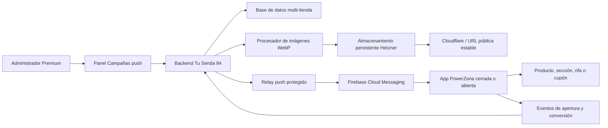
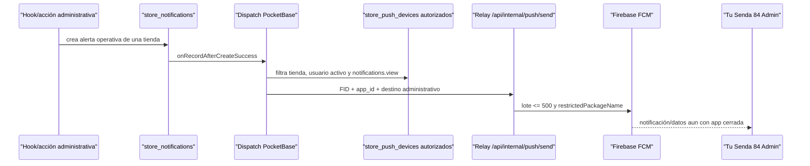

# Plan maestro: app de clientes white-label y campañas push Premium

> Documento vivo de ejecución para construir una app Android pública de PowerZona, reutilizable para otras tiendas de Tu Senda 84, con campañas push administradas desde el panel web.

## 1. Control del documento

| Campo | Valor |
|---|---|
| Estado general | PZ-APP-C10.7 EN CURSO — implementación local, volumen y backup integrado de staging verificados; despliegue pendiente |
| Versión del documento | 1.40 |
| Fecha de creación | 2026-08-11 |
| Última actualización | 2026-08-18 |
| Tienda piloto | PowerZona |
| Plataforma inicial | Android (APK y AAB) |
| Proyecto móvil propuesto | `mobile-storefront` |
| Aplicación administrativa existente | `mobile-admin` / Tu Senda 84 Admin |
| Responsable de aprobación | Propietario de Tu Senda 84 |
| Próximo prompt | Con autorización separada, desplegar C10.7 únicamente en staging y ejecutar QA aislado con limpieza total posterior |

### Convención de estados

- `[ ]` PENDIENTE: todavía no iniciado.
- `[x]` COMPLETADO: implementado, probado y documentado.
- `EN CURSO`: debe indicarse en la tabla general y en la bitácora. Solo puede existir un prompt en este estado.
- `BLOQUEADO`: no puede continuar sin una decisión, acceso o corrección externa.

### Niveles de razonamiento y criterio de calidad

Las recomendaciones de este documento usan los nombres disponibles en Codex:

- **Medium:** equilibrio entre velocidad y análisis. Útil cuando el alcance ya está claro.
- **High:** adecuado para implementación con varios archivos, pruebas y decisiones técnicas.
- **Extra High:** recomendado para seguridad, arquitectura, migraciones y flujos con muchas dependencias.
- **Max:** reserva más tiempo de razonamiento para los problemas de mayor riesgo, especialmente diagnóstico integral y producción.
- **Ultra:** divide trabajo complejo entre subagentes. No se usará por defecto en este plan porque las fases son secuenciales y necesitan una única trazabilidad. Solo se considerará si el propietario pide explícitamente trabajo paralelo y las partes pueden aislarse sin riesgo.

Según la [guía oficial de modelos de Codex](https://learn.chatgpt.com/docs/models.md), **Sol** es la opción preferida para trabajo complejo, abierto y de alto valor; **Terra** funciona bien como modelo general para tareas cotidianas y bien delimitadas. Un nivel mayor puede mejorar el análisis, pero también tarda más y consume más recursos.

Ningún modelo o nivel garantiza por sí solo un resultado perfecto. Para este proyecto, la calidad se consigue combinando:

1. Un prompt con alcance y definición de terminado.
2. El modelo y nivel apropiados al riesgo.
3. Pruebas automáticas.
4. Pruebas manuales en staging, emulador y teléfono físico.
5. Revisión del resultado antes de producción.

Cuando una fase requiera intervención humana, Codex debe mostrar claramente **PRUEBA MANUAL NECESARIA**, entregar pasos numerados, resultado esperado y evidencia solicitada. El prompt no se marcará completado hasta recibir el resultado de esa prueba o documentar por qué se pospuso.

## 2. Objetivo del proyecto

Construir una app Android pública para los clientes de PowerZona que muestre la tienda web, funcione sin inicio de sesión obligatorio y reciba notificaciones incluso cuando la app esté cerrada. La solución debe ser white-label: el mismo código permitirá generar una app diferente para otra tienda de Tu Senda 84 cambiando su configuración, marca, URL, identificador Android y credenciales de Firebase.

La app pública white-label y su panel de campañas serán productos exclusivos del plan Premium. El panel permitirá crear, segmentar, programar, enviar y medir notificaciones con texto, imagen WebP y enlaces internos. Al tocar una notificación, la app podrá abrir un producto, categoría, sección, seguimiento de pedido, rifa o cupón.

## 3. Decisiones aprobadas

1. La app de clientes será independiente de **Tu Senda 84 Admin**.
2. PowerZona será la primera tienda y servirá como plantilla validada.
3. La primera versión será Android; generará APK para entrega directa y AAB para Google Play.
4. No se exigirá una cuenta de cliente. Cada instalación se registrará anónimamente mediante un identificador de instalación de Firebase o equivalente.
5. La dirección IP no identificará al dispositivo. Solo se registrará en el servidor para seguridad, control de abuso y ubicación aproximada.
6. Los administradores de tienda verán estadísticas agregadas. El IP sin anonimizar, si se conserva, quedará restringido al Master Admin o funciones de seguridad.
7. Las imágenes se alojarán inicialmente en el servidor Hetzner, en almacenamiento persistente, se validarán y convertirán a WebP y se entregarán mediante una URL estable con caché de Cloudflare.
8. Los secretos, cuentas de servicio, archivos de firma y contraseñas nunca se guardarán en Git.
9. Las campañas comerciales para clientes se separarán de las alertas operativas de administradores.
10. Toda entidad móvil pertenecerá a una sola tienda. Ninguna campaña, instalación, imagen o evento podrá cruzar datos entre tiendas.
11. El permiso Premium se comprobará en el backend; ocultar botones en la interfaz no será suficiente.
12. Ninguna fase se desplegará en producción sin pasar primero por staging, emulador y teléfono físico cuando corresponda.
13. La app pública white-label, su configuración, builds y campañas solo se provisionarán para tiendas con plan Premium activo.

## 4. Resumen vivo del proyecto

### 4.1 Base ya completada y reutilizable

- [x] Existe una app administrativa Android nativa en `mobile-admin`.
- [x] La app administrativa usa el identificador `com.tusenda84.admin`.
- [x] La versión administrativa 1.0.2 fue instalada y validada.
- [x] Se solicitaron y verificaron los permisos de notificaciones de Android.
- [x] Las notificaciones administrativas funcionan con la app cerrada en un Samsung Galaxy Z Fold5 físico.
- [x] Se completó una prueba real de orden identificada como `Push002`.
- [x] El flujo validado es: PocketBase → Cloudflare → relay interno → Firebase Cloud Messaging → teléfono.
- [x] El relay de producción utiliza `https://tusenda84.com/api/internal/push/send`.
- [x] Firebase Admin y el secreto compartido del relay están configurados en el entorno de producción.
- [x] Cloudflare permite el tráfico originado por el servidor Hetzner `91.99.99.83` mediante la regla **Lista blanca servidor Alemania**.
- [x] La regla de lista blanca se encuentra antes de la limitación geográfica, usa la acción `Skip` y conserva el registro de eventos.
- [x] La limitación geográfica continúa activa para el resto del tráfico.
- [x] Se eliminó el relay HTTP temporal basado en `sslip.io`.
- [x] Frontend y PocketBase fueron desplegados y validados después de la corrección.
- [x] El commit desplegado durante esa validación fue `f5b023bc81075691c5b78f70e4a98279920967e1`.

### 4.2 Componentes existentes auditados en PZ-APP-C01

- `backend-powerzona/pb_hooks/pz_store_push_dispatch_lib.js`
- `backend-powerzona/pb_hooks/pz_store_push_devices_lib.js`
- Rutas relacionadas con dispositivos push en `backend-powerzona/pb_hooks`.
- Colecciones actuales `store_push_devices` y `store_notifications`.
- `frontend-powerzona/src/pages/api/internal/push/send.ts`
- Lógica Android de Firebase, registro y deep links en `mobile-admin`.
- Ayudantes de planes y permisos, entre ellos `pz_store_plans_lib.js` y `pz_store_team_permissions_lib.js`.

Resultado: el canal administrativo puede conservarse sin cambios, pero no se reutilizarán sus colecciones, identidad, permiso, rutas ni contrato de relay como canal público. Solo se reutilizarán patrones probados: FID de Firebase, entrega híbrida notificación/datos, `restrictedPackageName`, lotes de hasta 500, canales Android y desactivación de instalaciones rechazadas permanentemente.

### 4.3 Separación obligatoria

La colección administrativa `store_push_devices` no debe reutilizarse automáticamente para clientes. El registro actual está ligado a usuarios administrativos autenticados y a reglas operativas del panel. La app pública necesita instalaciones anónimas, consentimiento de notificaciones y métricas diferentes.

Se crearán modelos específicos para la app pública. Los nombres definitivos acordados técnicamente en PZ-APP-C01 son:

- `storefront_app_configs`
- `storefront_installations`
- `storefront_web_sessions`
- `storefront_order_links`
- `push_media`
- `push_campaigns`
- `push_campaign_deliveries`
- `push_events`
- `push_daily_stats`, diferida a PZ-APP-C09

No se creará una colección pública de lotes: el bloqueo, intento y resultado se conservarán en `push_campaign_deliveries` y en campos de control de `push_campaigns`.

### 4.4 Estado alcanzado al cerrar PZ-APP-C06

- [x] C02 creó y validó el modelo privado multi-tienda, migraciones, reglas, índices y retención del canal storefront.
- [x] C03 registró instalaciones públicas con App Check/Play Integrity real, credenciales rotables, heartbeat, permiso, bootstrap y disable.
- [x] C04 dejó operativo el canal persistente WebP con cuotas, vencimiento, caché pública y limpieza transaccional.
- [x] C06A aportó únicamente la identidad Android y cliente mínimo de staging necesarios para cerrar la puerta física de C03.
- [x] C05 dejó desplegado en staging el motor de campañas, cron por minuto y relay storefront v2 separado; la matriz inmediata/programada/invalidación/no duplicación fue aprobada y los datos técnicos quedaron limpiados.
- [x] El relay administrativo v1 continúa separado y funcional. Producción, Firebase, enforcement y las fases C06-C12 no se modificaron durante C05.
- [x] C06 convirtió el cliente mínimo de C06A en un shell público Android white-label: configuración estricta por tienda, WebView seguro, offline/reintento, permiso contextual, registro C03 y recepción/apertura FCM para los tres estados de la app.
- [x] El APK debug reproducible usa `com.tusenda84.powerzona.debug`, coexistió con staging en el emulador y no incorporó secretos, firma de staging ni `google-services.json`; C07-C12 continúan sin iniciar.

## 5. Arquitectura objetivo



### 5.1 Aplicación Android white-label

Se creará un proyecto independiente, propuesto como `mobile-storefront`, reutilizando únicamente patrones seguros y probados de `mobile-admin`.

Cada marca tendrá una configuración declarativa con, al menos:

| Propiedad | PowerZona | Otra tienda |
|---|---|---|
| Clave interna | `powerzona` | Configurable |
| Nombre visible | PowerZona | Configurable |
| URL inicial | `https://tusenda84.com/t/powerzona` | URL de la tienda |
| `applicationId` | `com.tusenda84.powerzona`, aprobado | Único por app |
| Icono y splash | V1 y v2 A/B rechazados. Maestro premium, símbolo launcher y splash v3 aprobados por el propietario en `docs/tusenda84/brand/powerzona/` | Marca de la tienda |
| Colores | Paleta v1 rechazada. Paleta v3 zafiro, cobalto, platino y blanco perlado aprobada con tokens exactos en `powerzona-palette-v3.svg` | Configurables |
| Firebase Android app | Exclusiva | Exclusiva |
| `google-services.json` | Fuera de configuración pública | Uno por app |
| Firma Android | Segura y separada | Una política por marca |
| `versionCode` / `versionName` | Independientes | Independientes |

Cada app publicada en Google Play necesita un `applicationId`, ficha, firma y versionado propios. No basta con cambiar la URL.

### 5.2 Registro anónimo de instalaciones

Al abrir la app por primera vez:

1. La app obtiene el Firebase Installation ID (FID) de su Firebase Android app.
2. Solicita permiso de notificaciones en el momento apropiado en Android 13 o superior.
3. Obtiene un token de Firebase App Check con Play Integrity.
4. La capa Android nativa registra la instalación; el WebView nunca recibe el FID ni la credencial de instalación.
5. Envía versión de la app, versión de Android, modelo, idioma, zona horaria y estado del permiso.
6. El servidor resuelve la tienda mediante la app Firebase/configuración validada, registra `first_seen`, actualiza `last_seen` de forma idempotente y devuelve una credencial opaca de instalación.
7. Si Firebase rota el FID, la app vuelve a registrar la instalación; la credencial anterior se revoca o vincula mediante un cambio auditado.

En este repositorio y en las API actuales de Firebase utilizadas por la app administrativa, FCM trabaja con FID, no con el registration token histórico. La reinstalación, eliminación de datos o restauración puede producir un identificador nuevo. Por esa razón, el panel hablará de **instalaciones** o **dispositivos registrados**, no de personas únicas exactas.

### 5.3 Contenido y apertura de una notificación

El mensaje incluirá una carga de datos normalizada:

```json
{
  "schema_version": "1",
  "channel": "storefront",
  "store_key": "powerzona",
  "campaign_id": "ID_DE_CAMPANA",
  "target_type": "product",
  "target_path": "/t/powerzona/producto/slug",
  "image_url": "https://media.tusenda84.com/push/powerzona/archivo.webp"
}
```

Tipos iniciales propuestos:

- `home`: abre la portada de la tienda.
- `product`: abre un producto.
- `category`: abre una categoría.
- `section`: abre una sección especial.
- `order`: abre seguimiento de una orden mediante un enlace seguro.
- `raffle`: abre una rifa.
- `coupon`: abre la tienda y solicita aplicar un cupón válido.

No existirá un tipo `url` libre. El servidor resolverá relaciones de la misma tienda a rutas canónicas y la app validará host HTTPS, slug y familia de ruta. Una app PowerZona no podrá abrir rutas `/admin`, `/master`, `/api`, `/login` ni `/t/<otra-tienda>`. Los enlaces externos se abrirán fuera del WebView solo cuando pertenezcan a esquemas explícitamente permitidos por la navegación normal, nunca por un payload push.

Para un cupón, la app no confiará en un descuento contenido solamente en la notificación. Abrirá una URL segura con un identificador o código; el backend validará vigencia, tienda, límites, elegibilidad y condiciones antes de aplicarlo.

### 5.4 Imágenes WebP en Hetzner

Flujo previsto:

1. El administrador sube JPG, PNG o WebP desde Campañas push.
2. El backend valida tipo real, dimensiones y peso.
3. Elimina metadatos que no sean necesarios.
4. Corrige orientación.
5. Redimensiona dentro del máximo acordado.
6. Convierte a WebP con calidad controlada.
7. Genera un nombre aleatorio no predecible.
8. Guarda en almacenamiento persistente, nunca dentro del sistema de archivos efímero del contenedor frontend.
9. Devuelve una URL HTTPS estable durante la vigencia de 24 horas, preferiblemente bajo `media.tusenda84.com`.
10. El origen sirve la imagen con caché pública acotada a cinco minutos; una integración futura de Cloudflare deberá respetarla.

Se añaden cuotas por tienda, vencimiento físico absoluto, presupuesto global, copias de seguridad y política de retención. Si en el futuro se migra a R2 o S3, el dominio público estable evitará cambios en las apps.

### 5.5 Panel Premium de campañas

El módulo permitirá:

- Crear borradores.
- Definir título, texto, imagen y destino.
- Previsualizar el contenido.
- Elegir audiencia.
- Enviar ahora o programar.
- Cancelar una campaña programada que aún no haya comenzado.
- Ver historial y estado.
- Duplicar una campaña anterior.
- Consultar métricas y errores.

Segmentos iniciales recomendados:

- Todos los dispositivos activos de la tienda.
- Dispositivos activos en los últimos 7 o 30 días.
- Android por versión de app.
- Con permiso de notificación confirmado.
- País o región aproximada, solo cuando la precisión y privacidad lo permitan.
- Segmentos de comportamiento futuros basados en eventos de tienda.

No se enviará por FID uno a uno desde el navegador. El backend resolverá destinatarios, aplicará límites, dividirá lotes, registrará resultados y desactivará FID inválidos.

### 5.6 Métricas

Panel de instalaciones:

- Instalaciones registradas totales.
- Activas hoy, últimos 7 días y últimos 30 días.
- Permiso concedido, denegado o desconocido.
- FID activos, inválidos o revocados.
- Versión de app y Android.
- Modelo del dispositivo.
- Primera y última actividad.
- Distribución geográfica aproximada y agregada.

Embudo de campaña:

1. Dispositivos seleccionados.
2. Mensajes aceptados por Firebase.
3. Envíos fallidos o FID inválidos.
4. Notificaciones abiertas mediante toque.
5. Destino visualizado.
6. Cupón aplicado, cuando corresponda.
7. Orden atribuida, cuando sea técnicamente verificable.

Una respuesta aceptada por Firebase no significa que el usuario leyó la notificación. La apertura solo se contará cuando la app procese el toque y reporte el evento.

## 6. Seguridad, privacidad y límites

- Todo endpoint público tendrá validación estricta, rate limiting y protección contra abuso.
- El servidor determinará la tienda por una credencial/configuración válida; no confiará solamente en un `store_id` arbitrario enviado por el cliente.
- Las consultas administrativas siempre filtrarán por tienda y permisos.
- Las funciones de envío comprobarán plan Premium y permiso, por ejemplo `marketing.push.manage`.
- Se establecerá un máximo de destinatarios y frecuencia por campaña.
- Se evitará registrar FID, credenciales, secretos o IP completos en logs generales.
- Se definirá retención para IP, eventos individuales y campañas.
- Se permitirá desactivar una instalación o sus notificaciones.
- Se eliminarán o invalidarán FID rechazados permanentemente por Firebase.
- Las imágenes serán públicas por necesidad técnica, pero usarán nombres aleatorios y no contendrán datos sensibles.
- La pantalla administrativa mostrará consentimiento, finalidad y límites de las métricas.
- El WebView solo abrirá hosts permitidos y bloqueará esquemas inseguros.
- La navegación, cargas de archivos y puentes JavaScript se revisarán contra abuso.
- Las cuentas de servicio de Firebase tendrán privilegios mínimos y rotación documentada.

### 6.1 Resultado de la auditoría PZ-APP-C01

Auditoría local realizada sobre `064d584f9de8c98638d4cb1bb035eb05b76c2458`. El repositorio estaba limpio antes de la edición documental y no existía `.tmp/`. No se abrió `pb_data`, no se usaron credenciales reales y no se ejecutaron migraciones, builds, servidores, despliegues ni acciones sobre Cloudflare, Coolify, Firebase o producción.

| Área | Estado real confirmado | Consecuencia para la app pública |
|---|---|---|
| Android administrativo | `mobile-admin` es Android nativo Java 17, SDK/target 36, minSdk 26, versión 1.0.2 y paquete predeterminado `com.tusenda84.admin`. El WebView bloquea acceso a archivos, mixed content y errores SSL; FCM auto-init se activa después del consentimiento. | Crear `mobile-storefront` independiente. Reutilizar patrones, no autenticación, cookies, puente ni paquete administrativo. |
| Marca PowerZona | No existían recursos inequívocos de PowerZona. El propietario rechazó v1 y v2 A/B, aportó una referencia y aprobó el maestro v3 original con P/Z inclinada, rayo, órbita y acabado zafiro/platino sobre blanco perlado. C01 derivó un símbolo launcher, splash y paleta exacta v3 en `docs/tusenda84/brand/powerzona/`; los tres fueron aprobados. | C07 no usará recursos rechazados y solo generará densidades/recursos Android finales desde la familia v3 aprobada. |
| Navegación Android | `MainActivity.java` permite navegación interna por host configurado y abre esquemas externos de forma controlada. Esa frontera es suficiente para un panel de un solo tenant, pero no para un host público que sirve muchas tiendas. | Validar HTTPS + host + slug fijo + familia de ruta. Un payload no podrá aportar una URL arbitraria. |
| Identidad push administrativa | `/api/pz/store-push/register` exige usuario autenticado, dispositivo administrativo autorizado y permiso `notifications.view`; persiste en `store_push_devices`. | No reutilizar `store_push_devices`. La instalación pública no representa a un usuario ni consume la cuota de dispositivos administrativos. |
| Alertas administrativas | Hooks crean `store_notifications`; el hook posterior a creación selecciona dispositivos administrativos activos de la misma tienda y envía al relay. | No reutilizar `store_notifications`. Las campañas comerciales tendrán ciclo de vida, audiencia, cuota, imagen, programación y métricas propios. |
| Relay Firebase | `/api/internal/push/send` exige secreto compartido, agrupa por `app_id`, usa FID, `restrictedPackageName`, prioridad alta y payload híbrido. El límite implementado por lote es 500. | Mantener este endpoint como v1 administrativo. Crear v2 separado para campañas y evitar regresiones. |
| Planes | Free y Básico comparten capacidades avanzadas desactivadas; Premium las activa. PowerZona está migrada como Premium permanente. | Añadir la capability `push_campaigns_enabled`; no inferir Premium solo desde el frontend y reevaluarla también al ejecutar. |
| Permisos | El catálogo posee 28 permisos asignables y cinco reservados; no existe permiso de campañas. El principal activo hereda el conjunto autorizado y los colaboradores usan permisos persistidos. | Añadir `marketing.push.manage`, incluirlo en la plantilla de marketing y exigirlo en lectura operativa y mutaciones sensibles. |
| Rutas multi-tienda | La ruta pública canónica es `/t/:storeSlug`; `/admin` es legado y `/t/:storeSlug/admin` es canónica. PowerZona es el slug predeterminado. | La app fija una sola configuración de tienda. Ni el cliente ni el payload pueden escoger otro `store_id`/slug. |
| Medios | PocketBase 0.38.2 guarda archivos bajo `pb_data/storage`; el frontend ya incluye `sharp` 0.34.5. El Dockerfile crea `/app/pb_data`, pero no declara por sí mismo un volumen. La documentación de despliegue dice que Coolify monta persistencia, sin prueba remota en C01. | Recomendación: archivo PocketBase en el volumen persistente existente, procesado primero por SSR con `sharp`. La persistencia real debe probarse en staging antes de aprobar C04. |
| Programación | PocketBase ya ejecuta `cronAdd` para avisos operativos cada cinco minutos. | Usar un cron nuevo cada minuto con lease transaccional e idempotencia por entrega. No mezclarlo con el cron operativo. |
| Borrado de tiendas | `pz_master_store_deletion_lib.js` cuenta, borra y verifica explícitamente las colecciones de cada tienda. | Toda colección nueva debe añadirse al preview, orden de borrado y verificación para no dejar datos huérfanos ni romper la eliminación. |
| Despliegue | Astro 6.4.3 usa adaptador Node; requiere Node >=22.12. PocketBase se construye en imagen 0.38.2. Producción conocida usa Git/Coolify/Hetzner/Cloudflare y relay en `tusenda84.com`. | Los cambios serán append-only y se probarán primero en staging. C01 no verificó ni alteró el estado remoto. |

Flujo administrativo actual, que debe permanecer compatible:



### 6.2 Arquitectura definitiva propuesta para el canal público

```mermaid
sequenceDiagram
    participant M as "mobile-storefront nativa"
    participant G as "Gateway Astro /api/storefront/v1"
    participant C as "Firebase App Check"
    participant P as "PocketBase privado"
    participant S as "Scheduler campañas"
    participant R as "Relay v2"
    participant F as "Firebase FCM"
    M->>C: obtiene token Play Integrity
    M->>G: FID + metadatos + App Check
    G->>C: verifica token y Firebase app id
    G->>P: llamada interna autenticada; sin store_id del cliente
    P-->>M: credencial opaca de instalación
    S->>P: reclama campaña y snapshot de destinatarios
    S->>R: entregas de una sola tienda, lotes <= 500
    R->>F: FID, packageName e imagen pública
    F-->>M: campaña storefront
    M->>G: apertura/evento + App Check + credencial
    G->>P: evento idempotente y acotado a instalación/tienda
```

Fronteras obligatorias:

1. La app nativa conoce una `app_key` pública compilada y su Firebase Android app; no envía un `store_id` confiable.
2. El gateway Astro verifica Firebase App Check y deriva `firebase_app_id`. PocketBase resuelve desde ese identificador una sola `storefront_app_configs` activa.
3. Gateway y PocketBase usan un secreto interno nuevo, mínimo 32 caracteres, distinto de `PZ_PUSH_RELAY_SECRET` y de los secretos de seguridad existentes.
4. El FID y la credencial de instalación solo viven en código nativo y backend. No se exponen a JavaScript, URLs, analítica web ni logs generales.
5. La credencial de instalación es aleatoria, rota, se guarda en Android mediante Keystore/almacenamiento cifrado y solo se persiste como digest HMAC en el servidor.
6. Firebase App Check prueba que la solicitud procede de una app admitida; no sustituye la credencial de instalación ni la autorización de tienda.
7. Las reglas CRUD directas de las colecciones nuevas quedan cerradas. Clientes públicos pasan por gateway; administradores pasan por endpoints autenticados que vuelven a comprobar tienda, plan y permiso.
8. Todo registro contiene `store`; las relaciones referenciadas deben tener el mismo `store`, validado en backend. La tienda se deriva del actor o de `storefront_app_configs`, nunca de un campo libre.
9. La cuenta de servicio Firebase, `google-services.json`, secretos internos y firmas Android permanecen fuera de Git.

### 6.3 Colecciones, campos sensibles e índices

| Colección | Propósito y campos principales | Acceso e índices obligatorios |
|---|---|---|
| `storefront_app_configs` | `store`, `app_key`, `display_name`, `package_name`, `firebase_app_id`, `public_origin`, `store_path_prefix`, `status`, versiones mínimas. | CRUD directo cerrado; Master para administración futura. Solo puede provisionarse/activarse para Premium. Únicos `app_key`, `package_name`, `firebase_app_id`; único compuesto `store + app_key`. `store` no cambia tras crear. |
| `storefront_installations` | `store`, `app_config`, `fid` oculto, `fid_digest`, `credential_digest`, `status`, `notification_permission`, `app_version`, `android_version`, `device_model`, `locale`, `timezone`, `first_seen`, `last_seen`, `last_ip_encrypted`/seguridad y geografía aproximada. | CRUD cerrado. Único `app_config + fid_digest`; índices `store + status + last_seen`, `store + notification_permission`. FID/IP nunca en respuestas o logs generales. |
| `storefront_web_sessions` | Sesión web efímera que vincula una instalación nativa con el WebView sin revelar FID/credencial: `store`, `installation`, `session_digest`, `expires_at`, `last_seen`, `status`. | CRUD cerrado; único `session_digest`; índices `store + installation + status`, `expires_at`. Cookie `HttpOnly`, `Secure`, `SameSite=Lax`; bootstrap de un solo uso. |
| `storefront_order_links` | Asociación verificada `store`, `installation`, `order`, `created_at`, `status` para destino/atribución de orden. | CRUD cerrado; único `installation + order`; todas las relaciones deben pertenecer a la misma tienda. No almacena el token de recibo en eventos ni FCM. |
| `push_media` | `store`, archivo PocketBase `file`, `sha256`, `width`, `height`, `bytes`, `status`, `created_by`, `referenced_at`, `delete_after`. | CRUD cerrado; archivo público por URL no predecible; índices `store + status + created`, `sha256`. Backend valida cuota y referencias antes de borrar. |
| `push_campaigns` | `store`, `created_by`, `status`, `title`, `body`, `media`, audiencia declarativa, destino tipado, `scheduled_at`, zona horaria de presentación, contadores, `lock_token`, `lock_expires_at`, `started_at`, `completed_at`, `canceled_at`, `failure_code`. Relaciones de destino separadas: producto, categoría, orden, rifa o cupón; sección como enum. | CRUD cerrado; índices `store + status + scheduled_at`, `store + created`, `lock_expires_at`. Backend impone exactamente un destino compatible y la misma tienda. |
| `push_campaign_deliveries` | Snapshot por destinatario: `store`, `campaign`, `installation`, `status`, `attempt_count`, `claim_token`, `lease_expires_at`, `firebase_message_id`, código de error normalizado y timestamps. | Único `campaign + installation`; índices `campaign + status`, `store + status + updated`, `lease_expires_at`. No copia FID ni IP. |
| `push_events` | `store`, `campaign`, `delivery`, `installation`, `event_type`, `idempotency_key`, `occurred_at`, `received_at`, versión de esquema y metadatos permitidos. | CRUD cerrado; único `installation + idempotency_key`; índices `store + campaign + event_type + occurred_at`, `received_at`. Payload con lista cerrada y reloj acotado. |
| `push_daily_stats` | Agregados diarios por tienda/campaña/plataforma; se crea en C09, no en C02. | Único por dimensión y fecha; nunca contiene FID, IP ni credencial. |

Las migraciones deben usar relaciones sin cascade automático desde `stores`; el flujo Master de eliminación mantendrá un inventario explícito y transaccional. Las reglas directas no se abrirán como sustituto de los endpoints.

### 6.4 Contratos HTTP definitivos

Rutas externas nativas en Astro, por defecto `POST`, con JSON estricto, límite de cuerpo, rate limit, HTTPS, App Check y respuestas sin secretos. La única excepción es el consumo WebView de un código bootstrap de un solo uso:

| Ruta | Autenticación adicional | Resultado |
|---|---|---|
| `/api/storefront/v1/installations/register` | App Check; FID en cuerpo nativo | Alta/upsert idempotente y credencial de instalación rotada. |
| `/api/storefront/v1/installations/heartbeat` | App Check + credencial | Actualiza metadatos y `last_seen` con límites. |
| `/api/storefront/v1/installations/permission` | App Check + credencial | Registra `granted`, `denied` o `unknown`. |
| `/api/storefront/v1/installations/disable` | App Check + credencial | Revoca credencial y excluye entregas. |
| `POST /api/storefront/v1/session/bootstrap` | App Check + credencial | Devuelve una URL con código aleatorio de un solo uso y vida máxima de 60 segundos. |
| `GET /api/storefront/v1/session/bootstrap/{code}` | Código de un solo uso | Lo consume atómicamente, establece cookie HttpOnly y redirige a la tienda fija; repetición o expiración falla cerrado. |
| `/api/storefront/v1/events` | App Check + credencial | Acepta evento tipado e idempotente. |
| `/api/storefront/v1/campaigns/resolve-target` | App Check + credencial | Resuelve un destino vigente de la misma entrega; es obligatorio para orden. |

Rutas PocketBase internas equivalentes bajo `/api/pz/storefront/v1/*` exigirán `X-PZ-Storefront-Internal`, aceptarán el Firebase app id ya verificado por el gateway y volverán a resolver app/tienda. Ninguna confiará en `X-Forwarded-For` o `store_id` aportado por el teléfono; la IP efectiva se obtiene en la capa pública conforme a la topología Cloudflare/Coolify y se pasa en un sobre firmado interno.

Rutas administrativas PocketBase, con sesión normal, CSRF/origen según el patrón actual, `push_campaigns_enabled` y `marketing.push.manage`:

- `GET /api/pz/storefront/v1/campaigns`
- `GET /api/pz/storefront/v1/campaigns/{id}`
- `POST /api/pz/storefront/v1/campaigns/save`
- `POST /api/pz/storefront/v1/campaigns/audience-preview`
- `POST /api/pz/storefront/v1/campaigns/schedule`
- `POST /api/pz/storefront/v1/campaigns/cancel`
- `POST /api/pz/storefront/v1/campaigns/duplicate`
- `POST /api/pz/storefront/v1/media/attach`
- `POST /api/pz/storefront/v1/media/delete`

El procesador SSR de imagen será `POST /api/admin/storefront-push/media`. El relay nuevo será `POST /api/internal/push/v2/send`, solo interno. El v1 actual `/api/internal/push/send` no cambiará de contrato.

### 6.5 Deep links y navegación segura

El payload FCM data-only llevará como máximo `schema_version`, `channel`, `store_key`, `campaign_id`, `title`, `body`, `target_type`, `target_path` cuando sea público y `image_url`; se mantendrá holgadamente por debajo de 4096 bytes. `target_path` siempre se genera en servidor. La app construye la notificación local y su `PendingIntent` para conservar el mismo contrato validado en foreground, background y proceso cerrado.

| Tipo | Fuente autorizada | Ruta canónica / regla |
|---|---|---|
| `home` | Sin referencia | `/t/{slug}` |
| `product` | Relación `products` activa de la misma tienda | `/t/{slug}/producto/{slug-actual}` |
| `category` | Relación `categories` activa de la misma tienda | `/t/{slug}/categoria/{slug-actual}` |
| `section` | Enum cerrado `search`, `links`, `gifts`, `raffles`, `checkout` | Ruta pública conocida bajo `/t/{slug}`. |
| `raffle` | Relación `raffles` de la misma tienda | `/t/{slug}/rifa/{raffleSlug}`; si venció, respaldo `/t/{slug}/rifa`. |
| `coupon` | Relación `manual_coupons` de la misma tienda | `/t/{slug}?coupon={codigo}`; el checkout vuelve a validar tienda, vigencia, límites y precios. |
| `order` | `storefront_order_links` activo y audiencia de una sola instalación | No se incluye el token de orden en FCM. `resolve-target` autentica la instalación y devuelve temporalmente `/orden/{orderNumber}/{token}`. |

La app acepta únicamente `https://tusenda84.com` y `https://www.tusenda84.com` si el origen canónico mantiene ambos, más el prefijo exacto de su tienda y la ruta de recibo resuelta por servidor. Un destino eliminado, vencido, de otra tienda o mal formado abre `/t/{slug}` y reporta un error no sensible. El mensaje no debe contener datos privados: FCM no es un canal de cifrado de extremo a extremo para información sensible.

### 6.6 Medios persistentes

Decisión técnica aprobada por el propietario: usar el campo file de `push_media` en PocketBase. El archivo físico quedará en el `pb_data/storage` persistente del mismo servicio, no en el contenedor efímero de Astro y no en un segundo volumen dedicado en V1. El frontend SSR autenticado decodifica con `sharp`, corrige orientación, elimina metadatos al recodificar y envía el WebP final a PocketBase. PocketBase vuelve a validar tienda, estado y metadatos esperados.

Límites recomendados:

- Entrada: JPG, PNG o WebP real; máximo 8 MiB, 6000 px por lado y 36 megapíxeles.
- Salida: WebP `fit: inside`, máximo 1200 × 630, calidad inicial 82 y máximo 100 KiB; la estrategia reduce calidad de forma acotada hasta 28 y usa perfiles descendentes hasta 480 × 252. Si aun así no baja del límite, se rechaza.
- Cuota: 250 MiB y máximo 100 medios físicos por tienda. El almacenamiento físico global de tiendas tiene alerta crítica al Master desde 35 GiB y bloqueo de nuevas cargas por encima de 40 GiB; protege cargas push y productos sin adelantar la futura conversión de productos.
- Vigencia: cada imagen push vence de forma absoluta a las 24 horas. El cron elimina el archivo y retira transaccionalmente referencias de campañas; si el cliente necesita conservarlo, debe guardar una copia propia antes del vencimiento.
- Nombre: 128 bits aleatorios + extensión `.webp`, sin nombre original ni datos de cliente.
- Caché: `Cache-Control: public, max-age=300, must-revalidate`; reemplazar crea otro archivo y el origen deja de servirlo al vencer.
- Host inicial: URL pública estable del PocketBase existente. Recomendación de alias: `media.tusenda84.com`, apuntando al mismo origen para permitir una migración futura sin cambiar las apps.
- Backup: incluir `pb_data/storage` y la base PocketBase como una unidad consistente; probar restauración y persistencia en staging durante C04.

El Dockerfile no prueba que Coolify tenga el volumen montado. Antes de C04 se deberá confirmar el mount exacto `/app/pb_data`, backup y restore de staging; no se presupone el estado remoto desde este repositorio.

### 6.7 Plan Premium, permiso, cuotas y downgrade

- Capability definitiva: `push_campaigns_enabled`, `true` solo en Premium activo.
- Elegibilidad de producto aprobada: la app pública white-label, su configuración, builds y campañas se ofrecen exclusivamente a tiendas con plan Premium activo. Si una tienda ya publicada baja de plan, la app instalada conserva acceso seguro al escaparate público, pero se suspenden altas push y campañas para no romper la navegación de clientes existentes.
- Permiso definitivo: `marketing.push.manage`; se añade al catálogo asignable y a la plantilla `marketing_promotions`. El administrador principal activo lo obtiene por la semántica vigente; colaboradores requieren asignación explícita.
- El backend comprueba capability y permiso al guardar contenido enviable, calcular audiencia, programar, enviar ahora, cancelar y duplicar; el scheduler vuelve a comprobar plan, tienda activa y autorización vigente del creador antes de reclamar destinatarios.
- Free/Básico pueden ver una explicación comercial, pero no datos de instalaciones, borradores o métricas del módulo.
- Cuota diaria aprobada por el propietario: máximo 10 campañas iniciadas por tienda en cada día calendario de su zona horaria configurada. Los borradores y las campañas canceladas antes de comenzar no cuentan.
- Frecuencia aprobada por instalación: una instalación elegible puede recibir las 10 campañas de ese día. El contador se reinicia con el día calendario de la tienda; las alertas administrativas no cuentan para este límite.
- Cuota mensual aprobada por el propietario: máximo 310 campañas iniciadas por tienda, equivalente a 10 diarias durante un mes de 31 días.
- Audiencia aprobada por el propietario: no existe un máximo fijo de instalaciones por campaña. Una campaña dirigida a todos se procesa para todas las instalaciones activas y elegibles, sin excluir silenciosamente las que superen 20 000 o 100 000.
- FCM es un producto sin coste por cantidad de mensajes. El límite técnico oficial actual del API HTTP v1 es una cuota predeterminada de 600 000 mensajes downstream por minuto y proyecto, sujeta a cambio o ampliación; no es una cuota mensual de facturación. El motor consultará/monitorizará la cuota real, enviará en lotes de hasta 500, distribuirá la carga y respetará `Retry-After` ante `429 RESOURCE_EXHAUSTED`.
- Si una tienda baja de Premium: conservar borradores, medios e historial en solo lectura; bloquear nuevas acciones; pasar lo programado aún no iniciado a `paused_plan`; no reanudar automáticamente al recuperar Premium. Un administrador autorizado debe revisar y reprogramar para evitar un envío antiguo inesperado.

La exclusividad Premium, las cuotas y el comportamiento de downgrade fueron aprobados por el propietario en C01.

### 6.8 Programación, concurrencia e idempotencia

PocketBase ejecutará `cronAdd("pz_storefront_push_campaigns", "* * * * *", ...)` dentro del proceso `serve`. El motor:

1. Busca campañas `scheduled` con `scheduled_at <= now`.
2. En transacción SQLite vuelve a validar tienda, Premium, permiso del creador, cuotas, destino y medio; adquiere `lock_token` con lease corto.
3. Materializa una vez el snapshot de destinatarios en `push_campaign_deliveries`; el índice único `campaign + installation` impide repetir filas.
4. Reclama entregas pendientes mediante `claim_token`/`lease_expires_at` y las divide en lotes de hasta 500.
5. Llama al relay v2. Este devuelve por `delivery_id` aceptación, fallo permanente o fallo transitorio, sin devolver FID en logs/respuestas generales.
6. Marca FID permanentemente inválidos como `invalid`; reintenta fallos transitorios hasta tres veces con backoff y nunca cruza tienda/app/package.
7. Si el resultado de red es ambiguo después de entregar a Firebase, marca `unknown` y no reintenta automáticamente; requiere revisión. Esto prioriza evitar duplicados sobre ocultar una incertidumbre.
8. Consolida `sent`, `partially_sent` o `failed`, libera el lease y registra contadores auditables.

El bloqueo transaccional protege también si en el futuro hay más de una réplica, pero C11 debe confirmar cuántos procesos `serve`/scheduler existen. FCM no ofrece idempotencia de entrega extremo a extremo: un fallo entre la aceptación de Firebase y la persistencia local puede dejar resultado incierto. La app usará una etiqueta estable por campaña para reemplazar visualmente duplicados, pero el panel no prometerá “exactly once”.

### 6.9 Métricas, privacidad y atribución

- `selected` significa snapshot de instalaciones elegibles; `accepted` significa que Firebase aceptó el mensaje, no que Android lo entregó o el cliente lo leyó.
- `opened` solo se cuenta cuando la app nativa procesa el toque y envía un evento autenticado e idempotente.
- `destination_viewed` se registra por la sesión web efímera después de cargar un destino válido.
- Un cupón se atribuye únicamente si el servidor lo aplicó en checkout, coincide tienda/campaña/instalación y ocurrió dentro de siete días del toque.
- Todo pedido creado desde una `storefront_web_sessions` válida conserva una relación privada y única con `storefront_installations`, aunque no provenga de una campaña. El código administrativo HMAC `APP-…` se deriva al consultar y no se persiste dentro del pedido ni sustituye la relación interna.
- Una orden se atribuye a una campaña solo si, además del vínculo privado anterior, se crea después del toque y dentro de siete días; correlación temporal sin vínculo de instalación no basta. La misma fila se completa desde `attribution_source = none` sin duplicar la relación de origen.
- Al eliminar la identidad de Seguridad del cliente se elimina también el vínculo instalación-pedido; al borrar el pedido se eliminan el vínculo y sus eventos. El pedido comercial anonimizado no conserva una vía indirecta hacia la instalación.
- Retención vigente desde C09 por decisión posterior del propietario: IP completa cifrada 30 días; sesiones web 30 días tras expirar; el contenido visible de borradores y campañas finalizadas se redacta a los siete días; entregas, eventos y agregados diarios se conservan como máximo 90 días. Las campañas programadas, en proceso o pausadas por plan no vencen mientras permanezcan activas. Un estado técnico privado sin contenido conserva únicamente zona horaria e inicios durante 40 días para sostener las cuotas permanentes 10/310. La evidencia mínima de una atribución ya fijada en una orden sigue la retención propia de esa orden y no depende de conservar el contenido de la campaña.
- Store Admin ve agregados y datos operativos de su tienda, nunca IP completa/FID/credenciales. Master/seguridad puede revelar el IP solo por el flujo auditado existente o una extensión equivalente.

Contrato de privacidad aplicado en C03: la app nativa envía únicamente FID, versión de app, versión Android, modelo, idioma, zona horaria y permiso de notificaciones. No puede declarar `store_id`, IP, país o región. El gateway obtiene el IP desde la topología confiable del runtime, PocketBase lo cifra con AES-256-GCM y fija `ip_delete_after` a 30 días; nunca lo usa como identidad. País/región aproximados solo se aceptan desde metadatos del proxy y quedan separados del IP completo. FID y credencial se buscan mediante HMAC con dominios distintos; la credencial solo se devuelve a la capa nativa y no se registra en activity logs. Las respuestas públicas omiten FID, digests, IP y secretos. El administrador de tienda no recibe acceso CRUD a estos campos; el IP completo sigue restringido a Superuser/Master-seguridad y requerirá un flujo auditado específico si se incorpora a una interfaz futura.

### 6.10 Compatibilidad, migración y rollback

1. Migraciones append-only: crear colecciones/capability/permiso sin alterar datos de `store_push_devices` o `store_notifications`.
2. Relay paralelo: v1 administrativo permanece intacto; v2 comparte solo inicialización Firebase y validadores puros probados.
3. App paralela: `mobile-storefront` usa paquete, Firebase app, firma, datos y configuración separados; nunca actualiza ni sustituye `com.tusenda84.admin`.
4. Secretos paralelos: `PZ_STOREFRONT_INTERNAL_SECRET` y App Check no reutilizan el secreto del relay administrativo.
5. Activación progresiva: colecciones y endpoints cerrados → gateway/App Check → medios → motor deshabilitado → app staging → panel staging → pruebas C11 → producción C12.
6. Rollback antes de producción: desactivar `storefront_app_configs`/scheduler y volver a la imagen anterior; las tablas nuevas pueden quedar inertes. El `down` de migraciones solo se usará en una base desechable o si está demostrado que no contiene datos útiles.
7. No hay migración de dispositivos administrativos a instalaciones públicas. Cada cliente debe registrarse desde `mobile-storefront`.
8. Cada nueva colección se incorpora al preview/borrado Master y a pruebas de aislamiento antes de habilitar el módulo.

### 6.11 Inventario exacto previsto de archivos de C02-C014

Este inventario es el contrato de implementación conocido en C01. Si una fase descubre que necesita otro archivo, debe registrarlo primero en la bitácora de esa fase y justificarlo; no autoriza editarlo durante C01.

| Fase | Archivos nuevos o modificados previstos |
|---|---|
| C02 | `backend-powerzona/pb_migrations/1786579200_storefront_push_foundation.js`; `backend-powerzona/pb_migrations/1786579300_storefront_push_permission.js`; `backend-powerzona/pb_hooks/pz_storefront_push_schema_lib.js`; `backend-powerzona/pb_hooks/pz_store_plans_lib.js`; `backend-powerzona/pb_hooks/pz_store_capabilities_lib.js`; `backend-powerzona/pb_hooks/pz_store_team_permissions_lib.js`; `backend-powerzona/pb_hooks/pz_store_permission_enforcement_lib.js`; `backend-powerzona/pb_hooks/pz_master_store_deletion_lib.js`; `frontend-powerzona/src/lib/storeCapabilities.ts`; `frontend-powerzona/src/lib/storeTeamPermissions.ts`; `backend-powerzona/tests/pz_storefront_push_schema.test.cjs`; `backend-powerzona/tests/pz_storefront_push_permissions.test.cjs`; `backend-powerzona/tests/pz_master_store_deletion_storefront.test.cjs`; `backend-powerzona/tests/pz_store_plans.test.cjs`; `backend-powerzona/tests/pz_store_capabilities.test.cjs`; `backend-powerzona/tests/pz_store_team_permissions.test.cjs`; `backend-powerzona/tests/pz_store_plan_management.test.cjs`. |
| C03 | `backend-powerzona/pb_hooks/pz_storefront_installations.pb.js`; `backend-powerzona/pb_hooks/pz_storefront_installations_lib.js`; `frontend-powerzona/src/lib/storefrontPushAppCheck.ts`; `frontend-powerzona/src/lib/storefrontPushContracts.ts`; `frontend-powerzona/src/pages/api/storefront/v1/installations/register.ts`; `frontend-powerzona/src/pages/api/storefront/v1/installations/heartbeat.ts`; `frontend-powerzona/src/pages/api/storefront/v1/installations/permission.ts`; `frontend-powerzona/src/pages/api/storefront/v1/installations/disable.ts`; `frontend-powerzona/src/pages/api/storefront/v1/session/bootstrap.ts`; `frontend-powerzona/src/pages/api/storefront/v1/session/bootstrap/[code].ts`; `backend-powerzona/tests/pz_storefront_installations.test.cjs`; `frontend-powerzona/tests/storefrontPushGateway.test.mjs`; `backend-powerzona/.env.example`; `frontend-powerzona/.env.example`. |
| C04 | `backend-powerzona/pb_migrations/1786579400_storefront_push_media_100k.js`; `backend-powerzona/pb_hooks/pz_storefront_media.pb.js`; `backend-powerzona/pb_hooks/pz_storefront_media_lib.js`; `backend-powerzona/pb_hooks/pz_store_storage_budget_lib.js`; `backend-powerzona/pb_hooks/pz_product_image_limits_lib.js`; `backend-powerzona/pb_hooks/pz_product_image_limits.pb.js`; `backend-powerzona/tests/pz_storefront_media.test.cjs`; `backend-powerzona/tests/pz_storefront_media_runtime.test.cjs`; `backend-powerzona/tests/pz_store_storage_budget.test.cjs`; `frontend-powerzona/src/lib/storefrontPushMedia.ts`; `frontend-powerzona/src/lib/storefrontPushMediaAccess.ts`; `frontend-powerzona/src/pages/api/admin/push-media.ts`; `frontend-powerzona/tests/storefrontPushMedia.test.mjs`; `docs/tusenda84/PZ_APP_C04_MEDIA_OPERATIONS.md`; `frontend-powerzona/.env.example`. |
| C06A | Proyecto mínimo `mobile-storefront`: wrapper/configuración Gradle, `.gitignore`, `README.md`, `app/build.gradle`, manifiesto, recursos técnicos de staging, `StorefrontApplication.java`, `StorefrontActivity.java`, `StorefrontConfig.java`, `StorefrontInstallationStore.java`, `StorefrontMessagingService.java`, `StorefrontRegistrationClient.java`, `StorefrontRegistrationPayload.java`, pruebas unitarias y `scripts/generate-staging-signing.ps1`. Son prerrequisitos técnicos de C06 y no incluyen WebView, marca final, campañas, deep links ni producción. |
| C05 | `backend-powerzona/pb_hooks/pz_storefront_campaigns.pb.js`; `backend-powerzona/pb_hooks/pz_storefront_campaigns_lib.js`; `backend-powerzona/pb_hooks/pz_storefront_push_dispatch_lib.js`; `frontend-powerzona/src/lib/pushRelayV2Payload.ts`; `frontend-powerzona/src/pages/api/internal/push/v2/send.ts`; `backend-powerzona/tests/pz_storefront_campaigns.test.cjs`; `backend-powerzona/tests/pz_storefront_push_dispatch.test.cjs`; `frontend-powerzona/tests/pushRelayV2Payload.test.mjs`; `backend-powerzona/.env.example`; `frontend-powerzona/.env.example`. |
| C06 | `mobile-storefront/settings.gradle`; `build.gradle`; `gradle.properties`; `gradlew`; `gradlew.bat`; `gradle/wrapper/gradle-wrapper.jar`; `gradle/wrapper/gradle-wrapper.properties`; `.gitignore`; `README.md`; `app/build.gradle`; `app/proguard-rules.pro`; `app/src/main/AndroidManifest.xml`; Java bajo `app/src/main/java/com/tusenda84/storefront/`: `StorefrontActivity.java`, `StorefrontMessagingService.java`, `StorefrontRegistrationClient.java`, `StorefrontInstallationStore.java`, `StorefrontDeepLink.java`, `StorefrontConfig.java`; recursos `res/layout/activity_storefront.xml`, `res/layout/view_storefront_offline.xml`, `res/values/strings.xml`, `colors.xml`, `themes.xml`, `res/xml/network_security_config.xml`; pruebas unitarias `StorefrontConfigTest.java`, `StorefrontDeepLinkTest.java`, `StorefrontPushPayloadTest.java`. |
| C07 | `mobile-storefront/config/powerzona.properties`; `mobile-storefront/brands/powerzona/brand.json`; `icon.png`; `splash.png`; pruebas `app/src/test/java/com/tusenda84/storefront/PowerZonaDestinationsTest.java`; `frontend-powerzona/src/pages/api/storefront/v1/campaigns/resolve-target.ts`; `backend-powerzona/pb_hooks/pz_storefront_installations.pb.js`; `backend-powerzona/pb_hooks/pz_storefront_installations_lib.js`; `backend-powerzona/tests/pz_storefront_order_targets.test.cjs`. La configuración Firebase real seguirá en un archivo local ignorado, no en Git. |
| C08 | `frontend-powerzona/src/pages/admin/push-campaigns.astro`; `frontend-powerzona/src/pages/t/[storeSlug]/admin/push-campaigns.astro`; `frontend-powerzona/src/components/admin/PushCampaignsView.astro`; `frontend-powerzona/src/components/admin/AdminSidebar.astro`; `frontend-powerzona/src/middleware.ts`; `frontend-powerzona/src/lib/storefrontPushAdmin.ts`; `frontend-powerzona/tests/storefrontPushAdminAccess.test.mjs`; `frontend-powerzona/tests/storefrontPushAdminForm.test.mjs`; ajuste de retención solicitado durante C08: `backend-powerzona/pb_migrations/1786665600_push_campaign_retention_7d.js`, `backend-powerzona/pb_hooks/pz_storefront_campaigns.pb.js`, `backend-powerzona/pb_hooks/pz_storefront_campaigns_lib.js`, `backend-powerzona/pb_hooks/pz_storefront_push_schema_lib.js`, `backend-powerzona/pb_hooks/pz_store_activity_audit_lib.js`, `backend-powerzona/tests/pz_storefront_campaigns.test.cjs`, `backend-powerzona/tests/pz_storefront_campaigns_runtime.test.cjs` y `backend-powerzona/tests/pz_storefront_push_schema.test.cjs`. |
| C09 | Inventario efectivo detallado en la bitácora C09. Archivos principales nuevos: `backend-powerzona/pb_migrations/1786665800_storefront_push_analytics_c09.js`; `backend-powerzona/pb_hooks/pz_storefront_analytics.pb.js`; `backend-powerzona/pb_hooks/pz_storefront_analytics_lib.js`; `backend-powerzona/tests/pz_storefront_analytics_c09.test.cjs`; `backend-powerzona/tests/pz_storefront_analytics_migration_c09.test.cjs`; `frontend-powerzona/src/pages/api/storefront/v1/events.ts`; `frontend-powerzona/src/pages/api/checkout/coupon-attribution.ts`; `frontend-powerzona/src/pages/admin/app-installations.astro`; `frontend-powerzona/src/pages/t/[storeSlug]/admin/app-installations.astro`; `frontend-powerzona/tests/storefrontPushAnalyticsC09.test.mjs`; `mobile-storefront/app/src/main/java/com/tusenda84/storefront/StorefrontEventQueue.java`; `docs/tusenda84/PZ_APP_C09_ANALYTICS_OPERATIONS.md`. |
| C10 | `scripts/build-store-app.ps1`; configuración y marcas bajo `mobile-storefront`; `mobile-storefront/README.md`; validadores y runner; `backend-powerzona/pb_hooks/pz_storefront_app_builds_lib.js`; `pz_storefront_app_admin_lib.js`; migraciones C10; panel y cliente Master App Android; pruebas focales y runtime C10. |
| C11 | `docs/tusenda84/reportes/PZ-APP-C11-staging.md` y este plan para resultados/evidencias; no se añadirán credenciales, bases temporales, capturas sensibles ni artefactos generados a Git. |
| C12 | `docs/tusenda84/reportes/PZ-APP-C12-produccion.md` y este plan para versiones, checksums, despliegue y rollback; APK/AAB firmados quedan fuera de Git. |
| C013 | `docs/tusenda84/reportes/PZ-APP-C013-reconciliacion-instalaciones.md`; revisión focal de `pz_storefront_installations_lib.js`, `pz_storefront_analytics_lib.js`, contratos Android de registro y sus pruebas. Parte de la base App Set ID ya incorporada; no autoriza una migración destructiva ni la eliminación automática de registros legacy. |
| C014 | `docs/tusenda84/reportes/PZ-APP-C014-cache-cloudflare-segura.md`; revisión focal de `frontend-powerzona/src/middleware.ts`, `frontend-powerzona/src/lib/publicCatalogResponse.ts`, `frontend-powerzona/src/lib/publicDataCache.ts`, `frontend-powerzona/src/lib/publicSecurity.ts`, configuración Cloudflare de producción y pruebas de rendimiento/aislamiento. No autoriza activar `Cache Everything` ni cambiar reglas de producción antes de cerrar C013 y aprobar el diseño de seguridad. |

No se reservan en C01 números de versión, secretos, archivos `google-services.json`, keystores, artefactos APK/AAB ni archivos generados. C11 y C12 documentarán por separado despliegue y evidencias; C013 documentará exclusivamente la reconciliación posterior y su rollback; C014 quedará reservada para la optimización final de caché/CDN con seguridad y rollback independientes.

### 6.12 Referencias técnicas verificadas

- Firebase Admin, multicast y límite de 500 FID: <https://firebase.google.com/docs/cloud-messaging/send/admin-sdk>
- Precio FCM: producto sin coste, sin tope diario o mensual de mensajes facturables: <https://firebase.google.com/pricing> y <https://firebase.google.com/products/cloud-messaging/>
- Cuota técnica downstream predeterminada: 600 000 mensajes/minuto/proyecto y manejo de `429`: <https://firebase.google.com/docs/cloud-messaging/throttling-and-quotas>
- Firebase Installation ID y ciclo de vida de instalaciones: <https://firebase.google.com/docs/projects/manage-installations>
- App Check con Play Integrity y backend propio: <https://firebase.google.com/docs/app-check/android/play-integrity-provider> y <https://firebase.google.com/docs/app-check/custom-resource-backend>
- Tipos de mensaje FCM, límite de payload e imágenes: <https://firebase.google.com/docs/cloud-messaging/customize-messages/set-message-type> y <https://firebase.google.com/docs/cloud-messaging/customize-messages/cross-platform>
- PocketBase: cron embebido, archivos y rutas personalizadas: <https://pocketbase.io/docs/js-jobs-scheduling/>, <https://pocketbase.io/docs/files-handling/> y <https://pocketbase.io/docs/js-routing/>

### 6.13 Estado de decisiones humanas para cerrar C01

**PRUEBA MANUAL COMPLETADA — el propietario aprobó el maestro v3 y confirmó `derivados v3 aprobados`.**

Estado vigente:

1. Identidad: nombre `PowerZona`, `applicationId` `com.tusenda84.powerzona`, maestro premium v3, símbolo launcher sin wordmark, splash vertical y paleta v3 exacta aprobados. V1 y v2 A/B quedan solo como historial rechazado.
2. Medios aprobados: `push_media.file` en `pb_data/storage` del servidor Tu Senda 84, alias `media.tusenda84.com`, entrada 8 MiB/6000 px/36 MP, WebP de hasta 1200 × 630 y 100 KiB, cuota 250 MiB/100 por tienda, vencimiento absoluto a 24 horas, alerta global a 35 GiB y límite global de carga a 40 GiB.
3. Campañas: aprobadas 10 por día, 310 por mes, que cada instalación elegible pueda recibir las 10 diarias y que cada campaña alcance a toda su audiencia elegible sin máximo fijo. El motor respetará la cuota técnica vigente de FCM mediante lotes y control de velocidad.
4. Downgrade aprobado: historial/borradores/medios en solo lectura; programadas pasan a `paused_plan` y requieren reprogramación manual tras recuperar Premium.
5. Retención vigente: IP completa cifrada 30 días; el contenido visible de campañas se redacta a los siete días; entregas, eventos y agregados diarios técnicos vencen a los 90 días; los marcadores de cuota sin contenido viven 40 días. La evidencia mínima fijada en una orden sigue la retención de esa orden. Esta decisión C09 sustituye los plazos históricos anteriores.
6. Atribución aprobada: ventana de siete días desde el toque; orden solo con sesión/instalación verificada y cupón solo aplicado por validación server-side.
7. Distribución directa aprobada: App Check/Play Integrity se configura y prueba por separado para APK directo y Google Play, sin reducir silenciosamente la protección.
8. Elegibilidad aprobada: la app white-label es exclusiva de Premium; un downgrade suspende push/provisión pero no rompe el escaparate de una app ya instalada.

## 7. Tabla general de prompts

| ID | Entregable | Estado | Dependencia | Prueba manual | Modelo y razonamiento recomendado |
|---|---|---|---|---|---|
| PZ-APP-C01 | Auditoría y diseño técnico definitivo | COMPLETADO | Ninguna | Completada: identidad y derivados v3 aprobados | Sol — Extra High |
| PZ-APP-C02 | Modelo de datos, migraciones y reglas multi-tienda | COMPLETADO | C01 | Completada: inspección controlada A/B en staging | Sol — Extra High |
| PZ-APP-C03 | Registro público seguro de instalaciones | COMPLETADO | C02 | Completada: matriz real App Check/Play Integrity en teléfono físico | Sol — High |
| PZ-APP-C04 | Canal persistente de imágenes WebP | COMPLETADO | C02 | Completada: carga, visualización, persistencia, limpieza y restauración aislada en staging | Terra — High |
| PZ-APP-C06A | Identidad de firma y cliente App Check de staging | COMPLETADO | C01 | Completada: token Play Integrity y matriz C03 real en Fold5 | Sol — Extra High |
| PZ-APP-C05 | Motor de campañas y entrega FCM | COMPLETADO | C02, C03, C04 | Completada: inmediata, programada, FID inválido y no duplicación en staging | Sol — Extra High |
| PZ-APP-C06 | Base Android white-label `mobile-storefront` | COMPLETADO | C01, C03, C06A | Completada en emulador; registro/FID real heredado de C03/C06A en Fold5 | Sol — High |
| PZ-APP-C07 | Variante PowerZona y deep links | COMPLETADO | C05, C06 | Completada: matriz real FCM y visual en Fold5 | Sol — High |
| PZ-APP-C08 | Panel Premium Campañas push | COMPLETADO | C04, C05 | Completada parcialmente en staging; pendientes humanos transferidos a C11 | Sol — High |
| PZ-APP-C09 | Analítica de instalaciones y campañas | COMPLETADO | C03, C05, C07, C08 | Completada: embudo, atribución, aislamiento y auditoría Master en staging | Sol — Extra High |
| PZ-APP-C10 | Generador reproducible APK/AAB por tienda | EN CURSO | C06, C07 | Pendiente: APK firmados y AAB Play sin publicar | Terra — High |
| PZ-APP-C11 | Pruebas integrales en staging | PENDIENTE | C03-C10 | Sí, obligatoria y extensa | Sol — Max |
| PZ-APP-C12 | Publicación controlada en producción | PENDIENTE | C11 | Sí, obligatoria con aprobación | Sol — Max |
| PZ-APP-C013 | Reconciliación de instalaciones legacy y validación física de App Set ID | PENDIENTE | C12 | Sí: APK nueva y teléfono físico conocido | Sol — Extra High |
| PZ-APP-C014 | Caché Cloudflare segura y optimización final del catálogo público | PENDIENTE | C013 | Sí: matriz HIT/MISS/BYPASS, seguridad y benchmark producción | Sol — Max |

## 8. Prompts de ejecución

Cada prompt debe ejecutarse en orden. Al comenzar, cambiar su estado a `EN CURSO`, añadir una entrada a la bitácora y no iniciar otro prompt hasta terminar o marcarlo `BLOQUEADO`.

**Excepción secuencial aprobada por el propietario — 2026-08-13:** C03 quedó técnicamente implementado pero no puede validar Play Integrity sin la SHA-256 del certificado que firma una app Android real; a la vez, C06 dependía de C03. Para romper únicamente ese ciclo se autoriza PZ-APP-C06A antes de C05 y del resto de C06. C06A se limita a la identidad de firma exclusiva de staging, configuración Firebase local ignorada por Git, cliente Android mínimo App Check/FCM y matriz manual de C03. No autoriza el motor C05, la app white-label completa, assets finales, deep links, APK/AAB de producción, Google Play público ni producción. Al cerrar C06A se reanuda C03; C05 solo podrá comenzar cuando C03 quede `COMPLETADO`.

### [x] PZ-APP-C01 — Auditoría y diseño técnico definitivo

**Objetivo:** convertir este plan conceptual en un contrato técnico basado en el código y despliegue reales, sin cambiar todavía el comportamiento de producción.

**Prompt para ejecutar:**

> Revisa completamente el repositorio de Tu Senda 84 y documenta cómo funcionan actualmente la app `mobile-admin`, el registro de dispositivos administrativos, `store_notifications`, el dispatch de PocketBase, el relay de Firebase, los planes Premium, permisos, despliegues y rutas de tienda. Diseña la nueva app pública `mobile-storefront` sin mezclar instalaciones de clientes con dispositivos administrativos. Confirma las decisiones de nombres, contratos API, deep links, almacenamiento de medios, trabajos programados, aislamiento por tienda y estrategia white-label. Identifica cambios que puedan romper compatibilidad y propón una migración segura. No modifiques código de producción en este prompt. Actualiza este archivo con hallazgos, decisiones pendientes, diagrama final, riesgos y una lista exacta de archivos que cambiarán en los siguientes prompts.

**Modelo y nivel recomendado:** Sol — Extra High. La fase combina arquitectura, seguridad, producto y dependencias existentes; necesita profundidad y juicio, pero todavía no justifica Max si el repositorio y el alcance están bien definidos.

**Prueba manual requerida:** Sí, revisión humana del diseño. Codex presentará las decisiones pendientes en una lista breve. El propietario debe confirmar como mínimo `applicationId`, marca, almacenamiento, límites de campañas y comportamiento Premium. No se requiere teléfono en esta fase.

**Criterios de aceptación:**

- [x] Se documentó el flujo administrativo actual de extremo a extremo.
- [x] Se definió el flujo público nuevo y sus fronteras de seguridad.
- [x] Se confirmó que PocketBase almacenará los archivos en `pb_data/storage` persistente del servidor Tu Senda 84.
- [x] Se definieron nombres de colecciones, rutas y permisos.
- [x] Se confirmó el `applicationId` de PowerZona: `com.tusenda84.powerzona`.
- [x] Se especificó cómo se ejecutarán campañas programadas.
- [x] No se modificó producción.
- [x] Este documento quedó actualizado con resultados y próximo paso.

### [x] PZ-APP-C02 — Modelo de datos, migraciones y aislamiento

**Objetivo:** crear la base de datos segura para configuraciones de app, instalaciones públicas, campañas, medios y eventos.

**Prompt para ejecutar:**

> Implementa las migraciones y reglas de acceso acordadas en PZ-APP-C01 para la app pública y las campañas push. Mantén separadas las colecciones administrativas existentes. Cada registro debe pertenecer inequívocamente a una tienda. Agrega índices para búsquedas de digest de FID, instalación, estado, programación, fechas y campañas. Define estados válidos, retención, timestamps y relaciones. Las reglas de acceso directo deben ser de mínimo privilegio; las operaciones sensibles pasarán por hooks o endpoints controlados. Incluye rollback seguro cuando la arquitectura del proyecto lo permita. Añade pruebas automatizadas de aislamiento entre dos tiendas, duplicados, permisos y plan Premium. No despliegues a producción.

**Modelo y nivel recomendado:** Sol — Extra High. Las migraciones, permisos y aislamiento multi-tienda tienen impacto crítico y requieren revisar consecuencias y rollback.

**Prueba manual requerida:** Limitada. Después de las pruebas automáticas, Codex debe mostrar en staging las nuevas colecciones, índices y reglas, y ejecutar una inspección controlada con dos tiendas. El propietario solo tendrá que confirmar la estructura visualmente si se solicita; no se usa teléfono.

**Criterios de aceptación:**

- [x] Las migraciones son reproducibles en una base limpia.
- [x] Ninguna tienda puede leer o modificar registros de otra.
- [x] El modelo separa dispositivos administrativos e instalaciones públicas.
- [x] Los índices y restricciones evitan duplicados previsibles.
- [x] Las pruebas de autorización y aislamiento pasan.
- [x] Se documentaron campos sensibles y retención.

**Resultado técnico local de C02:** se crearon `storefront_app_configs`, `storefront_installations`, `storefront_web_sessions`, `storefront_order_links`, `push_media`, `push_campaigns`, `push_campaign_deliveries` y `push_events`. Las cinco reglas directas de cada colección son `null`; no se creó `push_daily_stats` ni una colección pública de lotes. Todas las relaciones usan `cascadeDelete: false` y el borrado Master inventaría, detecta cruces, elimina de hijos a padres y verifica las ocho colecciones de forma explícita.

El acceso administrativo exige simultáneamente `marketing.push.manage` y `push_campaigns_enabled`; la capability es `false` en Free/Básico y `true` solo en Premium vigente o permanente. El permiso fue incorporado a las plantillas `secondary_admin` y `marketing_promotions`, con migración reversible de los registros persistidos. Las instalaciones y campañas públicas no reutilizan `store_push_devices` ni `store_notifications`.

Los campos sensibles y plazos quedan centralizados en `pz_storefront_push_schema_lib.js`: FID, digests, credenciales, IP cifrado, sesiones, tokens de lock/lease, Firebase message ID, idempotencia y metadatos privados. C02 se cerró originalmente con campañas a 24 meses y C08 introdujo siete días con eliminación de hijos; el contrato posterior C09 conserva la redacción del contenido a siete días, pero retiene entregas, eventos y agregados técnicos hasta 90 días y mantiene la evidencia mínima de una atribución con su orden. Los marcadores de cuota sin contenido viven 40 días. La inspección controlada con dos tiendas desechables terminó correctamente en staging, todos sus datos temporales fueron eliminados y el propietario confirmó la validación. C02 queda `COMPLETADO`; producción no fue modificada.

### [x] PZ-APP-C03 — Registro público seguro de instalaciones

**Objetivo:** registrar y mantener instalaciones anónimas sin exigir una cuenta de cliente.

**Prompt para ejecutar:**

> Implementa endpoints públicos controlados para registrar, actualizar, detectar rotación de FID, enviar heartbeat y desactivar una instalación de la app de una tienda. Usa Firebase App Check y la credencial de instalación acordada, validación de tienda, rate limiting e idempotencia. Captura únicamente metadatos necesarios: versión, Android, modelo, idioma, zona horaria, permiso y estado. Obtén el IP desde el request confiable del servidor, no desde un campo manipulable del cliente. Restringe el IP completo al ámbito Master/seguridad y prepara datos geográficos agregados. No uses el IP como identificador. Añade pruebas de reinstalación simulada, rotación de FID, duplicados, abuso y cruce de tiendas. Actualiza la documentación de privacidad.

**Modelo y nivel recomendado:** Sol — High. El contrato queda definido en las fases anteriores, pero la seguridad pública, idempotencia e identidad de instalación exigen razonamiento alto.

**Prueba manual requerida:** Sí, en staging. Codex probará primero el API automáticamente y luego indicará cómo registrar una instalación, repetir el registro, simular rotación de FID y desactivarla. La validación en teléfono puede posponerse hasta PZ-APP-C06, pero debe quedar registrada como pendiente.

**Criterios de aceptación:**

- [x] Repetir el registro no crea duplicados para la misma instalación.
- [x] Rotar el FID no pierde el historial auditable de instalación.
- [x] Una app no puede registrarse en una tienda arbitraria.
- [x] Existe rate limiting y validación de entradas.
- [x] IP, FID y credencial no aparecen en logs generales.
- [x] Se prueban altas, heartbeats, desactivación y errores.

### [x] PZ-APP-C04 — Imágenes WebP persistentes

**Objetivo:** permitir imágenes de campaña optimizadas y alojadas en Hetzner con URL estable durante su vigencia de 24 horas.

**Prompt para ejecutar:**

> Implementa el flujo de medios para campañas push según PZ-APP-C01: carga autenticada por tienda, validación del contenido real, límites de peso y resolución, eliminación de metadatos, corrección de orientación, conversión a WebP, nombre aleatorio, almacenamiento persistente y URL HTTPS estable durante 24 horas. Impide traversal, archivos ejecutables, dobles extensiones y consumo ilimitado. Agrega cuota por tienda, presupuesto global de almacenamiento, vencimiento físico absoluto, limpieza transaccional de referencias y estrategia de backup. Configura cabeceras de caché compatibles con la vida temporal. Incluye pruebas con archivos válidos, corruptos, demasiado grandes y maliciosos. No guardes archivos en el contenedor efímero del frontend.

**Modelo y nivel recomendado:** Terra — High. Es una implementación delimitada con validaciones claras; Terra ofrece buen equilibrio y High permite revisar seguridad y persistencia. Usar Sol — High si durante la fase cambia la arquitectura de almacenamiento.

**Prueba manual requerida:** Sí. Subir una imagen JPG o PNG, confirmar que la salida es WebP, verla desde su URL pública, revisar su aspecto en la previsualización y comprobar que sigue disponible después de reiniciar o redesplegar el servicio de staging.

**Criterios de aceptación:**

- [x] Toda imagen publicada termina validada como WebP.
- [x] La WebP pesa como máximo 100 KiB después de la conversión adaptativa.
- [x] La URL funciona sin autenticación para que FCM/Android pueda descargarla.
- [x] No se aceptan tipos falsificados ni rutas manipuladas.
- [x] La imagen y sus referencias vencen de forma segura después de 24 horas.
- [x] Hay cuota por tienda, alerta global a 35 GiB, bloqueo a 40 GiB, limpieza y respaldo documentados.
- [x] La imagen sobrevive reinicios y despliegues.
- [x] La caché no impide reemplazos ni limpieza correctos.

### [x] PZ-APP-C06A — Identidad de firma y cliente App Check de staging

**Objetivo:** crear exclusivamente el prerrequisito Android mínimo que permita obtener una atestación Play Integrity real y completar la validación bloqueada de C03, sin iniciar C05 ni desarrollar todavía la app white-label completa.

**Prompt autorizado:**

> Documenta la excepción secuencial, crea una identidad de firma exclusiva de staging fuera de Git, extrae y verifica su SHA-256 pública y prepara un cliente Android mínimo con el paquete `com.tusenda84.powerzona`. La configuración Firebase real, el keystore y sus contraseñas deben permanecer ignorados y fuera del historial. El cliente inicializará App Check con Play Integrity, registrará FCM/FID y enviará el contrato exacto de C03 al gateway de staging mediante HTTPS y `X-Firebase-AppCheck`. Antes de modificar Firebase, staging o cualquier proceso existente, informa recurso, impacto y prueba manual. Ejecuta pruebas locales y luego la matriz controlada de C03: alta, repetición, rotación cuando sea segura, heartbeat, permiso, bootstrap y disable. No inicies C05, no modifiques producción, no publiques en Play y no hagas push o despliegue sin autorización separada.

**Modelo y nivel recomendado:** Sol — Extra High. La fase combina firma, App Check, Firebase, Android y una excepción controlada al protocolo secuencial.

**Prueba manual requerida:** Sí, obligatoria en staging. Instalar la APK firmada de staging, obtener un token Play Integrity aceptado, registrar la instalación y validar los casos C03 con evidencia sanitizada. Las pruebas no deben mostrar FID, credenciales, tokens, contraseñas ni claves privadas.

**Criterios de aceptación:**

- [x] La excepción C03↔C06 está documentada sin autorizar C05 ni producción.
- [x] El keystore y sus contraseñas están fuera de Git, con ruta y respaldo seguro documentados sin revelar secretos.
- [x] La SHA-256 se extrajo del certificado que firma realmente la APK de staging y se verificó también desde la APK.
- [x] Firebase App Check staging reconoce la app con Play Integrity y la política correcta para distribución fuera de Play.
- [x] El cliente Android mínimo obtiene FID y token App Check sin exponerlos al WebView, URLs o logs.
- [x] El gateway C03 acepta la atestación real y la matriz de staging queda registrada.
- [x] No se inició C05 ni el resto funcional/visual de C06.
- [x] No se modificó producción ni se incorporaron secretos o artefactos firmados a Git.

### [x] PZ-APP-C05 — Motor de campañas y entrega FCM

**Objetivo:** crear el servicio backend que selecciona destinatarios y entrega campañas de clientes mediante Firebase.

**Prompt para ejecutar:**

> Implementa el ciclo de vida de campañas: borrador, programada, procesando, enviada, parcialmente enviada, fallida y cancelada. Exige tienda, plan Premium activo y permiso `marketing.push.manage`. Valida título, cuerpo, imagen y destino. Resuelve la audiencia solo dentro de la tienda, divide FID en lotes compatibles con Firebase, registra resultados agregados y desactiva FID inválidos permanentes. Protege contra envíos duplicados mediante idempotencia y bloqueos. Implementa envío inmediato y el mecanismo acordado para programación. Mantén el relay administrativo v1 intacto y crea el contrato v2 acordado. Añade pruebas de aislamiento, límites, reintentos, duplicados, Firebase parcial y downgrade de Premium.

**Modelo y nivel recomendado:** Sol — Extra High. Es el núcleo de la entrega y mezcla concurrencia, facturación Premium, Firebase, reintentos e aislamiento multi-tienda.

**Prueba manual requerida:** Sí, con destinatarios de staging. Enviar una campaña inmediata y una programada, provocar al menos un FID inválido y verificar que no haya duplicados. La recepción visual completa se repetirá después con la app PowerZona en PZ-APP-C07.

**Criterios de aceptación:**

- [x] Un usuario sin Premium o sin permiso no puede enviar.
- [x] Nunca se seleccionan instalaciones de otra tienda.
- [x] Los reintentos no duplican una campaña completa.
- [x] FID inválidos cambian de estado automáticamente.
- [x] Las campañas programadas se ejecutan una sola vez.
- [x] Un fallo parcial queda visible y auditable.
- [x] Las alertas administrativas actuales continúan funcionando.

### [x] PZ-APP-C06 — Base Android white-label

**Objetivo:** crear `mobile-storefront` como shell Android reutilizable para tiendas públicas.

**Prompt para ejecutar:**

> Crea un proyecto Android nativo independiente llamado `mobile-storefront`, inspirado en las partes probadas de `mobile-admin` pero sin código de autenticación o permisos administrativos innecesarios. La app debe recibir su marca y URL desde una configuración de tienda, mostrar la web pública en un WebView seguro, gestionar estados sin conexión, abrir enlaces permitidos, solicitar permiso de notificaciones, obtener/detectar cambios de FID y registrarse anónimamente con el backend. Implementa recepción FCM en primer plano, segundo plano y app cerrada. Añade manejo de deep links y eventos de apertura. No incluyas secretos ni un `google-services.json` real en Git. Incluye pruebas unitarias y build debug reproducible.

**Modelo y nivel recomendado:** Sol — High. Hay varios componentes Android y de seguridad, pero el alcance estará definido por los contratos anteriores.

**Prueba manual requerida:** Sí. Codex debe compilar e instalar en emulador; después solicitará verificar apertura, navegación, rotación, botón Atrás, modo sin conexión, permiso de notificaciones y recuperación desde Ajustes. Cuando sea posible, repetir la prueba básica en un teléfono físico.

**Criterios de aceptación:**

- [x] El proyecto compila desde una instalación limpia de dependencias.
- [x] No comparte `applicationId` con la app administrativa.
- [x] La tienda abre sin inicio de sesión.
- [x] El permiso se solicita con contexto y puede reactivarse desde una tarjeta visible.
- [x] El FID se registra y su rotación se procesa correctamente.
- [x] El WebView limita hosts, descargas y esquemas.
- [x] Existen pruebas para configuración y parsing de destinos.

### [x] PZ-APP-C07 — Variante PowerZona y navegación desde push

**Objetivo:** generar la primera app de clientes con la marca PowerZona y verificar sus destinos.

**Prompt para ejecutar:**

> Añade la configuración white-label de PowerZona: nombre, URL `https://tusenda84.com/t/powerzona`, icono, colores, splash, identificador Android confirmado y Firebase Android app correspondiente. Implementa y prueba destinos para portada, producto, categoría, sección, orden, rifa y cupón. Una notificación tocada con la app cerrada debe iniciar la app directamente en el destino correcto. Si el destino es inválido o venció, abre una pantalla segura de respaldo. El cupón se validará en el servidor antes de aplicarse. Genera una APK debug de staging e instálala primero en emulador.

**Modelo y nivel recomendado:** Sol — High. Requiere integrar marca, Android, Firebase, WebView y navegación sin perder detalle visual o funcional.

**Prueba manual requerida:** Sí, obligatoria en emulador y teléfono físico. Probar cada tipo de destino con la app abierta, en segundo plano y cerrada; comprobar icono, splash, imagen, texto, permiso y cupón válido/inválido. Codex entregará una tabla para marcar cada caso.

**Criterios de aceptación:**

- [x] La app muestra únicamente la identidad PowerZona.
- [x] Cada destino abre la ruta correcta desde app abierta y cerrada.
- [x] Los enlaces externos no permitidos se bloquean o abren de forma controlada.
- [x] El cupón inválido no produce descuento.
- [x] La app de staging no se confunde con producción.
- [x] La APK debug se probó en emulador.

### [x] PZ-APP-C08 — Panel Premium Campañas push

**Objetivo:** permitir que administradores autorizados creen y envíen campañas desde el panel web.

**Prompt para ejecutar:**

> Implementa en el panel administrativo la sección Campañas push para planes Premium. Incluye listado, filtros, creación, borrador, imagen WebP, previsualización Android, destino, audiencia, envío inmediato, programación, cancelación y duplicado. Muestra claramente estimación de dispositivos elegibles y advertencias. La interfaz debe ser usable en móvil y escritorio y respetar el sistema visual existente. El backend debe volver a validar plan, permiso, tienda y contenido. Añade estados de carga, confirmación antes de enviar, manejo de errores y accesibilidad. Incluye pruebas de componentes y flujos end-to-end relevantes.

**Modelo y nivel recomendado:** Sol — High. La fase necesita criterio visual, accesibilidad y consistencia funcional entre frontend y backend.

**Prueba manual requerida:** Sí. Revisar el panel en escritorio y móvil: pestaña activa, formularios, carga de imagen, previsualización, audiencia, confirmación, borrador, programación, errores y bloqueo para una tienda sin Premium. Se solicitarán capturas cuando un detalle visual necesite validación.

**Criterios de aceptación:**

- [x] Solo Premium autorizado puede acceder y ejecutar envíos.
- [x] La imagen se carga y previsualiza como WebP.
- [x] El destino se valida antes de permitir el envío.
- [x] Se muestran audiencia estimada y confirmación final.
- [x] Borradores y campañas programadas pueden administrarse.
- [x] La interfaz funciona en móvil y escritorio.

### [x] PZ-APP-C09 — Analítica de instalaciones y campañas

**Objetivo:** medir instalaciones, salud de FID y resultados reales de campañas sin exagerar la precisión.

**Prompt para ejecutar:**

> Implementa eventos autenticados por instalación para apertura de notificación, visualización del destino y conversiones verificables. Añade agregados eficientes para instalaciones activas hoy/7/30 días, permisos, estado, versión, Android, modelo y geografía aproximada. Crea el panel de métricas por campaña: seleccionados, aceptados por Firebase, fallidos, abiertos, destino visto, cupón aplicado y orden atribuida cuando exista evidencia. Etiqueta correctamente las métricas: Firebase aceptado no equivale a entregado o leído. Protege el endpoint de eventos contra falsificación, repetición y abuso; usa idempotencia. Establece retención y evita crecimiento ilimitado. Incluye pruebas de aislamiento y conteos.

**Modelo y nivel recomendado:** Sol — Extra High. La atribución, deduplicación, privacidad y agregación pueden producir resultados aparentemente correctos pero engañosos si no se analizan a fondo.

**Prueba manual requerida:** Sí. Ejecutar una campaña controlada con un número conocido de instalaciones, abrirla solo en algunas, aplicar un cupón en una y comparar manualmente cada etapa del embudo con los eventos registrados. Verificar también que otra tienda muestre cero actividad ajena.

**Contrato aprobado antes de implementar:**

1. La unidad estadística es una **instalación de la app**, no un dispositivo físico ni una persona. Reinstalar, borrar datos o rotar identidad puede producir otra instalación; ninguna pantalla debe presentar esos conteos como usuarios únicos.
2. `selected_count` es el snapshot de instalaciones únicas elegidas al cerrar la audiencia. `accepted_count` es el número de mensajes aceptados por Firebase y no demuestra entrega, visualización ni lectura. La tasa de aceptación es `accepted / selected`; si el denominador es cero se muestra `No aplica`.
3. Los fallos confirmados son `failed_permanent + invalid_fid`; `invalid_fid` se muestra además como subconjunto diagnóstico. `unknown`, `canceled`, `retrying`, `pending` y `claimed` permanecen separados. Sus tasas usan `selected` como denominador.
4. `opened` solo nace de un toque explícito sobre la notificación y usa una clave determinista por entrega. `destination_viewed` exige que el destino correcto quede visible en el marco principal, sin error ni navegación externa, y también se deduplica por entrega. La tasa de apertura usa `accepted`; destino visto usa `opened`.
5. La app obtiene un bootstrap de un solo uso, instala la cookie segura en `CookieManager` y la sesión WebView llega al checkout. El backend valida instalación, sesión y tienda; el cliente nunca decide la tienda ni la atribución.
6. La sesión autenticada dura 24 horas absolutas y se renueva si falta, vence o es rechazada. Los eventos son elegibles desde `accepted_at` hasta antes de siete días; el toque atribuible empieza en `destination_viewed` recibido por el servidor y una orden debe crearse antes de siete días desde ese toque.
7. `coupon_applied` exige validación server-side de un cupón de la misma tienda y vinculado a la campaña, después de un destino visto elegible. Se deduplica por campaña, instalación y cupón; una aplicación válida cuenta aunque luego se abandone el checkout. Su tasa usa instalaciones con destino visto y muestra `No aplica` si la campaña no tiene cupón.
8. La orden se atribuye primero al cupón explícito elegible y, si no existe, al último `destination_viewed` elegible. Una apertura sola no atribuye. Solo existe una atribución por orden, creada idempotentemente por el backend. Se muestran órdenes creadas, vigentes y canceladas; cancelar no borra la evidencia histórica.
9. El contenido de una campaña se redacta siete días después del cierre. Toques activos pueden vivir siete días, con un máximo de catorce días después del cierre. Entregas y eventos técnicos mínimos, sin contenido, se retienen 90 días; los agregados diarios también 90 días. La evidencia mínima ya fijada en una orden sigue la retención propia de la orden y no depende de conservar la campaña.
10. Toda relación y consulta se aísla por tienda. El acceso Master de soporte puede consultar agregados entre tiendas únicamente con auditoría, sin FID, token, URL, payload, credencial ni identidad personal.
11. La analítica general admite `Hoy`, `7`, `15`, `30` y `90 días`, con retención alineada a 90 días. `Analíticas de visitas` se renombra a `Analíticas` y suma la pestaña `App instalaciones`, cuya métrica principal es `Instalaciones vigentes ahora`, acompañada por altas y bajas detectadas del período.
12. `Bajas detectadas` se etiqueta como estimación técnica: un FID inválido también puede indicar borrado de datos, reinstalación o rotación y no demuestra por sí solo una desinstalación. `Ver más` abre el detalle agregado de vigentes, nuevas, bajas detectadas, permiso, estado y versiones, sin exponer identificadores.
13. `Campañas push` pasa a ser una entrada independiente inmediatamente debajo de `Promos`. Premium y soporte Master conservan acceso; el administrador principal de una tienda Básica ve la puerta Premium; un colaborador sin permiso no ve la entrada. La puerta explica honestamente qué datos se conservan y qué vuelve al recuperar Premium.
14. La implementación abarca backend, migración append-only, relay, Android, sesión WebView, checkout y panel. Debe preservar los contratos compatibles de C03, C05, C07 y C08 y registrar antes cualquier modificación necesaria sobre un comportamiento ya operativo.
15. Las pruebas incluyen autenticación, idempotencia, ventanas, retención, aislamiento, reconciliación de conteos, cola offline Android, cookie WebView, checkout, rangos del panel, navegación Premium y carga acotada hasta 40 000 instalaciones. La prueba manual será aislada; cualquier FCM real, staging, producción o servicio externo requiere otra autorización expresa.

**Criterios de aceptación:**

- [x] Los conteos distinguen instalaciones de personas.
- [x] Los eventos repetidos no inflan métricas.
- [x] El administrador solo ve su tienda.
- [x] El Master puede auditar seguridad sin exponer datos innecesarios.
- [x] Las etiquetas explican límites de medición.
- [x] El volumen de eventos tiene estrategia de retención/agregación.
- [x] El embudo usa exactamente los denominadores acordados y muestra `No aplica` cuando corresponde.
- [x] Apertura, destino, cupón y orden se autentican y atribuyen con las ventanas aprobadas.
- [x] La sesión de instalación llega de Android a WebView y de WebView al checkout sin aceptar identidad del cliente.
- [x] El contenido vence a siete días sin destruir evidencia todavía necesaria para los plazos de 90 días u órdenes.
- [x] `Analíticas` ofrece el rango de 90 días, la pestaña `App instalaciones` y un detalle agregado accesible desde `Ver más`.
- [x] Las bajas se presentan como `Bajas detectadas`, nunca como desinstalaciones exactas.
- [x] `Campañas push` es una entrada independiente debajo de `Promos` con acceso y puerta Premium coherentes.
- [x] Las pruebas locales proporcionales pasan sin usar FCM real ni modificar staging o producción.

### [ ] PZ-APP-C10 — Generador reproducible APK/AAB por tienda

**Objetivo:** producir otra app de tienda mediante configuración, sin copiar y editar manualmente el proyecto.

**Prompt para ejecutar:**

> Implementa un sistema de configuración y un script reproducible, por ejemplo `scripts/build-store-app.ps1 powerzona`, que valide la marca, URL, `applicationId`, versión, Firebase y firma antes de compilar. Debe generar APK firmado para distribución directa y AAB para Google Play, con salidas nombradas y checksums. Separa configuración versionable de secretos locales o CI. Impide compilar dos marcas con el mismo `applicationId` por accidente. Añade documentación para registrar una nueva Firebase Android app, crear la ficha de Google Play, preparar iconos y administrar firmas. Crea una configuración de demostración no publicable para probar que el sistema es realmente reutilizable.

**Modelo y nivel recomendado:** Terra — High. Es una automatización bien definida que se beneficia de ejecución cuidadosa y validaciones repetibles. Cambiar a Sol — High si aparecen problemas de Gradle, firma o variantes.

**Prueba manual requerida:** Sí. Compilar PowerZona y la marca de demostración, instalar ambas sin conflicto, confirmar nombre/icono/URL, revisar versión y checksum, y cargar el AAB en el validador de prueba interna de Google Play sin publicarlo.

**Criterios de aceptación:**

- [ ] PowerZona se compila con un único comando documentado.
- [ ] APK y AAB usan nombre, icono, URL e ID correctos.
- [ ] Los artefactos tienen versión y checksum.
- [ ] Ningún secreto queda en Git o en los logs.
- [ ] Una segunda configuración de prueba compila sin cambiar código fuente.
- [ ] El script detecta configuraciones incompletas o duplicadas.
- [ ] El Master normaliza, previsualiza y versiona privadamente un icono 1024 × 1024 y un splash 1080 × 1920 por tienda antes de crear la vista previa.
- [ ] La vista previa y el runner usan exactamente los mismos SHA-256 de marca sin guardar imágenes de tiendas en Git.

#### C10.7 — Primera instalación y actualizaciones

**Resultado funcional:**

- La primera publicación parte de un trabajo `provision` confirmado y solo queda `succeeded` cuando el APK fue transferido y custodiado por el backend privado.
- El Master prepara, pero no envía, el WhatsApp al administrador principal. El mensaje fija tienda, aplicación, versión, `versionCode`, archivo, enlace permanente por versión, SHA-256 e instrucciones de descarga, verificación e instalación.
- El administrador puede abrir o compartir el enlace y descargar el APK físico. El enlace no expira, pero deja de responder cuando la distribución se retira, el artefacto deja de estar disponible o la app entra en eliminación.
- Una actualización usa un trabajo `update`, exige un `versionCode` estrictamente mayor y conserva `app_key`, `package_name`, Firebase, certificado de firma de app y, cuando aplica, certificado de subida. Genera un artefacto y un enlace permanentes nuevos y repite la entrega manual auditada.
- Preparar o abrir WhatsApp no cuenta como envío. `MARCAR ENVIADO` conserva actor, destinatario, teléfonos normalizados, artefacto y hash exacto del mensaje preparado.

**Almacenamiento real del APK en el servidor privado:**

- `storefront_app_artifacts` incorpora un archivo protegido administrado por PocketBase. Los bytes quedan dentro de `pb_data`; con el contenedor actual, el volumen que debe montarse y respaldarse es `/app/pb_data`. Ninguna respuesta pública contiene `storage_locator` ni una ruta del sistema.
- El runner sube cada artefacto por un endpoint interno autenticado mientras el trabajo está `claimed`. El backend valida runner, trabajo, clase, visibilidad, nombre, tamaño y SHA-256 declarado antes de aceptar el archivo.
- La carga es idempotente por `job + kind`: repetir exactamente el mismo archivo reutiliza el registro; cambiar bytes o metadatos falla cerrado. Los archivos empiezan como `staged` y solo pasan a `available` en la transacción que completa el build.
- Un trabajo no puede terminar `succeeded` si falta algún archivo físico exigido. `storage_locator` queda como referencia interna heredada; C10.7 no persiste la ruta absoluta del runner.
- El backup válido incluye de forma coherente SQLite y `pb_data/storage`. Antes de producción se debe confirmar en el servidor el montaje persistente, la réplica fuera del host y una restauración ensayada.

**Enlace permanente seguro por versión:**

- La forma lógica es `/api/pz/storefront-app-downloads/{artifact}/{capability}/{filename}`. `capability` es un HMAC-SHA-256 derivado del artefacto, el perfil y un nonce privado con `PZ_STOREFRONT_APP_DOWNLOAD_SECRET`; no es una ruta física ni un token temporal.
- El backend compara la capacidad en tiempo constante y comprueba que sea un APK `store_delivery`, que el archivo exista, que el trabajo haya terminado y que distribución y ciclo de vida permitan descargar.
- El enlace siempre representa el mismo `artifact_id`, nombre, tamaño y SHA-256. Cada actualización crea otro enlace, por lo que un mensaje antiguo nunca descarga silenciosamente bytes diferentes.
- La respuesta usa HTTPS, descarga forzada, rangos, `X-Content-Type-Options: nosniff`, `X-PZ-APK-SHA256`, `X-Robots-Tag: noindex`, `Referrer-Policy: no-referrer` y caché privada desactivada. Nunca sirve AAB, manifiestos, rutas, secretos o listados.
- La capacidad es compartible por diseño: quien reciba el enlace puede descargar mientras esté activo. No se registra en analítica ni logs de aplicación y puede revocarse retirando la distribución o rotando el nonce privado.

**Criterios de aceptación C10.7:**

- [x] El runner transfiere los archivos físicos al backend privado antes de completar el build y la API rechaza un `succeeded` incompleto.
- [x] El APK disponible tiene una URL HMAC inmutable ligada a artefacto, nombre, checksum, tamaño y `versionCode`.
- [x] Retirar, eliminar o programar la eliminación de la app bloquea la descarga; reactivar recupera el mismo enlace si el archivo sigue disponible.
- [x] La vista Master permite descargar el APK y prepara WhatsApp con enlace, SHA-256 e instrucciones diferenciadas para primera instalación y actualización.
- [x] `update` continúa exigiendo un `versionCode` mayor y conserva paquete, Firebase y firma.
- [x] Migración, rollback seguro, runner, backend, frontend y descarga física están cubiertos por pruebas locales aisladas con limpieza total.
- [x] Coolify confirma que `/app/pb_data` está montado en el volumen Docker persistente nombrado de PocketBase staging.
- [x] Existe un backup integrado actual previo a C10.7 que incluye `data.db`, `auxiliary.db` y `pb_data/storage` como una unidad coherente.
- [ ] C10.7 se despliega y prueba en staging con registros QA aislados y eliminación completa posterior, previa autorización separada.

**Límites de C10.7:** no enviar WhatsApp, publicar en Google Play, crear Firebase, generar firmas reales, configurar volúmenes o ejecutar otra acción externa sin autorización separada. Las pruebas deben usar PocketBase y directorios temporales aislados y eliminar todo lo creado aun si fallan.

### [ ] PZ-APP-C11 — Pruebas integrales en staging

**Objetivo:** demostrar el sistema completo antes de tocar producción.

**Prompt para ejecutar:**

> Despliega únicamente en staging las migraciones, backend, medios, relay y panel ya aprobados. Ejecuta pruebas automáticas y una matriz manual en emulador y teléfono Android físico. Instala la app PowerZona de staging, acepta y deniega permisos, simula rotación de FID, cierra por completo la app y envía campañas de todos los tipos. Verifica imagen WebP, deep links, cupón, programación, cancelación, FID inválidos, modo ahorro de batería, reinicio del teléfono, desconexión temporal y aislamiento con una segunda tienda. Registra evidencias, logs sanitizados, tiempos y resultados en este documento. No despliegues producción durante este prompt.

**Modelo y nivel recomendado:** Sol — Max. Es la revisión integral con mayor cantidad de componentes y combinaciones antes de producción; aquí la profundidad importa más que la velocidad.

**Prueba manual requerida:** Sí, obligatoria y extensa. Codex preparará una matriz numerada y avisará exactamente cuándo manipular el teléfono. El propietario deberá confirmar recepción con la app cerrada, destinos, permiso denegado, reinicio, ahorro de batería y aislamiento. Ningún “parece funcionar” sustituirá la evidencia de cada caso crítico.

**Criterios de aceptación:**

- [ ] Una campaña llega con la app cerrada en teléfono físico.
- [ ] Imagen, título y texto se muestran correctamente.
- [ ] El toque abre cada destino esperado.
- [ ] La campaña programada se ejecuta una sola vez.
- [ ] La segunda tienda no recibe la campaña de PowerZona.
- [ ] Permiso denegado y FID inválido se reflejan correctamente.
- [ ] No hay regresión en la app administrativa 1.0.2.
- [ ] El propietario aprueba explícitamente pasar a producción.

### [ ] PZ-APP-C12 — Producción, Play Store y APK directo

**Objetivo:** publicar de forma reversible y confirmar el funcionamiento real.

**Prompt para ejecutar:**

> Con la aprobación registrada de PZ-APP-C11, prepara backups y despliega en producción por etapas: base de datos, backend/relay, medios, frontend y app. Ejecuta smoke tests después de cada etapa y revierte si falla un criterio crítico. Genera el APK firmado para entrega directa y el AAB para prueba interna de Google Play, incrementando correctamente `versionCode` y `versionName`. Instala desde ambos canales en teléfonos físicos, registra instalaciones nuevas y envía campañas controladas con app abierta y cerrada. Verifica métricas y aislamiento. Documenta versiones, commit, artefactos, checksums, URL interna de Play, plan de rollback y resultado final. No promociones a producción pública de Google Play sin aprobación explícita separada.

**Modelo y nivel recomendado:** Sol — Max. Producción exige el máximo cuidado, verificación paso a paso y evaluación de rollback. Se prioriza exactitud sobre velocidad.

**Prueba manual requerida:** Sí, obligatoria y con aprobación humana. Codex avisará antes de cada cambio externo importante. El propietario probará APK directo y versión de Play en teléfonos físicos, app abierta/cerrada, destinos y campaña real controlada. La publicación pública en Google Play requerirá una confirmación separada.

**Criterios de aceptación:**

- [ ] Backend y panel responden sin regresiones.
- [ ] APK directo instala, abre, registra y recibe push cerrada.
- [ ] AAB de prueba interna se instala y recibe push cerrada.
- [ ] PowerZona abre los destinos correctos en producción.
- [ ] La app administrativa sigue recibiendo sus alertas.
- [ ] Se documentaron artefactos, versiones, commits y rollback.
- [ ] Las métricas iniciales coinciden con las pruebas controladas.

### [ ] PZ-APP-C013 — Reconciliación de instalaciones legacy y validación física de App Set ID

**Orden aprobado:** ejecutar únicamente después de terminar y cerrar todos los pasos pendientes de PZ APP hasta C12. Esta reserva no autoriza iniciar C013 antes, modificar ahora datos de staging/producción ni borrar registros históricos.

**Objetivo:** conseguir que un teléfono físico conocido con una sola instalación vigente aparezca como una sola `Instalación activa estimada`, sin usar identificadores de hardware ni fusionar por modelo, versión o permiso.

**Contexto reservado:** el Samsung de prueba conserva dos registros legacy activos creados antes de que la app enviara App Set ID. El backend y el panel ya admiten un digest HMAC privado, pero el APK `0.2.4-staging` instalado no envía todavía ese dato y los registros anteriores no pueden fusionarse retrospectivamente con seguridad. Por eso el panel puede seguir mostrando `2` hasta instalar una APK nueva y ejecutar esta reconciliación controlada.

**Prompt para ejecutar:**

> Después de cerrar C12, genera e instala en el teléfono físico una nueva APK que envíe App Set ID mediante el contrato aprobado. Verifica primero que el servidor guarda únicamente su digest HMAC, que una rotación de FID con el mismo App Set ID reutiliza la instalación y que no existe cruce entre tiendas. Crea un backup y una herramienta idempotente de auditoría/reconciliación para registros anteriores a App Set ID. Nunca fusiones solo por modelo, versión de Android, versión de app, permiso o fechas aproximadas. Cuando la nueva instalación autenticada permita identificar con evidencia suficiente el registro vigente, deshabilita —no borres— únicamente el duplicado legacy confirmado, conserva trazabilidad sanitizada y recalcula la analítica. Documenta el resultado, rollback y cualquier caso que deba permanecer ambiguo.

**Privacidad y Google Play:**

- No usar ni recopilar IMEI, número de serie, dirección MAC, Android ID, identificador publicitario ni huellas de hardware.
- No persistir ni registrar en logs el App Set ID original; almacenar únicamente el digest HMAC aislado por el secreto vigente.
- Mantener la etiqueta `estimadas`: App Set ID puede cambiar en escenarios admitidos por Google y no identifica de forma infalible a una persona o dispositivo físico.
- Revisar y confirmar antes de la distribución la declaración de Google Play Data Safety correspondiente a `Device or other IDs`, además de la política de privacidad aplicable.

**Prueba manual requerida:** Sí. Instalar la nueva APK en el Samsung conocido, repetir registro/heartbeat, simular rotación controlada de FID sin cambiar App Set ID y comprobar el panel en `Hoy` y `90 días`. La desactivación del registro legacy requiere confirmación humana sobre la evidencia presentada por la herramienta; ante ambigüedad debe fallar cerrado y no modificar datos.

**Criterios de aceptación:**

- [ ] La APK nueva registra App Set ID sin exponer su valor original al backend, logs o panel.
- [ ] El mismo App Set ID con FID rotado conserva una sola instalación y su `first_seen` original.
- [ ] No se fusionan instalaciones de tiendas diferentes ni registros basándose solo en metadatos compartidos.
- [ ] Existe backup, vista previa, auditoría, idempotencia y rollback para la reconciliación legacy.
- [ ] El duplicado confirmado se marca como deshabilitado y no se elimina físicamente.
- [ ] Con el único Samsung de prueba instalado, el panel muestra `1` en `Instalaciones activas estimadas` y no infla `Nuevas del período`.
- [ ] Las pruebas automáticas de registro, rotación, aislamiento, analítica y regresión pasan.
- [ ] Google Play Data Safety y la política de privacidad quedan revisadas y documentadas antes de distribuir la APK/AAB resultante.

### [ ] PZ-APP-C014 — Caché Cloudflare segura y optimización final del catálogo público

**Orden aprobado:** ejecutar únicamente al final del proyecto, después de cerrar C013. Esta reserva documenta la mejora para realizarla más adelante; no autoriza activar ahora `Cache Everything`, modificar reglas Cloudflare de producción, omitir el control VPN/IP/dispositivo ni cachear rutas privadas.

**Objetivo:** reducir de forma medible el tiempo del primer HTML y la carga completa del catálogo público combinando la compilación/configuración más eficiente de staging con Cloudflare, sin permitir que una respuesta cacheada evite `publicAccessDecision`, mezcle tiendas, exponga sesiones o conserve contenido privado.

**Línea base reservada — 2026-08-16:** comparación desde el mismo navegador y ubicación, con cinco recargas alternadas por entorno. Producción (`tusenda84.com`) registró mediana de recarga completa de 4,057 s, TTFB promedio de 1,162 s, respuesta HTTP total promedio de 1,278 s y HTML de 143.757 bytes. Staging registró 3,632 s, 0,680 s, 1,080 s y 126.229 bytes respectivamente. Producción respondió mediante Cloudflare con `CF-Cache-Status: DYNAMIC`; staging entregó `Cache-Control: private, max-age=15, stale-while-revalidate=30`. Son mediciones comparativas, no Web Vitals globales ni una promesa de latencia futura.

**Restricción de seguridad vigente:** todas las rutas públicas protegidas pasan actualmente por `frontend-powerzona/src/middleware.ts` y `frontend-powerzona/src/lib/publicSecurity.ts`, que consultan `/api/pz/security/public-access` con IP resuelta y cookie de dispositivo antes de responder. Una regla CDN que sirva HTML antes de esa decisión podría permitir que otro visitante reciba contenido sin pasar su propia validación. Por tanto, el HTML público solo podrá llegar a `HIT` si el control equivalente se ejecuta antes de la caché —por ejemplo mediante una arquitectura Cloudflare Worker/WAF aprobada— o si una auditoría demuestra otra secuencia con garantías equivalentes. Si esa garantía no existe, el HTML seguirá `DYNAMIC` y C014 optimizará únicamente assets, datos públicos y SSR de origen.

**Prompt para ejecutar:**

> Después de cerrar C013, confirma que producción y staging ejecutan el mismo commit, variables no secretas, versión Node/Astro y estrategia de compresión. Repite el benchmark base con muestras alternadas y conserva TTFB, total HTTP, tamaño transferido, mediana de carga y variación. Implementa primero una fase segura para assets inmutables versionados (`/_astro/*`, CSS, JS y fuentes) con TTL largo y purga por despliegue. Audita después la caché interna de datos públicos, actualmente de 15 segundos, y aumenta a 30–60 segundos solo si existe invalidación explícita al modificar tienda, catálogo, promociones, regalos o ajustes. Diseña por separado el posible caché HTML de borde: únicamente `GET`/`HEAD` de portada y catálogo públicos, TTL corto inicial de 15–30 segundos, clave aislada por host/ruta/tienda y query string funcional, purga reproducible y seguridad ejecutada antes de servir un `HIT`. Prueba con dos tiendas, dos IP, dispositivo con y sin cookie, VPN/proxy bloqueado, cambios de catálogo y rollback. Nunca caches administración, master, login, checkout, recibos de pedidos, reseñas con token, endpoints API, respuestas con `Set-Cookie`, errores, redirecciones de autenticación ni contenido dependiente del usuario. Despliega por etapas, observa `CF-Cache-Status`, compara contra la línea base y revierte/purga inmediatamente ante fuga, contenido cruzado, bloqueo omitido o regresión.

**Estrategia mínima por fases:**

1. Alinear producción con la compilación y configuración verificadas en staging antes de atribuir diferencias a Cloudflare.
2. Fijar caché larga solo para assets con nombre versionado; no reutilizar una URL inmutable para contenido mutable.
3. Optimizar la caché de datos/SSR en origen manteniendo la decisión de seguridad por cada solicitud.
4. Habilitar un piloto HTML de borde solo si la validación VPN/IP/dispositivo ocurre antes del lookup de caché y queda demostrada con pruebas negativas.
5. Empezar con TTL 15–30 segundos, conservar query strings funcionales, definir purga/invalidez por cambios y medir `MISS`, `HIT`, `STALE/UPDATING` y `BYPASS`.
6. Mantener una regla explícita de bypass para `/admin`, `/master`, `/login`, `/checkout`, `/orden`, rutas `/t/*/admin`, reseñas/pedidos con token y todo `/api`.

**Prueba manual requerida:** Sí. Ejecutar la matriz desde producción con caché fría/caliente, una segunda ubicación o red, ventana privada, teléfono físico, VPN/proxy bloqueado y dos tiendas. Confirmar visualmente que actualizaciones de catálogo aparecen dentro del TTL aprobado o tras purga, que el carrito permanece local al navegador y que ninguna ruta privada devuelve `HIT`.

**Criterios de aceptación:**

- [ ] Producción y staging usan el mismo commit/configuración comparable antes del benchmark final.
- [ ] Assets versionados devuelven `HIT` sin impedir que un despliegue publique archivos nuevos.
- [ ] Administración, master, login, checkout, recibos, endpoints API y rutas con token nunca devuelven HTML compartido desde caché.
- [ ] Un visitante bloqueado por VPN/proxy continúa bloqueado incluso cuando otro visitante obtuvo previamente un `HIT` de la misma URL.
- [ ] La clave de caché no cruza host, tienda, ruta ni query string funcional y no depende de identificadores personales innecesarios.
- [ ] No se cachean respuestas con `Set-Cookie`, errores, autenticación, datos privados ni contenido personalizado.
- [ ] Cambios de catálogo se invalidan de forma reproducible o aparecen dentro del TTL aprobado.
- [ ] El TTFB mediano de producción mejora al menos 30 % frente a la línea base, sin regresión superior al 10 % en la mediana de carga completa; si el HTML debe permanecer dinámico, se documenta el máximo seguro conseguido sin forzar este umbral.
- [ ] Existe procedimiento probado para desactivar reglas, purgar host/prefijo y restaurar inmediatamente el comportamiento `DYNAMIC`.
- [ ] La matriz automática y manual de seguridad, aislamiento, contenido fresco, rendimiento y rollback queda documentada en `docs/tusenda84/reportes/PZ-APP-C014-cache-cloudflare-segura.md`.

## 9. Criterios maestros de aceptación

El proyecto completo solo se marcará terminado cuando:

- [ ] La app PowerZona funciona sin cuenta de cliente.
- [ ] La instalación anónima es segura e idempotente.
- [ ] Android permite activar notificaciones desde una tarjeta o ajuste claro de la app.
- [ ] Las notificaciones llegan con la app cerrada en teléfono físico.
- [ ] Las campañas aceptan imágenes WebP alojadas persistentemente en Hetzner.
- [ ] El toque abre productos, categorías, secciones, órdenes, rifas y cupones válidos.
- [ ] Un cupón se valida en el servidor y puede quedar aplicado de forma segura.
- [ ] Solo planes Premium autorizados pueden enviar campañas.
- [ ] No existe fuga de datos o destinatarios entre tiendas.
- [ ] El panel muestra instalaciones y métricas con definiciones honestas.
- [ ] Los FID inválidos se detectan y desactivan.
- [ ] Se controlan frecuencia, audiencia, tamaño de imagen y cuotas.
- [ ] No existen secretos o firmas dentro del repositorio.
- [ ] Se puede construir otra app de tienda cambiando configuración, sin duplicar el código.
- [ ] APK directo y AAB de Google Play se verificaron por separado.
- [ ] La app administrativa y sus alertas no sufrieron regresiones.
- [ ] C014 confirma una estrategia Cloudflare segura, medible y reversible o documenta por qué el HTML debe permanecer dinámico.

## 10. Fuera del alcance de la primera versión

- Inicio de sesión o cuenta permanente de clientes.
- App iOS.
- Segmentación mediante aprendizaje automático.
- Migración inicial a Cloudflare R2, S3 u otro proveedor externo.
- Constructor visual completo de apps dentro del panel.
- Automatización total de fichas y publicación pública de Google Play.
- Identificación infalible de personas únicas.
- Confirmación universal de entrega o lectura, porque FCM y Android no garantizan esa métrica en todos los dispositivos.

## 11. Riesgos y mitigaciones

| Riesgo | Impacto | Mitigación |
|---|---|---|
| Confundir instalaciones con personas | Métricas engañosas | Nombrar y documentar correctamente las métricas |
| Reinstalación genera otro ID | Duplicación histórica | Heartbeat, estados, ventanas activas y deduplicación razonable |
| Restricciones de batería de Samsung/Android | Push tardía | Mensajes FCM adecuados y pruebas físicas con ahorro de energía |
| Filtración entre tiendas | Crítico | Filtros backend, reglas e integración con dos tiendas en pruebas |
| Abuso de campañas | Coste y daño reputacional | Premium backend, permisos, cuotas, confirmaciones y rate limits |
| FID inválido | Métricas y envíos degradados | Limpieza automática según respuestas de Firebase |
| Archivos maliciosos | Seguridad | Decodificar, validar, reconvertir y limitar del lado servidor |
| Pérdida de imágenes en despliegue | Campañas rotas | Volumen persistente, backup y URL estable |
| Deep link inseguro | Phishing o escape del WebView | Allowlist de hosts/rutas y contratos tipados |
| Eventos falsificados | Analítica incorrecta | Identidad de instalación, idempotencia y validación servidor |
| Cambio o downgrade de plan | Envíos no autorizados | Validar Premium al crear, programar y ejecutar |
| Dos apps con el mismo paquete | Conflicto de instalación/Play | Registro central de `applicationId` y validación de build |
| Exposición de IP | Privacidad | Retención corta, acceso Master y agregación geográfica |

## 12. Puertas de despliegue

### Puerta A — Antes de modificar datos

- [x] PZ-APP-C01 aprobado.
- [ ] Backup y rollback definidos.
- [ ] Nombres y reglas de colecciones confirmados.

### Puerta B — Antes de staging

- [ ] Pruebas automáticas locales en verde.
- [ ] Revisión de seguridad multi-tienda completada.
- [ ] Secretos de staging configurados fuera de Git.

### Puerta C — Antes de producción web/backend

- [ ] PZ-APP-C11 completado.
- [ ] Prueba física con app cerrada completada.
- [ ] App administrativa sin regresiones.
- [ ] Aprobación explícita del propietario registrada.

### Puerta D — Antes de Google Play público

- [ ] Prueba interna de Play completada.
- [ ] Política de privacidad y ficha revisadas.
- [ ] Versionado, firma y Data Safety confirmados.
- [ ] Aprobación explícita separada para publicación pública.

## 13. Decisiones de PZ-APP-C01

Todas las decisiones requeridas para cerrar PZ-APP-C01 quedaron resueltas y registradas:

- [x] `applicationId` definitivo de PowerZona: `com.tusenda84.powerzona`.
- [x] Nombre visible exacto de la app: `PowerZona`.
- [x] Maestro de identidad premium v3 aprobado por el propietario; v1 y v2 A/B rechazados y conservados solo como historial.
- [x] Símbolo launcher, splash y paleta v3 derivados y aprobados explícitamente por el propietario.
- [x] Subdominio de medios definitivo: `media.tusenda84.com` como alias estable.
- [x] Uso de archivos PocketBase: `push_media.file` en el `pb_data/storage` persistente del servidor Tu Senda 84.
- [x] Peso y dimensiones máximas actualizadas por el propietario durante C04: 8 MiB/6000 px/36 MP de entrada; 1200 × 630/100 KiB de salida, con reducción adaptativa.
- [x] Vencimiento de imágenes push: borrado físico automático a las 24 horas; el cliente conserva por su cuenta cualquier copia necesaria.
- [x] Presupuesto de archivos de tiendas: alerta crítica al Master desde 35 GiB y bloqueo duro de nuevas cargas por encima de 40 GiB.
- [x] Retención del IP completo y de eventos individuales: 30 y 180 días respectivamente.
- [x] Límite diario: 10 campañas iniciadas por tienda; cada instalación elegible puede recibir las 10 en el día calendario de la tienda.
- [x] Límite mensual: 310 campañas iniciadas por tienda.
- [x] Audiencia por campaña: todas las instalaciones activas y elegibles, sin máximo fijo; lotes de hasta 500 y control de velocidad según la cuota vigente de FCM.
- [x] Proveedor/mecanismo del trabajo programado: `cronAdd` de PocketBase cada minuto, con lease transaccional, snapshot único y entregas idempotentes.
- [x] Comportamiento cuando una tienda baja de Premium: solo lectura y `paused_plan`, sin reanudación automática; el escaparate instalado no se rompe.
- [x] Nombre definitivo del permiso administrativo: `marketing.push.manage`; capability: `push_campaigns_enabled`.
- [x] Reglas de atribución de orden y cupón: vínculo de instalación verificado y ventana de siete días desde el toque.
- [x] App pública white-label, configuración, builds y campañas exclusivos del plan Premium.
- [x] App Check/Play Integrity obligatorio y probado por separado para APK directo y Google Play.

## 14. Protocolo para completar cada prompt

**Rama de integración acordada — 2026-08-12:** `dev` es la única rama local de integración para los cambios de este proyecto. Se permite trabajar temporalmente en un worktree aislado o desacoplado para proteger cambios concurrentes, pero el trabajo debe quedar consolidado en `dev` antes de entregarse. `origin/dev` solo se actualiza mediante un push autorizado; esta regla no autoriza producción, `main` ni despliegues.

Al iniciar un prompt:

1. Confirmar que sus dependencias están completadas.
2. Cambiar su estado en la tabla general a `EN CURSO`.
3. Añadir la fecha de inicio a la bitácora.
4. Revisar el estado de Git y preservar cambios ajenos.
5. Ejecutar solamente el alcance autorizado.

Antes de una prueba manual:

1. Mostrar el aviso **PRUEBA MANUAL NECESARIA**.
2. Indicar dispositivo, entorno y versión exactos.
3. Entregar pasos cortos y numerados.
4. Explicar el resultado esperado y qué evidencia observar o enviar.
5. Esperar la confirmación cuando la prueba sea una puerta obligatoria.
6. Registrar aprobado, fallido o pospuesto en la bitácora.

Al terminar un prompt:

1. Ejecutar pruebas proporcionales al riesgo.
2. Registrar resultados exactos, no solo “funciona”.
3. Marcar sus criterios de aceptación.
4. Documentar archivos modificados, migraciones, despliegues y decisiones.
5. Registrar branch, commit y entorno, si aplican.
6. Cambiar el estado a `COMPLETADO` solo si no queda trabajo requerido.
7. Actualizar **Resumen vivo del proyecto** y **Próximo prompt**.

Si aparece un problema fuera del alcance, se registra como deuda o bloqueo. No se amplía silenciosamente el prompt.

## 15. Plantilla de bitácora de ejecución

Copiar este bloque al completar cada prompt:

```markdown
### AAAA-MM-DD — PZ-APP-CXX — Título

- Estado: EN CURSO | COMPLETADO | BLOQUEADO
- Responsable: Codex / usuario
- Entorno: local | staging | production
- Branch:
- Commit:
- Fecha/hora de inicio:
- Fecha/hora de cierre:

#### Objetivo ejecutado

Resumen breve y verificable.

#### Archivos modificados

- `ruta/al/archivo`

#### Migraciones o infraestructura

- Ninguna, o detalle exacto.

#### Pruebas y resultados

- Comando/prueba:
- Resultado:
- Evidencia:

#### Decisiones tomadas

- Decisión y motivo.

#### Riesgos, deuda o bloqueos

- Ninguno, o detalle.

#### Despliegue

- No realizado, o staging/production con resultado y rollback.

#### Siguiente paso

- PZ-APP-CXX.
```

## 16. Bitácora

### 2026-08-11 — PLAN — Creación del plan maestro

- Estado: COMPLETADO
- Responsable: Codex y propietario de Tu Senda 84
- Entorno: documentación local
- Branch: registrar al hacer commit
- Commit: pendiente

#### Objetivo ejecutado

Se consolidó en un documento vivo el alcance de la app pública PowerZona, la arquitectura white-label, las campañas push Premium, el alojamiento WebP en Hetzner, el registro anónimo de instalaciones, la analítica, los riesgos y doce prompts secuenciales.

#### Archivos modificados

- `docs/tusenda84/PLAN_MAESTRO_APP_CLIENTES_WHITE_LABEL_PUSH_PREMIUM.md`

#### Pruebas y resultados

- Revisión de estructura y componentes existentes del repositorio.
- Verificación de que la app actual es Android nativa y configurable, no Flutter.
- El documento preserva como antecedente la validación real de push administrativo con la app cerrada.

#### Decisiones tomadas

- Crear una app pública separada de `mobile-admin`.
- Empezar con PowerZona y convertir la base en white-label.
- Usar instalación anónima en lugar de exigir inicio de sesión.
- Hospedar WebP inicialmente en Hetzner mediante almacenamiento persistente.
- Reservar Campañas push para Premium con control backend.

#### Riesgos, deuda o bloqueos

- Deben resolverse las decisiones listadas en la sección 13 antes de implementar.

#### Despliegue

- No realizado. Este cambio solo añade documentación.

#### Siguiente paso

- Ejecutar PZ-APP-C01: auditoría y diseño técnico definitivo.

### 2026-08-11 — PLAN-02 — Niveles de razonamiento y pruebas manuales

- Estado: COMPLETADO
- Responsable: Codex y propietario de Tu Senda 84
- Entorno: documentación local
- Branch: registrar al hacer commit
- Commit: pendiente

#### Objetivo ejecutado

Se añadió a cada prompt el modelo y nivel de razonamiento recomendado, junto con las pruebas manuales necesarias, participantes y momento de ejecución.

#### Archivos modificados

- `docs/tusenda84/PLAN_MAESTRO_APP_CLIENTES_WHITE_LABEL_PUSH_PREMIUM.md`

#### Pruebas y resultados

- Se verificó que los doce prompts contienen una recomendación de modelo/nivel y una sección de prueba manual.
- Se añadió un protocolo obligatorio de aviso antes de solicitar intervención del propietario.

#### Decisiones tomadas

- Usar Sol para arquitectura, seguridad, integración y producción.
- Usar Terra High en tareas delimitadas de medios y automatización de builds.
- Reservar Max para staging integral y producción.
- No usar Ultra por defecto; solo con solicitud explícita y trabajo paralelizable.

#### Riesgos, deuda o bloqueos

- Ninguno. El nivel recomendado puede ajustarse si una fase resulta más simple o compleja después de la auditoría.

#### Despliegue

- No realizado. Este cambio solo actualiza documentación.

#### Siguiente paso

- Ejecutar PZ-APP-C01 con Sol — Extra High.

### 2026-08-11 — PZ-APP-C01 — Auditoría y diseño técnico definitivo

- Estado: COMPLETADO
- Responsable: Codex / propietario de Tu Senda 84
- Entorno: local (auditoría documental; sin despliegues)
- Branch: `HEAD` separado en `064d584f9de8c98638d4cb1bb035eb05b76c2458`
- Commit: `14c453fa390cd3da18d913ad6d3df61650ebb65f`
- Fecha/hora de inicio: 2026-08-11 17:32:56 -04:00
- Fecha/hora de cierre: 2026-08-11 19:43:07 -04:00

#### Objetivo ejecutado

Se completó la auditoría técnica local del código y se documentó el diseño definitivo de la app pública white-label y las campañas push Premium. El propietario aprobó identidad nominal, `applicationId`, exclusividad Premium, almacenamiento, límites, downgrade, retención, atribución, App Check, el maestro visual v3 y sus derivados. V1 y v2 A/B permanecen como historial rechazado. PZ-APP-C01 cumple todos sus criterios de aceptación y queda completado. No se implementó PZ-APP-C02.

#### Archivos modificados

- `docs/tusenda84/PLAN_MAESTRO_APP_CLIENTES_WHITE_LABEL_PUSH_PREMIUM.md`
- `docs/tusenda84/brand/powerzona/BRAND_GUIDE.md`
- `docs/tusenda84/brand/powerzona/powerzona-icon-master-v1.png`
- `docs/tusenda84/brand/powerzona/powerzona-splash-master-v1.png`
- `docs/tusenda84/brand/powerzona/powerzona-palette.svg`
- `docs/tusenda84/brand/powerzona/powerzona-icon-premium-v2a.png`
- `docs/tusenda84/brand/powerzona/powerzona-icon-premium-v2b.png`
- `docs/tusenda84/brand/powerzona/powerzona-icon-premium-v3.png`
- `docs/tusenda84/brand/powerzona/powerzona-icon-symbol-v3.png`
- `docs/tusenda84/brand/powerzona/powerzona-splash-premium-v3.png`
- `docs/tusenda84/brand/powerzona/powerzona-palette-v3.svg`

#### Migraciones o infraestructura

- Ninguna.

#### Pruebas y resultados

- Preflight Git: `HEAD` separado en `064d584f9de8c98638d4cb1bb035eb05b76c2458`; árbol inicialmente limpio; `.tmp/` ausente.
- Se leyó completamente este plan y se auditó `mobile-admin`, hooks/migraciones/pruebas PocketBase, relay SSR Firebase, planes, capabilities, permisos, middleware, rutas públicas/admin, configuración de despliegue y borrado multi-tienda.
- Backend focal: `node --test tests\\pz_store_push_devices.test.cjs tests\\pz_store_push_dispatch.test.cjs tests\\pz_store_background_notifications.test.cjs tests\\pz_store_plans.test.cjs tests\\pz_store_capabilities.test.cjs tests\\pz_store_team_permissions.test.cjs tests\\pz_store_plan_management.test.cjs` → **104/104 aprobadas**.
- Frontend relay: `node --test tests\\pushRelayPayload.test.mjs` → **9/9 aprobadas**.
- No se ejecutó build: el único cambio es Markdown y `frontend-powerzona/node_modules` no está instalado en este worktree; no se descargaron dependencias para una auditoría documental.
- Revisión oficial: Firebase FID/FCM/App Check/payloads y PocketBase cron/files/routes, referencias registradas en 6.12.

#### Decisiones tomadas

- Separar completamente instalaciones/campañas públicas de `store_push_devices`/`store_notifications`.
- Usar gateway Astro con Firebase App Check, secreto interno dedicado y endpoints PocketBase cerrados.
- Usar nombres, contratos, deep links tipados, aislamiento y programación definidos en 6.3-6.8.
- Reservar `marketing.push.manage` y `push_campaigns_enabled`.
- Mantener el relay administrativo v1 sin cambios y crear v2 para storefront.
- Decisión humana inicial, sustituida posteriormente: máximo 5 campañas por tienda al día y 155 al mes.
- Decisión humana vigente: máximo 10 campañas por tienda al día, 310 al mes y cada instalación elegible puede recibir las 10 diarias.
- Decisión humana registrada: sin máximo fijo de audiencia; cada campaña alcanza a todas las instalaciones elegibles y el backend respeta la cuota técnica de FCM.
- Decisión humana registrada: la app white-label es exclusiva de Premium; un downgrade suspende push/provisión sin romper el escaparate instalado.
- Decisión humana registrada: medios en PocketBase `pb_data/storage` del servidor Tu Senda 84, con alias, límites y retención definidos en 6.6 y 6.13.
- Decisión humana registrada: downgrade, retención, atribución de siete días y App Check/Play Integrity aprobados.
- La habilidad `imagegen` produjo la v1 y v2 A/B, luego rechazados y preservados, y el maestro v3 original que el propietario aprobó. Desde v3 derivó el símbolo launcher y splash; la paleta v3 se creó determinísticamente como SVG con tokens exactos. Prompts, hashes, reglas y estados quedaron documentados en la guía de marca.

#### Riesgos, deuda o bloqueos

- Prueba manual visual completada: el propietario confirmó `derivados v3 aprobados`. No quedan bloqueos abiertos de PZ-APP-C01.
- El repositorio no demuestra el mount real de Coolify para `/app/pb_data`; C04 debe probar persistencia y restauración en staging.
- App Check/Play Integrity para APK directo debe configurarse y probarse por separado del canal Google Play.
- FCM no ofrece exactly-once extremo a extremo; los timeouts ambiguos se marcarán `unknown` sin reintento automático.

#### Despliegue

- No realizado ni autorizado. No se modificaron producción, staging, Cloudflare, Coolify, Firebase ni PocketBase runtime.

#### Siguiente paso

- PZ-APP-C01 cerrado. PZ-APP-C02 permanece `PENDIENTE` y no debe iniciarse sin autorización expresa del propietario.

### 2026-08-11 — PZ-APP-C02 — Modelo de datos, migraciones y aislamiento

- Estado: COMPLETADO
- Responsable: Codex
- Entorno: local integrado en `dev`; backend y frontend desplegados en staging
- Branch: `dev`
- Commit de implementación: `7b720764e1380b9a342caecdcb23e1e7fb021ddd`
- Fecha/hora de inicio: 2026-08-11 19:59:08 -04:00
- Fecha/hora de cierre: 2026-08-11 22:02:03 -04:00

#### Objetivo ejecutado

Implementación y validación controlada terminadas para las ocho colecciones privadas, migraciones reproducibles, capability Premium, permiso administrativo, reglas cerradas, índices, estados, retención, validación de relaciones y borrado multi-tienda definidos en C01. La prueba limitada de staging se ejecutó con dos tiendas y usuarios desechables, ya eliminados. El propietario respondió `Confirmo la validación de C02.` y autorizó preparar C03 exclusivamente en un chat nuevo.

#### Archivos modificados

- `backend-powerzona/pb_migrations/1786579200_storefront_push_foundation.js`
- `backend-powerzona/pb_migrations/1786579300_storefront_push_permission.js`
- `backend-powerzona/pb_hooks/pz_storefront_push_schema_lib.js`
- `backend-powerzona/pb_hooks/pz_store_plans_lib.js`
- `backend-powerzona/pb_hooks/pz_store_capabilities_lib.js`
- `backend-powerzona/pb_hooks/pz_store_team_permissions_lib.js`
- `backend-powerzona/pb_hooks/pz_store_team_lib.js`
- `backend-powerzona/pb_hooks/pz_store_permission_enforcement.pb.js`
- `backend-powerzona/pb_hooks/pz_store_permission_enforcement_lib.js`
- `backend-powerzona/pb_hooks/pz_master_store_deletion_lib.js`
- `backend-powerzona/tests/pz_storefront_push_schema.test.cjs`
- `backend-powerzona/tests/pz_storefront_push_permissions.test.cjs`
- `backend-powerzona/tests/pz_master_store_deletion_storefront.test.cjs`
- `backend-powerzona/tests/pz_store_plans.test.cjs`
- `backend-powerzona/tests/pz_store_capabilities.test.cjs`
- `backend-powerzona/tests/pz_store_team_permissions.test.cjs`
- `frontend-powerzona/src/lib/storeCapabilities.ts`
- `frontend-powerzona/src/lib/storeTeamPermissions.ts`
- `frontend-powerzona/src/lib/storeTeam.ts`
- `frontend-powerzona/src/lib/masterStorePlans.ts`
- `frontend-powerzona/src/components/master/MasterStorePlanView.astro`
- `frontend-powerzona/src/components/master/MasterStoreDeleteDialog.astro`
- `frontend-powerzona/src/lib/masterStoreDeletion.ts`
- `frontend-powerzona/tests/storeCapabilities.test.mjs`
- `frontend-powerzona/tests/m7u2StoreTeam.test.mjs`
- `frontend-powerzona/tests/m7u2C3FrontendPermissions.test.mjs`
- `frontend-powerzona/tests/masterStoreDeletion.test.mjs`
- `docs/tusenda84/PLAN_MAESTRO_APP_CLIENTES_WHITE_LABEL_PUSH_PREMIUM.md`

#### Migraciones o infraestructura

- `1786579200_storefront_push_foundation.js`: crea solo las ocho colecciones C02, reglas directas `null`, relaciones sin cascada, estados tipados, campos sensibles y 31 índices; rollback bloqueado si existe cualquier dato C02.
- `1786579300_storefront_push_permission.js`: agrega `marketing.push.manage` a registros existentes con plantilla `secondary_admin` o `marketing_promotions`; el down lo retira de forma determinista.
- PocketBase oficial 0.38.2 se descargó en el directorio temporal del sistema, verificando SHA-256 `9114bb978c694f49064bbf6f7ae28cf2bf01042a4ae9be26df1b98a4729a597e`; no se añadió el binario ni la base efímera al repositorio y el directorio temporal fue eliminado al terminar.
- Ciclo real en base limpia: todas las migraciones `up`; `down 2` de C02; segundo `up` de C02. Resultado: `Applied/Reverted` correcto en ambos sentidos.
- Las migraciones fueron aplicadas en PocketBase staging por el arranque del contenedor construido desde `d4933bc9739254a8997946891ae1b815caa99822`; las ocho colecciones están presentes. Firebase, Cloudflare y producción permanecieron fuera de alcance y no se modificaron.
- El preview Master ya incluía correctamente las ocho colecciones en backend, pero el contrato de conteos del frontend no contemplaba esas claves. La corrección `572d1223c24e76b861f89c9e7d133f6d49dd14ea` alineó el tipo, la normalización, el diálogo visible y sus pruebas; no alteró el procedimiento de borrado ni datos reales.

#### Pruebas y resultados

- Preflight: ruta y raíz Git confirmadas; `HEAD` exacto `14c453fa390cd3da18d913ad6d3df61650ebb65f`; árbol inicialmente limpio; `.tmp/` ausente.
- Plan maestro e instrucciones aplicables leídos completamente.
- Backend focal y regresión administrativa: 147/147 pruebas aprobadas. Incluye autorización, dos tiendas, duplicados, planes, permission/capability, rollback, inventario Master y compatibilidad de `store_push_devices`/`store_notifications`.
- Frontend capabilities/permisos/planes: 64/64 pruebas aprobadas; regresión Master/V7E9 adicional: 45/45 aprobadas.
- PocketBase/SQLite efímero: 8/8 colecciones presentes; 5/5 reglas cerradas por colección; 0 relaciones con cascada; 31 índices C02 presentes.
- PocketBase 0.38.2 inició localmente con todos los hooks reales y respondió `SERVE_HOOKS_HEALTH_OK`; el proceso se cerró inmediatamente después de la comprobación.
- `node --check` aprobó todas las migraciones, librerías y pruebas JavaScript nuevas o modificadas; `git diff --check` sin errores.
- Integración en el worktree principal: avance rápido de `dev` desde `6b95711a194abaac174d2818f9a38bedcc4030a1` hasta `7b720764e1380b9a342caecdcb23e1e7fb021ddd`; `.tmp/` se confirmó presente y preservada.
- Revalidación sobre `dev` integrado: backend 147/147; frontend 109/109; ciclo PocketBase `up → down 2 → up` correcto; 8 colecciones, 8/8 con reglas cerradas y 31 índices.
- `npm.cmd run build` completó correctamente sobre `dev`; solo emitió las advertencias preexistentes de `getStaticPaths()` ignorado en rutas dinámicas.
- GitHub quedó alineado tras la implementación inicial: `dev` y `origin/dev` apuntaron a `d4933bc9739254a8997946891ae1b815caa99822`; el árbol quedó limpio y `.tmp/` preservada.
- Coolify no inició autodespliegue con el push. Se ejecutó `Redeploy` manual únicamente en los recursos `powerzona-pocketbase-repo-staging` y `powerzona-frontend-staging`, ambos configurados con rama `dev`/`HEAD`.
- PocketBase staging: despliegue manual `ettya2u0ablgwyjs2yh14p9b`, `Success`, 2026-08-12 00:50:04–00:50:20 UTC, commit `d4933bc`.
- Frontend staging: despliegue manual `q5udllffnuyug7yqt37ur3g9`, `Success`, 2026-08-12 00:54:00–00:56:25 UTC, commit `d4933bc`; el build remoto terminó `Complete!` y la ruta `/t/powerzona` respondió correctamente sin error de aplicación.
- Inspección visual en PocketBase staging: 8/8 colecciones C02 presentes y vacías; `store_push_devices`/`store_notifications` siguen como colecciones separadas; 8/8 contienen `store` requerido; conteos de índices `4 + 5 + 4 + 2 + 3 + 4 + 5 + 4 = 31`; las cinco reglas de cada colección muestran `Superusers only` (40/40 cerradas); `push_events.store` confirmó `Cascade delete = False`.
- Comprobación anónima de solo lectura: listar cada una de las ocho colecciones por REST devolvió HTTP `403` en todos los casos.
- Staging contiene dos tiendas existentes: PowerZona Premium permanente y una tienda Free. No se crearon, editaron ni eliminaron registros para esta inspección.
- Con autorización del propietario se crearon las tiendas desechables `QA-C02-A` y `QA-C02-B`. La primera se cambió a Premium permanente mediante el flujo Master oficial y mostró `Campañas push públicas: Incluido`; la segunda permaneció Free. El aprovisionamiento inicial Free de ambas confirmó además el hook de planes.
- Cada tienda recibió, exclusivamente para la prueba, una configuración de app, una instalación pública, una sesión web, una campaña, una entrega y un evento. No se reutilizaron `store_push_devices` ni `store_notifications`; los dos dispositivos administrativos temporales solo se usaron para autenticar los usuarios de tienda y comprobar la frontera entre ambos modelos.
- PocketBase rechazó visualmente como duplicados `app_key`, `package_name`, `firebase_app_id`, `(app_config, fid_digest)`, `credential_digest`, `session_digest`, `(campaign, installation)` e `(installation, idempotency_key)`. La unicidad `(installation, order)` se verificó en prueba automatizada y en el índice de esquema: no se forzó manualmente porque `orders` exige el checkout canónico y crear una orden comercial ficticia habría excedido el alcance de C02.
- El acceso directo anónimo ya había dado `403` en 8/8 colecciones. Los usuarios temporales de A y B —incluido A Premium con `marketing.push.manage` persistido— recibieron `403` al listar las ocho colecciones y al intentar ver, crear o modificar `storefront_app_configs`; ningún usuario obtuvo registros de la otra tienda.
- El primer preview de borrado no eliminó nada y reveló de forma segura que el frontend rechazaba las nuevas claves de conteo C02. Se añadió una prueba focal del contrato (7/7 junto con los avisos Master), el build Astro terminó correctamente y la corrección se desplegó en el frontend de staging.
- Tras la corrección, el preview mostró para A y B exactamente `App pública y campañas push: 6`, además de sus dependencias administrativas, y totales 12 y 11 respectivamente. Se confirmó cada slug y se eliminaron solo las dos tiendas desechables mediante el flujo Master.
- Limpieza verificada: las ocho colecciones C02 volvieron a total 0; no quedan las tiendas, usuarios ni dispositivos administrativos `QA-C02-*`; las dos tiendas reales permanecen visibles y sin modificaciones. No se registraron ni expusieron FID, credenciales, IP, tokens o Firebase message ID reales.
- Pruebas focales de la corrección Master: 7/7 aprobadas; `npm.cmd run build` aprobado. La ejecución amplia histórica `node --test tests/*.test.mjs` conserva tres fallos preexistentes ajenos a C02 en validaciones M7U2; no apareció un fallo nuevo atribuible a este cambio.
- `git diff --check` aprobó la corrección y `dev`/`origin/dev` quedaron en `572d1223c24e76b861f89c9e7d133f6d49dd14ea` antes de esta actualización documental; `.tmp/` continuó preservada.

#### Decisiones tomadas

- Mantener C03-C12 fuera de alcance y conservar las colecciones administrativas sin cambios de contrato.
- Mantener CRUD REST completamente cerrado incluso para un usuario de tienda que posea `marketing.push.manage`; C03+ operará mediante gateways privados y reutilizará la validación central de tenant.
- Usar doble gate: permiso asignable `marketing.push.manage` más `push_campaigns_enabled` de Premium vigente/permanente.
- Conservar `push_daily_stats` para C09 y no crear una colección de lotes públicos.
- Hacer explícito el borrado Master de hijos a padres; ninguna relación C02 depende de cascada.

#### Riesgos, deuda o bloqueos

- No quedan bloqueos técnicos conocidos de C02. La comprobación manual de `(installation, order)` quedó limitada deliberadamente a prueba automatizada e inspección del índice porque una orden válida solo puede nacer del checkout canónico; no se contaminó staging con una orden comercial artificial.
- No quedan riesgos o bloqueos abiertos que impidan cerrar C02. C03 no se inició en este chat.

#### PRUEBA MANUAL COMPLETADA — staging

- Entorno: staging aislado de Tu Senda 84, PocketBase 0.38.2; backend C02 en `37c619a`, frontend corregido en `572d1223c24e76b861f89c9e7d133f6d49dd14ea`; no requiere teléfono.
- El propietario autorizó expresamente la prueba con dos tiendas y datos desechables. Nunca se usó producción.

1. [x] Aplicar las migraciones en staging desde el commit exacto y comprobar las ocho colecciones resultantes.
2. [x] Abrir las ocho colecciones: confirmar 40/40 reglas cerradas, 31 índices, `store` requerido, relación sin cascada inspeccionada y separación de las colecciones administrativas.
3. [x] Se crearon datos mínimos para A/B y se comprobaron ocho restricciones únicas visualmente. `(installation, order)` quedó aprobado por automatización e índice, sin crear una orden comercial fuera de alcance.
4. [x] Anónimo y ambos usuarios de tienda recibieron HTTP `403` en el CRUD REST directo; A era Premium y tenía `marketing.push.manage`. No hubo cruce A/B.
5. [x] El preview Master mostró las ocho colecciones agrupadas, con seis registros C02 por tienda. Las dos tiendas eran desechables y se verificó también la eliminación completa.
6. [x] Se guardó evidencia visual sin secretos y se comprobó la limpieza total de tiendas, usuarios, dispositivos y registros C02 temporales.

- Puerta de salida cumplida: el propietario confirmó visualmente la validación de C02 el 2026-08-11. C02 queda `COMPLETADO`.

#### Despliegue

- Implementación C02 de `dev` publicada en GitHub y desplegada en staging; la corrección del preview quedó publicada en `572d1223c24e76b861f89c9e7d133f6d49dd14ea`.
- Backend staging conserva la implementación correcta C02 de `37c619a`; no requirió redeploy por la corrección exclusivamente frontend. Frontend staging: despliegue `dwfxg5reo8kd63rllvonybw3`, `Success`, 2026-08-12 01:52:20–01:53:40 UTC, commit `572d122`.
- Producción no autorizada y no modificada; no hubo merge ni push a `main`, ni cambios en Firebase o Cloudflare.

#### Siguiente paso

- Abrir un chat nuevo y comenzar exclusivamente PZ-APP-C03 desde el cierre confirmado de C02. Al iniciar ese nuevo trabajo, volver a comprobar `dev`, `origin/dev`, el estado real del repositorio y `.tmp/`, y entonces marcar solo C03 `EN CURSO` conforme al protocolo.

### 2026-08-11 — PZ-APP-C03 — Registro público seguro de instalaciones

- Estado: COMPLETADO
- Responsable: Codex
- Entorno: local y staging; matriz física completada mediante la excepción C06A
- Branch: `dev`
- Commit base: `fd46936d3bbb06f87269f048be857a0d30c5d691`
- Fecha/hora de inicio: 2026-08-11 22:05:39 -04:00
- Fecha/hora de cierre: 2026-08-13 21:43:00 -04:00; bloqueo intermedio registrado 2026-08-12 08:06:41 -04:00

#### Objetivo en curso

Implementar exclusivamente el registro público seguro de instalaciones definido para C03, sin iniciar C04 ni fases posteriores y sin modificar producción.

#### Comprobaciones de inicio

- `dev`, la referencia local `origin/dev` y la consulta directa a `refs/heads/dev` en GitHub apuntan a `fd46936d3bbb06f87269f048be857a0d30c5d691`.
- El árbol de trabajo comenzó limpio en `dev`; `.tmp/` existe, está ignorada por Git y se preservará.
- C02 está `COMPLETADO`; C04-C12 continúan `PENDIENTE`.

#### Archivos modificados hasta esta validación local

- `backend-powerzona/pb_hooks/pz_storefront_installations.pb.js`
- `backend-powerzona/pb_hooks/pz_storefront_installations_lib.js`
- `backend-powerzona/tests/pz_storefront_installations.test.cjs`
- `backend-powerzona/.env.example`
- `frontend-powerzona/src/lib/storefrontPushAppCheck.ts`
- `frontend-powerzona/src/lib/storefrontPushContracts.ts`
- `frontend-powerzona/src/pages/api/storefront/v1/installations/register.ts`
- `frontend-powerzona/src/pages/api/storefront/v1/installations/heartbeat.ts`
- `frontend-powerzona/src/pages/api/storefront/v1/installations/permission.ts`
- `frontend-powerzona/src/pages/api/storefront/v1/installations/disable.ts`
- `frontend-powerzona/src/pages/api/storefront/v1/session/bootstrap.ts`
- `frontend-powerzona/src/pages/api/storefront/v1/session/bootstrap/[code].ts`
- `frontend-powerzona/tests/storefrontPushGateway.test.mjs`
- `frontend-powerzona/.env.example`
- `docs/tusenda84/PLAN_MAESTRO_APP_CLIENTES_WHITE_LABEL_PUSH_PREMIUM.md`

#### Implementación local

- Gateway Astro con Firebase App Check obligatorio, HTTPS, cuerpos JSON exactos, límites de tamaño y rate limiting por operación.
- Sobre interno canónico firmado HMAC-SHA256, secreto dedicado, timestamp acotado y nonce anti-replay; PocketBase vuelve a validar firma, payload, app y tenant.
- Registro idempotente por `app_config + fid_digest`, credencial opaca HMAC, rotación de FID que conserva `id`/`first_seen_at`, reinstalación con FID nuevo y separación total de `store_push_devices`.
- Heartbeat, permiso, desactivación idempotente y bootstrap WebView de un solo uso; la cookie resultante es `HttpOnly`, `Secure` y `SameSite=Lax` y solo redirige al `store_path_prefix` configurado.
- IP obtenido por el gateway desde el runtime, cifrado en PocketBase y con vencimiento de 30 días; país/región quedan limitados a datos aproximados del proxy. IP, FID, credenciales y digests no aparecen en respuestas generales ni logs de actividad exitosos.

#### Pruebas locales y resultados provisionales

- `node --test tests/pz_storefront_installations.test.cjs` → 12/12 aprobadas. Incluye PocketBase 0.38.2 real en base temporal del sistema, CRUD anónimo `403`, alta, repetición, rotación, heartbeat, permiso, bootstrap/consumo único y disable; la base temporal fue eliminada.
- Regresión backend C02/canal administrativo + C03 → 129/129 aprobadas.
- `node --test tests/storefrontPushGateway.test.mjs` → 11/11 aprobadas.
- Regresión frontend de capabilities, permisos, borrado Master, relay administrativo, resolución de IP y gateway C03 → 94/94 aprobadas.
- `npm.cmd run build` → aprobado; solo emitió las advertencias preexistentes de `getStaticPaths()` ignorado en tres rutas dinámicas.
- `node --check` de los dos hooks C03 y `git diff --check` → aprobados.

#### Avance de staging 2026-08-12

- `origin/dev`, backend y frontend staging quedaron convergentes inicialmente en `5fe975352cd0a4cdb40ca91d8f2b6f4836926cc6`; `.tmp/` permaneció intacta y producción no fue abierta ni modificada.
- Se configuraron fuera de Git y solo para runtime staging `PZ_STOREFRONT_INTERNAL_SECRET` en ambos servicios y `PZ_STOREFRONT_CREDENTIAL_SECRET` en PocketBase. Los secretos existentes de seguridad/Firebase se preservaron.
- El primer smoke test confirmó que la ruta C03 ya existía, pero detectó que Astro recibía el salto interno de Coolify como HTTP y respondía `https_required` aun cuando el cliente llegaba por HTTPS.
- Se ajustó la puerta de transporte para reconocer HTTPS detrás de Coolify solo con un paquete de proxy coherente: protocolo HTTPS, cadena de forwarding acotada, Real-IP válida y host reenviado idéntico al host reconstruido por Astro. Una cabecera de protocolo aislada o un host discordante siguen rechazados. La regresión C03/seguridad resultante aprobó 35/35 pruebas y el build Astro completo volvió a aprobar.
- El frontend staging terminó desplegado en `31e0b9865447db41f0b2a4776a7ee6a9a422c821`; el backend C03 permanece en `5fe975352cd0a4cdb40ca91d8f2b6f4836926cc6`, que contiene sus hooks. La matriz negativa remota aprobó: payload válido sin App Check `401 app_check_required`, token inválido `401 app_check_invalid`, backend interno con sobre válido pero sin firma `401` y CRUD anónimo de configuraciones/instalaciones `403`.
- La auditoría de Firebase fue de solo lectura: el proyecto compartido contiene únicamente `Tu Senda 84 Admin` (`com.tusenda84.admin`) y no existe una app Android storefront separada. La API Firebase App Check está deshabilitada; el intento controlado de emitir un token CI con Admin SDK terminó en `app-check/permission-denied` antes de registrar una instalación.
- Para comprobar la puerta sin tocar Firebase se creó una configuración sintética exclusivamente en PocketBase staging. Al fallar la emisión del token se eliminó inmediatamente: `storefront_app_configs`, `storefront_installations` y `storefront_web_sessions` quedaron en `Total: 0`.
- Con autorización posterior del propietario se creó exclusivamente para pruebas el proyecto Firebase `Tu Senda 84 Storefront Staging` (`tu-senda-84-storefront-staging`) y su app Android `PowerZona Storefront Staging`, paquete `com.tusenda84.powerzona`, app id `1:115337530324:android:8d3f78f8a93cdc1ea8e441`. Google Analytics y Gemini quedaron deshabilitados; no se descargó ni incorporó `google-services.json`, no se añadió firma Android y el proyecto compartido `tu-senda-84` permaneció intacto.
- Dos claves privadas generadas durante un fallo de descarga fueron revocadas en Google Cloud. La única credencial recuperada quedó fuera de Descargas en `.secrets/firebase-storefront-staging.json`, ignorada por Git. Coolify frontend staging recibió solo en runtime `PZ_STOREFRONT_FIREBASE_PROJECT_ID` y `PZ_STOREFRONT_FIREBASE_SERVICE_ACCOUNT_JSON`; el gateway C03 ahora falla cerrado si faltan o si sus proyectos no coinciden y dejó de depender de las variables Firebase del relay administrativo.
- El aislamiento adicional quedó publicado en `a980f46974628c53837b2d686cdb781c98645998` y el frontend staging lo desplegó correctamente (`wpq3jrlnzv2npvn8ui3b6gpb`, `Success`, 2026-08-12 04:36:42–04:38:04 UTC). La regresión focal C03/seguridad aprobó 35/35 y el build Astro completo volvió a aprobar con solo las tres advertencias preexistentes de rutas dinámicas.
- Play Integrity no pudo registrarse porque Firebase exige la huella SHA-256 del certificado Android. El propietario marcó las condiciones, pero `Save` permaneció deshabilitado y se canceló sin cambios; no se inventó una huella ni se inició la firma de C06. Un token Admin y un token debug CI oficial confirmaron por separado la misma puerta `App attestation failed` mientras la app figura `Not registered`; el token debug temporal se revocó y no quedan tokens debug registrados.

#### Riesgos o puertas pendientes

- C03 queda `BLOQUEADO` exclusivamente porque Firebase no emite un token App Check válido hasta registrar Play Integrity con la huella SHA-256 real del certificado Android. Esa huella pertenece a la firma/configuración de C06 y no se adelantará ni se inventará dentro de C03. La matriz válida de registro/repetición/rotación/heartbeat/permiso/bootstrap/disable queda pendiente de esa única puerta.
- La validación en teléfono puede posponerse hasta C06 conforme al plan; si se pospone, debe quedar registrada explícitamente.
- Producción, Firebase de producción, Cloudflare y C04-C12 permanecen fuera de alcance y sin cambios.

#### Cambio de estado 2026-08-12

- A las 2026-08-12 08:06:41 -04:00 se registró C03 como `BLOQUEADO`, no `COMPLETADO`, exclusivamente por la dependencia de la SHA-256 real del certificado Android requerida por Play Integrity.
- La obtención y configuración de esa huella corresponde a C06. No se generó firma Android, no se creó ni descargó `google-services.json`, no se modificó la implementación de C03 y no se tocó producción.

### 2026-08-12 — PZ-APP-C04 — Canal persistente de imágenes WebP

- Estado: COMPLETADO
- Responsable: Codex
- Entorno: local y staging; producción fuera de alcance y sin abrir
- Branch: `dev`; implementación preparada en worktree desacoplado y consolidada por fast-forward local
- Commit base: `5652bd4aaef5e0958d4639998e61b00a5ba24e1b`
- Fecha/hora de inicio: 2026-08-12 08:07:15 -04:00
- Fecha/hora de cierre: 2026-08-12 19:06:25 -04:00

#### Objetivo en curso

Implementar exclusivamente el canal persistente de imágenes WebP definido para C04, con carga administrativa autenticada por tienda, validación y recodificación segura, cuotas, vencimiento absoluto, caché pública acotada, pruebas y documentación, sin iniciar C05 ni fases posteriores y sin modificar producción.

#### Comprobaciones de inicio

- `HEAD`, `dev`, la referencia local `origin/dev` y la consulta directa a `refs/heads/dev` en GitHub apuntan exactamente a `5652bd4aaef5e0958d4639998e61b00a5ba24e1b`.
- El worktree comenzó limpio y desacoplado en ese commit; no había cambios versionados, no versionados ni ignorados por preservar. El `stash` ajeno de `main` no se tocó.
- `.tmp/` está ausente en este worktree y se preservará sin crearla, borrarla ni manipular la que pueda existir en otro worktree.
- C02 está `COMPLETADO`, por lo que la dependencia declarada de C04 está satisfecha. C03 quedó antes `BLOQUEADO` exclusivamente por la SHA-256 real del certificado Android requerida por Play Integrity en C06.
- C05-C12 continúan `PENDIENTE`. No se generará firma Android ni `google-services.json`; Firebase, Cloudflare y producción permanecen fuera de alcance.

#### Implementación local 2026-08-12

- Durante C04 el propietario sustituyó la política inicial de 750 KiB/30 días por WebP de máximo 100 KiB y vencimiento físico absoluto a 24 horas; además aprobó reservar un presupuesto lógico de 40 GiB para archivos de tiendas con alerta crítica al Master desde 35 GiB. Si el cliente necesita la imagen después del vencimiento, conserva su propia copia.

- El endpoint administrativo SSR `GET|POST|DELETE /api/admin/push-media` restaura la sesión, fija la tienda desde el contexto autenticado y exige simultáneamente `push_campaigns_enabled` y `marketing.push.manage`. Las mutaciones exigen origen same-origin y contratos exactos; el frontend no escribe uploads en su disco efímero.
- `sharp` limita entrada, píxeles y dimensiones, valida el formato decodificado frente a extensión/MIME, rechaza animaciones, corrige orientación, elimina metadatos y recodifica adaptativamente a WebP de hasta 1200×630 y 102400 bytes. El nombre publicado nace de 128 bits aleatorios y nunca conserva el nombre original. La conversión queda serializada a una tarea con cola máxima de cuatro para proteger el servidor actual.
- PocketBase vuelve a validar autenticación, tenant, Premium, permiso, nombre, tamaño, firma RIFF/WEBP y dimensiones reales de VP8/VP8L/VP8X. Las consultas de cuota y referencias fallan cerradas si la base no responde.
- El almacenamiento usa `push_media.file` y `app.newFilesystem()`: archivos y base quedan dentro de la unidad persistente `pb_data`, sin acoplar la ruta pública al disco del frontend. La descarga pública resuelve un registro privado exacto y expone `Cache-Control: public, max-age=300, must-revalidate` sin abrir el CRUD de la colección.
- La cuota física sigue en 250 MiB y 100 registros por tienda. Además, el filesystem completo de archivos de tiendas se mide con caché de 60 segundos: alerta crítica deduplicada al Master desde 35 GiB y rechazo de cargas push/productos que superarían 40 GiB.
- Cada medio vence de forma absoluta a las 24 horas. El cron de cinco minutos retira dentro de una transacción las referencias de campañas y elimina registro y archivo; la eliminación administrativa anticipada continúa respondiendo `media_in_use` si corresponde.
- La operación, el mount esperado `/app/pb_data`, backup/restauración, retención, limpieza y la prueba manual están documentados en `docs/tusenda84/PZ_APP_C04_MEDIA_OPERATIONS.md`.

#### Archivos C04 modificados o añadidos

- `frontend-powerzona/src/lib/storefrontPushMedia.ts`
- `frontend-powerzona/src/lib/storefrontPushMediaAccess.ts`
- `frontend-powerzona/src/pages/api/admin/push-media.ts`
- `frontend-powerzona/tests/storefrontPushMedia.test.mjs`
- `frontend-powerzona/.env.example`
- `backend-powerzona/pb_hooks/pz_storefront_media.pb.js`
- `backend-powerzona/pb_hooks/pz_storefront_media_lib.js`
- `backend-powerzona/pb_hooks/pz_store_storage_budget_lib.js`
- `backend-powerzona/pb_hooks/pz_product_image_limits_lib.js`
- `backend-powerzona/pb_hooks/pz_product_image_limits.pb.js`
- `backend-powerzona/pb_migrations/1786579400_storefront_push_media_100k.js`
- `backend-powerzona/tests/pz_storefront_media.test.cjs`
- `backend-powerzona/tests/pz_storefront_media_runtime.test.cjs`
- `backend-powerzona/tests/pz_store_storage_budget.test.cjs`
- `docs/tusenda84/PZ_APP_C04_MEDIA_OPERATIONS.md`
- `docs/tusenda84/PLAN_MAESTRO_APP_CLIENTES_WHITE_LABEL_PUSH_PREMIUM.md`

#### Evidencia local automatizada 2026-08-12

- Sintaxis de hooks, librerías y migración C04, más `git diff --check`: aprobadas.
- Backend C04 y presupuesto global: 13/13 pruebas aprobadas, incluidas validación binaria/dimensiones WebP, 100 KiB, tenant, acceso Premium, vencimiento con referencias, 35/40 GiB, notificación Master, caché de medición y fallo cerrado.
- Regresión backend acotada a fotos de producto, C02, capabilities, permisos, relay administrativo, dispositivos, borrado de tienda y C04: 102/102 aprobadas.
- Frontend C04: 10/10 pruebas aprobadas con salida de 100 KiB incluso para imagen ruidosa, serialización de conversión, orientación/EXIF, corruptos, SVG disfrazado, extensión/MIME falsos, traversal, límites, URL y origen detrás de proxy coherente.
- Regresión frontend relacionada de capabilities, permisos, borrado Master, relay, gateway y C04: 61/61 aprobadas.
- `npm.cmd run build`: aprobado; solo conserva las tres advertencias preexistentes de `getStaticPaths()` ignorado en rutas dinámicas.
- Runtime oficial PocketBase 0.38.2 Windows amd64: 1/1 aprobada. El ZIP usado tuvo SHA-256 `9114bb978c694f49064bbf6f7ae28cf2bf01042a4ae9be26df1b98a4729a597e`; se verificó en el esquema real `maxSize/max = 102400`, se cargó un WebP real con vencimiento cercano a 24 horas, se confirmó CRUD anónimo `403`, descarga pública `200` con caché de cinco minutos y bytes exactos, persistencia tras reinicio y restauración desde una copia consistente de `pb_data` con el proceso detenido. Los datos, el ZIP y la extracción temporales se eliminaron al terminar.

#### Inspección operativa aportada por el propietario

- Hetzner: 2 vCPU, 4 GB RAM, 80 GB nominales y 20 TB de tráfico saliente; backups del proveedor no estaban habilitados en la captura aportada.
- El root ext4 ofrece 74,8 GiB, usaba 15,5 GiB y tenía 56,2 GiB disponibles. La memoria disponible rondaba 1,9 GiB y no existía swap.
- Coolify mantiene el volumen persistente de PocketBase staging en `/var/lib/docker/volumes/imdbiodgr30k0dbhx3wtlysj-powerzona-pocketbase-repo-staging/_data`, montado como `/app/pb_data`; `pb_data` usaba 121,6 MiB y `storage` 5,1 MiB con 82 archivos durante la inspección.
- Docker reportó 3,21 GB de caché de build recuperable y 3,516 GB de imágenes recuperables. No se ejecutó ninguna poda: la operación exige distinguir caché segura de imágenes necesarias para rollback.
- Se documentaron como mejoras separadas: swap de 2 GiB, rotación de logs, limpieza selectiva de build cache, alertas del disco raíz y backup externo. Ninguna se aplicó remotamente durante C04.

#### Prueba manual de staging y cierre

- Antes del despliegue se reconfirmaron exclusivamente los recursos `powerzona-pocketbase-repo-staging` y `powerzona-frontend-staging` dentro del proyecto `tusenda-staging`; ambos seguían configurados con rama `dev` y commit `HEAD`. El storage persistente de PocketBase se verificó visualmente como volumen `imdbiodgr30k0dbhx3wtlysj-powerzona-pocketbase-repo-staging` con destino exacto `/app/pb_data`.
- Se creó primero el backup integrado `c04_predeploy_20260812_1900.zip` de 18,79 MiB. PocketBase staging desplegó `6d514726670f498d8e048cb37eaa0dd25ff77a0f` mediante `px26fllr244caqktaxya381q` y el frontend staging la misma SHA mediante `k7dq34p33fkke2xs9e1i5gbd`; ambos terminaron correctamente.
- Con una cuenta desechable Premium de la plantilla Marketing, que incluía `marketing.push.manage`, se cargó por el endpoint SSR un JPG sintético de 1600×1000. La respuesta fue HTTP `201`; el registro sanitizado `czsb9…` produjo WebP 1008×630 de 1232 bytes, con vencimiento exactamente cercano a 24 horas y URL pública HTTPS.
- La descarga anónima respondió HTTP `200`, `Content-Type: image/webp`, `Cache-Control: public, max-age=300, must-revalidate` y `X-Content-Type-Options: nosniff`. Los 1232 bytes descargados conservaron SHA-256 `d6bf75632971ebfb1cffa93d490f185b82185f418c3d19d5f2c7297095da5a59`, idéntica a la registrada, y la miniatura de PocketBase permitió revisar visualmente el resultado.
- Se reinició únicamente PocketBase staging mediante `n9v0gu0nlctzg9n0ym4vy4yl`. Después del rolling update la misma URL continuó respondiendo HTTP `200`, con los mismos 1232 bytes, SHA-256 y cabeceras; esto confirmó persistencia fuera del contenedor efímero.
- Para comprobar el vencimiento sin esperar un día se creó un segundo medio desechable `3gtds…` y, solo como superusuario de staging, se adelantó su `delete_after` a una hora pasada. El cron de cinco minutos eliminó el registro y el archivo; su URL pasó a HTTP `404`. No se creó ninguna campaña C05: la limpieza transaccional de referencias permanece cubierta por la prueba backend C04 aprobada.
- Se generó el backup integrado posterior `c04_with_media_20260812_2254.zip` de 18,8 MiB. Se descargó, extrajo y arrancó únicamente en un directorio local aislado con el binario oficial PocketBase 0.38.2, cuyo ZIP volvió a verificar SHA-256 `9114bb978c694f49064bbf6f7ae28cf2bf01042a4ae9be26df1b98a4729a597e`. La API aislada respondió saludable y el archivo restaurado conservó 1232 bytes y el mismo SHA-256. El proceso, descarga, base restaurada y estados locales con credenciales se eliminaron al concluir.
- Los dos medios y la cuenta desechable se eliminaron del runtime activo; `push_media` volvió a `Total: 0` y la tienda volvió a un único usuario. Los dos backups integrados permanecen en PocketBase staging como evidencia y protección operativa.
- C04 queda `COMPLETADO` con todos sus criterios marcados. C03 continúa `BLOQUEADO` exclusivamente por la SHA-256 real del certificado Android/Play Integrity que corresponde a C06. No se inició C05 ni ninguna fase posterior, no se generó firma Android ni `google-services.json`, no se abrió ni modificó producción y `.tmp/` permaneció preservada.

### 2026-08-13 — PZ-APP-C06A — Identidad de firma y cliente App Check de staging

- Estado: COMPLETADO
- Responsable: Codex / propietario de Tu Senda 84
- Entorno: local, Firebase storefront staging, Samsung SM-F946U1 físico, Android 16 y frontend/PocketBase staging
- Branch: preparación en worktree desacoplado integrada finalmente en `dev`
- Commit base: `7031769fce48cade44c8a24e669722bd35514900`
- Fecha/hora de inicio: 2026-08-13 20:16:21 -04:00
- Fecha/hora de cierre: 2026-08-13 21:43:00 -04:00

#### Objetivo en curso

Resolver exclusivamente la dependencia circular entre C03 y C06 mediante una identidad de firma de staging y un cliente Android mínimo capaz de obtener App Check/Play Integrity y ejecutar la matriz real de C03. C05, el resto de C06 y producción permanecen fuera de alcance.

#### Archivos previstos y justificación

- Se autoriza el inventario C06A añadido en 6.11. El proyecto Android mínimo necesita wrapper reproducible, configuración, cliente nativo, almacenamiento cifrado, interfaz técnica y pruebas para obtener la atestación y ejecutar el contrato C03 sin exponer secretos.
- `mobile-storefront/scripts/generate-staging-signing.ps1` generará exclusivamente la identidad local de staging con valores aleatorios, rechazo de sobrescritura y archivos fuera de Git. Se añade porque introducir contraseñas manualmente en comandos, historial o chat sería menos seguro.

#### Comprobaciones de inicio

- `HEAD`, `dev`, `origin/dev` local y la consulta directa a `refs/heads/dev` en GitHub apuntan a `7031769fce48cade44c8a24e669722bd35514900`.
- El worktree comenzó limpio y desacoplado; `.tmp/` está ausente y se preservará sin crearla, borrarla ni manipular otros worktrees.
- El stash ajeno `stash@{0}: On main: WIP recibo orden desde main` no se tocó.
- C04 está `COMPLETADO`; C03 sigue `BLOQUEADO` exclusivamente por la SHA-256 real/Play Integrity; C05 continúa `PENDIENTE`.
- La excepción fue aprobada explícitamente por el propietario después de revisar el bloqueo. No autoriza cambios externos silenciosos: Firebase y staging requieren aviso previo con impacto y prueba manual.

#### Riesgos, deuda o bloqueos

- La firma de staging debe mantenerse fuera de Git y respaldarse de forma segura. Una pérdida obliga a reinstalar la app de staging y registrar otra huella.
- La futura distribución Google Play deberá registrar y probar por separado la SHA-256 de la clave de firma de aplicación de Play; no debe confundirse con la clave de carga.
- No se habilitará enforcement ni se cambiará un servicio existente hasta comprobar el alcance y avisar al propietario.

#### Despliegue

- No se realizó push, despliegue, reinicio, parada ni cambio de contenedores/servicios Coolify. El frontend y PocketBase staging permanecieron `running` en sus estados previos; producción no se abrió ni modificó.
- Con aviso previo se registró exclusivamente Play Integrity para `PowerZona Storefront Staging` (`com.tusenda84.powerzona`) en el proyecto aislado `tu-senda-84-storefront-staging`. No se habilitó enforcement. La política para distribución exclusiva fuera de Play exige `Device integrity`, sin `PLAY_RECOGNIZED` ni `LICENSED`, con TTL predeterminado de una hora.

#### Implementación, firma y validación local

- Se creó el proyecto mínimo nativo `mobile-storefront`, sin WebView, campañas, deep links, marca final ni código de C05. Inicializa Play Integrity antes de FCM, envía los contratos exactos de C03 por HTTPS con `X-Firebase-AppCheck`, cifra la credencial de instalación con Android Keystore y no muestra ni registra FID, tokens o credenciales.
- La identidad privada de staging quedó fuera de Git en `.secrets/powerzona-storefront-staging.jks` y `.secrets/mobile-storefront-staging.properties`; `google-services.json` quedó local e ignorado. No se imprimieron contraseñas ni se incorporaron secretos al APK.
- La huella pública del certificado que firma la APK y que también verifica `apksigner` es `12:5B:DC:CC:B5:53:0D:94:FC:7C:0C:E3:32:21:BE:78:52:96:0C:45:3E:D2:F0:47:46:29:82:FC:C5:4F:B3:72` (`125bdcccb5530d94fc7c0ce33221be7852960c453ed2f047462982fcc54fb372`). Firebase muestra la app como registrada con Play Integrity.
- `testDebugUnitTest` aprobó 7/7 pruebas; `lintStaging` terminó con 0 incidencias; `assembleStaging` aprobó. La APK final pesa 2.910.818 bytes, tiene SHA-256 `3EE45B8F4640A5ED10622D75FE651BFBC01F44B4FC05495B05303C90E6A1A5A7`, una sola firma RSA 3072 y APK Signature Scheme v2 válido. La inspección del paquete no encontró `google-services.json`, keystore, propiedades privadas ni cuenta de servicio.
- Con aviso previo se instaló y reemplazó solo `com.tusenda84.powerzona` en `emulator-5554`. La pantalla técnica no expuso identificadores. El registro falló cerrado con el mensaje sanitizado `App Check/Play Integrity no pudo emitir una atestación válida`, resultado esperado porque el emulador no satisface la señal física `Device integrity`; no se habilitó el proveedor debug para eludir la prueba real.

#### Bloqueo resuelto y preestado físico

- Se conectó y desbloqueó un Samsung SM-F946U1 físico con Android 16 y depuración USB. El emulador se mantuvo separado y no se utilizó para sustituir la señal `Device integrity`.
- PocketBase staging se inspeccionó con una sesión Superuser ya autenticada. Antes de la matriz había cero configuraciones, cero instalaciones y cero sesiones storefront; PowerZona seguía activa, Premium y permanente.
- Con aviso y autorización se creó una única `storefront_app_configs` activa para PowerZona, el paquete `com.tusenda84.powerzona`, el Firebase app id aislado de storefront staging, el origen público HTTPS del frontend y el prefijo fijo `/t/powerzona`. No se modificó otra tienda ni producción.

#### Matriz física C03 aprobada

- El registro real con Play Integrity creó exactamente una instalación activa en staging. Repetirlo conservó una sola instalación y la rotación autenticada de FID mantuvo el mismo registro lógico y su historial.
- Heartbeat y actualización del permiso Android fueron aceptados; el permiso quedó `granted`. FID, credencial, token App Check y digests no se mostraron ni se escribieron en logs generales.
- El primer bootstrap falló cerrado porque Astro construía la URL pública con el protocolo HTTP interno de Coolify. La sesión pendiente anterior expiró y quedó revocada al crear el bootstrap siguiente.
- Tras la corrección del origen público HTTPS, el bootstrap se consumió una sola vez, devolvió la cookie `HttpOnly; Secure; SameSite=Lax` y creó una sesión web activa independiente de la credencial nativa.
- La desactivación final fue confirmada en el teléfono: Android eliminó su credencial local, la única instalación quedó `disabled` y dejó de ser elegible para heartbeat o entregas. La sesión web consumida permanece activa hasta su vencimiento normal, conforme a la separación entre navegación web y credencial push; el intento anterior permanece revocado. La tienda `/t/powerzona` continuó cargando sin error.

#### Correcciones y pruebas de cierre

- Se eliminó un ciclo de callbacks FCM: `StorefrontMessagingService.onRegistered` ya no vuelve a invocar `FirebaseMessaging.register()`. El registro explícito del usuario conserva esa llamada, mientras el callback solo sincroniza la instalación con el backend. La repetición física dejó de producir `429` y no creó duplicados.
- El gateway ahora deriva el origen HTTPS público únicamente desde una solicitud HTTPS directa o desde el paquete de proxy previamente validado; nunca toma como origen un `x-forwarded-host` discordante. Se añadió regresión para HTTPS directo, Coolify proxied y host falsificado.
- Android aprobó 8/8 pruebas unitarias, lint con 0 incidencias y `assembleStaging`. La APK corregida tiene SHA-256 `9CF529D97CC80B604A633733BBD15DF0E62A921872B6BEB06C325069FFF4D40D`; conserva una sola firma v2 y la SHA-256 pública del certificado `125bdcccb5530d94fc7c0ce33221be7852960c453ed2f047462982fcc54fb372`.
- Backend C03 aprobó 12/12 pruebas, incluida la ejecución con PocketBase 0.38.2 real. Gateway C03 aprobó 12/12 y el build Astro completo terminó correctamente. La suite frontend amplia conservó los mismos cinco fallos preexistentes que reproduce el commit base, sin regresión atribuible a C03/C06A.

#### Despliegue autorizado y estado final

- `dev` y `origin/dev` se alinearon en `c4c2c7ae0fabceda82fe7f35c56332d87f39d6dd`. Coolify no inició autodespliegue; con autorización separada se ejecutó `Redeploy` únicamente en `powerzona-frontend-staging`.
- El rolling update terminó correctamente y el frontend quedó `Running` con `c4c2c7a`. PocketBase no fue reiniciado ni redesplegado. La tienda pública volvió a renderizar PowerZona después del cambio.
- C06A queda `COMPLETADO` y la puerta física de C03 queda cerrada. C03 pasa de `BLOQUEADO` a `COMPLETADO`; C04 ya estaba `COMPLETADO`. C05 continúa `PENDIENTE`, ahora con sus dependencias satisfechas y listo para abrirse en el siguiente prompt secuencial.
- C05, el resto de C06, fases posteriores y producción no se iniciaron. `.tmp/`, el stash ajeno, secretos locales ignorados y la identidad de firma de staging se preservaron.

### 2026-08-13 — PZ-APP-C05 — Motor de campañas y entrega FCM

- Estado: COMPLETADO
- Responsable: Codex
- Entorno: local y staging autorizado; producción fuera de alcance
- Branch: `dev`, publicada y alineada con `origin/dev`
- Commit base: `2564635560f50196fa55b7ce33ed893759d554fa`
- Fecha/hora de inicio: 2026-08-13 21:51:14 -04:00
- Fecha/hora de cierre: 2026-08-13 23:27:01 -04:00

#### Objetivo completado

Implementar exclusivamente el motor backend C05 de campañas storefront y su relay FCM v2: ciclo de vida, validación, audiencia elegible por tienda, Premium más `marketing.push.manage`, lotes, idempotencia, leases, programación, reintentos, fallos parciales e invalidación permanente de FID. El relay administrativo v1 debe permanecer intacto; C06-C12 y producción quedan fuera de alcance.

#### Comprobaciones de inicio

- `HEAD`, `dev`, la referencia local `origin/dev` y la consulta directa a `refs/heads/dev` en GitHub apuntan exactamente a `2564635560f50196fa55b7ce33ed893759d554fa`.
- Este worktree comenzó limpio y desacoplado en ese commit. El worktree principal de `dev` también está limpio.
- La auditoría registró y preservará dos worktrees ajenos con cambios activos, el stash `On main: WIP recibo orden desde main`, `.tmp/` y `.secrets/` del worktree principal. Este worktree no contiene `.tmp/` ni `.secrets/`.
- El remoto real es `https://github.com/tusendasoporte-sudo/tusendaecommerce.git`; no se ejecutó `fetch`, push, merge, despliegue ni cambio externo.
- El plan maestro v1.25 se leyó íntegramente. C02, C03, C04 y C06A están `COMPLETADO`; la puerta declarada de C05 está satisfecha. C06-C12 permanecen `PENDIENTE`.

#### Archivos previstos y justificación

- Se limita la implementación al inventario C05 de la sección 6.11: hooks/librerías de campañas y dispatch storefront, relay v2 y su validador, pruebas focales, ejemplos de entorno y este plan vivo.
- El motor usará exclusivamente `push_campaigns`, `push_campaign_deliveries`, `storefront_installations`, `storefront_app_configs` y relaciones C02/C04 ya autorizadas; no reutilizará `store_notifications` ni `store_push_devices`.

#### Riesgos, deuda o bloqueos

- FCM no garantiza idempotencia extremo a extremo. Un resultado de red ambiguo posterior a una posible aceptación se marcará `unknown` sin reintento automático para priorizar la ausencia de duplicados.
- La prueba manual de C05 requiere destinatarios de staging, una campaña inmediata, una programada y un FID inválido. Antes de tocar staging, procesos, contenedores o servicios se informarán el recurso exacto, impacto, prueba antes/después y evidencia previa; no se hará ningún cambio externo sin autorización explícita separada.

#### Implementación local

- Se añadió el ciclo de vida administrativo y el cron `pz_storefront_push_campaigns` cada minuto, con revalidación de tienda activa, Premium, creador y `marketing.push.manage` antes de reclamar trabajo.
- La audiencia se deriva exclusivamente desde instalaciones `active` con permiso `granted`, `store` coincidente y `storefront_app_configs` activa. El snapshot se materializa una sola vez en `push_campaign_deliveries`, sin máximo artificial de audiencia y con retención de 180 días.
- Las cuotas son 10 campañas iniciadas por día y 310 por mes calendario en la zona IANA de la campaña. Una tienda no puede mezclar zonas horarias entre campañas ya iniciadas.
- El dispatch reclama como máximo 500 entregas por lote mediante `claim_token` y lease transaccional. Reintenta solo fallos transitorios seguros hasta tres intentos, respeta `Retry-After`, marca un lease ambiguo como `unknown` sin reintento y terminaliza trabajo restante si una campaña falla durante una revalidación.
- El relay v2 valida un contrato exacto por `delivery_id`, agrupa por `app_key`/paquete/Firebase app, usa credenciales y secreto storefront separados, restringe el paquete Android y devuelve resultados parciales. Un FID inválido permanente cambia la instalación a `invalid`.
- Los destinos se generan en servidor y quedan limitados a portada, producto, categoría, sección, orden, rifa y cupón. Orden no incluye token en FCM; rifas vencidas usan el respaldo público seguro.
- El relay administrativo v1, `store_notifications` y `store_push_devices` no fueron modificados.

#### Validación local completada

- `node --test` focal de los tres archivos C05: 21/21 pruebas aprobadas para contratos, Premium/permiso, aislamiento, snapshots, cuotas IANA, locks, downgrade con más de 500 campañas, lotes, reintentos, respuesta Firebase parcial, FID inválido y separación v1/v2.
- Regresión backend C02-C04, planes/permisos y relay v1: 129 pruebas aprobadas y una prueba runtime omitida en esa ejecución por no tener el binario dentro de este worktree; no hubo fallos de comportamiento.
- Con las dependencias locales exactas ya instaladas (`firebase-admin` 14.2.0 y Astro 6.4.3), 28/28 pruebas frontend C03-C05 aprobaron y `npm run build` terminó correctamente.
- PocketBase 0.38.2 real arrancó de forma aislada con todas las migraciones y hooks actuales, respondió salud y conservó la prueba C04 de persistencia/reinicio/restauración. Antes y después no existía ningún proceso PocketBase activo y no quedaron temporales.
- `node --check` aprobó las tres piezas JS de C05 y `git diff --check` no detectó errores. Las únicas advertencias son la conversión futura LF/CRLF de tres archivos ya versionados.

#### Estado de criterios

- La evidencia automatizada y manual cubre bloqueo sin Premium/permiso, aislamiento entre tiendas, no duplicación por snapshot/lock/estado terminal, invalidación permanente de FID, programación exclusiva por lock, fallo parcial auditable y continuidad funcional del relay v1.
- Los siete criterios de aceptación de C05 quedan satisfechos. C05 pasa a `COMPLETADO`; C06 y fases posteriores permanecen `PENDIENTE` y no se iniciaron.
- Implementación base: `5286515c54965c4a6e67a4fdf4c120c462147495`. Consolidación y documentación local: `c615ce1`. Correcciones de compatibilidad PocketBase 0.38.2 publicadas: `07fe35c`, `c2c9777`, `7fad72c` y `ac45f350b7f827a25acde05abc3f50750029defa`.

#### Despliegue

- Con autorización explícita separada se publicó exclusivamente `dev` y se desplegó staging. El frontend `mob76fcvxkxyb8tq0nwys18o` incorporó el relay v2 mediante el despliegue `jotlyqzrc24iqk2c22n49qsk`; storefront, relay v1 y relay v2 quedaron respectivamente en HTTP 200, 401 sin secreto y 401 sin secreto.
- PocketBase staging `imdbiodgr30k0dbhx3wtlysj` se actualizó mediante rolling updates informados. El despliegue final `r5g8gwv85ooefps7cxg1c8y2` terminó en `ac45f350b7f827a25acde05abc3f50750029defa`, salud HTTP 200 y ruta C05 protegida. Las correcciones reales fueron: handlers explícitos por aislamiento de hooks, calendario IANA compatible con PocketBase 0.38.2 y deserialización tipada de `audience_config` con `DynamicModel`.
- Se configuraron solo las claves staging `PZ_STOREFRONT_PUSH_RELAY_URL`, `PZ_STOREFRONT_PUSH_RELAY_SECRET`, `PZ_STOREFRONT_MEDIA_PUBLIC_ORIGIN` y `PZ_STOREFRONT_PUSH_RELAY_ALLOW_HTTP`. El secreto storefront es nuevo y distinto del administrativo; sus valores no se documentan. Las variables y el código del relay administrativo v1 permanecieron intactos.

#### Matriz manual de staging completada

- Evidencia previa: storefront HTTP 200, PocketBase health HTTP 200, relay administrativo v1 HTTP 401 sin autenticación, relay storefront v2 HTTP 401 sin autenticación, 0 campañas y 0 entregas antes de crear fixtures.
- Campaña inmediata `8u54rwv2szjzdmf`: audiencia exacta 2; resultado terminal `partially_sent`, 2 seleccionadas, 1 aceptada por FCM, 1 `invalid_fid`, 1 fallo y código `partial_delivery_failure`. El FID sintético pasó automáticamente a `invalid`.
- La repetición de la programación inmediata devolvió HTTP 409 y conservó exactamente `accepted=1` e `invalid_fid=1`, sin materializar ni enviar una entrega duplicada.
- Campaña programada `wukymb5la5fxxb7`: audiencia exacta 1 y estado inicial `scheduled`. Antes de la hora objetivo conservó 0 entregas; el cron del minuto siguiente la llevó una sola vez a `sent`, con 1 seleccionada, 1 aceptada, 0 inválidas y 0 fallos. Tras otro tick conservó exactamente los mismos contadores.
- La aceptación FCM se registra correctamente como aceptación, no como entrega o lectura visual. La recepción visual completa y destinos se repetirán en C07, tal como exige el plan.
- Al terminar se eliminaron exclusivamente 3 entregas, 2 campañas, la instalación sintética y el usuario QA temporal mediante los flujos administrativos. Staging quedó restaurado con 0 campañas, 0 entregas, 3 usuarios PocketBase y una sola instalación real `disabled` con permiso `granted`; la configuración storefront PowerZona permaneció `active`.

#### Validación final

- Suite focal C05: 33/33 pruebas aprobadas. Runtime aislado con el binario exacto PocketBase 0.38.2: 1/1 aprobado, incluyendo creación, zona IANA, persistencia JSON y previsualización de audiencias `all_active`/`app_version`. El proceso local terminó y no dejó temporales.
- `npm run build` de `frontend-powerzona` terminó correctamente con Astro 6.4.3. `git diff --check` terminó limpio.
- Como control exploratorio fuera del inventario, la suite backend global obtuvo 632/641 aprobadas, 7 omitidas y 2 fallos históricos reproducibles en `M7U2-C3` y `R7P2`; la frontend global obtuvo 477/482 y 5 fallos históricos en M7U2, BLOCKED-UI y V7E9. La comparación con `2564635` confirma que C05 no modificó los hooks, páginas ni pruebas implicados; no se amplió el alcance para corregir deuda previa.
- Producción, Firebase, Cloudflare, enforcement, firma Android y `google-services.json` no se modificaron. `.tmp/`, `.secrets/`, la identidad de firma de staging y `stash@{0}: On main: WIP recibo orden desde main` permanecieron preservados.

#### Siguiente paso

- Abrir una tarea nueva e iniciar exclusivamente PZ-APP-C06 desde este cierre confirmado de C05. Antes de comenzar deberá repetirse la auditoría autoritativa de `dev`, `origin/dev`, worktrees, stash, `.tmp/` y secretos locales. C07 y fases posteriores no deben iniciarse en esta tarea.

### 2026-08-14 — PZ-APP-C06 — Base Android white-label `mobile-storefront`

- Estado: COMPLETADO
- Responsable: Codex
- Entorno: local; staging, Firebase y producción fuera de alcance sin autorización separada
- Branch: `dev`; trabajo preparado en worktree desacoplado desde `ad0e9deab2bcc494b76df18a66f5148032bb8acf` y consolidado localmente por fast-forward al cierre
- Commit base: `ad0e9deab2bcc494b76df18a66f5148032bb8acf`
- Commit de implementación: `3634f23878a2448f07c4a5cf0ebc4ba2fd809ea7`
- Fecha/hora de inicio: 2026-08-14 05:40:10 -04:00
- Fecha/hora de cierre: 2026-08-14 06:19:26 -04:00

#### Objetivo ejecutado

Implementar exclusivamente la base Android white-label C06 sobre el proyecto mínimo autorizado de C06A: shell público separado de `mobile-admin`, WebView seguro, navegación permitida, estados sin conexión, permiso contextual de notificaciones, registro y rotación de FID mediante el contrato C03, recepción FCM y build debug reproducible. C07-C12, producción, publicación, firma de producción, enforcement y cambios externos permanecen fuera de alcance.

#### Comprobaciones de inicio

- Este worktree, la raíz Git y el remoto `https://github.com/tusendasoporte-sudo/tusendaecommerce.git` fueron confirmados. El árbol comenzó limpio y desacoplado en `ad0e9deab2bcc494b76df18a66f5148032bb8acf`.
- `dev`, la referencia local `origin/dev` y la consulta remota real `refs/heads/dev` apuntan exactamente a `ad0e9deab2bcc494b76df18a66f5148032bb8acf`.
- Se auditaron los worktrees activos y el stash ajeno `On main: WIP recibo orden desde main`; no se tocarán. Este worktree no contiene `.tmp/` ni `.secrets/`.
- El plan maestro v1.27 se leyó íntegramente. C01, C02, C03, C04, C05 y C06A están `COMPLETADO`; las dependencias declaradas de C06 están satisfechas. C07-C12 continúan `PENDIENTE`.

#### Archivos previstos y justificación

- Se limita la implementación al inventario C06 de la sección 6.11 dentro de `mobile-storefront` y a este plan vivo. C06A se reutiliza como base auditada; no se rehacen C03-C05.
- Si C06 requiere un archivo Android adicional para separar y probar navegación, payloads, estado offline o permiso contextual, se registrará en esta bitácora antes de incorporarlo, conforme al contrato de inventario.
- Archivos auxiliares C06 registrados antes de incorporarlos: `StorefrontPushPayload.java` para validar el contrato FCM sin confiar en extras arbitrarios; `StorefrontNotifications.java` para aislar canal, notificación foreground/data y `PendingIntent`; y `res/drawable/ic_notification.xml`, recurso técnico requerido por el `icon: ic_notification` ya emitido por el relay storefront v2 de C05. Permanecen genéricos y no adelantan la identidad final ni los destinos verificados de C07.

#### Archivos modificados

- Configuración y documentación: `mobile-storefront/README.md`, `settings.gradle`, `app/build.gradle`, `app/proguard-rules.pro`, `app/src/main/AndroidManifest.xml` y este plan maestro.
- Shell nativo: `StorefrontActivity.java`, `StorefrontApplication.java`, `StorefrontConfig.java`, `StorefrontInstallationStore.java`, `StorefrontRegistrationClient.java`, `StorefrontMessagingService.java`, `StorefrontDeepLink.java`, `StorefrontPushPayload.java` y `StorefrontNotifications.java`.
- Recursos: `activity_storefront.xml`, `view_storefront_offline.xml`, `ic_notification.xml` y valores de strings, colores y tema.
- Pruebas: `StorefrontConfigTest.java`, `StorefrontRegistrationPayloadTest.java`, `StorefrontDeepLinkTest.java` y `StorefrontPushPayloadTest.java`.

#### Migraciones o infraestructura

- Ninguna. No se cambió ni redesplegó PocketBase, relay, Cloudflare, Firebase, App Check, producción o staging.

#### Pruebas y resultados

- Dos ejecuciones consecutivas de `clean testDebugUnitTest lintDebug assembleDebug --no-daemon` con URL/key/nombre declarativos de PowerZona: exit `0`; APK byte-idéntica, 4 suites, 16 pruebas, 0 fallos, 0 errores, 0 omitidas y 0 issues de lint.
- APK local: `app-debug.apk`, `com.tusenda84.powerzona.debug`, `0.1.0-debug`, minSdk 26, target/compileSdk 36, 3,717,161 bytes, SHA-256 `4376c5cc392198350d1b202886496c181a4705ff65097ec90c0b079a631a64c2`.
- Firma del APK: certificado Android Debug SHA-256 `3ef106bebf2393438c55c48453797c0229097668e5290511ea0771bf6090935c`; no se usó ni cambió la firma de staging. El APK tiene 0 entradas sensibles y Git tiene 0 candidatos rastreados de `google-services.json`, keystore, service account o `.secrets`.
- Emulador `Pixel_4a`, Android 16/API 36: la tienda pública abrió sin login; se aprobaron navegación, Atrás, rotación con restauración, overlay offline y recuperación online.
- Permiso Android: la tarjeta contextual abrió el diálogo, reflejó la denegación, llevó a Ajustes y desapareció tras conceder `POST_NOTIFICATIONS`.
- Payload contractual validado localmente mediante `onNewIntent`/`onCreate`: foreground abrió `/t/powerzona/buscar`, background `/t/powerzona/links` y proceso cerrado `/t/powerzona/regalos`. El proceso detenido tuvo PID vacío antes de la reapertura.
- `com.tusenda84.powerzona` `0.1.0-staging` permaneció instalado e intacto junto a `com.tusenda84.powerzona.debug` `0.1.0-debug`.
- El registro/rotación FID mantiene el cliente y contrato C03 probado realmente en C06A/Fold5; el build debug sin Firebase falla cerrado. No se reenvió una campaña real ni se modificó Firebase: la matriz visual por destino y teléfono físico corresponde a C07/C11.

#### Riesgos, deuda o bloqueos

- No queda bloqueo C06. Solo estuvo conectado el emulador; la base real App Check/FID/permiso ya fue aprobada en el Fold5 durante C03/C06A y la repetición visual completa en teléfono físico queda asignada expresamente a C07.
- `order` conserva fallback seguro a portada hasta el resolvedor de recibos de C07. No se adelantaron branding final, destinos de negocio completos, publicación, AAB ni firma de producción.
- La identidad de firma de staging, secretos locales ignorados, `.tmp/` y `google-services.json` no se leyeron, regeneraron ni alteraron.

#### Despliegue

- No realizado ni autorizado. No se ejecutó push, despliegue, reinicio, parada ni cambio sobre staging, Firebase, Cloudflare, Coolify o producción.

#### Siguiente paso

- Abrir una tarea nueva e iniciar exclusivamente PZ-APP-C07 desde el cierre consolidado de C06. Antes deberá repetirse la auditoría autoritativa de `dev`, `origin/dev`, worktrees, stash, `.tmp/` y secretos locales. C08 y fases posteriores no deben iniciarse en esa tarea.

### 2026-08-14 — PZ-APP-C07 — Variante PowerZona y navegación desde push

- Estado: COMPLETADO
- Responsable: Codex
- Entorno: local, emulador, frontend/PocketBase staging y Samsung SM-F946U1 físico autorizados; Firebase no fue modificado y producción permanece fuera de alcance
- Branch: `dev`; frontend staging desplegado en `a8f3c20`, PocketBase staging y `origin/dev` en `4efb9a6`, cierre documental posterior conservado localmente
- Commit base: `17704dfce6304d84d74b20171c0c9c775d947020`
- Commit de implementación local: `5d7a8e4c239aa7e70fbeb9373544d7498d0bf7a6`
- Fecha/hora de inicio: 2026-08-14 06:31:01 -04:00
- Fecha/hora de cierre: 2026-08-14 15:53:23 -04:00

#### Objetivo completado

Implementar exclusivamente la variante PowerZona y la navegación segura desde push definida por C07: configuración y marca v3 aprobada, recursos Android finales, identificador confirmado y destinos portada, producto, categoría, sección, orden, rifa y cupón con fallback seguro en foreground, background y proceso cerrado. Se reutilizan C03-C06 sin rehacerlos. C08-C12 no se inician.

#### Comprobaciones de inicio

- Este worktree comenzó limpio y desacoplado en `17704dfce6304d84d74b20171c0c9c775d947020`; `dev` local apunta al mismo cierre C06.
- La referencia local `origin/dev` y la consulta remota real `refs/heads/dev` apuntan a `ad0e9deab2bcc494b76df18a66f5148032bb8acf`; C06 permanece exclusivamente local y no se publicará sin autorización separada.
- Los commits C06 locales forman la cadena `3634f23878a2448f07c4a5cf0ebc4ba2fd809ea7` → `769c8826433d31100996a4c617ad4cd1f35481b4` → `17704dfce6304d84d74b20171c0c9c775d947020`.
- El worktree principal `dev` está limpio y tres commits por delante de `origin/dev`; `.tmp/` y `.secrets/` existen allí, están ignorados y se preservarán sin abrirlos ni modificarlos. Este worktree no contiene esas rutas.
- El stash ajeno `On main: WIP recibo orden desde main`, todos los worktrees ajenos y la identidad de firma de staging quedan intactos.
- El plan maestro v1.27 se leyó íntegramente. C01, C02, C03, C04, C06A, C05 y C06 están `COMPLETADO`; la puerta C07 (`C05 + C06`) está satisfecha. C08-C12 permanecen `PENDIENTE`.

#### Archivos previstos y justificación

- La implementación se limita al inventario C07 de la sección 6.11 y a este plan vivo. C03-C06 se reutilizan como base auditada y no se rehacen.
- Archivos Android adicionales registrados antes de editarlos: `mobile-storefront/app/build.gradle`, `app/src/main/AndroidManifest.xml`, `StorefrontActivity.java`, `StorefrontConfig.java`, `StorefrontDeepLink.java`, `StorefrontRegistrationClient.java`, `StorefrontRegistrationPayload.java`, `StorefrontNotifications.java`, pruebas C06 relacionadas, `README.md` y recursos bajo `app/src/main/res/`. Son necesarios para consumir la configuración PowerZona, aplicar launcher/splash/paleta v3, distinguir staging, resolver órdenes autenticadas y mostrar la WebP en foreground; no añaden otra marca ni adelantan C10.
- Recursos Android adicionales registrados: densidades `mipmap-*`, icono adaptativo `mipmap-anydpi-v26`, splash de arranque por versión, paleta/tema PowerZona e icono monocromo de notificación. Todos se derivan únicamente de los maestros v3 aprobados; v1 y v2 no se usan.
- Archivos gateway adicionales registrados antes de editarlos: `frontend-powerzona/src/lib/storefrontPushContracts.ts`, `frontend-powerzona/src/lib/storefrontPushAppCheck.ts` y `frontend-powerzona/tests/storefrontPushGateway.test.mjs`. Son la extensión mínima del sobre firmado/App Check C03 para exponer `campaigns/resolve-target` sin duplicar seguridad ni filtrar el token de recibo en FCM.
- Prueba C03 adicional registrada al detectarse su inventario de seis rutas: `backend-powerzona/tests/pz_storefront_installations.test.cjs`. C07 debe actualizarla para exigir exactamente la séptima ruta privada `campaigns/resolve-target`, con body limit y omisión de activity logs, sin relajar las seis rutas existentes.
- Corrección C05 adicional registrada al bloquear la matriz C07 real: `backend-powerzona/pb_hooks/pz_storefront_campaigns_lib.js` y `backend-powerzona/tests/pz_storefront_campaigns.test.cjs`. El procesador y la duplicación deben distinguir el enum `target_section` de las relaciones `target_product/category/order/raffle/coupon`; el defecto actual interpreta `search` como `targetRef` y terminaliza una sección válida con `invalid_target`. La corrección se limita a esa resolución y a una regresión para las cinco secciones; no rediseña C05.
- Antes de incorporar cualquier otro archivo adicional necesario para completar navegación, recursos Android o documentación de pruebas C07, se registrará aquí su ruta y justificación.

#### Migraciones o infraestructura

- No se añadieron migraciones. `dev`/`origin/dev` y PocketBase staging quedaron en `4efb9a6`; frontend staging conserva `a8f3c20` porque no necesitaba ni tenía autorizado otro redespliegue. El push publicó la cadena móvil/documental en `dev`, pero el único runtime redesplegado fue PocketBase staging. Firebase, App Check, Cloudflare y producción no se modificaron.

#### Implementación local

- Se añadió `mobile-storefront/config/powerzona.properties` y `mobile-storefront/brands/powerzona/brand.json` como fuente declarativa de nombre, URL, store key, paquete, versión, paleta y hashes. Gradle valida la identidad PowerZona y conserva los overrides controlados; `release` sigue bloqueada.
- Los maestros v3 aprobados se copiaron byte-idénticos a `brands/powerzona/icon.png` y `splash.png`. Launcher adaptativo, round icon, monocromo, splash pre-Android 12, splash Android 12+, layouts, barras y estados nativos usan exclusivamente la paleta autorizada. Tras detectar recorte por máscara circular en el emulador, los foregrounds derivados recibieron una zona segura uniforme; el maestro aprobado no se alteró.
- `StorefrontDeepLink` cubre portada, producto, categoría, las cinco secciones permitidas, rifa y cupón con allowlists estrictas y fallback a portada. `onCreate` y `onNewIntent` comparten el mismo manejo para proceso cerrado, background y foreground.
- `order` ya no confía en una ruta FCM. La app envía únicamente `campaign_id` al nuevo resolvedor App Check + credencial. Backend revalida app, instalación, tienda, campaña, entrega aceptada/desconocida, vínculo activo y pedido del mismo tenant; sólo entonces devuelve `/orden/{numero}/{receiptToken}`. Ausencia, vencimiento, formato inválido o cruce de tenant/instalación producen el mismo 404/fallback sin filtrar el recibo.
- Se incorporaron la ruta gateway `frontend-powerzona/src/pages/api/storefront/v1/campaigns/resolve-target.ts`, la prueba backend `backend-powerzona/tests/pz_storefront_order_targets.test.cjs` y `PowerZonaDestinationsTest.java` para aislar el contrato C07. La ruta reutiliza el sobre interno firmado, App Check y autenticación de instalación C03; no modifica el relay administrativo v1.
- La app descarga la imagen sólo por HTTPS sin credenciales, puerto o redirecciones, exige `.webp`/`image/webp`, limita a 100 KiB y 1200×630, y degrada a `BigTextStyle` si falla. El relay storefront v2 de C05 entrega un mensaje data-only de alta prioridad para que foreground, background y proceso cerrado construyan localmente la misma notificación y el mismo `PendingIntent`; el relay administrativo v1 permanece sin cambios.

#### Corrección durante la matriz FCM física

- El propietario corrigió la decisión operativa vigente a un máximo de 10 campañas iniciadas por tienda al día y después elevó el máximo mensual a 310 para cubrir 10 diarias en meses de 31 días. Las pruebas explícitas fijan ambos valores.
- Diez diarias es un techo comercial, no un objetivo de envío ni un umbral de bloqueo de FCM. Está muy por debajo de los límites técnicos por dispositivo, pero se espaciarán las campañas, se evitarán duplicados y se enviará prioridad alta sólo cuando el contenido sea visible y oportuno: FCM puede degradar prioridad ante patrones que no muestran notificaciones y el usuario puede retirar el permiso. En una futura publicación Play, promociones por notificación deberán seguir siendo una función integral y relevante de la app.
- La campaña de producto con el slug provisional incorrecto abrió Home. La repetición posterior con la URL pública confirmada de `Audifonos M90 Pro Ultra Calidad` también abrió Home en segundo plano, demostrando que el slug no era la causa raíz.
- Los logs del teléfono mostraron que el mensaje híbrido `notification + data` llegaba mediante un `PendingIntent` generado por Firebase y la actividad recibía extras sin un contrato de navegación utilizable. En foreground el mismo formato tampoco produjo una notificación visible de forma fiable.
- La corrección limita el relay storefront v2 a FCM data-only: título, texto, imagen y destino viajan como datos validados; PowerZona analiza el contrato y crea localmente la notificación y su `PendingIntent`. No se modificó el relay administrativo v1 ni se envió otra campaña antes de compilar, desplegar e instalar la corrección.
- La instrumentación mínima staging de `0.2.2`/code 4 confirmó recepción por `FirebaseMessagingService`, pero rechazó el contrato con el código fijo `payload_rejected_invalid_store`; no registró payload, token, secreto ni identificador. El relay storefront v2 usa correctamente el `app_key` público `powerzona-storefront-staging` en `store_key`, mientras la app lo comparaba erróneamente con el slug web `powerzona`.
- `0.2.3`/code 5 separa `APP_KEY=powerzona-storefront-staging` de `STORE_KEY=powerzona`: el primero valida el contrato push y el segundo conserva las URLs `/t/powerzona`. La notificación real `PowerZona M90 corregida` se publicó en segundo plano y el propietario confirmó que al tocarla abrió `https://tusenda84.com/t/powerzona/producto/audifonos-m90-pro-ultra-calidad` mostrando el audífono correcto.
- La prueba M90 aprobada consumió la octava campaña. La novena, `PowerZona Aminos abierta`, publicó correctamente en foreground, pero al tocarla el dominio público mostró `Internal server error`; por tanto, esa navegación no se aprobó.
- La ruta pública `/t/powerzona/categoria/aminos` responde HTTP 200 con el cuerpo literal de error, mientras la misma ruta del frontend staging renderiza `aminos`, `0 productos` y `1 subcategorías`. Producción permanece fuera de alcance. `0.2.4`/code 6 hace que sólo el build `staging` derive `STORE_URL` de `PZ_STOREFRONT_API_BASE_URL` y añada `/t/powerzona`; debug y la definición de marca conservan la URL pública, y release continúa bloqueada.
- Gradle aplica `google-services.json` y `FIREBASE_CONFIGURED=true` únicamente al empaquetado staging. Esto recupera el build debug sin cliente Firebase `.debug`, preserva el archivo privado sin modificarlo y mantiene la identidad staging existente.
- El propietario autorizó expresamente continuar las notificaciones C07 más allá del techo diario hasta terminar esta tarea. La décima campaña, `PowerZona Aminos staging`, fue aceptada y Android registró `notification_posted` con la app abierta, pero la notificación se cerró antes de validar el toque. El límite permanente sigue siendo 10/310; no se cambió globalmente para estas repeticiones.
- Una primera repetición de staging (`7ilv2ak6gim2313`) heredó por error el destino sección/buscar al duplicar el fixture. El cron la marcó `failed` con `invalid_target`, 0 dispositivos seleccionados y 0 notificaciones; se conservó como evidencia y no se reintentó ni eliminó.
- La repetición corregida `7bvs4f2pyvus2rl`, titulada `PowerZona Aminos foreground 2`, se creó sólo después de verificar `target_type=category`, categoría `aminos` y `/t/powerzona/categoria/aminos`. El cron registró `sent`, 1 seleccionada, 1 aceptada, 0 fallos y 0 inválidas; Android registró `notification_posted`, la app permaneció en foreground y el propietario confirmó que al tocarla abrió la página de Aminos sin caer en Home ni mostrar `Internal server error`.
- La campaña `4azw2vwy74bmesb`, titulada `PowerZona Portada cerrada`, se creó desde el fixture home validado con `target_type=home`, `/t/powerzona`, texto y medio WebP `ng4c8sr6iqzpk84`. Antes del envío `pidof com.tusenda84.powerzona` estaba vacío y Recientes era la actividad visible; el cron registró `sent`, 1 seleccionada, 1 aceptada, 0 fallos y 0 inválidas. FCM inició sólo el servicio para publicar la notificación, sin abrir la actividad, y el propietario confirmó que al tocarla PowerZona inició y abrió correctamente la portada con el contenido visual esperado.
- La primera prueba real de sección, `5g72yanuk8bh9hk` (`PowerZona Buscar abierta`), se verificó previamente como `section=search` y `/t/powerzona/buscar`, pero el cron la terminalizó con `invalid_target`, 0 seleccionadas y 0 notificaciones. La causa fue que `validateCampaignForExecution` construía siempre `target_${targetType}` como relación: para `section` leía el propio enum `target_section=search` como `targetRef` y después lo rechazaba. La corrección local centraliza las referencias sólo para producto, categoría, orden, rifa y cupón; ejecución, respuesta y duplicación conservan las secciones sin referencia.
- Con autorización separada se publicó `dev` hasta `4efb9a6` y se redesplegó exclusivamente `powerzona-pocketbase-repo-staging`. Coolify importó ese hash, construyó la imagen, inició el contenedor nuevo, retiró el anterior y terminó el rolling update; salud PocketBase y storefront respondieron HTTP 200 y la campaña fallida persistió. La repetición `wuutps8ztrhgexb`, `PowerZona Buscar abierta 2`, terminó `sent` con 1 seleccionada, 1 aceptada, 0 fallos y 0 inválidas; Android registró `notification_posted` en foreground y el propietario confirmó que el toque abrió Buscar.
- La campaña `bamz0yey0wznr0b`, titulada `PowerZona Links segundo plano`, se creó con `target_type=section`, `target_section=links` y `/t/powerzona/links`. PocketBase la terminó `sent` con 1 seleccionada, 1 aceptada, 0 fallos y 0 inválidas; antes del toque el launcher permanecía al frente, el proceso PowerZona seguía vivo y Android conservaba `pz_storefront_bamz0yey0wznr0b`. El propietario confirmó que el toque abrió correctamente los Links del storefront staging.
- La campaña `b43m2mftpsqlv7v`, titulada `PowerZona Regalos abierta`, se creó con `target_type=section`, `target_section=gifts` y `/t/powerzona/regalos`. PocketBase la terminó `sent` con 1 seleccionada, 1 aceptada, 0 fallos y 0 inválidas, y Android publicó `pz_storefront_b43m2mftpsqlv7v`. Aunque PowerZona estaba al frente al crearla, WhatsApp ocupaba el foreground cuando se comprobó la recepción; por ello la evidencia se clasifica como background. El propietario confirmó que el toque abrió perfectamente Regalos en staging.
- La campaña `jq3lswyrt74n76k`, titulada `PowerZona Rifas abierta`, se creó con `target_type=section` y `target_section=raffles`; el backend normalizó el destino a la ruta canónica `/t/powerzona/rifa`. PocketBase la terminó `sent` con 1 seleccionada, 1 aceptada, 0 fallos y 0 inválidas. PowerZona permaneció como actividad visible durante la recepción y Android publicó `pz_storefront_jq3lswyrt74n76k`; el propietario confirmó que el toque abrió perfectamente la sección Rifas en staging.
- La campaña `xxcrlmze4u3y2m3`, titulada `PowerZona Checkout abierta`, se creó con `target_type=section`, `target_section=checkout` y `/t/powerzona/checkout`. PocketBase la terminó `sent` con 1 seleccionada, 1 aceptada, 0 fallos y 0 inválidas. PowerZona permaneció como actividad visible durante la recepción y Android publicó `pz_storefront_xxcrlmze4u3y2m3`; el propietario confirmó que el toque abrió Checkout correctamente en staging. Con esta aprobación quedan cubiertas las cinco secciones reales.
- La campaña `9tx4fdy6dljpds6`, titulada `PowerZona Pedido PP-F6BRD`, usó `target_type=order`, `target_path` vacío y audiencia `all_active` restringida mediante `installation_id` al Fold5 activo. El vínculo `storefront_order_links` existente estaba `active`, pertenecía a PowerZona y asociaba esa instalación con `PP-F6BRD`; no se creó ni modificó ningún fixture. PocketBase terminó la campaña `sent` con 1 seleccionada, 1 aceptada, 0 fallos y 0 inválidas, y Android publicó `pz_storefront_9tx4fdy6dljpds6` en foreground. El FCM transportó sólo `campaign_id`; el propietario confirmó que el toque abrió directamente el recibo esperado. El token no se leyó, documentó ni expuso.
- La campaña `j2zqplr3iy1kr9m`, titulada `PowerZona Rifa C07 vigente`, apuntó a `Rifa C07 Fold5` (`rifa-2`) mientras el registro estaba `active` y `link_enabled=true`. PocketBase resolvió `/t/powerzona/rifa/rifa-2` y terminó `sent` con 1 seleccionada, 1 aceptada, 0 fallos y 0 inválidas; PowerZona permaneció visible y Android publicó `pz_storefront_j2zqplr3iy1kr9m`. El propietario confirmó que el toque abrió el detalle de la rifa y no el listado general.
- Para la variante vencida, `Rifa C07 Fold5` se cambió temporalmente y sólo en staging de `active`/`link_enabled=true` a `archived`/`false`, conservando intactas sus fechas y demás campos. La campaña `6c1f9u9cx3ve2wm`, `PowerZona Rifa C07 vencida`, terminó `sent` con 1 seleccionada, 1 aceptada, 0 fallos y 0 inválidas y persistió únicamente el fallback `/t/powerzona/rifa`. Antes de la prueba manual se restauró exactamente `active`/`true`; PocketBase confirmó las fechas originales y el detalle renderizado volvió a mostrar `Rifa C07 Fold5` sin error ni 404. Con PowerZona viva en background, el propietario confirmó que el toque de la campaña vencida abrió el listado general, no el detalle.
- La campaña `96r045wim1bk0ic`, titulada `PowerZona Cupón C07 válido`, apuntó al fixture vigente `PZC07F5A84`. PocketBase generó exclusivamente en servidor `/t/powerzona?coupon=PZC07F5A84`, terminó `sent` con 1 seleccionada, 1 aceptada, 0 fallos y 0 inválidas, y Android publicó `pz_storefront_96r045wim1bk0ic` mientras PowerZona estaba en foreground. El propietario confirmó que el toque abrió correctamente el storefront y reconoció el cupón.
- Para probar la revalidación en servidor, la campaña `ok6rk8dz47w0gb4`, `PowerZona Cupón C07 inválido`, se programó mientras el mismo fixture seguía vigente y después se cambió temporalmente sólo `active=true` a `false` en PocketBase staging. En ejecución, el servidor la terminalizó `failed` con `target_unavailable`, 0 seleccionadas, 0 aceptadas, 0 fallos de transporte y 0 inválidas; Android no registró notificación ni tag de esa campaña. El fixture se restauró inmediatamente a `active=true` con código, fechas, descuento y límites intactos.
- En la comprobación visual final, el propietario cerró PowerZona en el Fold5, inspeccionó el launcher y abrió la app en frío. Confirmó que el icono muestra completo el símbolo azul/plata `PZ` con rayo y que el splash presenta el mismo símbolo centrado, sin recorte, antes de cargar correctamente el storefront.

#### Validación automatizada local

- Backend proporcional tras corregir secciones: `node --test tests/pz_storefront_installations.test.cjs tests/pz_storefront_order_targets.test.cjs tests/pz_storefront_campaigns.test.cjs tests/pz_storefront_push_dispatch.test.cjs tests/pz_storefront_push_schema.test.cjs` → 41/41 aprobadas, incluidos runtime PocketBase real, las cinco rutas de sección, duplicación, instalaciones, órdenes, relay y aislamiento de esquema.
- Frontend proporcional: `node --test tests/storefrontPushGateway.test.mjs tests/pushRelayV2Payload.test.mjs` → 18/18 aprobadas. `npm run build` terminó correctamente; sólo mostró las tres advertencias históricas de Astro sobre `getStaticPaths` ignorado en rutas dinámicas. El junction temporal de `node_modules` auditado se retiró y no quedó en Git.
- Android, después de la corrección data-only: `clean testDebugUnitTest lintDebug assembleDebug --no-daemon` → 5 suites, 23/23 pruebas, 0 fallos, 0 errores, 0 omitidas y lint 0.
- APK debug de corrección: `com.tusenda84.powerzona.debug`, `0.2.1-debug`/code 3, minSdk 26, target/compileSdk 36, 5.271.545 bytes, SHA-256 `3ef92e0316bd1d2085f0016c7527746c7e1263a81f2a0a5f3116a83826e4a3cf`.
- Dos builds limpios de staging produjeron 142 entradas ZIP byte-idénticas, huella agregada SHA-256 `17f3411a41d9e8fd441d1b210cf943488325b22b7b08ad4e4c434571e91ddb11`, y 4.301.650 bytes. La firma v2 RSA-PSS aleatoria cambió únicamente el SHA del contenedor (`50e3c928e58ce0b0b619b8d1cd7b67f71dd7fc855bcbe8b274718fae30cfc415` → `d08a040371f8501350907d3820d28d3706b2052f5e5b31725e0b03f767e2181e`); ambos usan un firmante y el certificado staging SHA-256 `125bdcccb5530d94fc7c0ce33221be7852960c453ed2f047462982fcc54fb372`.
- APK staging final disponible: `com.tusenda84.powerzona`, `0.2.1-staging`/code 3, minSdk 26, target/compileSdk 36, lint 0, SHA-256 `d08a040371f8501350907d3820d28d3706b2052f5e5b31725e0b03f767e2181e`. La firma privada y `google-services.json` se consumieron desde sus ubicaciones ignoradas y no se modificaron ni expusieron.
- La inspección del APK encontró 0 entradas y 0 strings de `google-services.json`, keystore, service account, `.secrets` o clave privada. `git diff --check` quedó limpio antes de esta actualización documental.
- La corrección final `0.2.3-staging`/code 5 repitió las 23/23 pruebas unitarias y lint 0. El build limpio `clean lintStaging assembleStaging` terminó correctamente; el APK de 4.301.650 bytes tiene SHA-256 `a4f41d1749ac8734164eba98c230bd8a8395a4d6475ced912d7eebe65cc09426`, firma v2 válida y el mismo certificado staging SHA-256 `125bdcccb5530d94fc7c0ce33221be7852960c453ed2f047462982fcc54fb372`.
- `0.2.4` repitió 5 suites y 23/23 pruebas unitarias, sin fallos, errores ni omitidas; `lintDebug`, `assembleDebug`, `lintStaging` y `assembleStaging` terminaron correctamente. El primer intento debug reveló que el plugin Google Services se aplicaba al paquete `.debug`; se corrigió el aislamiento por build type y la repetición aprobó sin leer ni alterar el JSON.
- APK `0.2.4-staging`/code 6: `com.tusenda84.powerzona`, minSdk 26, target/compileSdk 36, 4.301.650 bytes, SHA-256 `b241eede26b448d1153572bcedd5faa5e672ec753675b1c434708f9c26638497`, firma v2 válida y certificado staging SHA-256 `125bdcccb5530d94fc7c0ce33221be7852960c453ed2f047462982fcc54fb372`. `BuildConfig` confirma API/origen y storefront staging, `APP_KEY=powerzona-storefront-staging`, `STORE_KEY=powerzona` y Firebase configurado sólo para staging.

#### Validación local en emulador

- El APK final se instaló primero mediante `adb install -r` en `Pixel_4a`, Android 16/API 36. Debug pasó de `0.1.0-debug` a `0.2.0-debug`; `com.tusenda84.powerzona` permaneció exactamente en `0.1.0-staging`.
- La corrección firmada se volvió a instalar primero en el mismo `Pixel_4a`, conservando userdata: staging pasó de `0.1.0-staging`/code 1 a `0.2.1-staging`/code 3 y `StorefrontActivity` quedó como actividad reanudada. No se envió FCM desde el emulador.
- La portada PowerZona cargó sin login y se comprobó visualmente la marca. El cajón de aplicaciones confirmó `PowerZona Debug` con el símbolo v3 completo y `PowerZona Storefront Staging` como paquete separado.
- Una matriz sintética envió los siete tipos contractuales en foreground, background y proceso cerrado. Los 21 `am start` terminaron con exit 0; foreground/background recuperaron foco y URL interna permitida. En los siete casos cerrados `pidof` quedó vacío antes de abrir y el proceso se recreó; los dos sockets WebView inicialmente tardíos (home/producto) se repitieron con espera suficiente.
- Portada, categoría, buscar, rifa y cupón se observaron en su URL exacta. El producto sintético abrió `/t/powerzona/producto/creatina` y el sitio lo rotuló correctamente como no disponible. `order`, sin identidad Firebase/credencial en debug, cayó a portada con el fallback esperado.
- El primer harness ADB fue descartado porque pasó `image_url` vacío con sintaxis inválida; no se contó como evidencia. La matriz corregida omitió el campo opcional y registró código de arranque, PID, foco y URL.
- Durante la captura intensiva de frames el AVD se cerró inesperadamente sin que se ejecutara un comando de apagado. Tras informar recurso, impacto y prueba, se reinició únicamente `Pixel_4a` conservando userdata; boot, API y versiones debug/staging quedaron intactos. No se repitió la captura intensiva.
- Se capturó el splash del sistema antes de ajustar la zona segura y se verificó que Android usaba el foreground PowerZona; esa evidencia reveló el recorte y motivó la corrección. El recurso final compila y el launcher final muestra el símbolo completo, pero el emulador no expuso un frame estable del splash posterior. Esa observación visual final queda en la matriz manual pendiente y no se presenta como aprobada.
- `0.2.4-staging` se instaló primero en `Pixel_4a`, preservando userdata y actualizando code 3 → 6. La portada staging cargó y un intent contractual de categoría abrió `aminos`; accesibilidad confirmó `CATEGORÍA`, `0 productos`, `1 subcategorías`, `Subcategorías` y cero coincidencias de `Internal server error`.

#### Matriz manual requerida

| Destino | Foreground emulador | Background emulador | Cerrada emulador | FCM real + teléfono físico |
|---|---|---|---|---|
| Portada | [x] intent + URL | [x] intent + URL | [x] PID vacío + reapertura | [x] `0.2.4`: proceso cerrado antes del FCM; toque inicia la app y abre portada correcta |
| Producto | [x] lifecycle; ruta exacta cubierta | [x] URL exacta | [x] PID vacío + URL | [x] `0.2.3`: M90 exacto, background, notificación visible y toque abre artículo correcto |
| Categoría | [x] URL exacta; `0.2.4` staging visible | [x] URL exacta | [x] PID vacío + URL | [x] `0.2.4`: Aminos real en foreground, notificación visible y toque abre la categoría correcta sin error |
| Sección | [x] `/buscar` | [x] `/buscar` | [x] PID vacío + `/buscar` | [x] `search`, `raffles` y `checkout` en foreground; `links` y `gifts` en background |
| Orden | [x] fallback sin credencial | [x] fallback sin credencial | [x] fallback sin credencial | [x] `PP-F6BRD`, Fold5 vinculado, resolución segura y recibo directo aprobados |
| Rifa | [x] URL exacta | [x] URL exacta | [x] PID vacío + URL | [x] vigente abre `rifa-2`; vencida en background cae al listado; fixture restaurado |
| Cupón | [x] URL sintáctica | [x] URL sintáctica | [x] PID vacío + URL | [x] válido abre y aplica; inválido falla `target_unavailable` antes de FCM; fixture restaurado |

| Comprobación visual/operativa | Emulador local | Teléfono físico + FCM real |
|---|---|---|
| Icono final | [x] símbolo completo y paquetes separados | [x] propietario confirmó símbolo completo, sin recorte |
| Splash final | [x] recurso final compilado; el emulador no expuso frame estable posterior | [x] propietario confirmó símbolo centrado, sin recorte, en arranque frío |
| Imagen WebP y texto | [x] implementación y pruebas locales | [x] portada cerrada con medio WebP, título y texto confirmados |
| Permiso concedido/denegado | [x] base C06 preservada | [x] denegación y concesión confirmadas; permiso preservado hasta `0.2.4` |
| App abierta/background/cerrada | [x] lifecycle sintético | [x] foreground Aminos, background M90 y proceso cerrado Portada aprobados |

#### Riesgos, deuda o bloqueos

- La prueba manual obligatoria de C07 quedó completa en emulador y teléfono físico para destinos, lifecycle, permiso, WebP/texto, cupón e identidad visual. La autorización excepcional para superar temporalmente el techo durante las pruebas termina con el cierre de C07; los límites permanentes permanecen en 10 campañas diarias y 310 mensuales.
- La identidad de firma de staging, secretos locales ignorados y `google-services.json` no se leerán, regenerarán ni alterarán. No se generará firma de producción ni se habilitará enforcement.
- El propietario confirmó la matriz FCM real/teléfono, incluidos pedido, rifa vigente/vencida, cupón válido/inválido, WebP/texto, permiso, icono y splash. Los seis criterios de aceptación quedan satisfechos y C07 pasa a `COMPLETADO`; C08-C12 permanecen `PENDIENTE`.

#### Despliegue

- Antes del commit documental de cierre, `dev` estaba limpio en `dc769df` y nueve commits por delante de `origin/dev`; `origin/dev` y la consulta remota real permanecían exactamente en `4efb9a6`. Frontend staging permanece desplegado en `a8f3c20`; PocketBase staging se redesplegó exclusivamente en `4efb9a6` y Coolify lo confirmó `Running` tras un rolling update terminado.
- Smoke checks posteriores confirmaron PocketBase y storefront HTTP 200, persistencia de campañas y procesamiento correcto de `section=search`. El relay storefront v2 data-only, las cuotas 10/310 y el relay administrativo v1 separado no se modificaron.
- El APK `0.2.4-staging` se instaló primero en emulador y después en el Samsung SM-F946U1, conservando userdata y permiso. El teléfono actualizó code 5 → 6, recreó el proceso y abrió Aminos directamente desde proceso cerrado sin el error público; la repetición FCM real confirmó además la apertura correcta de Aminos desde foreground.
- Esta actualización documental posterior al push permanece local y cualquier publicación adicional requiere otra autorización explícita separada.
- No se modificó Firebase/App Check, no se generó firma de producción y producción permaneció fuera de alcance.

#### Siguiente paso

- C07 queda cerrado sin push adicional. Abrir una tarea nueva e iniciar exclusivamente PZ-APP-C08 cuando el propietario lo solicite; antes deberá repetirse la auditoría autoritativa de `dev`, `origin/dev`, referencia remota real, worktrees, stash, `.tmp/` y secretos locales. No publicar este cierre ni iniciar C08 o fases posteriores en esta tarea.

### 2026-08-14 — PZ-APP-C08 — Panel Premium Campañas push

- Estado: COMPLETADO
- Responsable: Codex
- Entorno: local + frontend staging autorizado; producción fuera de alcance
- Branch: `codex/pz-app-c08`, worktree aislado creado desde `dev` en `e61e055fac5c3a00e87b974a38da4f2f1584104b`
- Commit base: `e61e055fac5c3a00e87b974a38da4f2f1584104b`
- Commit de implementación local: `07c5df9a82081639667df01b55d25b4b9dbb7179`
- Commit de corrección focal post-smoke: `90579f8bce8ec64767616bda37080cf411354513`
- Commit de corrección focal post-matriz mutable: `f485e84877dc83dbacbadd60b0bcaea885921cd8`
- Commit funcional final desplegado: `8e667556408ad8ed94213dd0785020904eba4024`
- Commit documental previo al cierre: `f692ef23aef2020665d896a7a48c548a2d6bcacb`
- Fecha/hora de inicio: 2026-08-14 16:10:31 -04:00
- Fecha/hora de cierre: 2026-08-15 09:16:52 -04:00

#### Objetivo completado

Implementar exclusivamente el panel administrativo Premium de campañas push C08: acceso, listado y filtros, borradores, carga y previsualización WebP, previsualización Android, destinos, audiencia estimada, envío inmediato, programación, cancelación, duplicado, estados, confirmaciones, errores y accesibilidad móvil/escritorio. Se reutilizan C04 y C05 sin rehacerlos; C09-C12 no se inician.

#### Comprobaciones de inicio

- Este worktree comenzó limpio y desacoplado exactamente en `e61e055fac5c3a00e87b974a38da4f2f1584104b`, el mismo commit de `dev`.
- `dev` está diez commits por delante de `origin/dev`; `origin/dev` local y la consulta remota real `refs/heads/dev` apuntan a `4efb9a6a3d06bf78d81bdadb406748998718545f`.
- El stash ajeno `stash@{0}: On main: WIP recibo orden desde main`, todos los worktrees ajenos, `.tmp/`, `.secrets/`, la identidad de firma staging y `google-services.json` permanecen intactos. Las rutas protegidas no existen en este worktree aislado.
- El plan maestro v1.27 se leyó íntegramente. C01-C07 y C06A están `COMPLETADO`; la puerta C08 (`C04 + C05`) está satisfecha. C09-C12 permanecen `PENDIENTE`.

#### Archivos previstos y justificación

- La implementación inicial se limitó al inventario C08 de la sección 6.11 y a este plan vivo: rutas administrativas, vista, sidebar, middleware, cliente administrativo y pruebas focales de acceso/formulario.
- Cambio solicitado por el propietario durante C08: las campañas pasan a retención física de siete días. Esto requiere ajustar únicamente el contrato C05 de ciclo de vida, un cron de limpieza, una migración append-only, el campo técnico privado de cuota en `stores` y sus pruebas focales. No crea eventos, métricas ni agregados y no inicia C09.
- Corrección adicional solicitada por el propietario: la estimación debe calcularse también al crear una campaña sin guardar un borrador, la zona canónica del módulo será `America/Havana` y la etiqueta técnica `data-only v2` no se mostrará en la previsualización Android. El contrato real del relay v2 permanece separado y sin cambios.

#### Migraciones o infraestructura

- Migración append-only `1786665600_push_campaign_retention_7d.js`: añade a `stores` el JSON oculto `push_campaign_quota_state`, retroactiva `delete_after` de campañas existentes y conserva solo ID técnico/fecha de inicio/zona horaria necesarios para 10/310; fue publicada y aplicada en staging mediante `dba553a`.
- Migración append-only `1786665700_push_campaign_havana_timezone.js`: normaliza campañas existentes y el ancla privada de cuota a `America/Havana`, preserva íntegro el mapa ID técnico → inicio y es idempotente. Se publicó en el commit funcional `8e667556408ad8ed94213dd0785020904eba4024` y se aplicó primero en PocketBase staging mediante el deployment `rsg612lrlwbsrn16w7mngzol`.

#### Riesgos, deuda o bloqueos

- El panel debe conservar las cuotas permanentes de 10 campañas diarias y 310 mensuales, y describir `accepted` como aceptación de Firebase, no entrega o lectura.
- El frontend no sustituye las validaciones backend de plan, permiso, tienda y contenido; todas las mutaciones consumen los endpoints C04/C05 que las revalidan.
- El relay storefront v2 data-only y el relay administrativo v1 permanecerán separados y sin cambios de contrato.
- La ejecución manual mutable encontró dos regresiones directas de C08 en el frontend desplegado: un ID inválido oculto seguía participando en `reportValidity()` al volver a Portada/Sección, y una campaña nueva usaba `America/Havana` aunque las campañas iniciadas que fijaban la cuota de PowerZona usaban `America/New_York`. La primera corrección quedó publicada mediante `f485e84`; la decisión posterior del propietario sustituyó el ancla histórica y normalizó todo el módulo a `America/Havana` mediante `8e66755`.
- Por decisión posterior del propietario, C08 deja de heredar `America/New_York`: frontend, backend, campañas existentes y calendario de cuota se normalizan a `America/Havana`. El instante UTC de cada inicio y los contadores permanentes 10/310 no se alteran.

#### Implementación local

- Se añadieron las rutas legacy/canónica y una vista administrativa responsive con historial paginado, filtro de estado, búsqueda local, estados operativos, contadores C05 y acciones contextuales.
- El editor crea y actualiza borradores completos, carga JPG/PNG/WebP exclusivamente mediante el procesador C04, muestra la WebP resultante y su vencimiento, y ofrece una previsualización Android para título, texto e imagen.
- Los siete destinos permanecen tipados. La interfaz nunca acepta una URL libre: envía únicamente tipo, sección cerrada o relación PocketBase; C05 genera y devuelve la ruta canónica después de volver a comprobar tienda y vigencia. Pedido exige además una instalación vinculada y no expone token de recibo.
- La audiencia cubre todas las activas, actividad 7/30 días, permiso confirmado, versión Android y país/región aproximada. C05 acepta una previsualización administrativa exacta de solo `audience_type`, `audience_config` y `target_type`, vuelve a validar Premium, permiso y tienda, y calcula sin crear/guardar una campaña; los estados iniciados conservan el snapshot persistido.
- Enviar ahora y programar requieren confirmación final con campaña, audiencia, destino, momento, cuotas 10/310 y la aclaración de que Firebase aceptado no significa entregado o leído. Cancelar y duplicar usan confirmaciones separadas; los errores backend se traducen sin revelar datos sensibles.
- Middleware, sidebar y página vuelven a aplicar `marketing.push.manage` y `push_campaigns_enabled`. Un administrador principal sin Premium puede ver únicamente la explicación comercial; no se cargan campañas, instalaciones, borradores ni contadores. Un colaborador sin permiso recibe la puerta 403/404 vigente.
- El navegador obtiene la sesión desde la cookie administrativa existente y nunca recibe el token como prop o atributo HTML del componente. Las solicitudes solo pueden usar rutas `/api/pz/storefront/v1/campaigns/*`, HTTPS —salvo localhost de desarrollo— y el header de soporte Master sanitizado cuando corresponde.
- La vista incorpora mensajes `aria-live`, etiquetas, diálogos con título/descripción, foco de error, botones con nombres accesibles, navegación por teclado, targets táctiles, layout móvil/escritorio y reducción de movimiento.
- La corrección posterior a la matriz mutable desactiva los controles condicionales mientras están ocultos, por lo que una referencia o segmento inválido anterior no bloquea un destino/audiencia nuevos. La zona horaria dejó de depender de la página o de campañas históricas: C08 usa exclusivamente `America/Havana`, C05 la exige al guardar/ejecutar/duplicar y la migración local normaliza datos existentes sin reiniciar cuotas.
- El ajuste de retención solicitado fija siete días desde la última edición del borrador o desde `completed_at`/`canceled_at` para estados finales. Programadas, en proceso y pausadas por plan limpian `delete_after` y nunca son candidatas mientras sigan activas. Un cron cada cinco minutos revalida estado y vencimiento en transacción, guarda primero el marcador mínimo de cuota si la campaña inició y elimina explícitamente `push_events`, `push_campaign_deliveries` y finalmente `push_campaigns`.
- Las cuotas siguen siendo 10 diarias y 310 mensuales aunque el contenido desaparezca: `push_campaign_quota_state` guarda zona horaria y un mapa acotado de ID técnico → inicio durante 40 días, se poda al escribir y está bloqueado ante actualización REST directa. La API de listado solo devuelve `quota_timezone`, nunca el mapa. El relay storefront v2 data-only y el relay administrativo v1 no cambian.
- Ajuste visual solicitado durante C08: las tarjetas del historial dejan de mostrar los cuatro contadores `Seleccionadas`, `Aceptadas FCM`, `Fallidas` y `FID inválidos`. En el listado quedan `Ver detalle`, `Duplicar` y `Borrar`, en una columna derecha centrada verticalmente con el estado y la información; en viewport estrecho bajan a una fila táctil sin desborde. `Editar` y `Cancelar campaña` pasan al detalle y solo aparecen cuando el estado lo permite. Los contadores siguen existiendo en C05 y en el detalle, pero no se presentan en la tarjeta.
- Borrado manual solicitado durante C08: permite borrar individualmente o seleccionar varias/todas las campañas eliminables visibles (10 por página; el endpoint admite hasta 50 IDs) y exige un diálogo flotante de confirmación irreversible. El backend vuelve a validar Premium, `marketing.push.manage`, tienda e IDs, rechaza el lote completo si falta una campaña, pertenece a otra tienda o está `processing`, y elimina transaccionalmente eventos, entregas y campañas. Una campaña programada borrada deja de enviarse; las imágenes WebP compartidas no se eliminan y los marcadores técnicos de cuota 10/310 se conservan si el envío ya había iniciado.
- Estimación automática solicitada durante C08: al abrir una campaña guardada o el editor de una campaña nueva, el panel consulta inmediatamente a C05 y muestra cuántas instalaciones elegibles alcanzaría. Los cambios de segmento/configuración recalculan con debounce; el cálculo anuncia carga/resultado mediante `aria-live`, distingue estimación dinámica de `snapshot`, evita respuestas tardías y conserva `Actualizar cálculo`. La apertura nueva no guarda borrador, no inicia envíos ni consume cuota.
- La previsualización Android deja de mostrar la etiqueta técnica `data-only v2`; solo conserva el encabezado `Previsualización · Android`. El relay storefront v2 sigue siendo data-only, protegido y separado del relay administrativo v1.
- Paginación solicitada durante C08: el backend devuelve un máximo de 10 campañas por página y consulta un registro adicional para informar `has_more` sin crear una página vacía cuando el total es múltiplo de 10. El panel reutiliza el patrón visual global `Anterior | página actual | Próximo`, muestra el rango/resumen y conserva filtros, selección y anuncios accesibles por página.
- Lista informativa Premium solicitada durante C08: las cuatro tarjetas aisladas pasan a un solo resumen semántico con cabecera Premium, corona, paleta violeta global, divisores y badge `Incluido`. Mantiene sin cambios 10 campañas diarias, 310 mensuales, la aclaración de aceptación FCM y la retención de siete días; se adapta de cuatro columnas a dos y una sin desborde.

#### Archivos modificados

- `frontend-powerzona/src/pages/admin/push-campaigns.astro`
- `frontend-powerzona/src/pages/t/[storeSlug]/admin/push-campaigns.astro`
- `frontend-powerzona/src/components/admin/PushCampaignsView.astro`
- `frontend-powerzona/src/components/admin/AdminSidebar.astro`
- `frontend-powerzona/src/middleware.ts`
- `frontend-powerzona/src/lib/storefrontPushAdmin.ts`
- `frontend-powerzona/src/pages/api/admin/push-media.ts` (corrección focal C08 del contexto Master al reutilizar C04)
- `frontend-powerzona/tests/storefrontPushAdminAccess.test.mjs`
- `frontend-powerzona/tests/storefrontPushAdminForm.test.mjs`
- `frontend-powerzona/tests/storefrontPushMedia.test.mjs` (regresión focal del puente C08 → C04)
- `backend-powerzona/pb_migrations/1786665600_push_campaign_retention_7d.js` (migración append-only y backfill)
- `backend-powerzona/pb_migrations/1786665700_push_campaign_havana_timezone.js` (normalización append-only de zona sin perder cuota)
- `backend-powerzona/pb_hooks/pz_storefront_campaigns.pb.js`
- `backend-powerzona/pb_hooks/pz_storefront_campaigns_lib.js`
- `backend-powerzona/pb_hooks/pz_storefront_push_schema_lib.js`
- `backend-powerzona/pb_hooks/pz_store_activity_audit_lib.js` (protección REST del estado técnico de cuota)
- `backend-powerzona/tests/pz_storefront_campaigns.test.cjs`
- `backend-powerzona/tests/pz_storefront_campaigns_runtime.test.cjs`
- `backend-powerzona/tests/pz_storefront_push_schema.test.cjs`
- `docs/tusenda84/PLAN_MAESTRO_APP_CLIENTES_WHITE_LABEL_PUSH_PREMIUM.md`

#### Migraciones o infraestructura

- El ajuste de siete días modifica C05 solo en retención/scheduler y añade una migración append-only de PocketBase. Se publicó en `dev` y se desplegó exclusivamente en PocketBase y frontend staging con autorización expresa del propietario; C04, Firebase, App Check, Cloudflare, firma Android, `google-services.json`, relay storefront v2 y relay administrativo v1 no cambiaron. Producción permaneció fuera de alcance.
- La corrección posterior de estimación nueva + `America/Havana` + retirada de etiqueta técnica quedó publicada en `8e667556408ad8ed94213dd0785020904eba4024`. PocketBase y frontend staging se redesplegaron, en ese orden, con los deployments `rsg612lrlwbsrn16w7mngzol` y `betzx7gmbktglr0h5r8qnl2b`; ambos quedaron `Running` en el commit exacto. Producción y los servicios fuera de alcance no se tocaron.

#### Pruebas y resultados locales

- Focal C08: `node --test tests/storefrontPushAdminAccess.test.mjs tests/storefrontPushAdminForm.test.mjs` → 11/11 aprobadas. Incluye doble gate, soporte Master, rutas/sidebar, contratos exactos de formulario, siete destinos sin URL libre, segmentos, programación, errores, estados y flujos simulados guardar → estimar → programar, cancelar y duplicar.
- Regresión frontend proporcional: 64/64 aprobadas en C08, medios C04, relay storefront v2, capabilities, permisos, navegación e identidad del sidebar.
- Regresión backend C04/C05: 30/30 aprobadas; confirma Premium+permiso, aislamiento, destinos/secciones, cuotas 10/310, WebP, lotes, fallos parciales, FID inválidos y separación v1/v2.
- `npm.cmd run build` con Astro 6.4.3 → aprobado. Solo mostró las tres advertencias históricas de `getStaticPaths()` ignorado en rutas dinámicas de categoría, subcategoría y producto.
- El build reutilizó mediante un junction temporal la instalación exacta de dependencias del worktree principal, cuyo `package-lock.json` tiene el mismo SHA-256. El junction se verificó como `ReparsePoint`, se retiró después y el destino original continuó intacto; no se instalaron ni descargaron paquetes.
- `git diff --check` y revisión de whitespace de archivos nuevos → sin errores. `.tmp/`, `.secrets/`, `google-services.json`, identidad de firma staging, worktrees y stash ajenos permanecen intactos.
- Smoke del primer despliegue encontró una regresión directa de C08 exclusiva del modo soporte Master: el panel resolvía correctamente las 33 campañas, pero `/api/admin/push-media` no recibía el slug de la tienda y mostraba `No se pudo cargar la biblioteca de imágenes.` El proxy seguía aplicando autenticación, Premium y permiso, pero no podía construir el contexto Master desde una ruta API sin `/t/<slug>`.
- Corrección focal local: la vista propaga el slug canónico en las peticiones GET/POST de medios y el proxy lo entrega a `requireCurrentStoreForAdmin`; un usuario de tienda continúa usando su tienda asignada y el backend C04 vuelve a validar el acceso. Pruebas C08 → 11/11; regresión focal C08+C04 → 21/21; build Astro aprobado con las mismas tres advertencias históricas de rutas dinámicas. No se descargaron dependencias: se reutilizó una unión temporal verificada y retirada, conservando intacto el `node_modules` principal.
- Corrección focal posterior a la matriz mutable: 34/34 pruebas de C08, C04 y gateway storefront aprobadas, incluida la nueva regresión de anclaje de zona horaria; `npm.cmd run build` aprobado con las mismas tres advertencias históricas. El junction temporal de `node_modules` se verificó y retiró, y el origen quedó intacto. El primer intento de build dentro del sandbox no pudo actualizar `.astro/content.d.ts`; la repetición autorizada fuera del sandbox terminó correctamente.
- Retención local de siete días: 48/48 pruebas backend de campañas, dispatch, esquema y protección de tienda aprobadas; 61/61 pruebas frontend proporcionales de C08, C04, gateway, relay v2, capabilities y permisos aprobadas; comprobación sintáctica de hook, cron y migración aprobada. PocketBase 0.38.2 real aplicó todas las migraciones sobre una base temporal, inició una campaña sin destinatarios, conservó la zona horaria de cuota y fijó `delete_after` exactamente siete días después de `completed_at`; el proceso y la base temporal se retiraron al terminar. El build Astro quedó aprobado con las mismas tres advertencias históricas de rutas dinámicas; el primer intento encontró el `EPERM` histórico de `.astro/content.d.ts`, la repetición autorizada fuera del sandbox terminó correctamente y el junction temporal verificado fue retirado sin alterar el `node_modules` principal. Cualquier prueba staging requiere autorización separada.
- Borrado individual/múltiple local: 49/49 pruebas backend relacionadas de campañas, dispatch, esquema y protección de tienda aprobadas, con una integración PocketBase opcional omitida por no estar configurada en esa ejecución; 68/68 pruebas frontend relacionadas de C08, C04, gateway, relay v2, capacidades y permisos aprobadas. Sintaxis de hook/rutas, `git diff --check` y build Astro aprobados; el build conserva solo las tres advertencias históricas de rutas dinámicas. La primera ampliación frontend no pudo cargar `firebase-admin`/`sharp` desde el worktree aislado; al reutilizar el `node_modules` principal mediante un junction verificado y retirado, toda la suite pasó sin instalar ni descargar dependencias. No se ejecutó borrado real ni se modificó staging.
- Estimación automática local: 12/12 pruebas específicas de acceso/formulario C08 aprobadas y build Astro correcto con las tres advertencias históricas de rutas dinámicas. El cálculo automático usa el endpoint C05 existente, no guarda al abrir, invalida respuestas tardías y mantiene un refresco manual seguro; no se enviaron notificaciones ni se modificó staging.
- Paginación local de 10 por página: 16/16 pruebas backend y 8/8 pruebas frontend focales aprobadas. La regresión cubre 21 registros (10 + 10 + 1), un total exacto de 20 sin habilitar una página vacía, el límite independiente de borrado de 50 IDs y las clases del patrón global. `node --check`, `git diff --check` y build Astro aprobados; el build conserva solo las tres advertencias históricas de rutas dinámicas. El junction temporal verificado se retiró y no se modificó staging.
- Lista Premium local: 8/8 pruebas frontend focales aprobadas y build Astro correcto con las tres advertencias históricas de rutas dinámicas. La regresión confirma estructura de lista, cabecera y badge Premium, paleta global, cuotas 10/310, texto FCM honesto, retención y retirada de las tarjetas anteriores. El junction temporal verificado fue retirado y staging no cambió.
- Consolidación previa al commit `dba553a`: suite backend proporcional de 51 casos con 50 aprobados, 1 integración runtime PocketBase opcional omitida por falta de configuración en esa ejecución y 0 fallos; suite frontend proporcional 77/77 aprobada; build Astro aprobado con las mismas tres advertencias históricas; `git diff --check` limpio. El junction temporal de dependencias se retiró y `.tmp/`, `.secrets/`, `google-services.json`, firma staging, worktrees y stash ajenos permanecieron intactos.
- Corrección de estimación/Havana/preview antes de publicar: backend proporcional 46 casos con 45 aprobados, 1 integración PocketBase opcional omitida y 0 fallos; frontend proporcional 71/71 aprobadas, incluyendo C08, C04, gateway, relay v2 data-only, relay administrativo v1 y capacidades. `node --check` aprobó hook y migración; build Astro aprobó con las mismas tres advertencias históricas. El primer build encontró el `EPERM` histórico de `.astro/content.d.ts`, la repetición autorizada fuera del sandbox terminó correctamente y el junction temporal fue retirado conservando el `node_modules` original.

#### PRUEBA MANUAL C08 — ejecución parcial aceptada para cierre

- Entorno usado: frontend y PocketBase staging; producción fuera de alcance. La corrección más reciente se comprobó sobre el commit funcional exacto `8e667556408ad8ed94213dd0785020904eba4024` después del push y de ambos despliegues autorizados.
- Escritorio previsto: Chromium actual, viewport aproximado 1440 × 900. Móvil previsto: viewport 390 × 844 y, si está disponible, navegador del Samsung Fold5. No requiere instalar ni recompilar la app Android.
- Evidencia solicitada: una captura sanitizada por viewport de la lista y del editor/preview; para acciones, anotar estado anterior, respuesta visible y estado posterior sin mostrar tokens, FID, credenciales ni datos privados de pedidos.

| Caso | Escritorio | Móvil | Resultado esperado / evidencia |
|---|---|---|---|
| Ruta y navegación activa | [x] | [x] | `Campañas push` aparece bajo Promos, queda activo y `Nueva campaña` es accesible. |
| Premium + permiso | [x] | [x] | Carga solo campañas de la tienda; otra tienda no aparece. |
| Free/Básico y sin permiso | [ ] | [ ] | Principal sin Premium ve solo la explicación comercial; colaborador sin permiso no accede ni recibe datos. |
| Listado, búsqueda y filtros | [x] | [x] | Estados, texto y destino se leen sin desbordes; las tarjetas no muestran los cuatro contadores operativos y las acciones quedan alineadas con el contenido; la paginación global limita a 10 por página y los filtros anuncian su resultado. |
| Borrador y validaciones | [x] | [ ] | Crear/editar borrador exige título, texto, audiencia y destino válidos; URL libre e ID inválido se rechazan. |
| Carga y preview WebP | [x] | [ ] | JPG/PNG válido termina como WebP, muestra dimensiones/peso/vencimiento y se previsualiza; archivo inválido muestra error. |
| Previsualización Android | [ ] | [ ] | Título, cuerpo e imagen cambian en vivo; el contenido sigue legible sin imagen y con texto largo. |
| Destino tipado | [ ] | [ ] | Portada/sección y al menos una relación válida muestran ruta canónica; relación ajena/inactiva falla cerrada. Pedido exige instalación vinculada. |
| Audiencia estimada | [x] | [ ] | Al abrir una campaña guardada o crear una nueva, el conteo se calcula automáticamente sin guardar; cambios de segmento recalculan, `snapshot` y estimación dinámica se etiquetan correctamente y `Actualizar cálculo` sigue disponible. |
| Confirmación de envío | [x] | [ ] | Antes de enviar muestra campaña, audiencia, destino, momento, 10/310 y la advertencia Firebase; Volver no envía. |
| Envío inmediato controlado | [ ] | [ ] | Tras confirmación, el estado y contadores C05 se actualizan una sola vez; no se promete entrega/lectura. |
| Programación y cancelación | [ ] | [ ] | Fecha pasada falla; fecha futura queda `Programada`; cancelar antes de iniciar pasa a `Cancelada`. |
| Duplicado | [x] | [ ] | Crea un borrador separado, conserva contenido/destino/audiencia y advierte revisar el medio temporal. |
| Borrado individual y múltiple | [ ] | [ ] | `Borrar` abre confirmación irreversible; selección individual y `Seleccionar todas` operan solo sobre las visibles/eliminables. Se borran campaña, entregas y eventos; `processing` queda protegido y 10/310 no se reinicia. |
| Retención automática 7 días | [ ] | [ ] | Un borrador vence siete días tras su última edición; enviada/parcial/fallida/cancelada vence siete días tras cierre. Programada/procesando/pausada permanece. Tras el cron desaparecen campaña, entregas y eventos, pero 10/310 y la zona horaria siguen aplicándose. |
| Errores y accesibilidad | [ ] | [ ] | Red/403/409/imagen muestran mensajes útiles; teclado, Escape, foco visible, lector y reducción de movimiento funcionan. |

El 2026-08-15 el propietario decidió cerrar C08 con la evidencia funcional, automatizada y staging ya registrada. Las casillas granulares que permanecen vacías no se reinterpretan como ejecutadas: la repetición móvil completa, la retención automática con un registro realmente vencido, el envío inmediato posterior a la normalización horaria y las comprobaciones humanas de lector/Escape se transfieren a la matriz integral C11 y no bloquean este cierre aceptado.

#### Ejecución manual parcial — staging

- Escritorio 1440 × 900: ruta canónica, sidebar `Promos > Campañas push`, encabezado Premium, límites 10/310, historial de 33 campañas, filtro `Enviada` con 21 resultados y ausencia de desborde horizontal aprobados en modo soporte Master.
- Móvil 390 × 844: header móvil, acción `Nueva`, 33 campañas, búsqueda `M90` con cinco resultados anunciados y ausencia de desborde horizontal aprobados. El editor abrió sin persistir datos; título/cuerpo actualizaron en vivo el preview Android, sección `checkout` y audiencia por versión mostraron sus campos condicionales, no existe entrada de URL libre y el cierre visible funcionó. La simulación automatizada no consiguió generar un evento Escape nativo confiable, aunque el listener `cancel` está implementado; ese gesto queda pendiente de comprobación humana.
- El smoke no creó borradores, no duplicó/canceló campañas, no subió medios y no envió FCM; por tanto no consumió cuota ni modificó datos staging.
- La biblioteca WebP falló cerrada en modo soporte Master durante el primer despliegue por el contexto descrito arriba. Después de publicar la corrección, el segundo smoke cargó correctamente una WebP vigente y mostró dimensiones `640 × 320`, peso `6.5 KiB` y vencimiento; no se subió ni eliminó ningún medio. La carga válida/inválida, acciones mutables y envío FCM todavía no se marcan.
- Con autorización mutable explícita se probó un PNG sintético local de `800 × 420` y 7933 bytes: C04 lo convirtió en el medio temporal `n4387ur2s81ki1s`, WebP de 700 bytes con URL HTTPS y vencimiento el 15 de agosto de 2026 a las 19:33. Un PNG falsificado de 26 bytes fue rechazado y no agregó otra opción. Los dos archivos fuente bajo `%TEMP%` se eliminaron después de la prueba; el medio remoto conservará su vencimiento normal de 24 horas.
- El ID corto `abc` se rechazó antes de crear una campaña. La misma secuencia reveló que el control oculto seguía invalidando el formulario al cambiar a Portada; el workaround manual fue vaciarlo desde Producto y la corrección local ahora desactiva controles condicionales ocultos.
- El borrador `kn521lolj869683`, con destino Sección `/t/powerzona/buscar`, audiencia `notification_permission` y la WebP nueva, fue validado por C05 y estimó exactamente 1 instalación. La confirmación inmediata mostró campaña, audiencia, destino, momento, límites 10/310 y la advertencia Firebase; `Volver` cerró el diálogo sin iniciar ni alterar contadores.
- Ese borrador se programó para el 14 de agosto de 2026 a las 19:55 y quedó `Programada`; se canceló antes de iniciar y pasó a `Cancelada` con contadores 0. La prueba de fecha pasada no se ejecutó, por lo que la fila combinada permanece sin marcar.
- El duplicado `pbbs5nt55loy64x` se creó como borrador separado y conservó contenido, destino, audiencia y medio temporal. Se renombró `QA-C08-20260814-envio`; su estimación volvió a ser 1 instalación.
- Se ejecutó exactamente un intento de envío inmediato, conforme a la autorización. C05 lo dejó `Fallida` con `timezone_mismatch`, 0 seleccionadas, 0 aceptadas, 0 fallidas y 0 FID inválidos: no alcanzó FCM, no notificó al Fold5 y no fijó `started_at`, por lo que no consumió una campaña de las cuotas 10/310. Dos campañas C07 iniciadas confirmaron el ancla histórica `America/New_York`, mientras el frontend desplegado había propuesto `America/Havana`; no se reintentó ni se alteraron cuotas.
- La puerta Free/prueba gratuita se comprobó con la tienda existente `ywqrbs12gzr9ky6`: mostró solo la explicación comercial y no expuso campañas. No existía una sesión de colaborador sin permiso disponible y no se crearon ni alteraron usuarios, por lo que esa mitad de la fila queda pendiente. Escape nativo y lector de pantalla continúan pendientes de comprobación humana; los listeners, nombres accesibles, foco visible y reducción de movimiento permanecen cubiertos por código/pruebas.
- Smoke autenticado posterior a `dba553a`, sin mutaciones: el escritorio mostró el resumen Premium único con límites 10/310, aviso FCM, retención 7d, 10 campañas visibles, selección individual/total, borrado múltiple deshabilitado sin selección, tarjetas sin contadores y acciones `Ver detalle`, `Duplicar` y `Borrar` alineadas. La paginación indicó `Mostrando 1 a 10 campañas · 10 por página`. Al abrir una campaña guardada, la estimación de C05 se cargó automáticamente y mostró 0 instalaciones para ese registro fallido de QA; abrir/cerrar un editor nuevo no persistió datos ni consumió cuota.
- Smoke autenticado posterior a `8e66755`, sin mutaciones: al abrir `Nueva campaña`, C05 calculó automáticamente `1 instalación` elegible sin guardar; el campo de cuota mostró `America/Havana`; la previsualización Android no mostró `data-only v2`. Se cerró el editor y permanecieron 10 campañas visibles, sin borrador, programación, envío, borrado ni consumo de cuota.

#### Despliegue

- El propietario autorizó expresamente consolidar/publicar `dev` en `https://github.com/tusendasoporte-sudo/tusendaecommerce.git` y redesplegar exclusivamente `powerzona-frontend-staging`.
- `dev` avanzó por fast-forward desde `e61e055` hasta `d5cbdc9`; `origin/dev` y la referencia remota real quedaron en `d5cbdc9f6f748c57c217cf53b280bbf1d1dab64a`.
- Coolify ejecutó el deployment `fzb6b8zuqgrdylqj82krnslt`: build aprobado, rolling update terminado, recurso frontend `Running` y commit activo `d5cbdc9`. Storefront y salud de PocketBase devolvieron HTTP 200.
- PocketBase no se redesplegó: continúa `Running` en `4efb9a6a3d06bf78d81bdadb406748998718545f`. Su historial confirmó que el último deployment fue el manual previo de C07, cuatro horas antes de este smoke. Firebase, App Check, Cloudflare y producción no se modificaron.
- Con una segunda autorización explícita, `dev`, `origin/dev` y la referencia remota real avanzaron por fast-forward hasta `6d59951238850ae3c07c093013c74ea74f473fb6`. Coolify ejecutó el deployment frontend `qgan6bh58jsv4d0ewjp2l16k`: build aprobado, las mismas tres advertencias históricas, rolling update `Finished`, recurso `Running` y commit activo `6d59951`.
- Smoke posterior: storefront HTTP 200, ruta C08 anónima protegida con redirección, historial Master de 33 campañas, biblioteca C04 con una WebP vigente y PocketBase HTTP 200. PocketBase continuó `Running` en `4efb9a6`; no se redesplegó ni modificó. Producción, Firebase, App Check y Cloudflare permanecieron fuera de alcance.
- Con una tercera autorización explícita, `dev`, `origin/dev` y la referencia remota real avanzaron por fast-forward desde `6d59951` hasta `f485e84877dc83dbacbadd60b0bcaea885921cd8`, sin force ni divergencia. Coolify ejecutó exclusivamente el deployment frontend `exwkqlu4cp4b5vqzdyfqmnme`: importó ese hash, aprobó el build con las tres advertencias históricas, completó el rolling update, retiró el contenedor anterior y dejó `powerzona-frontend-staging` `Running` con commit activo `f485e84`.
- Smoke posterior a `f485e84`: storefront y salud PocketBase respondieron HTTP 200; la ruta C08 anónima mantuvo la redirección 302. Con la sesión Master existente, el panel mostró 35 campañas; un borrador no persistido tomó `America/New_York`, rechazó `abc` como ID de Producto y, al volver a Portada, dejó ese control oculto/deshabilitado fuera de `:invalid` y limpió el error. El editor se cerró sin guardar, permanecieron 35 campañas y no apareció `QA-C08-smoke-no-guardar`. PocketBase no se reinició ni redesplegó y continúa en `4efb9a6`; producción, Firebase, App Check y Cloudflare no se modificaron.
- Con autorización explícita del propietario se creó `dba553a8fca22145dba4e53f9c99f1f52ab7734c` (`feat(push): completa correcciones premium C08`), `dev` avanzó por fast-forward y `dev`, `origin/dev` y la referencia remota real quedaron en ese hash sin force ni divergencia antes de desplegar.
- PocketBase staging se desplegó primero para aplicar el contrato backend y la migración append-only: deployment `a140dwrpj8an2mstw31b614w` `Finished`, rolling update completado, recurso `powerzona-pocketbase-repo-staging` `Running` en `dba553a`. La salud respondió HTTP 200 y el endpoint C08 anónimo cerró con HTTP 403; el volumen persistente `/app/pb_data` se conservó.
- El primer intento frontend `w7xkz71y0rann28yjm8j6i8x` falló antes de `npm ci` y del build de la aplicación al desempaquetar el archivo externo de Nixpkgs. Coolify eliminó la versión nueva incompleta; `f485e84` siguió `Running` y el storefront se comprobó HTTP 200 antes del reintento.
- El reintento frontend `myt3sa9zb7ade7ep454udb9w` importó exactamente `dba553a`, superó Nixpacks, `npm ci` y el build Astro, completó el rolling update, inició el contenedor nuevo y retiró el anterior. `powerzona-frontend-staging` quedó `Running` en `dba553a`.
- Smoke posterior final: storefront HTTP 200, ruta C08 anónima 302 hacia el panel administrativo, salud PocketBase HTTP 200 y API C08 anónima 403. La inspección Master autenticada verificó resumen Premium, cuotas permanentes 10/310, retención 7d, borrado individual/múltiple, estimación automática de campaña guardada y paginación de 10 sin crear, guardar, duplicar, cancelar, borrar ni enviar campañas. Producción, Firebase, App Check, Cloudflare, firma Android y `google-services.json` no se tocaron.
- Con autorización explícita posterior del propietario se creó `8e667556408ad8ed94213dd0785020904eba4024` (`fix(push): automatiza audiencia y fija horario Havana`), `dev` avanzó por fast-forward y `dev`, `origin/dev` y la referencia remota real quedaron alineados en ese hash antes de desplegar, sin force ni divergencia.
- PocketBase staging se desplegó primero: deployment `rsg612lrlwbsrn16w7mngzol` `Finished`, imagen construida desde `8e66755`, contenedor nuevo iniciado, rolling update completado y recurso `powerzona-pocketbase-repo-staging` `Running` en el hash exacto. La salud respondió HTTP 200 y las rutas anónimas de listado y estimación C08 respondieron HTTP 403.
- Frontend staging se desplegó después: deployment `betzx7gmbktglr0h5r8qnl2b` `Finished`, `npm ci` y build Astro aprobados con las tres advertencias históricas de rutas dinámicas, rolling update completado y recurso `powerzona-frontend-staging` `Running` en `8e66755`. Storefront respondió HTTP 200, la ruta C08 anónima 302 y PocketBase permaneció saludable/protegido con 200/403.
- El smoke Master no destructivo verificó en la nueva campaña estimación automática de `1 instalación`, `America/Havana`, ausencia de la etiqueta `data-only v2`, cierre sin persistencia y 10 campañas visibles antes/después. No se guardó, programó, duplicó, canceló, borró ni envió una campaña. Producción, Firebase, App Check, Cloudflare, firma Android, `google-services.json`, `.tmp/`, `.secrets/`, worktrees y stash ajenos permanecieron intactos.

#### Siguiente paso

- C08 queda `COMPLETADO` por decisión expresa del propietario. Abrir una tarea nueva únicamente para conversar sobre objetivos, métricas, atribución, privacidad, retención, seguridad y prueba manual de C09. C09 permanece `PENDIENTE`: no modificar código, migraciones ni estados del plan hasta que el propietario apruebe el alcance y autorice su inicio.

### 2026-08-15 — PZ-APP-C09 — Analítica de instalaciones y campañas

- Estado: COMPLETADO
- Responsable: Codex / propietario de Tu Senda 84
- Entorno: local y staging
- Branch: `dev`
- Commit de respaldo previo: `f1fd3c9`
- Fecha de inicio: 2026-08-15
- Fecha de cierre: 2026-08-16

#### Objetivo completado

Implementar el contrato de analítica aprobado para instalaciones, campañas y atribución, preservando los comportamientos operativos de C03, C05, C07 y C08. Toda modificación necesaria sobre una pieza ya funcional se anunciará y quedará cubierta por pruebas de regresión.

#### Alcance autorizado

- Backend, migración append-only, relay interno, app Android, sesión WebView, checkout y panel administrativo.
- Retención técnica y agregada de 90 días, redacción de contenido a siete días y evidencia mínima de atribución ligada a la orden.
- Rango general de 90 días, pestaña `App instalaciones`, detalle agregado y navegación independiente de `Campañas push` bajo `Promos`.
- Pruebas locales automáticas y preparación de prueba manual aislada.

#### Límites iniciales

- No desplegar ni modificar staging o producción.
- No enviar FCM ni generar eventos externos reales.
- No tocar Firebase, App Check, firmas, secretos, `google-services.json`, servicios, worktrees ni stash.
- No iniciar C10.

#### Decisiones tomadas

- El contrato completo aprobado queda incorporado en la sección PZ-APP-C09 de la versión 1.28.
- El commit vacío `f1fd3c9` conserva exactamente el cierre C08 y será el punto de regreso inequívoco anterior a C09.

#### Riesgos iniciales resueltos localmente

- El relay multicast C05 compartía un único payload entre instalaciones. C09 lo convirtió en mensajes individuales con `delivery_id` por destino, conservando el límite de 500, el orden de resultados y los estados existentes; la regresión focal quedó aprobada.
- La limpieza C08 destruía campaña, entregas y eventos a siete días. C09 la convirtió en redacción del contenido a siete días y limpieza técnica escalonada a 90 días, preservando la atribución vigente y la evidencia mínima de órdenes.

#### Inventario efectivo y justificación

El inventario previsto en C01 se amplía porque el contrato aprobado exige unir C03, C05, C07 y C08 con checkout, Android, navegación, analítica general, eliminación Master y conservación de órdenes. Los archivos efectivos de C09 son:

- Backend y migración: `backend-powerzona/pb_migrations/1786665800_storefront_push_analytics_c09.js`; `backend-powerzona/pb_migrations/1786752100_storefront_order_origin_unique.js`; `backend-powerzona/pb_hooks/pz_storefront_analytics.pb.js`; `backend-powerzona/pb_hooks/pz_storefront_analytics_lib.js`; `backend-powerzona/pb_hooks/pz_storefront_campaigns_lib.js`; `backend-powerzona/pb_hooks/pz_storefront_installations.pb.js`; `backend-powerzona/pb_hooks/pz_storefront_installations_lib.js`; `backend-powerzona/pb_hooks/pz_storefront_push_schema_lib.js`; `backend-powerzona/pb_hooks/pz_order_pricing.pb.js`; `backend-powerzona/pb_hooks/pz_order_pricing_lib.js`; `backend-powerzona/pb_hooks/pz_security_monitoring_lib.js`; `backend-powerzona/pb_hooks/pz_store_analytics_lib.js`; `backend-powerzona/pb_hooks/pz_master_dashboard_lib.js`; `backend-powerzona/pb_hooks/pz_master_store_deletion_lib.js`; `backend-powerzona/pb_hooks/pz_store_permission_enforcement.pb.js`; `backend-powerzona/pb_hooks/pz_store_permission_enforcement_lib.js`.
- Pruebas backend: `backend-powerzona/tests/pz_storefront_analytics_c09.test.cjs`; `backend-powerzona/tests/pz_storefront_analytics_migration_c09.test.cjs`; `backend-powerzona/tests/pz_storefront_campaigns.test.cjs`; `backend-powerzona/tests/pz_storefront_installations.test.cjs`; `backend-powerzona/tests/pz_storefront_order_origin_migration.test.cjs`; `backend-powerzona/tests/pz_storefront_order_origin_privacy.test.cjs`; `backend-powerzona/tests/pz_storefront_push_schema.test.cjs`; `backend-powerzona/tests/pz_storefront_push_permissions.test.cjs`; `backend-powerzona/tests/pz_order_pricing.test.cjs`; `backend-powerzona/tests/pz_master_store_deletion_storefront.test.cjs`.
- Frontend y relay: `frontend-powerzona/src/lib/pushRelayV2Payload.ts`; `frontend-powerzona/src/lib/storefrontPushAdmin.ts`; `frontend-powerzona/src/lib/storefrontPushAppCheck.ts`; `frontend-powerzona/src/lib/storefrontPushContracts.ts`; `frontend-powerzona/src/lib/masterStoreAnalytics.ts`; `frontend-powerzona/src/lib/masterStoreDeletion.ts`; `frontend-powerzona/src/middleware.ts`; `frontend-powerzona/src/pages/api/internal/push/v2/send.ts`; `frontend-powerzona/src/pages/api/storefront/v1/events.ts`; `frontend-powerzona/src/pages/api/checkout/orders.ts`; `frontend-powerzona/src/pages/api/checkout/coupon-attribution.ts`; `frontend-powerzona/src/pages/checkout.astro`; `frontend-powerzona/src/pages/admin/index.astro`; `frontend-powerzona/src/pages/admin/pageviews.astro`; `frontend-powerzona/src/pages/admin/app-installations.astro`; `frontend-powerzona/src/pages/t/[storeSlug]/admin/app-installations.astro`; `frontend-powerzona/src/pages/admin/push-campaigns.astro`; `frontend-powerzona/src/components/admin/AdminSidebar.astro`; `frontend-powerzona/src/components/admin/PushCampaignsView.astro`; `frontend-powerzona/src/components/master/MasterStoreDeleteDialog.astro`.
- Pruebas frontend: `frontend-powerzona/tests/storefrontPushAnalyticsC09.test.mjs`; `frontend-powerzona/tests/storefrontPushGateway.test.mjs`; `frontend-powerzona/tests/storefrontPushAdminAccess.test.mjs`; `frontend-powerzona/tests/storefrontPushAdminForm.test.mjs`; `frontend-powerzona/tests/pushRelayV2Payload.test.mjs`; `frontend-powerzona/tests/masterStoreDeletion.test.mjs`.
- Android: `mobile-storefront/app/src/main/java/com/tusenda84/storefront/StorefrontActivity.java`; `StorefrontConfig.java`; `StorefrontDeepLink.java`; `StorefrontEventQueue.java`; `StorefrontNotifications.java`; `StorefrontPushPayload.java`; `StorefrontRegistrationClient.java`; `StorefrontRegistrationPayload.java`; y las regresiones `StorefrontDeepLinkTest.java`, `StorefrontEventQueueTest.java`, `StorefrontPushPayloadTest.java`, `StorefrontRegistrationPayloadTest.java` bajo el mismo paquete de pruebas.
- Documentación: este plan y `docs/tusenda84/PZ_APP_C09_ANALYTICS_OPERATIONS.md`.

Los cambios sobre piezas ya operativas se limitaron a: payload individual del relay conservando lotes de 500; redacción en vez de destrucción temprana; cookie segura C03 instalada en WebView; atribución best-effort que nunca revierte una compra; limpieza paginada de evidencia al borrar una orden; rango general de 90 días; inventario Master; y navegación solicitada. Cada integración tiene regresión focal.

#### Resultado local al corte

- Backend focal C03/C05/C07/C08/C09: 97 pruebas, 95 aprobadas y dos omitidas porque requieren el runtime real de PocketBase. La carga agregada de 40 000 instalaciones completó sin truncar denominadores ni devolver filas individuales.
- Frontend focal: 38/38 pruebas aprobadas en la última corrida consolidada. Las nueve páginas Astro modificadas compilaron individualmente sin errores.
- Android: `testDebugUnitTest` y `lintDebug` aprobados, incluida la cola offline con deduplicación, máximo de 64 eventos, antigüedad máxima de siete días y máximo de diez intentos.
- Validaciones estructurales: hooks y migración pasan `node --check`; `git diff --check` no detecta errores.
- Limitación local: no se ejecutaron el test que importa directamente el gateway Firebase ni el build Astro completo porque este worktree no contiene `node_modules/firebase-admin`. No se instalaron ni enlazaron dependencias para evitar alterar el entorno; la validación estática del gateway, sus pruebas desacopladas y la compilación de los Astro modificados sí aprobaron.
- No se usaron FCM real, staging, producción ni servicios externos. C09 permanece `EN CURSO` hasta completar y aprobar la prueba manual aislada.

#### Despliegue

- Con autorizaciones expresas posteriores, frontend y PocketBase de staging se desplegaron mediante el auto despliegue de Coolify; producción permaneció fuera de alcance.
- La prueba manual usó la APK staging `0.2.8-staging` en teléfono físico y emulador. No se modificaron Firebase, App Check, firmas, secretos ni `google-services.json`.

#### Evidencia final de cierre

- Los cinco periodos `Hoy`, `7`, `15`, `30` y `90 días` funcionaron; instalaciones vigentes, nuevas y bajas detectadas coincidieron con las pruebas controladas.
- El embudo controlado distinguió seleccionadas, aceptadas por Firebase, aperturas y destino visto. La corrección de `destination_viewed` fue validada en teléfono físico sin inflar resultados al actualizar.
- El cupón aplicado, la orden atribuida, la instalación compradora y la separación vigente/cancelada quedaron verificados; cancelar conservó la evidencia histórica.
- Una compra web orgánica con el mismo cupón, sin apertura autenticada de la notificación, no se atribuyó falsamente a la campaña.
- La segunda tienda no mostró actividad de PowerZona. Plan Básico mostró la puerta Premium y PowerZona Premium conservó acceso; `Campañas push` quedó independiente debajo de `Promos`.
- La lectura en modo soporte Master creó la auditoría `Analítica agregada de la app` con el rango consultado y sin FID, token, credencial, URL, payload ni identificadores de instalación.
- La carga JPG/PNG/WebP y la vista previa sin recorte quedaron aprobadas. La URL de cupón conservó el prefijo canónico de la tienda.
- La validación final de retención, privacidad, migraciones y atribución aprobó 23/23 pruebas focales. La expectativa obsoleta del detalle se corrigió sin cambiar backend, panel ni app.
- El propietario confirmó expresamente los resultados esperados y autorizó marcar C09 como `COMPLETADO`.

#### Siguiente paso

- C09 queda `COMPLETADO`. C10 permanece `PENDIENTE` y no se iniciará sin una conversación y autorización nuevas.

### 2026-08-16 — PZ-APP-C10 EN CURSO: implementación local autorizada, sin aprovisionamiento ni firmas reales

#### Autorización y límites

- El propietario aprobó el diseño C10 y autorizó exclusivamente su implementación local.
- Permanecieron prohibidos: crear proyectos Firebase, registrar paquetes, generar firmas reales, desplegar servicios, modificar staging/producción o publicar artefactos.
- Se avisó antes de modificar componentes Android, Firebase/push, PocketBase, panel Master y este plan. Los cambios locales preexistentes de pruebas y C014 se preservaron.

#### Diseño local implementado

- Se añadió el panel privado `/master/stores/{storeId}/app`; solo crea vistas previas y confirma trabajos. No compila, no ejecuta shell y no recibe secretos.
- La migración aditiva `1786838400_storefront_app_builds_c10.js` crea perfiles, trabajos y metadatos de artefactos privados, y amplía `storefront_app_configs` con proyecto Firebase sin invalidar PowerZona legacy.
- Aprovisionamiento y actualización usan contratos separados. Preview queda ligado a actor, tienda, SHA-256 y vencimiento; confirmar únicamente cambia el trabajo a `queued`.
- El runner Android aislado usa endpoints internos y un secreto exclusivo. Ninguna ruta Master puede reclamar/completar trabajos o registrar artefactos.
- PowerZona conserva `play_and_direct`; las demás tiendas fallan cerrado si intentan AAB. APK, checksum e instrucciones son entregables; AAB y manifiesto técnico son solo Master.
- Firma de app y clave de subida son distintas para PowerZona. Cada tienda exige su propia firma; el generador prohíbe sobrescribir keystores.
- Firebase admite un registro multi-proyecto por runtime con apps Admin nombradas. El gateway selecciona proyecto usando claims no confiables solo como ruteo y luego verifica criptográficamente App Check. Las variables legacy mantienen compatibilidad PowerZona.

#### Motor reproducible y prueba local

- `scripts/build-store-app.ps1` crea previews sin efectos; la ejecución exige la ruta y hash exactos confirmados, `-ExecuteBuild` y switches adicionales para Firebase/firma.
- `config/schema.json`, validación PowerShell, hashes de marca, detección de paquetes duplicados, wrapper SHA-256, dependency locking y verification metadata fijan entradas relevantes.
- PowerZona y `demo` usan el mismo código fuente. Demo tiene paquete, app key, proyecto ficticio, nombre, paleta e iconos distintos, y se bloquea para Release.
- PowerZona: `testDebugUnitTest`, `lintDebug` y `assembleDebug` aprobaron 27/27 pruebas.
- Demo: `testDebugUnitTest`, `lintDebug` y `assembleDebug` aprobaron 27/27 pruebas sin editar `app/src/main` entre marcas.
- `mobile-storefront/scripts/test-store-config.ps1` aprobó aislamiento de paquete, app key, Firebase y distribución.
- Backend focal C10 + compatibilidad C03/C05: 40/40 pruebas aprobadas, incluido el runtime PocketBase real de instalaciones y el contrato de entrega manual WhatsApp.
- Frontend focal C10/Firebase/gateway: 30/30 pruebas aprobadas y `astro build` completó. La suite global heredada quedó en 515/523 por las mismas ocho expectativas M7U2/V7E9 sobre archivos fuera del inventario C10 y ya divergentes en el árbol recibido; no se modificaron dentro de este prompt.
- `git diff --check`, parser de scripts PowerShell y auditoría de archivos sensibles aprobaron. El lockfile Gradle se revalidó en modo estricto para ambas marcas.
- No se abrió ni alteró ningún secreto, keystore o `google-services.json`; no se usaron Firebase/FCM reales.

#### Archivos y revisión

- Diseño operativo: `docs/tusenda84/PZ_APP_C10_DISENO_IMPLEMENTACION_LOCAL.md`.
- Motor y custodia: `mobile-storefront/README.md` y `mobile-storefront/runner/`.
- C10 permanece `EN CURSO`. Los criterios de artefactos firmados, instalación física y validación AAB requieren revisión del diseño y autorizaciones externas separadas.

### 2026-08-17 — PZ-APP-C10 EN CURSO: versión del motor y alertas de actualización

- Se aprobó añadir antes del cierre C10 el mecanismo que permitirá propagar futuras funciones nativas comunes a apps nuevas y detectar las apps ya construidas que requieren una nueva APK/AAB.
- `engine.properties` fija una release SemVer común. Cada build registra versión y commit; el perfil privado conserva esa procedencia y el runner Release exige un workspace Git limpio.
- El backend compara los perfiles con la release aprobada por variables de runtime y expone un inventario privado exclusivo Master. Crear, confirmar o reintentar una vista previa exige siempre la versión SemVer y el commit exacto de 40 caracteres; una release sin fijar o cambiada falla cerrado antes de entrar en cola.
- `PZ_STOREFRONT_ENGINE_REVISION` se fija al último commit aprobado que modificó `mobile-storefront`, y el runner usa un checkout limpio de ese mismo commit. Los commits exclusivos del panel o backend no cambian esta señal ni generan alertas globales innecesarias.
- El resumen Master presenta una alerta global y la página App Android muestra una alerta por tienda con severidad normal, recomendada o crítica. Ninguna alerta compila, firma, despliega o publica automáticamente.
- Solo cambios del motor Android común activan todas las apps. Cambios exclusivos de marca/configuración o de la web remota quedan fuera de esa señal.
- El futuro panel inferior nativo no se implementó en este paso. Será una evolución posterior del motor, antes de C11, y al incrementar la release marcará las apps existentes como pendientes.
- No se aprovisionó Firebase, no se registraron paquetes, no se generaron firmas y no se desplegó ningún servicio. C10 continúa `EN CURSO`.

### 2026-08-17 — PZ-APP-C10 EN CURSO: entrega manual de actualizaciones por WhatsApp

- Se aprobó que el Master prepare y envíe personalmente desde su propio número el aviso de actualización al administrador principal de cada tienda, sin WhatsApp Cloud API ni envío automático.
- Se reutilizan relaciones existentes: `users.phone` para el número oficial del Master y `stores.primary_admin_user` más el teléfono de ese usuario para el destinatario. Ambos números deben incluir código de país.
- La sección global Master incorpora la configuración del remitente. El panel de cada app conserva únicamente el estado del administrador principal destinatario, APK pendiente, vista previa del mensaje, confirmación de la sesión abierta, apertura manual de WhatsApp y confirmación posterior de envío.
- El destinatario no puede sustituirse dentro del envío: debe ser el administrador principal activo de la misma tienda. Si falta o su teléfono es inválido, el flujo falla cerrado y dirige al control de usuarios.
- En C10.6, la vista previa solo se habilitaba para un build exitoso con APK entregable y contenía versión, archivo y checksum; el panel nunca exponía el localizador de almacenamiento. C10.7 sustituye la recuperación y el adjunto manual por el enlace permanente seguro del APK físico custodiado en PocketBase.
- PocketBase conserva la constancia manual por trabajo —actor, destinatario, teléfonos normalizados, hash del mensaje y fecha—, pero no afirma entrega o lectura técnica de WhatsApp.
- El resumen Master separa apps que necesitan generar una nueva versión de APK ya generadas que todavía deben enviarse. Ninguna acción abre WhatsApp durante pruebas automáticas.
- No se enviaron mensajes reales, no se usó una sesión de WhatsApp y no se añadió ninguna credencial externa. C10 continúa `EN CURSO` hasta revisar visualmente este flujo y completar las pruebas manuales autorizadas.

### 2026-08-17 — PZ-APP-C10 EN CURSO: cierre de pruebas automáticas de entrega manual

- Un runtime PocketBase 0.38.2 desechable aplicó íntegramente las migraciones y aprobó 1/1 prueba HTTP real del flujo C10: autorización Master, colecciones privadas, remitente ausente o inválido, administrador principal ausente o con teléfono inválido, APK inexistente, preview `wa.me`, checksum, confirmación exacta, persistencia e idempotencia de `MARCAR ENVIADO`.
- La regresión backend C10 aprobó 13/13 pruebas; la regresión frontend C10/Firebase/gateway aprobó 30/30 y el build Astro terminó correctamente con las tres advertencias históricas de rutas dinámicas.
- El panel se recorrió con cuatro tiendas ficticias: lista para enviar, sin administrador principal, con teléfono inválido y sin APK. El resumen separó correctamente 1 actualización de motor de 3 APK pendientes de entrega.
- La vista previa mostró destinatario, versión, archivo, SHA-256 e instrucciones; `Abrir WhatsApp` permaneció deshabilitado hasta confirmar la cuenta y la confirmación posterior permaneció oculta. La ejecución se detuvo antes de abrir WhatsApp y no apareció ninguna pestaña externa.
- La revisión responsive aprobó en 1440×900, 834×1112 y 390×844: sin desbordamiento horizontal, sin controles visibles menores de 44 px y sin errores ni advertencias de consola.
- El runtime, las cuatro tiendas, los usuarios, trabajos y artefactos ficticios se eliminaron al terminar. No quedaron procesos ni puertos QA abiertos; no se aprovisionó Firebase, no se registraron paquetes, no se generaron firmas, no se desplegó y no se envió ningún mensaje.
- C10 permanece `EN CURSO`. Su cierre sigue condicionado a la revisión manual del propietario y a las autorizaciones externas separadas ya definidas.

### 2026-08-17 — PZ-APP-C10 EN CURSO: configuración global del Master

- El propietario precisó que el bloque inferior Master del menú lateral debía convertirse en una sección global reutilizable, no limitar el número remitente a la página App Android de una tienda.
- El bloque de perfil lateral ahora abre /master/settings, marca su estado activo y funciona también desde el menú móvil. La nueva página inicia la configuración general del Master con el número oficial de WhatsApp y queda preparada para incorporar futuros ajustes globales.
- Se conserva una única fuente de verdad: users.phone del Master autenticado. No se creó una tabla, secreto ni configuración por tienda; el endpoint privado existente normaliza el número y continúa exigiendo rol Master.
- App Android eliminó el formulario y el campo del remitente. Solo muestra el administrador principal destinatario; si falta el número global, bloquea la vista previa y dirige a Master > WhatsApp oficial del Master.
- La prueba focal C10 aprobó 8/8 casos y el build Astro completó. La prueba interactiva local verificó acceso desde el bloque lateral, rechazo nativo de formato inválido, guardado normalizado, estado ausente/configurado, una sola tarjeta destinatario, sesión no autenticada redirigida y diseño sin desbordamiento en 1440×900 y 390×844.
- Durante la prueba negativa se detectó y corrigió un patrón HTML incompatible con expresiones regulares Unicode modernas; una prueba de contrato evita su regresión.
- No se abrió WhatsApp, no se envió ningún mensaje, no se aprovisionó Firebase, no se registraron paquetes, no se generaron firmas y no se desplegó ningún servicio. C10 continúa `EN CURSO` pendiente de revisión manual.

### 2026-08-17 — PZ-APP-C10 EN CURSO: navegación Master y cierre de vista previa

- El acceso Master se movió al grupo PRINCIPAL del menú lateral, inmediatamente después de Notificaciones. El bloque inferior conserva únicamente la identificación del usuario activo y ya no aparenta ser una navegación duplicada.
- App Android incorpora Cerrar vista previa tanto para aprovisionamiento como para actualización. La acción solo oculta la tarjeta, limpia cualquier alerta visual, desmarca la revisión y vuelve a bloquear la confirmación; no cancela, modifica ni confirma el trabajo o su hash.
- Al recargar, una vista previa pendiente vuelve a mostrarse, confirmando que el cierre es únicamente visual y no altera el backend.
- Se corrigieron los patrones HTML de clave de marca y versionName para la sintaxis Unicode moderna de los navegadores. Valores inválidos quedan bloqueados antes de llamar al backend.
- Las pruebas focales C10 y navegación aprobaron 33/33 casos y el build Astro completó. La prueba interactiva aprobó creación de preview, cierre con confirmación marcada, restauración tras recarga, orden de navegación y diseño sin desbordamiento en 1440×900 y 390×844, sin errores de consola.
- No se confirmó ni ejecutó el trabajo, no se usó el runner, Firebase, firmas, despliegues o WhatsApp. C10 permanece `EN CURSO`.

### 2026-08-17 — PZ-APP-C10 EN CURSO: propuesta automática del proyecto Firebase

- Durante la prueba manual se acordó que el ID propuesto del proyecto Firebase no quede vacío para una tienda nueva: el panel lo genera reproduciblemente a partir del nombre de la tienda y un sufijo estable derivado de su identidad interna.
- La propuesta cumple localmente el formato técnico de Google Cloud —minúsculas, números y guiones, entre 6 y 30 caracteres, inicio con letra y final alfanumérico—, elimina acentos y evita cadenas reservadas conocidas. El sufijo reduce colisiones, pero no afirma disponibilidad global.
- El Master puede editar la propuesta antes de crear la vista previa. La propuesta local no consulta, reserva ni crea recursos Firebase; cualquier comprobación externa continúa separada y requiere la autorización prevista.
- PowerZona conserva su proyecto Firebase compatible ya definido. Tras el aprovisionamiento, el perfil guarda el ID real y las actualizaciones lo reutilizan como identidad inmutable, sin regenerarlo desde el nombre de la tienda.
- C10 continúa `EN CURSO` y la prueba manual de vista previa debe repetirse después de publicar esta corrección en dev.

### 2026-08-17 — PZ-APP-C10 EN CURSO: cierre persistente de la vista previa

- Durante la revisión manual se acordó que una vista previa cerrada no vuelva a desplegarse automáticamente al recargar la misma pestaña.
- El cierre queda registrado únicamente como preferencia visual en `sessionStorage`, aislada por tienda y ligada al ID del trabajo más su checksum. No se modifica, cancela, confirma ni elimina el trabajo pendiente en PocketBase.
- Mientras permanece cerrada, el panel muestra un bloque compacto con estado no ejecutado, checksum y la acción Abrir vista previa. Al abrirla se limpia la preferencia y la confirmación continúa desmarcada y bloqueada.
- Una vista nueva o un checksum distinto ignora el cierre anterior y se abre automáticamente para exigir revisión. Otro navegador o sesión también la muestra abierta inicialmente.
- La regresión focal y de navegación aprobó 34/34 pruebas y el build Astro completó con las tres advertencias históricas de rutas dinámicas. Una prueba interactiva local confirmó cierre, persistencia tras recarga, reapertura, confirmación reiniciada y apertura automática ante un nuevo checksum, sin errores de consola ni desbordamiento horizontal a 1280 px.
- El servidor y los archivos temporales de QA se eliminaron al terminar. No se confirmó o ejecutó el trabajo, ni se usaron Firebase, firmas, runner, despliegues o WhatsApp. C10 permanece `EN CURSO`.

### 2026-08-17 — PZ-APP-C10 EN CURSO: icono y splash privados administrados por el Master

- El propietario acordó incorporar a App Android la carga del icono y el splash propios de cada tienda. Si el original no cumple el tamaño final, el servidor SSR lo rota, convierte a sRGB, ajusta sin recortar y elimina metadatos automáticamente.
- El contrato de salida queda fijado en PNG 1024 × 1024 para icono y PNG opaco 1080 × 1920 para splash. Solo se aceptan JPG, PNG o WebP no animados dentro de límites cerrados de bytes, dimensiones y píxeles.
- PocketBase incorpora una colección privada e inmutable por versión. La vista previa de esquema 2 fija IDs, dimensiones, normalizador y SHA-256; cambiar un recurso cancela previews no confirmados y queda bloqueado mientras un trabajo esté `queued/claimed`.
- El runner descarga únicamente los hashes del trabajo que reclamó y materializa la configuración en su directorio externo de secretos. Gradle valida nuevamente archivo, tamaño, dimensiones, normalizador y checksum antes de compilar.
- Se añadió cancelación explícita para trabajos todavía no reclamados, necesaria para retirar de forma segura una vista previa legacy sin marca. No revierte efectos externos ni elimina perfiles que ya tengan artefactos.
- Las pruebas automáticas cubren normalización reproducible, migración privada, runtime PocketBase real, bloqueo durante cola, cancelación previa al runner, compatibilidad de PowerZona y build Astro. No se aprovisionó Firebase, no se registró ningún paquete, no se generaron firmas y no se ejecutó el runner real.
- C10 permanece `EN CURSO`. Falta publicar esta revisión en dev, cancelar manualmente el trabajo legacy, cargar y revisar visualmente imágenes reales, y solo entonces generar una nueva vista previa para autorización separada.

### 2026-08-17 — PZ-APP-C10.6 EN CURSO: estados y acciones administrativas

- El propietario fijó tres controles independientes: estado de la tienda web, distribución Android y ciclo de vida de la app Android. Las acciones Android no modifican `stores.status`.
- Retirar distribución es reversible y conserva archivos e identidad; reactivar exige Premium y un APK disponible. Una bajada de Premium a Básico ejecuta exclusivamente el retiro con razón `plan_downgrade` y no elimina la app ni suspende la web.
- Eliminar APK/AAB exige la frase exacta `ELIMINAR ARTEFACTOS`, retira primero la distribución y envía al runner una lista privada e inmutable. Firebase, firma e identidad permanecen intactos.
- Eliminar app exige `ELIMINAR APP {package_name}`, programa la acción a 30 días y admite `RECUPERAR APP` dentro de la ventana. La recuperación mantiene la distribución retirada hasta reactivarla explícitamente.
- La migración aditiva `1786924800_storefront_app_admin_c10_6.js` añade estados al perfil/artefactos y una cola privada. El runner borra únicamente archivos exactos bajo `mobile-storefront/releases`, después de validar nombre, tamaño y SHA-256; no usa borrado recursivo ni acepta rutas externas.
- El panel Master muestra simultáneamente distribución Android, ciclo de vida y tienda web, confirmaciones escritas, acción pendiente e historial. El detalle permanece consultable en Básico, mientras builds y reactivación siguen protegidos por Premium.
- El runtime PocketBase real aprobó retirar/reactivar, downgrade sin suspensión web, confirmaciones cerradas, borrado de artefactos, programación de 30 días, recuperación y finalización vencida. La prueba física local eliminó solo el archivo ficticio inventariado y rechazó una ruta fuera de custodia.
- No se modificó una tienda real, no se borró ningún APK/AAB real, no se ejecutó un runner conectado, no se tocaron Firebase, firma o keystores y no se desplegó. C10 continúa `EN CURSO` pendiente de revisión visual y prueba manual aislada en staging.

### 2026-08-18 — saneamiento de los 10 fallos heredados antes de staging

- Backend corrigió dos defectos funcionales reales: la lectura autenticada de `settings` ahora queda aislada por tienda y las páginas públicas de rifas consultan el plan vigente sin reutilizar una caché anterior al downgrade.
- Frontend retiró la serialización del bearer administrativo en el HTML de Ajustes; los demás fallos heredados correspondían a pruebas que todavía describían contratos anteriores y se realinearon con el comportamiento vigente.
- Suite backend completa: 707 pruebas, 700 aprobadas, 7 omitidas declaradas y 0 fallidas. Suite frontend completa: 534/534 aprobadas. El build Astro terminó correctamente con las tres advertencias históricas de rutas dinámicas.
- La migración `1787011200_settings_authenticated_tenant_isolation.js` se validó con PocketBase real mediante subida, reversión exacta y nueva subida sobre una base temporal desechable.

### 2026-08-18 — PZ-APP-C10.7 EN CURSO: primera instalación, custodia y enlace permanente

- Se formalizó que el APK no puede quedar únicamente en la ruta local del runner: antes de completar el build debe subirse como archivo protegido al `pb_data` persistente del backend.
- Se eligió un enlace de capacidad HMAC permanente e inmutable por artefacto y versión. Esta decisión mantiene unidos enlace, nombre, tamaño y SHA-256 y evita que una URL de un mensaje anterior entregue silenciosamente una versión distinta.
- La primera versión y cada actualización repiten el mismo flujo Master: build controlado, custodia, vista previa de WhatsApp con enlace/checksum/instrucciones y constancia separada. `update` conserva paquete, Firebase y firma y exige aumentar `versionCode`.
- El montaje de `/app/pb_data` se confirmó visualmente en Coolify como volumen persistente real del servidor y el backup integrado previo a C10.7 se creó y verificó con autorización separada.
- La migración aditiva incorpora un nonce privado por perfil, archivo protegido por artefacto y el estado transitorio `staged`. El rollback falla cerrado si encuentra datos C10.7 que pudiera destruir.
- El runner carga multipart con autenticación separada, reintento idempotente por `job + kind` y localizador interno `pocketbase_managed`. Las eliminaciones C10.6 reconocen esa custodia y dejan que PocketBase retire el archivo físico sin aceptar rutas del cliente.
- El panel Master consume el enlace únicamente para APK disponible y muestra descarga física, checksum y estado. El mensaje de primera instalación y el de actualización explican pasos distintos; abrir WhatsApp y marcar enviado siguen siendo actos separados y manuales.
- Validación local final: backend 710 pruebas, 703 aprobadas, 7 omitidas declaradas y 0 fallidas; frontend 534/534; runtime C10 real 1/1; build Astro correcto con las tres advertencias históricas de rutas dinámicas; sintaxis PowerShell correcta.
- Todos los PocketBase y workspaces de prueba se ejecutaron en carpetas temporales. Se verificó la limpieza y se eliminó también el único `pb_data` C10 temporal heredado que aún permanecía fuera del repositorio; no se tocaron la tienda QA ni staging.
- Se reparó el control local de Edge y se inspeccionó en modo lectura la instancia autenticada `https://www.mi-descarga.com`: File Browser 2.63.23, 13,4 GiB usados de 74,8 GiB y carpetas raíz `Apps-Android` —vacía— y `Powerzona App`. No se creó, cargó, compartió, movió ni eliminó ningún archivo.
- File Browser ofrece enlaces permanentes `/share/<capacidad>`, pero la propia instancia anuncia archivo del proyecto el 2026-09-01 y advierte que no debe exponerse directamente sin autenticación frontal. Sus shares portadores quedan descartados como enlace canónico de clientes; File Browser podrá ser consola operativa privada, no autoridad de entrega.
- La vista de File Browser no expone ni prueba el montaje Docker de PocketBase. La custodia canónica continúa diseñada en el archivo protegido de PocketBase dentro de `/app/pb_data/storage`, y el enlace permanente sigue siendo el endpoint HMAC de PowerZona. Coolify confirmó después el mount actual y PocketBase generó la copia integrada reciente. `Apps-Android` no se usará ni montará sin una autorización y diseño de volumen separados.
- Una inspección autenticada y de solo lectura en Coolify reconfirmó el recurso exacto `powerzona-pocketbase-repo-staging`, `Running` en `c3d62e49109eaf754d42c6939ae69c874ab1929e`, y su volumen Docker nombrado `imdbiodgr30k0dbhx3wtlysj-powerzona-pocketbase-repo-staging` con destino `/app/pb_data`.
- La terminal del contenedor confirmó `/app/pb_data` montado como `ext4` con `rw`: 74,8 GiB totales, 13,4 GiB usados y 58,3 GiB disponibles. `pb_data` ocupa 239,9 MiB; `storage`, 9,7 MiB y 116 archivos. Directorio, almacenamiento y backups pertenecen a `root:root` con modo `0755`.
- Antes de la autorización solo existían los backups históricos `c04_predeploy_20260812_1900.zip` y `c04_with_media_20260812_2254.zip`; el segundo contenía 90 archivos de `storage` y ya no protegía el estado actual de 116 archivos.
- Con autorización expresa se creó mediante la función integrada de PocketBase `c10_7_predeploy_20260818_1415.zip`, de 31,34 MB. Se conservaron intactas las dos copias C04.
- El ZIP verificó sin errores con `unzip -t`. Contiene `auxiliary.db` de 192.634.880 bytes, `data.db` de 4.366.336 bytes y los 116 archivos actuales de `storage`, que suman 9.580.569 bytes. Su SHA-256 es `a59294cbf3fe70e6f5b543193ff4ecc9e6791c8a8fdef345a52df5250cfc2ab5`.
- Los tres backups ocupan 68,9 MiB en total; el filesystem conserva 58,3 GiB disponibles y PocketBase respondió salud interna HTTP 200 después de la operación.
- Fuera de esta copia autorizada no se modificaron archivos ni configuración, no se reinició ni desplegó ningún recurso y no se ejecutaron WhatsApp, Google Play, Firebase, firmas reales o cambios de volumen. C10.7 permanece `EN CURSO` hasta autorizar y probar staging.
