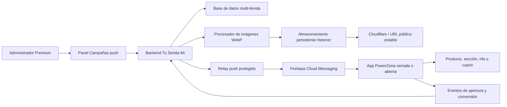

# Plan maestro: app de clientes white-label y campañas push Premium

> Documento vivo de ejecución para construir una app Android pública de PowerZona, reutilizable para otras tiendas de Tu Senda 84, con campañas push administradas desde el panel web.

## 1. Control del documento

| Campo | Valor |
|---|---|
| Estado general | PLANIFICACIÓN |
| Versión del documento | 1.1 |
| Fecha de creación | 2026-08-11 |
| Última actualización | 2026-08-11 |
| Tienda piloto | PowerZona |
| Plataforma inicial | Android (APK y AAB) |
| Proyecto móvil propuesto | `mobile-storefront` |
| Aplicación administrativa existente | `mobile-admin` / Tu Senda 84 Admin |
| Responsable de aprobación | Propietario de Tu Senda 84 |
| Próximo prompt | PZ-APP-C01 |

### Convención de estados

- `[ ]` PENDIENTE: todavía no iniciado.
- `[x]` COMPLETADO: implementado, probado y documentado.
- `EN CURSO`: debe indicarse en la tabla general y en la bitácora. Solo puede existir un prompt en este estado.
- `BLOQUEADO`: no puede continuar sin una decisión, acceso o corrección externa.

### Niveles de razonamiento y criterio de calidad

Las recomendaciones de este documento usan los nombres disponibles en Codex:

- **Medium:** equilibrio entre velocidad y análisis. Útil cuando el alcance ya está claro.
- **High:** adecuado para implementación con varios archivos, pruebas y decisiones técnicas.
- **Extra High:** recomendado para seguridad, arquitectura, migraciones y flujos con muchas dependencias.
- **Max:** reserva más tiempo de razonamiento para los problemas de mayor riesgo, especialmente diagnóstico integral y producción.
- **Ultra:** divide trabajo complejo entre subagentes. No se usará por defecto en este plan porque las fases son secuenciales y necesitan una única trazabilidad. Solo se considerará si el propietario pide explícitamente trabajo paralelo y las partes pueden aislarse sin riesgo.

Según la [guía oficial de modelos de Codex](https://learn.chatgpt.com/docs/models.md), **Sol** es la opción preferida para trabajo complejo, abierto y de alto valor; **Terra** funciona bien como modelo general para tareas cotidianas y bien delimitadas. Un nivel mayor puede mejorar el análisis, pero también tarda más y consume más recursos.

Ningún modelo o nivel garantiza por sí solo un resultado perfecto. Para este proyecto, la calidad se consigue combinando:

1. Un prompt con alcance y definición de terminado.
2. El modelo y nivel apropiados al riesgo.
3. Pruebas automáticas.
4. Pruebas manuales en staging, emulador y teléfono físico.
5. Revisión del resultado antes de producción.

Cuando una fase requiera intervención humana, Codex debe mostrar claramente **PRUEBA MANUAL NECESARIA**, entregar pasos numerados, resultado esperado y evidencia solicitada. El prompt no se marcará completado hasta recibir el resultado de esa prueba o documentar por qué se pospuso.

## 2. Objetivo del proyecto

Construir una app Android pública para los clientes de PowerZona que muestre la tienda web, funcione sin inicio de sesión obligatorio y reciba notificaciones incluso cuando la app esté cerrada. La solución debe ser white-label: el mismo código permitirá generar una app diferente para otra tienda de Tu Senda 84 cambiando su configuración, marca, URL, identificador Android y credenciales de Firebase.

El panel administrativo incorporará, como función del plan Premium, un módulo de campañas push para crear, segmentar, programar, enviar y medir notificaciones con texto, imagen WebP y enlaces internos. Al tocar una notificación, la app podrá abrir un producto, categoría, sección, seguimiento de pedido, rifa o cupón.

## 3. Decisiones aprobadas

1. La app de clientes será independiente de **Tu Senda 84 Admin**.
2. PowerZona será la primera tienda y servirá como plantilla validada.
3. La primera versión será Android; generará APK para entrega directa y AAB para Google Play.
4. No se exigirá una cuenta de cliente. Cada instalación se registrará anónimamente mediante un identificador de instalación de Firebase o equivalente.
5. La dirección IP no identificará al dispositivo. Solo se registrará en el servidor para seguridad, control de abuso y ubicación aproximada.
6. Los administradores de tienda verán estadísticas agregadas. El IP sin anonimizar, si se conserva, quedará restringido al Master Admin o funciones de seguridad.
7. Las imágenes se alojarán inicialmente en el servidor Hetzner, en almacenamiento persistente, se validarán y convertirán a WebP y se entregarán mediante una URL estable con caché de Cloudflare.
8. Los secretos, cuentas de servicio, archivos de firma y contraseñas nunca se guardarán en Git.
9. Las campañas comerciales para clientes se separarán de las alertas operativas de administradores.
10. Toda entidad móvil pertenecerá a una sola tienda. Ninguna campaña, instalación, imagen o evento podrá cruzar datos entre tiendas.
11. El permiso Premium se comprobará en el backend; ocultar botones en la interfaz no será suficiente.
12. Ninguna fase se desplegará en producción sin pasar primero por staging, emulador y teléfono físico cuando corresponda.

## 4. Resumen vivo del proyecto

### 4.1 Base ya completada y reutilizable

- [x] Existe una app administrativa Android nativa en `mobile-admin`.
- [x] La app administrativa usa el identificador `com.tusenda84.admin`.
- [x] La versión administrativa 1.0.2 fue instalada y validada.
- [x] Se solicitaron y verificaron los permisos de notificaciones de Android.
- [x] Las notificaciones administrativas funcionan con la app cerrada en un Samsung Galaxy Z Fold5 físico.
- [x] Se completó una prueba real de orden identificada como `Push002`.
- [x] El flujo validado es: PocketBase → Cloudflare → relay interno → Firebase Cloud Messaging → teléfono.
- [x] El relay de producción utiliza `https://tusenda84.com/api/internal/push/send`.
- [x] Firebase Admin y el secreto compartido del relay están configurados en el entorno de producción.
- [x] Cloudflare permite el tráfico originado por el servidor Hetzner `91.99.99.83` mediante la regla **Lista blanca servidor Alemania**.
- [x] La regla de lista blanca se encuentra antes de la limitación geográfica, usa la acción `Skip` y conserva el registro de eventos.
- [x] La limitación geográfica continúa activa para el resto del tráfico.
- [x] Se eliminó el relay HTTP temporal basado en `sslip.io`.
- [x] Frontend y PocketBase fueron desplegados y validados después de la corrección.
- [x] El commit desplegado durante esa validación fue `f5b023bc81075691c5b78f70e4a98279920967e1`.

### 4.2 Componentes existentes que deben auditarse antes de reutilizar

- `backend-powerzona/pb_hooks/pz_store_push_dispatch_lib.js`
- `backend-powerzona/pb_hooks/pz_store_push_devices_lib.js`
- Rutas relacionadas con dispositivos push en `backend-powerzona/pb_hooks`.
- Colecciones actuales `store_push_devices` y `store_notifications`.
- `frontend-powerzona/src/pages/api/internal/push/send.ts`
- Lógica Android de Firebase, registro y deep links en `mobile-admin`.
- Ayudantes de planes y permisos, entre ellos `pz_store_plans_lib.js` y `pz_store_team_permissions_lib.js`.

### 4.3 Separación obligatoria

La colección administrativa `store_push_devices` no debe reutilizarse automáticamente para clientes. El registro actual está ligado a usuarios administrativos autenticados y a reglas operativas del panel. La app pública necesita instalaciones anónimas, consentimiento de notificaciones y métricas diferentes.

Se propone crear modelos específicos para la app pública. Sus nombres definitivos se confirmarán en PZ-APP-C01 y PZ-APP-C02:

- `storefront_app_configs`
- `storefront_installations`
- `push_campaigns`
- `push_campaign_deliveries` o agregados diarios equivalentes
- `push_events`
- `push_media`
- `push_daily_stats`, solo si el volumen justifica precálculo

## 5. Arquitectura objetivo



### 5.1 Aplicación Android white-label

Se creará un proyecto independiente, propuesto como `mobile-storefront`, reutilizando únicamente patrones seguros y probados de `mobile-admin`.

Cada marca tendrá una configuración declarativa con, al menos:

| Propiedad | PowerZona | Otra tienda |
|---|---|---|
| Clave interna | `powerzona` | Configurable |
| Nombre visible | PowerZona | Configurable |
| URL inicial | `https://tusenda84.com/t/powerzona` | URL de la tienda |
| `applicationId` | POR CONFIRMAR | Único por app |
| Icono y splash | Marca PowerZona | Marca de la tienda |
| Colores | Marca PowerZona | Configurables |
| Firebase Android app | Exclusiva | Exclusiva |
| `google-services.json` | Fuera de configuración pública | Uno por app |
| Firma Android | Segura y separada | Una política por marca |
| `versionCode` / `versionName` | Independientes | Independientes |

Cada app publicada en Google Play necesita un `applicationId`, ficha, firma y versionado propios. No basta con cambiar la URL.

### 5.2 Registro anónimo de instalaciones

Al abrir la app por primera vez:

1. La app obtiene o genera un identificador de instalación.
2. Solicita permiso de notificaciones en el momento apropiado en Android 13 o superior.
3. Obtiene el token FCM.
4. Registra la instalación contra la tienda configurada.
5. Envía versión de la app, versión de Android, modelo, idioma, zona horaria y estado del permiso.
6. El servidor registra `first_seen` y actualiza `last_seen` de forma idempotente.
7. Al renovarse el token FCM, la misma instalación se actualiza sin duplicarse.

La reinstalación, eliminación de datos o restauración puede producir un identificador nuevo. Por esa razón, el panel hablará de **instalaciones** o **dispositivos registrados**, no de personas únicas exactas.

### 5.3 Contenido y apertura de una notificación

El mensaje incluirá una carga de datos normalizada:

```json
{
  "store_key": "powerzona",
  "campaign_id": "ID_DE_CAMPANA",
  "target_type": "product",
  "target_value": "/t/powerzona/producto/slug",
  "image_url": "https://media.tusenda84.com/push/powerzona/archivo.webp"
}
```

Tipos iniciales propuestos:

- `home`: abre la portada de la tienda.
- `url`: abre una ruta interna permitida de la tienda.
- `product`: abre un producto.
- `category`: abre una categoría.
- `section`: abre una sección especial.
- `order`: abre seguimiento de una orden mediante un enlace seguro.
- `raffle`: abre una rifa.
- `coupon`: abre la tienda y solicita aplicar un cupón válido.

Los enlaces serán validados contra una lista de hosts y rutas autorizados. No se debe permitir que una campaña abra esquemas o dominios arbitrarios.

Para un cupón, la app no confiará en un descuento contenido solamente en la notificación. Abrirá una URL segura con un identificador o código; el backend validará vigencia, tienda, límites, elegibilidad y condiciones antes de aplicarlo.

### 5.4 Imágenes WebP en Hetzner

Flujo previsto:

1. El administrador sube JPG, PNG o WebP desde Campañas push.
2. El backend valida tipo real, dimensiones y peso.
3. Elimina metadatos que no sean necesarios.
4. Corrige orientación.
5. Redimensiona dentro del máximo acordado.
6. Convierte a WebP con calidad controlada.
7. Genera un nombre aleatorio no predecible.
8. Guarda en almacenamiento persistente, nunca dentro del sistema de archivos efímero del contenedor frontend.
9. Devuelve una URL HTTPS estable, preferiblemente bajo `media.tusenda84.com`.
10. Cloudflare sirve la imagen con caché.

Se añadirán cuotas por tienda, limpieza de imágenes huérfanas, copias de seguridad y política de retención. Si en el futuro se migra a R2 o S3, el dominio público estable evitará cambios en las apps.

### 5.5 Panel Premium de campañas

El módulo permitirá:

- Crear borradores.
- Definir título, texto, imagen y destino.
- Previsualizar el contenido.
- Elegir audiencia.
- Enviar ahora o programar.
- Cancelar una campaña programada que aún no haya comenzado.
- Ver historial y estado.
- Duplicar una campaña anterior.
- Consultar métricas y errores.

Segmentos iniciales recomendados:

- Todos los dispositivos activos de la tienda.
- Dispositivos activos en los últimos 7 o 30 días.
- Android por versión de app.
- Con permiso de notificación confirmado.
- País o región aproximada, solo cuando la precisión y privacidad lo permitan.
- Segmentos de comportamiento futuros basados en eventos de tienda.

No se enviará por token uno a uno desde el navegador. El backend resolverá destinatarios, aplicará límites, dividirá lotes, registrará resultados y desactivará tokens inválidos.

### 5.6 Métricas

Panel de instalaciones:

- Instalaciones registradas totales.
- Activas hoy, últimos 7 días y últimos 30 días.
- Permiso concedido, denegado o desconocido.
- Tokens activos, inválidos o revocados.
- Versión de app y Android.
- Modelo del dispositivo.
- Primera y última actividad.
- Distribución geográfica aproximada y agregada.

Embudo de campaña:

1. Dispositivos seleccionados.
2. Mensajes aceptados por Firebase.
3. Envíos fallidos o tokens inválidos.
4. Notificaciones abiertas mediante toque.
5. Destino visualizado.
6. Cupón aplicado, cuando corresponda.
7. Orden atribuida, cuando sea técnicamente verificable.

Una respuesta aceptada por Firebase no significa que el usuario leyó la notificación. La apertura solo se contará cuando la app procese el toque y reporte el evento.

## 6. Seguridad, privacidad y límites

- Todo endpoint público tendrá validación estricta, rate limiting y protección contra abuso.
- El servidor determinará la tienda por una credencial/configuración válida; no confiará solamente en un `store_id` arbitrario enviado por el cliente.
- Las consultas administrativas siempre filtrarán por tienda y permisos.
- Las funciones de envío comprobarán plan Premium y permiso, por ejemplo `marketing.push.manage`.
- Se establecerá un máximo de destinatarios y frecuencia por campaña.
- Se evitará registrar tokens FCM, secretos o IP completos en logs generales.
- Se definirá retención para IP, eventos individuales y campañas.
- Se permitirá desactivar una instalación o sus notificaciones.
- Se eliminarán o invalidarán tokens rechazados permanentemente por Firebase.
- Las imágenes serán públicas por necesidad técnica, pero usarán nombres aleatorios y no contendrán datos sensibles.
- La pantalla administrativa mostrará consentimiento, finalidad y límites de las métricas.
- El WebView solo abrirá hosts permitidos y bloqueará esquemas inseguros.
- La navegación, cargas de archivos y puentes JavaScript se revisarán contra abuso.
- Las cuentas de servicio de Firebase tendrán privilegios mínimos y rotación documentada.

## 7. Tabla general de prompts

| ID | Entregable | Estado | Dependencia | Prueba manual | Modelo y razonamiento recomendado |
|---|---|---|---|---|---|
| PZ-APP-C01 | Auditoría y diseño técnico definitivo | PENDIENTE | Ninguna | Sí: aprobación del diseño | Sol — Extra High |
| PZ-APP-C02 | Modelo de datos, migraciones y reglas multi-tienda | PENDIENTE | C01 | Limitada: inspección en staging | Sol — Extra High |
| PZ-APP-C03 | Registro público seguro de instalaciones | PENDIENTE | C02 | Sí: ciclo de registro en staging | Sol — High |
| PZ-APP-C04 | Canal persistente de imágenes WebP | PENDIENTE | C02 | Sí: carga, visualización y persistencia | Terra — High |
| PZ-APP-C05 | Motor de campañas y entrega FCM | PENDIENTE | C02, C03, C04 | Sí: envío real controlado | Sol — Extra High |
| PZ-APP-C06 | Base Android white-label `mobile-storefront` | PENDIENTE | C01, C03 | Sí: emulador y teléfono | Sol — High |
| PZ-APP-C07 | Variante PowerZona y deep links | PENDIENTE | C05, C06 | Sí, obligatoria: teléfono físico | Sol — High |
| PZ-APP-C08 | Panel Premium Campañas push | PENDIENTE | C04, C05 | Sí: panel móvil y escritorio | Sol — High |
| PZ-APP-C09 | Analítica de instalaciones y campañas | PENDIENTE | C03, C05, C07, C08 | Sí: contraste del embudo | Sol — Extra High |
| PZ-APP-C10 | Generador reproducible APK/AAB por tienda | PENDIENTE | C06, C07 | Sí: instalar ambos artefactos | Terra — High |
| PZ-APP-C11 | Pruebas integrales en staging | PENDIENTE | C03-C10 | Sí, obligatoria y extensa | Sol — Max |
| PZ-APP-C12 | Publicación controlada en producción | PENDIENTE | C11 | Sí, obligatoria con aprobación | Sol — Max |

## 8. Prompts de ejecución

Cada prompt debe ejecutarse en orden. Al comenzar, cambiar su estado a `EN CURSO`, añadir una entrada a la bitácora y no iniciar otro prompt hasta terminar o marcarlo `BLOQUEADO`.

### [ ] PZ-APP-C01 — Auditoría y diseño técnico definitivo

**Objetivo:** convertir este plan conceptual en un contrato técnico basado en el código y despliegue reales, sin cambiar todavía el comportamiento de producción.

**Prompt para ejecutar:**

> Revisa completamente el repositorio de Tu Senda 84 y documenta cómo funcionan actualmente la app `mobile-admin`, el registro de dispositivos administrativos, `store_notifications`, el dispatch de PocketBase, el relay de Firebase, los planes Premium, permisos, despliegues y rutas de tienda. Diseña la nueva app pública `mobile-storefront` sin mezclar instalaciones de clientes con dispositivos administrativos. Confirma las decisiones de nombres, contratos API, deep links, almacenamiento de medios, trabajos programados, aislamiento por tienda y estrategia white-label. Identifica cambios que puedan romper compatibilidad y propón una migración segura. No modifiques código de producción en este prompt. Actualiza este archivo con hallazgos, decisiones pendientes, diagrama final, riesgos y una lista exacta de archivos que cambiarán en los siguientes prompts.

**Modelo y nivel recomendado:** Sol — Extra High. La fase combina arquitectura, seguridad, producto y dependencias existentes; necesita profundidad y juicio, pero todavía no justifica Max si el repositorio y el alcance están bien definidos.

**Prueba manual requerida:** Sí, revisión humana del diseño. Codex presentará las decisiones pendientes en una lista breve. El propietario debe confirmar como mínimo `applicationId`, marca, almacenamiento, límites de campañas y comportamiento Premium. No se requiere teléfono en esta fase.

**Criterios de aceptación:**

- [ ] Se documentó el flujo administrativo actual de extremo a extremo.
- [ ] Se definió el flujo público nuevo y sus fronteras de seguridad.
- [ ] Se confirmó si PocketBase almacenará directamente los archivos o si habrá un servicio persistente dedicado.
- [ ] Se definieron nombres de colecciones, rutas y permisos.
- [ ] Se confirmó el `applicationId` de PowerZona.
- [ ] Se especificó cómo se ejecutarán campañas programadas.
- [ ] No se modificó producción.
- [ ] Este documento quedó actualizado con resultados y próximo paso.

### [ ] PZ-APP-C02 — Modelo de datos, migraciones y aislamiento

**Objetivo:** crear la base de datos segura para configuraciones de app, instalaciones públicas, campañas, medios y eventos.

**Prompt para ejecutar:**

> Implementa las migraciones y reglas de acceso acordadas en PZ-APP-C01 para la app pública y las campañas push. Mantén separadas las colecciones administrativas existentes. Cada registro debe pertenecer inequívocamente a una tienda. Agrega índices para búsquedas de token, identificador de instalación, estado, programación, fechas y campañas. Define estados válidos, retención, timestamps y relaciones. Las reglas de acceso directo deben ser de mínimo privilegio; las operaciones sensibles pasarán por hooks o endpoints controlados. Incluye rollback seguro cuando la arquitectura del proyecto lo permita. Añade pruebas automatizadas de aislamiento entre dos tiendas, duplicados, permisos y plan Premium. No despliegues a producción.

**Modelo y nivel recomendado:** Sol — Extra High. Las migraciones, permisos y aislamiento multi-tienda tienen impacto crítico y requieren revisar consecuencias y rollback.

**Prueba manual requerida:** Limitada. Después de las pruebas automáticas, Codex debe mostrar en staging las nuevas colecciones, índices y reglas, y ejecutar una inspección controlada con dos tiendas. El propietario solo tendrá que confirmar la estructura visualmente si se solicita; no se usa teléfono.

**Criterios de aceptación:**

- [ ] Las migraciones son reproducibles en una base limpia.
- [ ] Ninguna tienda puede leer o modificar registros de otra.
- [ ] El modelo separa dispositivos administrativos e instalaciones públicas.
- [ ] Los índices y restricciones evitan duplicados previsibles.
- [ ] Las pruebas de autorización y aislamiento pasan.
- [ ] Se documentaron campos sensibles y retención.

### [ ] PZ-APP-C03 — Registro público seguro de instalaciones

**Objetivo:** registrar y mantener instalaciones anónimas sin exigir una cuenta de cliente.

**Prompt para ejecutar:**

> Implementa endpoints públicos controlados para registrar, actualizar, renovar token, enviar heartbeat y desactivar una instalación de la app de una tienda. Usa una identidad de instalación estable dentro de lo posible, firma o credencial de app acordada, validación de tienda, rate limiting e idempotencia. Captura únicamente metadatos necesarios: versión, Android, modelo, idioma, zona horaria, permiso y estado. Obtén el IP desde el request confiable del servidor, no desde un campo manipulable del cliente. Restringe el IP completo al ámbito Master/seguridad y prepara datos geográficos agregados. No uses el IP como identificador. Añade pruebas de reinstalación simulada, renovación de FCM, duplicados, abuso y cruce de tiendas. Actualiza la documentación de privacidad.

**Modelo y nivel recomendado:** Sol — High. El contrato queda definido en las fases anteriores, pero la seguridad pública, idempotencia e identidad de instalación exigen razonamiento alto.

**Prueba manual requerida:** Sí, en staging. Codex probará primero el API automáticamente y luego indicará cómo registrar una instalación, repetir el registro, renovar el token y desactivarla. La validación en teléfono puede posponerse hasta PZ-APP-C06, pero debe quedar registrada como pendiente.

**Criterios de aceptación:**

- [ ] Repetir el registro no crea duplicados para la misma instalación.
- [ ] Renovar el token no pierde el historial de instalación.
- [ ] Una app no puede registrarse en una tienda arbitraria.
- [ ] Existe rate limiting y validación de entradas.
- [ ] IP y token no aparecen en logs generales.
- [ ] Se prueban altas, heartbeats, desactivación y errores.

### [ ] PZ-APP-C04 — Imágenes WebP persistentes

**Objetivo:** permitir imágenes de campaña optimizadas y alojadas en Hetzner con URL estable.

**Prompt para ejecutar:**

> Implementa el flujo de medios para campañas push según PZ-APP-C01: carga autenticada por tienda, validación del contenido real, límites de peso y resolución, eliminación de metadatos, corrección de orientación, conversión a WebP, nombre aleatorio, almacenamiento persistente y URL HTTPS estable. Impide traversal, archivos ejecutables, dobles extensiones y consumo ilimitado. Agrega cuota por tienda, referencia desde campañas, limpieza segura de huérfanos y estrategia de backup. Configura cabeceras de caché compatibles con Cloudflare. Incluye pruebas con archivos válidos, corruptos, demasiado grandes y maliciosos. No guardes archivos en el contenedor efímero del frontend.

**Modelo y nivel recomendado:** Terra — High. Es una implementación delimitada con validaciones claras; Terra ofrece buen equilibrio y High permite revisar seguridad y persistencia. Usar Sol — High si durante la fase cambia la arquitectura de almacenamiento.

**Prueba manual requerida:** Sí. Subir una imagen JPG o PNG, confirmar que la salida es WebP, verla desde su URL pública, revisar su aspecto en la previsualización y comprobar que sigue disponible después de reiniciar o redesplegar el servicio de staging.

**Criterios de aceptación:**

- [ ] Toda imagen publicada termina validada como WebP.
- [ ] La URL funciona sin autenticación para que FCM/Android pueda descargarla.
- [ ] No se aceptan tipos falsificados ni rutas manipuladas.
- [ ] Hay cuotas, limpieza y respaldo documentados.
- [ ] La imagen sobrevive reinicios y despliegues.
- [ ] La caché no impide reemplazos ni limpieza correctos.

### [ ] PZ-APP-C05 — Motor de campañas y entrega FCM

**Objetivo:** crear el servicio backend que selecciona destinatarios y entrega campañas de clientes mediante Firebase.

**Prompt para ejecutar:**

> Implementa el ciclo de vida de campañas: borrador, programada, procesando, enviada, parcialmente enviada, fallida y cancelada. Exige tienda, plan Premium activo y permiso `marketing.push.manage` o el nombre definitivo. Valida título, cuerpo, imagen y destino. Resuelve la audiencia solo dentro de la tienda, divide tokens en lotes compatibles con Firebase, registra resultados agregados y desactiva tokens inválidos permanentes. Protege contra envíos duplicados mediante idempotencia y bloqueos. Implementa envío inmediato y el mecanismo acordado para programación. Reutiliza el relay Firebase existente solo si la auditoría confirma que puede ampliarse sin comprometer las alertas administrativas. Añade pruebas de aislamiento, límites, reintentos, duplicados, Firebase parcial y downgrade de Premium.

**Modelo y nivel recomendado:** Sol — Extra High. Es el núcleo de la entrega y mezcla concurrencia, facturación Premium, Firebase, reintentos e aislamiento multi-tienda.

**Prueba manual requerida:** Sí, con destinatarios de staging. Enviar una campaña inmediata y una programada, provocar al menos un token inválido y verificar que no haya duplicados. La recepción visual completa se repetirá después con la app PowerZona en PZ-APP-C07.

**Criterios de aceptación:**

- [ ] Un usuario sin Premium o sin permiso no puede enviar.
- [ ] Nunca se seleccionan instalaciones de otra tienda.
- [ ] Los reintentos no duplican una campaña completa.
- [ ] Tokens inválidos cambian de estado automáticamente.
- [ ] Las campañas programadas se ejecutan una sola vez.
- [ ] Un fallo parcial queda visible y auditable.
- [ ] Las alertas administrativas actuales continúan funcionando.

### [ ] PZ-APP-C06 — Base Android white-label

**Objetivo:** crear `mobile-storefront` como shell Android reutilizable para tiendas públicas.

**Prompt para ejecutar:**

> Crea un proyecto Android nativo independiente llamado `mobile-storefront`, inspirado en las partes probadas de `mobile-admin` pero sin código de autenticación o permisos administrativos innecesarios. La app debe recibir su marca y URL desde una configuración de tienda, mostrar la web pública en un WebView seguro, gestionar estados sin conexión, abrir enlaces permitidos, solicitar permiso de notificaciones, obtener/renovar FCM y registrarse anónimamente con el backend. Implementa recepción FCM en primer plano, segundo plano y app cerrada. Añade manejo de deep links y eventos de apertura. No incluyas secretos ni un `google-services.json` real en Git. Incluye pruebas unitarias y build debug reproducible.

**Modelo y nivel recomendado:** Sol — High. Hay varios componentes Android y de seguridad, pero el alcance estará definido por los contratos anteriores.

**Prueba manual requerida:** Sí. Codex debe compilar e instalar en emulador; después solicitará verificar apertura, navegación, rotación, botón Atrás, modo sin conexión, permiso de notificaciones y recuperación desde Ajustes. Cuando sea posible, repetir la prueba básica en un teléfono físico.

**Criterios de aceptación:**

- [ ] El proyecto compila desde una instalación limpia de dependencias.
- [ ] No comparte `applicationId` con la app administrativa.
- [ ] La tienda abre sin inicio de sesión.
- [ ] El permiso se solicita con contexto y puede reactivarse desde una tarjeta visible.
- [ ] El token se registra y renueva correctamente.
- [ ] El WebView limita hosts, descargas y esquemas.
- [ ] Existen pruebas para configuración y parsing de destinos.

### [ ] PZ-APP-C07 — Variante PowerZona y navegación desde push

**Objetivo:** generar la primera app de clientes con la marca PowerZona y verificar sus destinos.

**Prompt para ejecutar:**

> Añade la configuración white-label de PowerZona: nombre, URL `https://tusenda84.com/t/powerzona`, icono, colores, splash, identificador Android confirmado y Firebase Android app correspondiente. Implementa y prueba destinos para portada, producto, categoría, sección, orden, rifa y cupón. Una notificación tocada con la app cerrada debe iniciar la app directamente en el destino correcto. Si el destino es inválido o venció, abre una pantalla segura de respaldo. El cupón se validará en el servidor antes de aplicarse. Genera una APK debug de staging e instálala primero en emulador.

**Modelo y nivel recomendado:** Sol — High. Requiere integrar marca, Android, Firebase, WebView y navegación sin perder detalle visual o funcional.

**Prueba manual requerida:** Sí, obligatoria en emulador y teléfono físico. Probar cada tipo de destino con la app abierta, en segundo plano y cerrada; comprobar icono, splash, imagen, texto, permiso y cupón válido/inválido. Codex entregará una tabla para marcar cada caso.

**Criterios de aceptación:**

- [ ] La app muestra únicamente la identidad PowerZona.
- [ ] Cada destino abre la ruta correcta desde app abierta y cerrada.
- [ ] Los enlaces externos no permitidos se bloquean o abren de forma controlada.
- [ ] El cupón inválido no produce descuento.
- [ ] La app de staging no se confunde con producción.
- [ ] La APK debug se probó en emulador.

### [ ] PZ-APP-C08 — Panel Premium Campañas push

**Objetivo:** permitir que administradores autorizados creen y envíen campañas desde el panel web.

**Prompt para ejecutar:**

> Implementa en el panel administrativo la sección Campañas push para planes Premium. Incluye listado, filtros, creación, borrador, imagen WebP, previsualización Android, destino, audiencia, envío inmediato, programación, cancelación y duplicado. Muestra claramente estimación de dispositivos elegibles y advertencias. La interfaz debe ser usable en móvil y escritorio y respetar el sistema visual existente. El backend debe volver a validar plan, permiso, tienda y contenido. Añade estados de carga, confirmación antes de enviar, manejo de errores y accesibilidad. Incluye pruebas de componentes y flujos end-to-end relevantes.

**Modelo y nivel recomendado:** Sol — High. La fase necesita criterio visual, accesibilidad y consistencia funcional entre frontend y backend.

**Prueba manual requerida:** Sí. Revisar el panel en escritorio y móvil: pestaña activa, formularios, carga de imagen, previsualización, audiencia, confirmación, borrador, programación, errores y bloqueo para una tienda sin Premium. Se solicitarán capturas cuando un detalle visual necesite validación.

**Criterios de aceptación:**

- [ ] Solo Premium autorizado puede acceder y ejecutar envíos.
- [ ] La imagen se carga y previsualiza como WebP.
- [ ] El destino se valida antes de permitir el envío.
- [ ] Se muestran audiencia estimada y confirmación final.
- [ ] Borradores y campañas programadas pueden administrarse.
- [ ] La interfaz funciona en móvil y escritorio.

### [ ] PZ-APP-C09 — Analítica de instalaciones y campañas

**Objetivo:** medir instalaciones, salud de tokens y resultados reales de campañas sin exagerar la precisión.

**Prompt para ejecutar:**

> Implementa eventos autenticados por instalación para apertura de notificación, visualización del destino y conversiones verificables. Añade agregados eficientes para instalaciones activas hoy/7/30 días, permisos, estado, versión, Android, modelo y geografía aproximada. Crea el panel de métricas por campaña: seleccionados, aceptados por Firebase, fallidos, abiertos, destino visto, cupón aplicado y orden atribuida cuando exista evidencia. Etiqueta correctamente las métricas: Firebase aceptado no equivale a entregado o leído. Protege el endpoint de eventos contra falsificación, repetición y abuso; usa idempotencia. Establece retención y evita crecimiento ilimitado. Incluye pruebas de aislamiento y conteos.

**Modelo y nivel recomendado:** Sol — Extra High. La atribución, deduplicación, privacidad y agregación pueden producir resultados aparentemente correctos pero engañosos si no se analizan a fondo.

**Prueba manual requerida:** Sí. Ejecutar una campaña controlada con un número conocido de instalaciones, abrirla solo en algunas, aplicar un cupón en una y comparar manualmente cada etapa del embudo con los eventos registrados. Verificar también que otra tienda muestre cero actividad ajena.

**Criterios de aceptación:**

- [ ] Los conteos distinguen instalaciones de personas.
- [ ] Los eventos repetidos no inflan métricas.
- [ ] El administrador solo ve su tienda.
- [ ] El Master puede auditar seguridad sin exponer datos innecesarios.
- [ ] Las etiquetas explican límites de medición.
- [ ] El volumen de eventos tiene estrategia de retención/agregación.

### [ ] PZ-APP-C10 — Generador reproducible APK/AAB por tienda

**Objetivo:** producir otra app de tienda mediante configuración, sin copiar y editar manualmente el proyecto.

**Prompt para ejecutar:**

> Implementa un sistema de configuración y un script reproducible, por ejemplo `scripts/build-store-app.ps1 powerzona`, que valide la marca, URL, `applicationId`, versión, Firebase y firma antes de compilar. Debe generar APK firmado para distribución directa y AAB para Google Play, con salidas nombradas y checksums. Separa configuración versionable de secretos locales o CI. Impide compilar dos marcas con el mismo `applicationId` por accidente. Añade documentación para registrar una nueva Firebase Android app, crear la ficha de Google Play, preparar iconos y administrar firmas. Crea una configuración de demostración no publicable para probar que el sistema es realmente reutilizable.

**Modelo y nivel recomendado:** Terra — High. Es una automatización bien definida que se beneficia de ejecución cuidadosa y validaciones repetibles. Cambiar a Sol — High si aparecen problemas de Gradle, firma o variantes.

**Prueba manual requerida:** Sí. Compilar PowerZona y la marca de demostración, instalar ambas sin conflicto, confirmar nombre/icono/URL, revisar versión y checksum, y cargar el AAB en el validador de prueba interna de Google Play sin publicarlo.

**Criterios de aceptación:**

- [ ] PowerZona se compila con un único comando documentado.
- [ ] APK y AAB usan nombre, icono, URL e ID correctos.
- [ ] Los artefactos tienen versión y checksum.
- [ ] Ningún secreto queda en Git o en los logs.
- [ ] Una segunda configuración de prueba compila sin cambiar código fuente.
- [ ] El script detecta configuraciones incompletas o duplicadas.

### [ ] PZ-APP-C11 — Pruebas integrales en staging

**Objetivo:** demostrar el sistema completo antes de tocar producción.

**Prompt para ejecutar:**

> Despliega únicamente en staging las migraciones, backend, medios, relay y panel ya aprobados. Ejecuta pruebas automáticas y una matriz manual en emulador y teléfono Android físico. Instala la app PowerZona de staging, acepta y deniega permisos, fuerza renovación de token, cierra por completo la app y envía campañas de todos los tipos. Verifica imagen WebP, deep links, cupón, programación, cancelación, tokens inválidos, modo ahorro de batería, reinicio del teléfono, desconexión temporal y aislamiento con una segunda tienda. Registra evidencias, logs sanitizados, tiempos y resultados en este documento. No despliegues producción durante este prompt.

**Modelo y nivel recomendado:** Sol — Max. Es la revisión integral con mayor cantidad de componentes y combinaciones antes de producción; aquí la profundidad importa más que la velocidad.

**Prueba manual requerida:** Sí, obligatoria y extensa. Codex preparará una matriz numerada y avisará exactamente cuándo manipular el teléfono. El propietario deberá confirmar recepción con la app cerrada, destinos, permiso denegado, reinicio, ahorro de batería y aislamiento. Ningún “parece funcionar” sustituirá la evidencia de cada caso crítico.

**Criterios de aceptación:**

- [ ] Una campaña llega con la app cerrada en teléfono físico.
- [ ] Imagen, título y texto se muestran correctamente.
- [ ] El toque abre cada destino esperado.
- [ ] La campaña programada se ejecuta una sola vez.
- [ ] La segunda tienda no recibe la campaña de PowerZona.
- [ ] Permiso denegado y token inválido se reflejan correctamente.
- [ ] No hay regresión en la app administrativa 1.0.2.
- [ ] El propietario aprueba explícitamente pasar a producción.

### [ ] PZ-APP-C12 — Producción, Play Store y APK directo

**Objetivo:** publicar de forma reversible y confirmar el funcionamiento real.

**Prompt para ejecutar:**

> Con la aprobación registrada de PZ-APP-C11, prepara backups y despliega en producción por etapas: base de datos, backend/relay, medios, frontend y app. Ejecuta smoke tests después de cada etapa y revierte si falla un criterio crítico. Genera el APK firmado para entrega directa y el AAB para prueba interna de Google Play, incrementando correctamente `versionCode` y `versionName`. Instala desde ambos canales en teléfonos físicos, registra instalaciones nuevas y envía campañas controladas con app abierta y cerrada. Verifica métricas y aislamiento. Documenta versiones, commit, artefactos, checksums, URL interna de Play, plan de rollback y resultado final. No promociones a producción pública de Google Play sin aprobación explícita separada.

**Modelo y nivel recomendado:** Sol — Max. Producción exige el máximo cuidado, verificación paso a paso y evaluación de rollback. Se prioriza exactitud sobre velocidad.

**Prueba manual requerida:** Sí, obligatoria y con aprobación humana. Codex avisará antes de cada cambio externo importante. El propietario probará APK directo y versión de Play en teléfonos físicos, app abierta/cerrada, destinos y campaña real controlada. La publicación pública en Google Play requerirá una confirmación separada.

**Criterios de aceptación:**

- [ ] Backend y panel responden sin regresiones.
- [ ] APK directo instala, abre, registra y recibe push cerrada.
- [ ] AAB de prueba interna se instala y recibe push cerrada.
- [ ] PowerZona abre los destinos correctos en producción.
- [ ] La app administrativa sigue recibiendo sus alertas.
- [ ] Se documentaron artefactos, versiones, commits y rollback.
- [ ] Las métricas iniciales coinciden con las pruebas controladas.

## 9. Criterios maestros de aceptación

El proyecto completo solo se marcará terminado cuando:

- [ ] La app PowerZona funciona sin cuenta de cliente.
- [ ] La instalación anónima es segura e idempotente.
- [ ] Android permite activar notificaciones desde una tarjeta o ajuste claro de la app.
- [ ] Las notificaciones llegan con la app cerrada en teléfono físico.
- [ ] Las campañas aceptan imágenes WebP alojadas persistentemente en Hetzner.
- [ ] El toque abre productos, categorías, secciones, órdenes, rifas y cupones válidos.
- [ ] Un cupón se valida en el servidor y puede quedar aplicado de forma segura.
- [ ] Solo planes Premium autorizados pueden enviar campañas.
- [ ] No existe fuga de datos o destinatarios entre tiendas.
- [ ] El panel muestra instalaciones y métricas con definiciones honestas.
- [ ] Los tokens inválidos se detectan y desactivan.
- [ ] Se controlan frecuencia, audiencia, tamaño de imagen y cuotas.
- [ ] No existen secretos o firmas dentro del repositorio.
- [ ] Se puede construir otra app de tienda cambiando configuración, sin duplicar el código.
- [ ] APK directo y AAB de Google Play se verificaron por separado.
- [ ] La app administrativa y sus alertas no sufrieron regresiones.

## 10. Fuera del alcance de la primera versión

- Inicio de sesión o cuenta permanente de clientes.
- App iOS.
- Segmentación mediante aprendizaje automático.
- Migración inicial a Cloudflare R2, S3 u otro proveedor externo.
- Constructor visual completo de apps dentro del panel.
- Automatización total de fichas y publicación pública de Google Play.
- Identificación infalible de personas únicas.
- Confirmación universal de entrega o lectura, porque FCM y Android no garantizan esa métrica en todos los dispositivos.

## 11. Riesgos y mitigaciones

| Riesgo | Impacto | Mitigación |
|---|---|---|
| Confundir instalaciones con personas | Métricas engañosas | Nombrar y documentar correctamente las métricas |
| Reinstalación genera otro ID | Duplicación histórica | Heartbeat, estados, ventanas activas y deduplicación razonable |
| Restricciones de batería de Samsung/Android | Push tardía | Mensajes FCM adecuados y pruebas físicas con ahorro de energía |
| Filtración entre tiendas | Crítico | Filtros backend, reglas e integración con dos tiendas en pruebas |
| Abuso de campañas | Coste y daño reputacional | Premium backend, permisos, cuotas, confirmaciones y rate limits |
| Token FCM inválido | Métricas y envíos degradados | Limpieza automática según respuestas de Firebase |
| Archivos maliciosos | Seguridad | Decodificar, validar, reconvertir y limitar del lado servidor |
| Pérdida de imágenes en despliegue | Campañas rotas | Volumen persistente, backup y URL estable |
| Deep link inseguro | Phishing o escape del WebView | Allowlist de hosts/rutas y contratos tipados |
| Eventos falsificados | Analítica incorrecta | Identidad de instalación, idempotencia y validación servidor |
| Cambio o downgrade de plan | Envíos no autorizados | Validar Premium al crear, programar y ejecutar |
| Dos apps con el mismo paquete | Conflicto de instalación/Play | Registro central de `applicationId` y validación de build |
| Exposición de IP | Privacidad | Retención corta, acceso Master y agregación geográfica |

## 12. Puertas de despliegue

### Puerta A — Antes de modificar datos

- [ ] PZ-APP-C01 aprobado.
- [ ] Backup y rollback definidos.
- [ ] Nombres y reglas de colecciones confirmados.

### Puerta B — Antes de staging

- [ ] Pruebas automáticas locales en verde.
- [ ] Revisión de seguridad multi-tienda completada.
- [ ] Secretos de staging configurados fuera de Git.

### Puerta C — Antes de producción web/backend

- [ ] PZ-APP-C11 completado.
- [ ] Prueba física con app cerrada completada.
- [ ] App administrativa sin regresiones.
- [ ] Aprobación explícita del propietario registrada.

### Puerta D — Antes de Google Play público

- [ ] Prueba interna de Play completada.
- [ ] Política de privacidad y ficha revisadas.
- [ ] Versionado, firma y Data Safety confirmados.
- [ ] Aprobación explícita separada para publicación pública.

## 13. Decisiones pendientes

Estas decisiones deben resolverse en PZ-APP-C01 y registrarse aquí:

- [ ] `applicationId` definitivo de PowerZona, por ejemplo `com.tusenda84.powerzona` o una identidad propia de la marca.
- [ ] Nombre visible exacto de la app.
- [ ] Icono, splash y paleta aprobados.
- [ ] Subdominio de medios definitivo.
- [ ] Uso de archivos PocketBase o volumen persistente dedicado.
- [ ] Peso y dimensiones máximas de la imagen original y WebP final.
- [ ] Retención del IP completo y de eventos individuales.
- [ ] Límite de campañas por día/mes y máximo de audiencia por tienda.
- [ ] Proveedor/mecanismo del trabajo programado.
- [ ] Comportamiento del módulo cuando una tienda baja de Premium.
- [ ] Nombre definitivo del permiso administrativo.
- [ ] Reglas exactas de atribución de orden y cupón.

## 14. Protocolo para completar cada prompt

Al iniciar un prompt:

1. Confirmar que sus dependencias están completadas.
2. Cambiar su estado en la tabla general a `EN CURSO`.
3. Añadir la fecha de inicio a la bitácora.
4. Revisar el estado de Git y preservar cambios ajenos.
5. Ejecutar solamente el alcance autorizado.

Antes de una prueba manual:

1. Mostrar el aviso **PRUEBA MANUAL NECESARIA**.
2. Indicar dispositivo, entorno y versión exactos.
3. Entregar pasos cortos y numerados.
4. Explicar el resultado esperado y qué evidencia observar o enviar.
5. Esperar la confirmación cuando la prueba sea una puerta obligatoria.
6. Registrar aprobado, fallido o pospuesto en la bitácora.

Al terminar un prompt:

1. Ejecutar pruebas proporcionales al riesgo.
2. Registrar resultados exactos, no solo “funciona”.
3. Marcar sus criterios de aceptación.
4. Documentar archivos modificados, migraciones, despliegues y decisiones.
5. Registrar branch, commit y entorno, si aplican.
6. Cambiar el estado a `COMPLETADO` solo si no queda trabajo requerido.
7. Actualizar **Resumen vivo del proyecto** y **Próximo prompt**.

Si aparece un problema fuera del alcance, se registra como deuda o bloqueo. No se amplía silenciosamente el prompt.

## 15. Plantilla de bitácora de ejecución

Copiar este bloque al completar cada prompt:

```markdown
### AAAA-MM-DD — PZ-APP-CXX — Título

- Estado: EN CURSO | COMPLETADO | BLOQUEADO
- Responsable: Codex / usuario
- Entorno: local | staging | production
- Branch:
- Commit:
- Fecha/hora de inicio:
- Fecha/hora de cierre:

#### Objetivo ejecutado

Resumen breve y verificable.

#### Archivos modificados

- `ruta/al/archivo`

#### Migraciones o infraestructura

- Ninguna, o detalle exacto.

#### Pruebas y resultados

- Comando/prueba:
- Resultado:
- Evidencia:

#### Decisiones tomadas

- Decisión y motivo.

#### Riesgos, deuda o bloqueos

- Ninguno, o detalle.

#### Despliegue

- No realizado, o staging/production con resultado y rollback.

#### Siguiente paso

- PZ-APP-CXX.
```

## 16. Bitácora

### 2026-08-11 — PLAN — Creación del plan maestro

- Estado: COMPLETADO
- Responsable: Codex y propietario de Tu Senda 84
- Entorno: documentación local
- Branch: registrar al hacer commit
- Commit: pendiente

#### Objetivo ejecutado

Se consolidó en un documento vivo el alcance de la app pública PowerZona, la arquitectura white-label, las campañas push Premium, el alojamiento WebP en Hetzner, el registro anónimo de instalaciones, la analítica, los riesgos y doce prompts secuenciales.

#### Archivos modificados

- `docs/tusenda84/PLAN_MAESTRO_APP_CLIENTES_WHITE_LABEL_PUSH_PREMIUM.md`

#### Pruebas y resultados

- Revisión de estructura y componentes existentes del repositorio.
- Verificación de que la app actual es Android nativa y configurable, no Flutter.
- El documento preserva como antecedente la validación real de push administrativo con la app cerrada.

#### Decisiones tomadas

- Crear una app pública separada de `mobile-admin`.
- Empezar con PowerZona y convertir la base en white-label.
- Usar instalación anónima en lugar de exigir inicio de sesión.
- Hospedar WebP inicialmente en Hetzner mediante almacenamiento persistente.
- Reservar Campañas push para Premium con control backend.

#### Riesgos, deuda o bloqueos

- Deben resolverse las decisiones listadas en la sección 13 antes de implementar.

#### Despliegue

- No realizado. Este cambio solo añade documentación.

#### Siguiente paso

- Ejecutar PZ-APP-C01: auditoría y diseño técnico definitivo.

### 2026-08-11 — PLAN-02 — Niveles de razonamiento y pruebas manuales

- Estado: COMPLETADO
- Responsable: Codex y propietario de Tu Senda 84
- Entorno: documentación local
- Branch: registrar al hacer commit
- Commit: pendiente

#### Objetivo ejecutado

Se añadió a cada prompt el modelo y nivel de razonamiento recomendado, junto con las pruebas manuales necesarias, participantes y momento de ejecución.

#### Archivos modificados

- `docs/tusenda84/PLAN_MAESTRO_APP_CLIENTES_WHITE_LABEL_PUSH_PREMIUM.md`

#### Pruebas y resultados

- Se verificó que los doce prompts contienen una recomendación de modelo/nivel y una sección de prueba manual.
- Se añadió un protocolo obligatorio de aviso antes de solicitar intervención del propietario.

#### Decisiones tomadas

- Usar Sol para arquitectura, seguridad, integración y producción.
- Usar Terra High en tareas delimitadas de medios y automatización de builds.
- Reservar Max para staging integral y producción.
- No usar Ultra por defecto; solo con solicitud explícita y trabajo paralelizable.

#### Riesgos, deuda o bloqueos

- Ninguno. El nivel recomendado puede ajustarse si una fase resulta más simple o compleja después de la auditoría.

#### Despliegue

- No realizado. Este cambio solo actualiza documentación.

#### Siguiente paso

- Ejecutar PZ-APP-C01 con Sol — Extra High.
