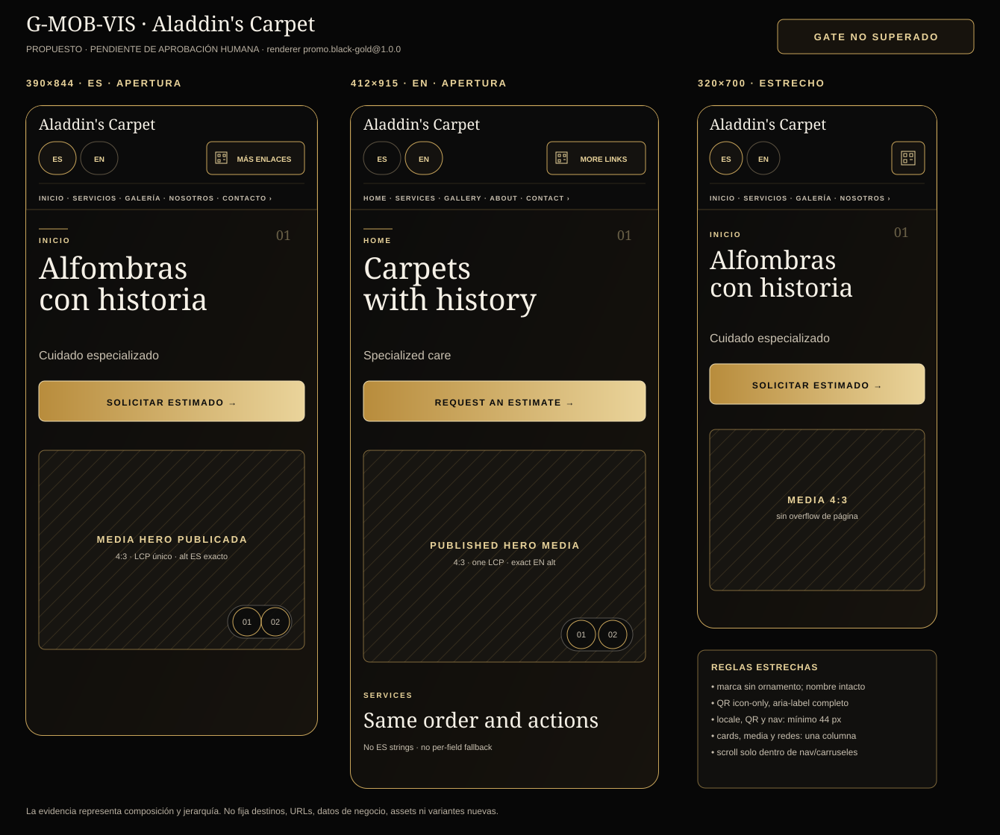

# TS84-PROMO-MOB-VIS-0001 — Mockup móvil formal y contrato G-MOB-VIS

## 1. Control del documento

| Campo | Valor |
|---|---|
| Proyecto | Tu Senda 84 / Tiendas Promo |
| Tienda de referencia | Aladdin's Carpet |
| Prompt ID | `TS84-PROMO-MOB-VIS-0001` |
| Estado | **APROBADO POR KRAKEN** |
| Gate | `G-MOB-VIS`: **SUPERADO** |
| Fecha | 2026-08-24 |
| Rama local verificada antes de modificar | `dev` |
| Base autorizada verificada | `0358867` |
| Worktree inicial | limpio |
| Implementación funcional | **NO** |
| Commit local de la propuesta | `0bc2188` |
| Registro de aprobación | sobre `dev` / `0bc2188`, worktree limpio |
| Push, merge, deploy o release | **NO** |

Este documento define el mockup móvil aprobado por Kraken. La propuesta se registró inicialmente como pendiente y Kraken emitió después la decisión humana explícita **“APROBADO TS84-PROMO-MOB-VIS-0001”**; por tanto `G-MOB-VIS` queda superado sin iniciar ni implementar `TS84-PROMO-RESP-0001` en esta tarea.

## 2. Evidencia visual para revisión

La evidencia usa exclusivamente el renderer first-party `promo.black-gold@1.0.0`, sus secciones `default`, el catálogo `promo.system.v1` y los contratos públicos ya aprobados. Los marcos rotulados como media representan posiciones del contrato `promo.media.delivery.v1`; no crean assets, fuentes de datos, variantes, destinos ni URLs.

- [Comparativa del gate: 390×844, 412×915 y 320×700](evidencias/TS84-PROMO-MOB-VIS-0001/01-gate-movil-comparativa.svg)
- [Recorrido completo ES a 390 px de ancho](evidencias/TS84-PROMO-MOB-VIS-0001/02-recorrido-completo-es-390x844.svg)
- [Locale exacto EN a 412×915](evidencias/TS84-PROMO-MOB-VIS-0001/03-locale-en-412x915.svg)
- [Reflujo estrecho y estados críticos a 320×700](evidencias/TS84-PROMO-MOB-VIS-0001/04-reflow-estrecho-320x700.svg)

### 2.1 Contratos consultados

Se leyeron y respetaron antes de diseñar la propuesta:

- `docs/tusenda84/TS84_PROMO_MAPA_MAESTRO_PROMPTS.md`;
- `docs/tusenda84/reportes/TS84-PROMO-QR-0001-implementacion.md`;
- `docs/tusenda84/reportes/TS84-PROMO-ALADDIN-0001-implementacion.md`;
- `docs/tusenda84/reportes/TS84-PROMO-HERO-0001-implementacion.md`;
- `docs/tusenda84/reportes/TS84-PROMO-SECTIONS-0001-implementacion.md`;
- `docs/tusenda84/reportes/TS84-PROMO-REVIEWS-0001-implementacion.md`;
- `docs/tusenda84/reportes/TS84-PROMO-CONTACT-0001-implementacion.md`;
- `docs/tusenda84/reportes/TS84-PROMO-FOOTER-0001-implementacion.md`; y
- `docs/tusenda84/reportes/TS84-PROMO-ARC-0001-arquitectura-adrs.md`, en particular `G-MOB-VIS`, `AC-17` y los ADR de tema, CTA, medios, accesibilidad y compatibilidad.

No existe en este checkout un archivo independiente `TS84-PROMO-VIS-0001-direccion-visual.md`, aunque ALADDIN lo menciona. Por ello se usa como fuente visual canónica la decisión `TS84-PROMO-VIS-0001` registrada en las secciones 2.1–2.3 del mapa maestro: negro/dorado, experiencia premium, conversión por contacto, CTA sin bloque QR redundante y Landing QR conservada.

## 3. Decisión visual propuesta

### 3.1 Lenguaje y composición

- Se conserva la superficie obsidiana `#0b0b0b`, texto marfil `#f6f1e7`, acento oro heredado `#c8a45a`, tipografía editorial serif para jerarquías y sans-serif de sistema para cuerpo.
- La página móvil mantiene composición editorial propia; no copia píxel por píxel la referencia inicial.
- El orden de lectura propuesto para Aladdin's Carpet es: cabecera y navegación → Hero → servicios → trabajo destacado → galería → propietario → reseñas → contacto → footer.
- Landing QR se mantiene como utilidad secundaria de cabecera. No sustituye el CTA principal, no muestra un código QR y no crea un bloque “Escanéame para contactarme”.
- No se añade menú hamburguesa, navegación fija, overlay, lightbox, tab, filtro, autoplay, control inventado ni variante de tema. La navegación existente se conserva visible dentro de un scroller horizontal propio.

### 3.2 Cabecera y navegación

En `390` y `412` px la cabecera ocupa tres filas en flujo normal:

1. marca textual de Aladdin's Carpet;
2. selector de locale y acceso Landing QR;
3. navegación principal horizontal, desplazable dentro de su propio límite.

En `320` px:

- se omite únicamente el ornamento de marca, no el nombre;
- Landing QR pasa a icono visible con nombre accesible completo;
- cada opción de locale mantiene un área mínima de `44×44` px;
- ningún contenido de la cabecera produce scroll horizontal de página.

El foco comienza en el skip link y continúa por marca, navegación, locales, Landing QR y contenido en orden DOM. No se introduce `tabindex` positivo.

### 3.3 Hero y CTA

- El Hero usa una sola columna: copy primero y media después.
- La media visible usa relación `4:3`; imagen o poster inicial es el único recurso LCP `eager/high`.
- El carrusel, si existe, conserva scroll-snap y enlaces de fragmento; sus targets móviles objetivo serán de al menos `44×44` px.
- El CTA principal ocupa el ancho disponible, conserva altura mínima de `54` px, foco de `3` px y el mismo contrato/destino compilado que desktop.
- Si la acción no está disponible, se muestra el estado localizado sin `href`; no se improvisa canal o fallback.
- Video mantiene poster, controles nativos, `preload="none"`, sin autoplay y reproducción solo tras interacción.

### 3.4 Servicios, destacado, galería y propietario

- Servicios: una columna por debajo de `420` px; media arriba y copy debajo. No aparecen precios, stock, moneda ni affordances de compra.
- Trabajo destacado: media y copy se apilan; se conserva el orden editorial publicado.
- Galería: una columna por debajo de `420` px; caption sobre gradiente y media diferida. No hay lightbox ni descarga eager masiva.
- Propietario: retrato `3:4` o placeholder estable seguido por nombre y biografía; el borde desplazado no puede salir del viewport.
- Ausencia o error de media conserva altura estable, alt localizado cuando corresponde y ornamento first-party; no crea URL alternativa.

### 3.5 Reseñas

- El resumen de rating se apila bajo el heading.
- La lista es un scroller horizontal de una fila con scroll-snap; la página no se desplaza horizontalmente.
- Una tarjeta ocupa aproximadamente `84–86vw`, dejando una pista visual de continuidad.
- El viewport de reseñas es alcanzable por teclado, recibe foco visible y conserva nombre accesible localizado.
- Solo aparecen reseñas generales `approved`; no se muestran IDs, pedidos, productos ni afirmación de compra verificada.

### 3.6 Contacto, Landing QR y footer

- La sección Contacto repite la misma acción principal compilada del Hero, no una URL o destino paralelo.
- WhatsApp, teléfono o correo solo existen si `promo.contact.action.v1` los entrega disponibles; el mockup no fija canal ni destino.
- Landing QR sigue separado del CTA y conserva el enlace central compilado por `promo.landing-qr-link.v1`.
- Footer: identidad, navegación interna, redes tipadas y branding reservado “Tu Senda 84”; tres columnas desktop refluyen a una columna móvil.
- Redes sociales usan dos columnas en `390/412` y una columna a `320` px. Todos los enlaces conservan al menos `44` px de alto.

## 4. Contrato por viewport

| Viewport | Composición requerida | Evidencia de paso |
|---|---|---|
| `390×844` | Cabecera en tres filas; Hero 1 columna; CTA ancho completo; servicios/galería 1 columna; owner apilado; reseñas con pista de continuidad; footer 1 columna | Recorrido ES completo, sin elemento fuera de `390` px y con cortes de pliegue cada `844` px |
| `412×915` | Mismo contenido y acciones; copy EN exacto; media `4:3`; jerarquía y densidad sin solapamiento | Marco EN con `lang=en`, navegación/CTA/QR/copy de sistema en inglés y cero mezcla ES |
| `320×700` | Marca sin ornamento; QR icon-only con `aria-label`; locales `44×44`; cards/media a una columna; redes a una columna | Estados críticos estrechos sin clipping ni scroll horizontal de página |

El ancho estrecho contractual queda fijado en `320` px. `TS84-PROMO-RESP-0001` podrá añadir comprobaciones intermedias, pero no reducir este mínimo ni ocultar funciones para hacerlo pasar.

## 5. Touch, teclado, foco y semántica

### 5.1 Targets

| Superficie | Mínimo propuesto |
|---|---:|
| Enlaces de navegación, locale, Landing QR, footer y redes | `44×44` px |
| Controles de carrusel Hero | `44×44` px |
| CTA principal | `54` px de alto; ancho completo ≤ `420` px |
| Controles nativos de video | área nativa sin recorte, alcanzable por teclado |
| Scroller de reseñas | foco visible de `3` px con offset y desplazamiento por teclado |

El renderer actual ya cumple la mayoría de estos mínimos. El mockup detecta dos ajustes documentados para `TS84-PROMO-RESP-0001`, todavía no implementados aquí: los controles Hero que hoy pueden bajar a `36` px y las opciones de locale que hoy pueden bajar a `42` px deben quedar en `44` px como mínimo.

### 5.2 Orden de foco

1. skip link “Saltar al contenido” / “Skip to content”;
2. marca;
3. navegación principal en orden publicado;
4. selector de idioma;
5. Landing QR cuando esté habilitado;
6. CTA Hero;
7. carrusel/video Hero cuando exista;
8. videos de secciones y scroller de reseñas;
9. CTA Contacto;
10. enlaces internos, sociales y branding no interactivo del footer.

El foco no queda atrapado en scrollers. Activar enlaces de fragmento conserva destino visible y no mueve el foco de forma sorpresiva.

## 6. Zoom, reflujo y desborde

- Texto a `200 %`: no se corta, superpone ni pierde controles.
- Reflujo equivalente a `320` CSS px: una sola columna, salvo scrollers intencionales de navegación, Hero y reseñas.
- Zoom hasta `400 %` en un viewport desktop de referencia: el contenido refluye sin scroll bidimensional de página y sin pérdida de información o función.
- `documentElement.scrollWidth === documentElement.clientWidth` en los tres viewports.
- Strings largos usan wrapping; la marca puede truncarse visualmente solo si conserva nombre accesible completo. CTA, headings y labels esenciales no se eliden.
- No se usa una escala visual inferior para “hacer caber” la página; tipografía, controles y áreas táctiles conservan legibilidad.

## 7. Movimiento reducido y carga progresiva

Con `prefers-reduced-motion: reduce` o token Theme `motion=reduced`:

- transiciones y desplazamientos decorativos se eliminan;
- hover no mueve cards ni CTA;
- carruseles usan desplazamiento inmediato, no animado;
- video permanece en poster hasta interacción y nunca usa autoplay;
- ningún ornamento parpadea, rota o se repite.

Carga propuesta:

1. HTML SSR, estilos first-party y una sola imagen/poster Hero prioritaria;
2. media Hero secundaria con prioridad normal/lazy;
3. servicios, trabajo destacado, galería y propietario con `loading=lazy` y prioridad automática;
4. videos con poster y `preload="none"`;
5. reseñas y contacto ya presentes en SSR, sin hidratación o spinner necesario.

Un error de media conserva el copy, alt/estado pertinente y geometría; nunca bloquea CTA, navegación o locale.

## 8. Locale exacto ES/EN

El locale efectivo se toma de una única revisión publicada. No hay fallback por campo ni mezcla de idiomas.

| Clave/superficie | `es` exacto | `en` exacto |
|---|---|---|
| `a11y.skip_to_content` | Saltar al contenido | Skip to content |
| `a11y.main_navigation` | Navegación principal | Main navigation |
| `locale.current` | Idioma actual | Current language |
| `navigation.home` | Inicio | Home |
| `navigation.services` | Servicios | Services |
| `navigation.gallery` | Galería | Gallery |
| `navigation.owner` | Nosotros | About |
| `navigation.contact` | Contacto | Contact |
| `contact.request_estimate` | Solicitar estimado | Request an estimate |
| `landing_qr.open` | Más enlaces | More links |
| `reviews.list` | Reseñas de clientes | Customer reviews |
| `contact.unavailable` | El contacto no está disponible en este momento | Contact is currently unavailable |
| `footer.platform_branding` | Presencia promocional en | Promo presence on |

Copy de Aladdin usado en evidencia y ya presente en las fixtures contractuales:

| Superficie | `es` | `en` |
|---|---|---|
| Identidad | Aladdin's Carpet | Aladdin's Carpet |
| Resumen | Restauración especializada | Specialized restoration |
| Hero heading | Alfombras con historia | Carpets with history |
| Hero summary | Cuidado especializado | Specialized care |

Todo otro contenido del negocio, alt, reseña, fecha, label o mensaje debe provenir del mismo locale de la revisión publicada; los textos de posición presentes en la evidencia son anotaciones del mockup, no datos publicables.

Además se exige:

- `html[lang="es"]` o `html[lang="en"]` exacto;
- `dir` del catálogo efectivo;
- selector con nombres nativos “Español” y “English” y `aria-current` correcto;
- `aria-label`, alt, captions, rating y fecha en el mismo locale;
- cambio de locale por enlace real, usable sin JavaScript;
- el CTA conserva tipo/destino configurado mientras cambia label, aria y mensaje al locale efectivo.

## 9. Paridad con desktop

Responsive puede cambiar columnas, espaciado, tamaño y dirección de los scrollers. No puede cambiar:

- revisión publicada, orden editorial o visibilidad de secciones;
- identidad, copy, alt, ratings o cantidad de items permitidos;
- acción principal, canal, destino compilado o fallback;
- acceso Landing QR y sus gates;
- semántica de enlaces, controles nativos de video y estados;
- carga prioritaria única del Hero y carga diferida del resto;
- branding reservado de Tu Senda 84;
- ausencia de Commerce, precios, carrito, checkout, pedidos, inventario, analytics o scripts tenant-controlled.

No se permite ocultar en móvil una función disponible en desktop para evitar un problema de layout.

## 10. Estados que RESP y QA deberán contrastar

La futura implementación `TS84-PROMO-RESP-0001` deberá probar, sin adelantarse en este prompt:

- contenido completo;
- Hero con imagen, con video/poster y sin media;
- una y varias medias Hero;
- servicios, destacado, galería y propietario con/sin media;
- pocas y muchas imágenes dentro del límite publicado;
- reseñas aprobadas, lista vacía y adaptador no disponible;
- contacto disponible y no disponible;
- Landing QR visible y ausente por gate;
- ES y EN completos, además de rechazo/fallo seguro de locale incompleto;
- textos y nombres largos;
- carga lenta/error de media;
- teclado, foco, `200 %` de texto, `400 %` de zoom, movimiento reducido y ahorro de datos;
- paridad con desktop en contenido, acciones y destinos;
- cero overflow de página en `390×844`, `412×915` y `320×700`.

## 11. Criterios para la decisión humana

Kraken aprobó expresamente:

- [x] composición y orden móvil;
- [x] cabecera de tres filas y navegación horizontal sin hamburguesa;
- [x] Hero 1 columna, media `4:3` y CTA ancho completo;
- [x] servicios/galería 1 columna, propietario apilado y reseñas con scroll-snap;
- [x] Landing QR secundario y separado del CTA;
- [x] targets mínimos y orden de foco;
- [x] contrato de zoom, reflujo, carga y movimiento reducido;
- [x] locale exacto ES/EN y paridad con desktop;
- [x] evidencia de `390×844`, `412×915` y `320×700`.

### Registro de decisión de Kraken

| Campo | Valor |
|---|---|
| Decisión | **`APROBADO`** |
| Autoridad | Kraken |
| Fecha | 2026-08-24 |
| Evidencia de decisión | Respuesta explícita “aprobado” sobre la instrucción “APROBADO TS84-PROMO-MOB-VIS-0001” |
| Observaciones | Sin cambios solicitados |

Con esta decisión, `G-MOB-VIS` queda **SUPERADO** y `TS84-PROMO-RESP-0001` queda habilitado para una tarea independiente. `RESP-0001` no fue iniciado en este registro de aprobación.

## 12. Archivos y alcance

### Creados

- `docs/tusenda84/reportes/TS84-PROMO-MOB-VIS-0001-propuesta.md`.
- `docs/tusenda84/reportes/evidencias/TS84-PROMO-MOB-VIS-0001/01-gate-movil-comparativa.svg`.
- `docs/tusenda84/reportes/evidencias/TS84-PROMO-MOB-VIS-0001/02-recorrido-completo-es-390x844.svg`.
- `docs/tusenda84/reportes/evidencias/TS84-PROMO-MOB-VIS-0001/03-locale-en-412x915.svg`.
- `docs/tusenda84/reportes/evidencias/TS84-PROMO-MOB-VIS-0001/04-reflow-estrecho-320x700.svg`.

El registro normativo inicial queda en la ficha de control y en la sección de decisión de este mismo contrato. El mapa maestro se conserva sin cambios porque su edición no es necesaria para someter `G-MOB-VIS` a Kraken.

No se modifican frontend, estilos de producción, backend, migraciones, colecciones, datos, PocketBase, Cloudflare, Coolify, staging o producción. No se activan destinos, URLs, analytics, Commerce, carrito, checkout, precios, pedidos o scripts. No se inicia `TS84-PROMO-RESP-0001`, `TS84-PROMO-DOM-CF-0001` ni ningún prompt posterior.
